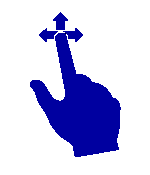
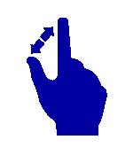
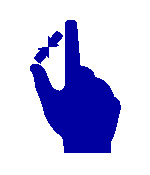

::: {style="DISPLAY: none"}
{#d2h_url_template}{#d2h_package_url style="WIDTH: 0px; DISPLAY: none; HEIGHT: 0px"}
:::

::::: {#nsbanner .d2h_main_nsbanner style="BORDER-BOTTOM: #999999 1px solid; POSITION: relative; PADDING-BOTTOM: 0px; BACKGROUND-COLOR: transparent; PADDING-LEFT: 0px; PADDING-RIGHT: 0px; DISPLAY: none; BORDER-TOP: #999999 1px solid; PADDING-TOP: 0px; LEFT: 0px"}
:::: {#TitleRow .d2h_main_titlerow style="PADDING-BOTTOM: 4px; BACKGROUND-COLOR: transparent; PADDING-LEFT: 22px; WIDTH: 100%; PADDING-RIGHT: 10px; DISPLAY: none; PADDING-TOP: 4px"}
::: {#ienav .d2h_main_ienav style="DISPLAY: none"}
{#D2HPrevious .D2HPreviousEnabled}  {#D2HNext .D2HNextEnabled}
:::
::::
:::::

:::: {#nstext .d2h_main_nstext style="PADDING-BOTTOM: 10px; BACKGROUND-COLOR: transparent; PADDING-LEFT: 22px; PADDING-RIGHT: 10px; HEIGHT: 100%; OVERFLOW: auto; PADDING-TOP: 5px" hasuserbackground="true" valign="bottom"}
::: {#d2h_breadcrumbs .d2h_breadcrumbs}
[Essential Studio User Guide Documentation](ms-xhelp:///?Id=12457748-09e3-4d74-a240-8e049cedf030){.d2h_breadcrumbsNormal}[ \> ]{.d2h_breadcrumbsLinkSeparator}[User Interface Edition](ms-xhelp:///?Id=c29296b7-531c-413b-a0ec-488ca1f7f669){.d2h_breadcrumbsNormal}[ \> ]{.d2h_breadcrumbsLinkSeparator}[Essential WPF](ms-xhelp:///?Id=7f4f82c5-151c-4262-94d0-75c4626c77bc){.d2h_breadcrumbsNormal}[ \> ]{.d2h_breadcrumbsLinkSeparator}[Essential Diagram]{.d2h_breadcrumbsContentsOnly}[ \> ]{.d2h_breadcrumbsLinkSeparator}[Concepts and Features](ms-xhelp:///?Id=8625d466-6e21-495a-b811-4ecee754da81){.d2h_breadcrumbsNormal}[ \> ]{.d2h_breadcrumbsLinkSeparator}[Diagram View](ms-xhelp:///?Id=5fbfa644-6dd8-4969-8866-3f1b867be204){.d2h_breadcrumbsNormal}
:::

### Touch Support {#touch-support style="tab-stops: 0pt"}

Touch support for diagram view has the following features:

[·      ]{style="FONT-FAMILY: Symbol"}Drag and Drop from the SymbolPalette

[·      ]{style="FONT-FAMILY: Symbol"}Dragging the Node and LineConnector on DiagramView

[·      ]{style="FONT-FAMILY: Symbol"}Panning

[·      ]{style="FONT-FAMILY: Symbol"}Multiple selection

 

Steps for Dragging:

Dragging operation can be performed by

1.   Touch a particular element in the touch screen monitor.

2.   Start dragging the element to the desired location.

3.   Take the finger off from the screen after it is reached to the desired location.

This dragging gesture is used to perform the following operation.

Drag and Drop from the SymbolPalette

1.   Touch the SymbolPaletteItem for Drag and Drop.

2.   Drag the SymbolPaletteItem and Drop onto DiagramView by touching the finger in DiagramView.

 

Dragging the Node and LineConnector on DiagramView

1.   Touch the Node or Lineconnector for Dragging.

2.   The selected item can be moved around using your finger.

 

Panning

1.   Please enable the IsPanEnabled property of the DiagramView.

2.   Drag the finger over DiagramView, the DiagramView gets panned along the finger.

 

Multiple selections

1.   Touch the empty space of the DiagramView.

2.   Drag the finger in DiagramView, the Selection Adorner will be visible.

3.   Objects which are getting intersected while dragging will get selected.

{border="0"}

Figure 174: Drag

MultiTouch Support:

MultiTouch support has been provided to enable zoom the page and resizing a Node.

**Steps for Spreading and Pinching**

1.   Use two fingers to touch the monitor.

2.   Move the fingers away to perform spread operation.

3.   Move the fingers close to each other to perform pinch operation.

4.   Take the fingers off from the screen after the required size is achieved.

 

This spread and pinch gesture is used to perform, zooming and resizing operation.

[·      ]{style="FONT-FAMILY: Symbol"}Zooming the DiagramView with two fingers can be done

[·      ]{style="FONT-FAMILY: Symbol"}Resizing the Node with two fingers can be done

 

{border="0"}

Figure 175: Spread

 

 

{border="0"}

Figure 176: Pinch

{border="0"}

Steps for Zooming:

1.   Touch the DiagramView with two fingers.

2.   Pinch represents the ZoomOut.

3.   Spread represents the ZoomIn.

 

Steps for Resizing:

1.   Touch the Node for resizing with two Fingers.

2.   Pinch Represents - Increase the size of the Node.

3.   Spread Represents - Decrease the size of the Node.

[]{#related-topics}
::::
