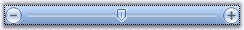
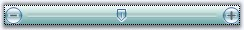
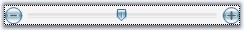
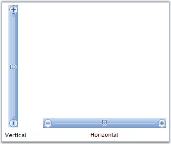

::: {style="DISPLAY: none"}
{#d2h_url_template}{#d2h_package_url style="WIDTH: 0px; DISPLAY: none; HEIGHT: 0px"}
:::

::: {.d2h_secondary_topic style="PADDING-BOTTOM: 10pt; MARGIN: 0pt; PADDING-LEFT: 0pt; PADDING-RIGHT: 0pt; PADDING-TOP: 0pt"}
##### TrackBar Appearance {#trackbar-appearance style="tab-stops: 0pt"}

[]{#p1193}[]{style="COLOR: #15428b"} 

FocusRectangle

**[]{style="COLOR: #15428b"}** 

A focus rectangle for the TrackBarEx control can be shown or hidden using **ShowFocusRect** property.

[]{style="COLOR: #15428b"} 

{border="0"}

[]{style="COLOR: #15428b"} 

Figure 1439: TrackBarEx with FocusRectangle

[]{style="COLOR: #15428b"} 

Gradient Start and End Color

**[]{style="COLOR: #15428b"}** 

By default, the TrackBarEx control has a gradient appearance. The start color and end color for this gradient appearance can be specified using **TrackBarGradientStart** and **TrackBarGradientEnd** properties.

[]{style="COLOR: #15428b"} 

+--------------------------------------------------------------------------------------------------------------------------------------------------------------------------------------------------------------------------------+
| **[\[C#\]]{style="FONT-FAMILY: 'Courier New'; COLOR: black"}**                                                                                                                                                                 |
|                                                                                                                                                                                                                                |
| []{style="FONT-FAMILY: 'Courier New'; COLOR: blue"}                                                                                                                                                                            |
|                                                                                                                                                                                                                                |
| [this]{style="FONT-FAMILY: 'Courier New'; COLOR: blue"}[.trackBarEx1.TrackBarGradientEnd = System.Drawing.[Color]{style="COLOR: teal"}.CadetBlue;]{style="FONT-FAMILY: 'Courier New'"}                                         |
|                                                                                                                                                                                                                                |
| [this]{style="FONT-FAMILY: 'Courier New'; COLOR: blue"}[.trackBarEx1.TrackBarGradientStart = System.Drawing.[Color]{style="COLOR: teal"}.MintCream;]{style="FONT-FAMILY: 'Courier New'"}[]{style="FONT-FAMILY: 'Courier New'"} |
+--------------------------------------------------------------------------------------------------------------------------------------------------------------------------------------------------------------------------------+

[]{style="COLOR: #15428b"} 

+----------------------------------------------------------------------------------------------------------------------------------------------------------------+
| **[\[VB.NET\]]{style="FONT-FAMILY: 'Courier New'; COLOR: black"}**                                                                                             |
|                                                                                                                                                                |
| []{style="FONT-FAMILY: 'Courier New'; COLOR: blue"}                                                                                                            |
|                                                                                                                                                                |
| [Me]{style="FONT-FAMILY: 'Courier New'; COLOR: blue"}[.trackBarEx1.TrackBarGradientEnd = System.Drawing.Color.CadetBlue]{style="FONT-FAMILY: 'Courier New'"}   |
|                                                                                                                                                                |
| [Me]{style="FONT-FAMILY: 'Courier New'; COLOR: blue"}[.trackBarEx1.TrackBarGradientStart = System.Drawing.Color.MintCream]{style="FONT-FAMILY: 'Courier New'"} |
+----------------------------------------------------------------------------------------------------------------------------------------------------------------+

**[]{style="COLOR: #15428b"}** 

{border="0"}

**[]{style="COLOR: #15428b"}** 

Figure 1440: GradientStartColor = \"MintCream\"; GradientEndColor = \"CadetBlue\"

**[]{style="COLOR: #15428b"}** 

The control can be given a transparent background by enabling the **Transparent** property.

[]{style="COLOR: #15428b"} 

+------------------------------------------------------------------------------------------------------------------------------------------------------+
| **[\[C#\]]{style="FONT-FAMILY: 'Courier New'; COLOR: black"}**                                                                                       |
|                                                                                                                                                      |
| []{style="FONT-FAMILY: 'Courier New'; COLOR: blue"}                                                                                                  |
|                                                                                                                                                      |
| [this]{style="FONT-FAMILY: 'Courier New'; COLOR: blue"}[.trackBarEx1.Transparent = [true]{style="COLOR: blue"};]{style="FONT-FAMILY: 'Courier New'"} |
+------------------------------------------------------------------------------------------------------------------------------------------------------+

[]{style="COLOR: #15428b"} 

+------------------------------------------------------------------------------------------------------------------------------------------------------------------------------------------------------+
| **[\[VB.NET\]]{style="FONT-FAMILY: 'Courier New'; COLOR: black"}**                                                                                                                                   |
|                                                                                                                                                                                                      |
| []{style="FONT-FAMILY: 'Courier New'; COLOR: blue"}                                                                                                                                                  |
|                                                                                                                                                                                                      |
| [Me]{style="FONT-FAMILY: 'Courier New'; COLOR: blue"}[.trackBarEx1.Transparent = [True]{style="COLOR: blue"}]{style="FONT-FAMILY: 'Courier New'"}[]{style="FONT-FAMILY: 'Courier New'; COLOR: blue"} |
+------------------------------------------------------------------------------------------------------------------------------------------------------------------------------------------------------+

**[]{style="COLOR: #15428b"}** 

**[{border="0"}]{style="COLOR: #15428b"}[]{style="COLOR: #15428b"}**

**[]{style="COLOR: #15428b"}** 

Figure 1441: TrackBarEx with Transparent Background

**[]{style="COLOR: #15428b"}** 

TrackBarEx Orientation

**[]{style="COLOR: #15428b"}** 

This control has options for vertical and horizontal orientation.

[]{style="COLOR: #15428b"} 

+--------------------------------------------------------------------------------------------------------------------------------------------------------------------------+
| **[\[C#\]]{style="FONT-FAMILY: 'Courier New'; COLOR: black"}**                                                                                                           |
|                                                                                                                                                                          |
| []{style="FONT-FAMILY: 'Courier New'; COLOR: blue"}                                                                                                                      |
|                                                                                                                                                                          |
| [//To set the control to be vertically oriented]{style="FONT-FAMILY: 'Courier New'; COLOR: green"}                                                                       |
|                                                                                                                                                                          |
| [this]{style="FONT-FAMILY: 'Courier New'; COLOR: blue"}[.trackBarEx1.Orientation = [Orientation]{style="COLOR: teal"}.Vertical;]{style="FONT-FAMILY: 'Courier New'"}     |
|                                                                                                                                                                          |
| [//To set the control to be horizontally oriented]{style="FONT-FAMILY: 'Courier New'; COLOR: green"}                                                                     |
|                                                                                                                                                                          |
| [this]{style="FONT-FAMILY: 'Courier New'; COLOR: blue"}[.trackBarEx1.Orientation = [Orientation]{style="COLOR: teal"}.Horizontal;  ]{style="FONT-FAMILY: 'Courier New'"} |
+--------------------------------------------------------------------------------------------------------------------------------------------------------------------------+

[]{style="COLOR: #15428b"} 

+----------------------------------------------------------------------------------------------------------------------------------------------+
| **[\[VB.NET\]]{style="FONT-FAMILY: 'Courier New'; COLOR: black"}**                                                                           |
|                                                                                                                                              |
| []{style="FONT-FAMILY: 'Courier New'; COLOR: blue"}                                                                                          |
|                                                                                                                                              |
| [\'To set the control to be vertically oriented]{style="FONT-FAMILY: 'Courier New'; COLOR: green"}                                           |
|                                                                                                                                              |
| [Me]{style="FONT-FAMILY: 'Courier New'; COLOR: blue"}[.trackBarEx1.Orientation = Orientation.Vertical]{style="FONT-FAMILY: 'Courier New'"}   |
|                                                                                                                                              |
| [\'To set the control to be horizontally oriented]{style="FONT-FAMILY: 'Courier New'; COLOR: green"}                                         |
|                                                                                                                                              |
| [Me]{style="FONT-FAMILY: 'Courier New'; COLOR: blue"}[.trackBarEx1.Orientation = Orientation.Horizontal]{style="FONT-FAMILY: 'Courier New'"} |
+----------------------------------------------------------------------------------------------------------------------------------------------+

**[]{style="COLOR: #15428b"}** 

{border="0"}

**[]{style="COLOR: #15428b"}** 

Figure 1442: Vertical and Horizontal Orientation for TrackBarEx

 

[]{#related-topics}
:::
