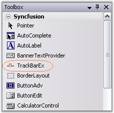
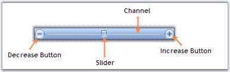

::: {style="DISPLAY: none"}
{#d2h_url_template}{#d2h_package_url style="WIDTH: 0px; DISPLAY: none; HEIGHT: 0px"}
:::

::: {.d2h_secondary_topic style="PADDING-BOTTOM: 10pt; MARGIN: 0pt; PADDING-LEFT: 0pt; PADDING-RIGHT: 0pt; PADDING-TOP: 0pt"}
#### TrackBarEx {#trackbarex style="tab-stops: 0pt"}

[]{style="COLOR: #15428b"} 

The TrackBarEx is a new Office2007 control, which has a track bar or a pointer which slides between the minimum value and maximum value specified. The user can drag the track bar along the line and also, the pointer can be placed at a particular point by clicking a position inside this TrackBar.

 

A TrackBarEx can be added to your form by simply dragging-and-dropping the control from the toolbox.

[]{style="COLOR: #15428b"} 

{border="0"}

[]{style="COLOR: #15428b"} 

Figure 1435: TrackBarEx control in Toolbox

[]{style="COLOR: #15428b"} 

{border="0"}

[]{style="COLOR: #15428b"} 

Figure 1436: TrackBarEx Components

**[]{style="COLOR: #15428b"}** 

It can be created programmatically using the below code snippets.

[]{style="COLOR: #15428b"} 

+------------------------------------------------------------------------------------------------------------------------------------------------------------------------------------------------------------+
| **[\[C#\]]{style="FONT-FAMILY: 'Courier New'; COLOR: black"}**                                                                                                                                             |
|                                                                                                                                                                                                            |
| []{style="FONT-FAMILY: 'Courier New'; COLOR: blue"}                                                                                                                                                        |
|                                                                                                                                                                                                            |
| [private]{style="FONT-FAMILY: 'Courier New'; COLOR: blue"}[ Syncfusion.Windows.Forms.Tools.[TrackBarEx]{style="COLOR: teal"} trackBarEx1;]{style="FONT-FAMILY: 'Courier New'"}                             |
|                                                                                                                                                                                                            |
| [this]{style="FONT-FAMILY: 'Courier New'; COLOR: blue"}[.trackBarEx1 = [new]{style="COLOR: blue"} Syncfusion.Windows.Forms.Tools.[TrackBarEx]{style="COLOR: teal"}();]{style="FONT-FAMILY: 'Courier New'"} |
|                                                                                                                                                                                                            |
| [this]{style="FONT-FAMILY: 'Courier New'; COLOR: blue"}[.Controls.Add([this]{style="COLOR: blue"}.trackBarEx1);]{style="FONT-FAMILY: 'Courier New'"}[]{style="FONT-FAMILY: 'Courier New'"}                 |
+------------------------------------------------------------------------------------------------------------------------------------------------------------------------------------------------------------+

[]{style="COLOR: #15428b"} 

+---------------------------------------------------------------------------------------------------------------------------------------------------------------------------------------+
| **[\[VB.NET\]]{style="FONT-FAMILY: 'Courier New'; COLOR: black"}**                                                                                                                    |
|                                                                                                                                                                                       |
| []{style="FONT-FAMILY: 'Courier New'; COLOR: black"}                                                                                                                                  |
|                                                                                                                                                                                       |
| [Private]{style="FONT-FAMILY: 'Courier New'; COLOR: blue"}[ trackBarEx1 [As]{style="COLOR: blue"} Syncfusion.Windows.Forms.Tools.TrackBarEx]{style="FONT-FAMILY: 'Courier New'"}      |
|                                                                                                                                                                                       |
| [Me]{style="FONT-FAMILY: 'Courier New'; COLOR: blue"}[.trackBarEx1 = [New]{style="COLOR: blue"} Syncfusion.Windows.Forms.Tools.TrackBarEx ]{style="FONT-FAMILY: 'Courier New'"}       |
|                                                                                                                                                                                       |
| [Me]{style="FONT-FAMILY: 'Courier New'; COLOR: blue"}[.Controls.Add([Me]{style="COLOR: blue"}.trackBarEx1)]{style="FONT-FAMILY: 'Courier New'"}[]{style="FONT-FAMILY: 'Courier New'"} |
+---------------------------------------------------------------------------------------------------------------------------------------------------------------------------------------+

[]{style="COLOR: #15428b"} 

Various Features and Customization options are discussed in the following topics.

 

More:

[ ]{#related-topics}

[{border="0" align="absMiddle"}Button, Slider and Channel Settings](ms-xhelp:///?Id=8a5597b3-f0c7-4370-8fc5-33fa8fae6950){style="TEXT-DECORATION: none"}

[{border="0" align="absMiddle"}TrackBar Appearance](ms-xhelp:///?Id=262ba57b-9b03-43e4-9b4c-cd419b6fcad3){style="TEXT-DECORATION: none"}

[{border="0" align="absMiddle"}TrackBar Value](ms-xhelp:///?Id=0db2d9a8-f2b0-4cf6-bcef-2167499536b6){style="TEXT-DECORATION: none"}

[{border="0" align="absMiddle"}TrackBarEx Event](ms-xhelp:///?Id=bb2c9f34-4e66-4f73-a46b-eff2946751bb){style="TEXT-DECORATION: none"}
:::
