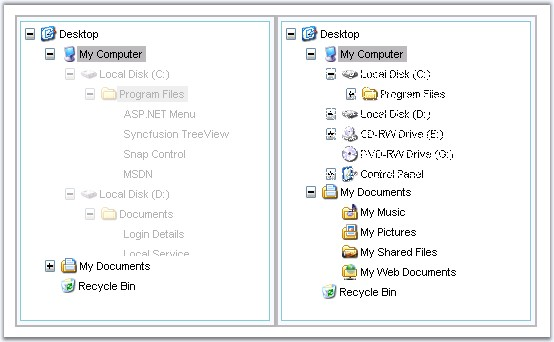

::: {style="DISPLAY: none"}
{#d2h_url_template}{#d2h_package_url style="WIDTH: 0px; DISPLAY: none; HEIGHT: 0px"}
:::

::::::::: {.d2h_secondary_topic style="PADDING-BOTTOM: 10pt; MARGIN: 0pt; PADDING-LEFT: 0pt; PADDING-RIGHT: 0pt; PADDING-TOP: 0pt"}
##### Transition Effects {#transition-effects style="tab-stops: 0pt"}

[]{style="FONT-FAMILY: 'Trebuchet MS','sans-serif'; COLOR: #15428b; FONT-SIZE: 9pt"} 

Transition and slide effects can be applied for node expand and collapse to enhance and provide a rich interface.

[]{style="FONT-FAMILY: 'Trebuchet MS','sans-serif'; COLOR: #15428b; FONT-SIZE: 9pt"} 

Transition effects

[]{style="FONT-FAMILY: 'Trebuchet MS','sans-serif'; COLOR: #15428b; FONT-SIZE: 9pt"} 

The transition effects can be set for expand and collapse action of a parent node. These effects can be applied just by setting the **ExpandTransition** and **CollapseTransition** to one of the effects.

[                                                                                            ]{style="FONT-FAMILY: 'Trebuchet MS','sans-serif'; COLOR: #15428b; FONT-SIZE: 9pt"}

::: {align="center"}
+-----------------------------------+---------------------------------------------------------------------------------------------------------------------+
| Property                          | Description                                                                                                         |
+-----------------------------------+---------------------------------------------------------------------------------------------------------------------+
| CollapseTransition                | Specifies the transition effect for collapse animation. Default value is None. The options included are as follows: |
|                                   |                                                                                                                     |
|                                   | [·      ]{style="FONT-FAMILY: Symbol"}None                                                                          |
|                                   |                                                                                                                     |
|                                   | [·      ]{style="FONT-FAMILY: Symbol"}Fade                                                                          |
|                                   |                                                                                                                     |
|                                   | [·      ]{style="FONT-FAMILY: Symbol"}Dissolve                                                                      |
|                                   |                                                                                                                     |
|                                   | [·      ]{style="FONT-FAMILY: Symbol"}Pixelate                                                                      |
|                                   |                                                                                                                     |
|                                   | [·      ]{style="FONT-FAMILY: Symbol"}WipeDown                                                                      |
|                                   |                                                                                                                     |
|                                   | [·      ]{style="FONT-FAMILY: Symbol"}WipeLeft                                                                      |
|                                   |                                                                                                                     |
|                                   | [·      ]{style="FONT-FAMILY: Symbol"}WipeRight                                                                     |
|                                   |                                                                                                                     |
|                                   | [·      ]{style="FONT-FAMILY: Symbol"}WipeUp                                                                        |
+-----------------------------------+---------------------------------------------------------------------------------------------------------------------+
| ExpandTransition                  | Specifies the transition effect for expand animation. The options included are as follows:                          |
|                                   |                                                                                                                     |
|                                   | [·      ]{style="FONT-FAMILY: Symbol"}None                                                                          |
|                                   |                                                                                                                     |
|                                   | [·      ]{style="FONT-FAMILY: Symbol"}Fade                                                                          |
|                                   |                                                                                                                     |
|                                   | [·      ]{style="FONT-FAMILY: Symbol"}Dissolve                                                                      |
|                                   |                                                                                                                     |
|                                   | [·      ]{style="FONT-FAMILY: Symbol"}Pixelate                                                                      |
|                                   |                                                                                                                     |
|                                   | [·      ]{style="FONT-FAMILY: Symbol"}WipeDown                                                                      |
|                                   |                                                                                                                     |
|                                   | [·      ]{style="FONT-FAMILY: Symbol"}WipeLeft                                                                      |
|                                   |                                                                                                                     |
|                                   | [·      ]{style="FONT-FAMILY: Symbol"}WipeRight                                                                     |
|                                   |                                                                                                                     |
|                                   | [·      ]{style="FONT-FAMILY: Symbol"}WipeUp                                                                        |
+-----------------------------------+---------------------------------------------------------------------------------------------------------------------+
:::

[]{style="FONT-FAMILY: 'Trebuchet MS','sans-serif'; COLOR: #15428b; FONT-SIZE: 9pt"} 

Programmatically the properties can be set as follows.

[]{style="FONT-FAMILY: 'Trebuchet MS','sans-serif'; COLOR: #15428b; FONT-SIZE: 9pt"} 

+--------------------------------------------------------------------------------------------------------------------------------------+
| **[\[C#\]]{style="FONT-FAMILY: 'Courier New'; FONT-SIZE: 9pt"}**                                                                     |
|                                                                                                                                      |
| []{style="FONT-FAMILY: 'Courier New'; COLOR: blue; FONT-SIZE: 9pt"}                                                                  |
|                                                                                                                                      |
| [TreeView1.CollapseTransition=[TransitionFilter]{style="COLOR: teal"}.Dissolve;]{style="FONT-FAMILY: 'Courier New'; FONT-SIZE: 9pt"} |
|                                                                                                                                      |
| [TreeView1.ExpandTransition = [TransitionFilter]{style="COLOR: teal"}.Fade;]{style="FONT-FAMILY: 'Courier New'; FONT-SIZE: 9pt"}     |
+--------------------------------------------------------------------------------------------------------------------------------------+

[]{style="FONT-FAMILY: 'Trebuchet MS','sans-serif'; COLOR: #15428b; FONT-SIZE: 9pt"} 

+-----------------------------------------------------------------------------------------------------------------------------------------------------------------------------------------+
| **[\[VB\]]{style="FONT-FAMILY: 'Courier New'; FONT-SIZE: 9pt"}**                                                                                                                        |
|                                                                                                                                                                                         |
| []{style="FONT-FAMILY: 'Courier New'; COLOR: blue; FONT-SIZE: 9pt"}                                                                                                                     |
|                                                                                                                                                                                         |
| [Private]{style="FONT-FAMILY: 'Courier New'; COLOR: blue; FONT-SIZE: 9pt"}[ TreeView1.ExpandTransition = TransitionFilter.Fade]{style="FONT-FAMILY: 'Courier New'; FONT-SIZE: 9pt"}     |
|                                                                                                                                                                                         |
| [Private]{style="FONT-FAMILY: 'Courier New'; COLOR: blue; FONT-SIZE: 9pt"}[ TreeView1.CollapseTransition=TransitionFilter.Dissolve]{style="FONT-FAMILY: 'Courier New'; FONT-SIZE: 9pt"} |
+-----------------------------------------------------------------------------------------------------------------------------------------------------------------------------------------+

[]{style="FONT-FAMILY: 'Trebuchet MS','sans-serif'; COLOR: #15428b; FONT-SIZE: 9pt"} 

Setting using methods

[]{style="FONT-FAMILY: 'Trebuchet MS','sans-serif'; COLOR: #15428b; FONT-SIZE: 9pt"} 

The expand and collapse transition effect can be set by using the **SetExpandTransition** and **SetCollapseTransition** and the transition effect set for the control can be retrieved using the **GetExpandTransition** and **GetCollapseTransition** methods.

[]{style="FONT-FAMILY: 'Trebuchet MS','sans-serif'; COLOR: #15428b; FONT-SIZE: 9pt"} 

::: {align="center"}
+-----------------------+-----------------+-----------------------------------------------------------------------------+-----------------+
| Method                | Parameter       | Description                                                                 | Return Type     |
+-----------------------+-----------------+-----------------------------------------------------------------------------+-----------------+
| SetExpandTransition   | int             | Set a value indicating the transition effect to use for expand animation.   | \-              |
|                       |                 |                                                                             |                 |
|                       |                 | Parameter can take one of the following values.                             |                 |
|                       |                 |                                                                             |                 |
|                       |                 |                                                                             |                 |
|                       |                 |                                                                             |                 |
|                       |                 | *-1 - TransitionNone*                                                       |                 |
|                       |                 |                                                                             |                 |
|                       |                 | *0 - TransitionFade*                                                        |                 |
|                       |                 |                                                                             |                 |
|                       |                 | *1 - TransitionDissolve*                                                    |                 |
|                       |                 |                                                                             |                 |
|                       |                 | *2 - TransitionPixelate*                                                    |                 |
|                       |                 |                                                                             |                 |
|                       |                 | *3 - TransitionWipeDown*                                                    |                 |
|                       |                 |                                                                             |                 |
|                       |                 | *4 - TransitionWipeLeft*                                                    |                 |
|                       |                 |                                                                             |                 |
|                       |                 | *5 - TransitionWipeRight*                                                   |                 |
|                       |                 |                                                                             |                 |
|                       |                 | *6 - TransitionWipeUp*                                                      |                 |
+-----------------------+-----------------+-----------------------------------------------------------------------------+-----------------+
| GetExpandTransition   | \-              | Get a value indicating the transition effect to use for expand animation.   | int             |
+-----------------------+-----------------+-----------------------------------------------------------------------------+-----------------+
| SetCollapseTransition | int             | Set a value indicating the transition effect to use for collapse animation. | \-              |
|                       |                 |                                                                             |                 |
|                       |                 | Parameter can take one of the following values.                             |                 |
|                       |                 |                                                                             |                 |
|                       |                 |                                                                             |                 |
|                       |                 |                                                                             |                 |
|                       |                 | *-1 - TransitionNone*                                                       |                 |
|                       |                 |                                                                             |                 |
|                       |                 | *0 - TransitionFade*                                                        |                 |
|                       |                 |                                                                             |                 |
|                       |                 | *1 - TransitionDissolve*                                                    |                 |
|                       |                 |                                                                             |                 |
|                       |                 | *2 - TransitionPixelate*                                                    |                 |
|                       |                 |                                                                             |                 |
|                       |                 | *3 - TransitionWipeDown*                                                    |                 |
|                       |                 |                                                                             |                 |
|                       |                 | *4 - TransitionWipeLeft*                                                    |                 |
|                       |                 |                                                                             |                 |
|                       |                 | *5 - TransitionWipeRight*                                                   |                 |
|                       |                 |                                                                             |                 |
|                       |                 | *6 - TransitionWipeUp*                                                      |                 |
+-----------------------+-----------------+-----------------------------------------------------------------------------+-----------------+
| GetCollapseTransition | \-              | Get a value indicating the transition effect to use for collapse animation. | int             |
+-----------------------+-----------------+-----------------------------------------------------------------------------+-----------------+
:::

[]{style="FONT-FAMILY: 'Trebuchet MS','sans-serif'; COLOR: #15428b; FONT-SIZE: 9pt"} 

Here, the expand and collapse transition effects can be selected from the select options which will be applied to the tree control using the Set methods. As and when the values are changed it is obtained and displayed on a label control using the Get methods.

[]{style="FONT-FAMILY: 'Trebuchet MS','sans-serif'; COLOR: #15428b; FONT-SIZE: 9pt"} 

+--------------------------------------------------------------------------------------------------------------------------------------------------------------------------------------------------------------------------------------------------------------------------------+
| **[\[script\]]{style="FONT-FAMILY: 'Courier New'; FONT-SIZE: 9pt"}**                                                                                                                                                                                                           |
|                                                                                                                                                                                                                                                                                |
| []{style="FONT-FAMILY: 'Courier New'; COLOR: blue; FONT-SIZE: 9pt"}                                                                                                                                                                                                            |
|                                                                                                                                                                                                                                                                                |
| [\<]{style="FONT-FAMILY: 'Courier New'; COLOR: blue; FONT-SIZE: 9pt"}[script]{style="FONT-FAMILY: 'Courier New'; COLOR: maroon; FONT-SIZE: 9pt"}[ [type]{style="COLOR: red"}[=\"text/javascript\"\>]{style="COLOR: blue"}]{style="FONT-FAMILY: 'Courier New'; FONT-SIZE: 9pt"} |
|                                                                                                                                                                                                                                                                                |
| [    [function]{style="COLOR: blue"} SetExpandTransition()]{style="FONT-FAMILY: 'Courier New'; FONT-SIZE: 9pt"}                                                                                                                                                                |
|                                                                                                                                                                                                                                                                                |
| [    {]{style="FONT-FAMILY: 'Courier New'; FONT-SIZE: 9pt"}                                                                                                                                                                                                                    |
|                                                                                                                                                                                                                                                                                |
| [        [var]{style="COLOR: blue"} z=document.getElementById([\"ExpandTransitionType\"]{style="COLOR: maroon"}).value;]{style="FONT-FAMILY: 'Courier New'; FONT-SIZE: 9pt"}                                                                                                   |
|                                                                                                                                                                                                                                                                                |
| [        treeview.SetExpandTransition(z);]{style="FONT-FAMILY: 'Courier New'; FONT-SIZE: 9pt"}                                                                                                                                                                                 |
|                                                                                                                                                                                                                                                                                |
| [        document.getElementById([\"textarea\"]{style="COLOR: maroon"}).innerText += [\"\\n\"]{style="COLOR: maroon"} + [\"Expand Transition Type  : \"]{style="COLOR: maroon"} + treeview.GetExpandTransition();]{style="FONT-FAMILY: 'Courier New'; FONT-SIZE: 9pt"}         |
|                                                                                                                                                                                                                                                                                |
| [    }]{style="FONT-FAMILY: 'Courier New'; FONT-SIZE: 9pt"}                                                                                                                                                                                                                    |
|                                                                                                                                                                                                                                                                                |
| [    [function]{style="COLOR: blue"} SetCollapseTransition()]{style="FONT-FAMILY: 'Courier New'; FONT-SIZE: 9pt"}                                                                                                                                                              |
|                                                                                                                                                                                                                                                                                |
| [    {]{style="FONT-FAMILY: 'Courier New'; FONT-SIZE: 9pt"}                                                                                                                                                                                                                    |
|                                                                                                                                                                                                                                                                                |
| [        [var]{style="COLOR: blue"} x=document.getElementById([\"CollapseTransitionType\"]{style="COLOR: maroon"}).value;]{style="FONT-FAMILY: 'Courier New'; FONT-SIZE: 9pt"}                                                                                                 |
|                                                                                                                                                                                                                                                                                |
| [        treeview.SetCollapseTransition(x);]{style="FONT-FAMILY: 'Courier New'; FONT-SIZE: 9pt"}                                                                                                                                                                               |
|                                                                                                                                                                                                                                                                                |
| [        document.getElementById([\"textarea\"]{style="COLOR: maroon"}).innerText += [\"\\n\"]{style="COLOR: maroon"} + [\"Collapse Transition Type: \"]{style="COLOR: maroon"} + treeview.GetCollapseTransition();]{style="FONT-FAMILY: 'Courier New'; FONT-SIZE: 9pt"}       |
|                                                                                                                                                                                                                                                                                |
| [    }]{style="FONT-FAMILY: 'Courier New'; FONT-SIZE: 9pt"}                                                                                                                                                                                                                    |
|                                                                                                                                                                                                                                                                                |
| [\</]{style="FONT-FAMILY: 'Courier New'; COLOR: blue; FONT-SIZE: 9pt"}[script]{style="FONT-FAMILY: 'Courier New'; COLOR: maroon; FONT-SIZE: 9pt"}[\>]{style="FONT-FAMILY: 'Courier New'; COLOR: blue; FONT-SIZE: 9pt"}                                                         |
+--------------------------------------------------------------------------------------------------------------------------------------------------------------------------------------------------------------------------------------------------------------------------------+

[]{style="FONT-FAMILY: 'Trebuchet MS','sans-serif'; COLOR: #15428b; FONT-SIZE: 9pt"} 

+-------------------------------------------------------------------------------------------------------------------------------------------------------------------------------------------------------------------------------------------------------------------------------------------------------------------------------------------------------------------------------------------------------------------------------------------------------------------------------------------------------------------------------------------------------------------------------------------------------------------------+
| **[\[aspx\]]{style="FONT-FAMILY: 'Courier New'; FONT-SIZE: 9pt"}**                                                                                                                                                                                                                                                                                                                                                                                                                                                                                                                                                      |
|                                                                                                                                                                                                                                                                                                                                                                                                                                                                                                                                                                                                                         |
| []{style="FONT-FAMILY: 'Courier New'; COLOR: blue; FONT-SIZE: 9pt"}                                                                                                                                                                                                                                                                                                                                                                                                                                                                                                                                                     |
|                                                                                                                                                                                                                                                                                                                                                                                                                                                                                                                                                                                                                         |
| [\<]{style="FONT-FAMILY: 'Courier New'; COLOR: blue; FONT-SIZE: 9pt"}[cc1]{style="FONT-FAMILY: 'Courier New'; COLOR: maroon; FONT-SIZE: 9pt"}[:]{style="FONT-FAMILY: 'Courier New'; COLOR: blue; FONT-SIZE: 9pt"}[TreeView]{style="FONT-FAMILY: 'Courier New'; COLOR: maroon; FONT-SIZE: 9pt"}[ [ID]{style="COLOR: red"}[=\"TreeView1\"]{style="COLOR: blue"} [runat]{style="COLOR: red"}[=\"server\"]{style="COLOR: blue"} [AutoFormat]{style="COLOR: red"}[=\"Contacts\"]{style="COLOR: blue"} [BorderColor]{style="COLOR: red"}[=\"Gray\"]{style="COLOR: blue"}]{style="FONT-FAMILY: 'Courier New'; FONT-SIZE: 9pt"} |
|                                                                                                                                                                                                                                                                                                                                                                                                                                                                                                                                                                                                                         |
| [    [BorderStyle]{style="COLOR: red"}[=\"Solid\"]{style="COLOR: blue"} [BorderWidth]{style="COLOR: red"}[=\"1px\"]{style="COLOR: blue"} [Height]{style="COLOR: red"}[=\"211px\"]{style="COLOR: blue"} [Width]{style="COLOR: red"}[=\"160px\"]{style="COLOR: blue"} [ClientObjectId]{style="COLOR: red"}[=\"treeview\"\>]{style="COLOR: blue"}]{style="FONT-FAMILY: 'Courier New'; FONT-SIZE: 9pt"}                                                                                                                                                                                                                     |
|                                                                                                                                                                                                                                                                                                                                                                                                                                                                                                                                                                                                                         |
| [    [\<%]{style="BACKGROUND: yellow"}[\--Add treeview nodes\--]{style="COLOR: green"}[%\>]{style="BACKGROUND: yellow"}]{style="FONT-FAMILY: 'Courier New'; FONT-SIZE: 9pt"}                                                                                                                                                                                                                                                                                                                                                                                                                                            |
|                                                                                                                                                                                                                                                                                                                                                                                                                                                                                                                                                                                                                         |
| [\</]{style="FONT-FAMILY: 'Courier New'; COLOR: blue; FONT-SIZE: 9pt"}[cc1]{style="FONT-FAMILY: 'Courier New'; COLOR: maroon; FONT-SIZE: 9pt"}[:]{style="FONT-FAMILY: 'Courier New'; COLOR: blue; FONT-SIZE: 9pt"}[TreeView]{style="FONT-FAMILY: 'Courier New'; COLOR: maroon; FONT-SIZE: 9pt"}[\>]{style="FONT-FAMILY: 'Courier New'; COLOR: blue; FONT-SIZE: 9pt"}                                                                                                                                                                                                                                                    |
|                                                                                                                                                                                                                                                                                                                                                                                                                                                                                                                                                                                                                         |
| [    [\<]{style="COLOR: blue"}[br]{style="COLOR: maroon"} [/\>]{style="COLOR: blue"}]{style="FONT-FAMILY: 'Courier New'; FONT-SIZE: 9pt"}                                                                                                                                                                                                                                                                                                                                                                                                                                                                               |
|                                                                                                                                                                                                                                                                                                                                                                                                                                                                                                                                                                                                                         |
| [\</]{style="FONT-FAMILY: 'Courier New'; COLOR: blue; FONT-SIZE: 9pt"}[div]{style="FONT-FAMILY: 'Courier New'; COLOR: maroon; FONT-SIZE: 9pt"}[\>]{style="FONT-FAMILY: 'Courier New'; COLOR: blue; FONT-SIZE: 9pt"}                                                                                                                                                                                                                                                                                                                                                                                                     |
|                                                                                                                                                                                                                                                                                                                                                                                                                                                                                                                                                                                                                         |
| [\<]{style="FONT-FAMILY: 'Courier New'; COLOR: blue; FONT-SIZE: 9pt"}[table]{style="FONT-FAMILY: 'Courier New'; COLOR: maroon; FONT-SIZE: 9pt"}[\>]{style="FONT-FAMILY: 'Courier New'; COLOR: blue; FONT-SIZE: 9pt"}                                                                                                                                                                                                                                                                                                                                                                                                    |
|                                                                                                                                                                                                                                                                                                                                                                                                                                                                                                                                                                                                                         |
| [    [\<]{style="COLOR: blue"}[tr]{style="COLOR: maroon"}[\>\<]{style="COLOR: blue"}[td]{style="COLOR: maroon"}[\>]{style="COLOR: blue"}Expand Transition Type]{style="FONT-FAMILY: 'Courier New'; FONT-SIZE: 9pt"}                                                                                                                                                                                                                                                                                                                                                                                                     |
|                                                                                                                                                                                                                                                                                                                                                                                                                                                                                                                                                                                                                         |
| [            [\<]{style="COLOR: blue"}[select]{style="COLOR: maroon"} [id]{style="COLOR: red"}[=\"ExpandTransitionType\"]{style="COLOR: blue"} [onchange]{style="COLOR: red"}[=\"SetExpandTransition()\"\>]{style="COLOR: blue"}]{style="FONT-FAMILY: 'Courier New'; FONT-SIZE: 9pt"}                                                                                                                                                                                                                                                                                                                                   |
|                                                                                                                                                                                                                                                                                                                                                                                                                                                                                                                                                                                                                         |
| [                [\<]{style="COLOR: blue"}[option]{style="COLOR: maroon"} [value]{style="COLOR: red"}[=\"-1\"\>]{style="COLOR: blue"}None[\</]{style="COLOR: blue"}[option]{style="COLOR: maroon"}[\>]{style="COLOR: blue"}]{style="FONT-FAMILY: 'Courier New'; FONT-SIZE: 9pt"}                                                                                                                                                                                                                                                                                                                                        |
|                                                                                                                                                                                                                                                                                                                                                                                                                                                                                                                                                                                                                         |
| [                \.....]{style="FONT-FAMILY: 'Courier New'; FONT-SIZE: 9pt"}                                                                                                                                                                                                                                                                                                                                                                                                                                                                                                                                            |
|                                                                                                                                                                                                                                                                                                                                                                                                                                                                                                                                                                                                                         |
| [                [\<]{style="COLOR: blue"}[option]{style="COLOR: maroon"} [value]{style="COLOR: red"}[=\"5\"\>]{style="COLOR: blue"}TransitionWipeUp[\</]{style="COLOR: blue"}[option]{style="COLOR: maroon"}[\>]{style="COLOR: blue"}]{style="FONT-FAMILY: 'Courier New'; FONT-SIZE: 9pt"}                                                                                                                                                                                                                                                                                                                             |
|                                                                                                                                                                                                                                                                                                                                                                                                                                                                                                                                                                                                                         |
| [            [\</]{style="COLOR: blue"}[select]{style="COLOR: maroon"}[\>]{style="COLOR: blue"}]{style="FONT-FAMILY: 'Courier New'; FONT-SIZE: 9pt"}                                                                                                                                                                                                                                                                                                                                                                                                                                                                    |
|                                                                                                                                                                                                                                                                                                                                                                                                                                                                                                                                                                                                                         |
| [    [\</]{style="COLOR: blue"}[td]{style="COLOR: maroon"}[\>\</]{style="COLOR: blue"}[tr]{style="COLOR: maroon"}[\>]{style="COLOR: blue"}]{style="FONT-FAMILY: 'Courier New'; FONT-SIZE: 9pt"}                                                                                                                                                                                                                                                                                                                                                                                                                         |
|                                                                                                                                                                                                                                                                                                                                                                                                                                                                                                                                                                                                                         |
| [    [\<]{style="COLOR: blue"}[tr]{style="COLOR: maroon"}[\>\<]{style="COLOR: blue"}[td]{style="COLOR: maroon"}[\>]{style="COLOR: blue"}Collapse Transition Type]{style="FONT-FAMILY: 'Courier New'; FONT-SIZE: 9pt"}                                                                                                                                                                                                                                                                                                                                                                                                   |
|                                                                                                                                                                                                                                                                                                                                                                                                                                                                                                                                                                                                                         |
| [            [\<]{style="COLOR: blue"}[select]{style="COLOR: maroon"} [id]{style="COLOR: red"}[=\"CollapseTransitionType\"]{style="COLOR: blue"} [onchange]{style="COLOR: red"}[=\"SetCollapseTransition()\"\>]{style="COLOR: blue"}]{style="FONT-FAMILY: 'Courier New'; FONT-SIZE: 9pt"}                                                                                                                                                                                                                                                                                                                               |
|                                                                                                                                                                                                                                                                                                                                                                                                                                                                                                                                                                                                                         |
| [                [\<]{style="COLOR: blue"}[option]{style="COLOR: maroon"} [value]{style="COLOR: red"}[=\"-1\"\>]{style="COLOR: blue"}None[\</]{style="COLOR: blue"}[option]{style="COLOR: maroon"}[\>]{style="COLOR: blue"}]{style="FONT-FAMILY: 'Courier New'; FONT-SIZE: 9pt"}                                                                                                                                                                                                                                                                                                                                        |
|                                                                                                                                                                                                                                                                                                                                                                                                                                                                                                                                                                                                                         |
| [                \.....]{style="FONT-FAMILY: 'Courier New'; FONT-SIZE: 9pt"}                                                                                                                                                                                                                                                                                                                                                                                                                                                                                                                                            |
|                                                                                                                                                                                                                                                                                                                                                                                                                                                                                                                                                                                                                         |
| [                [\<]{style="COLOR: blue"}[option]{style="COLOR: maroon"} [value]{style="COLOR: red"}[=\"5\"\>]{style="COLOR: blue"}TransitionWipeUp[\</]{style="COLOR: blue"}[option]{style="COLOR: maroon"}[\>]{style="COLOR: blue"}]{style="FONT-FAMILY: 'Courier New'; FONT-SIZE: 9pt"}                                                                                                                                                                                                                                                                                                                             |
|                                                                                                                                                                                                                                                                                                                                                                                                                                                                                                                                                                                                                         |
| [            [\</]{style="COLOR: blue"}[select]{style="COLOR: maroon"}[\>]{style="COLOR: blue"}]{style="FONT-FAMILY: 'Courier New'; FONT-SIZE: 9pt"}                                                                                                                                                                                                                                                                                                                                                                                                                                                                    |
|                                                                                                                                                                                                                                                                                                                                                                                                                                                                                                                                                                                                                         |
| [    [\</]{style="COLOR: blue"}[td]{style="COLOR: maroon"}[\>\</]{style="COLOR: blue"}[tr]{style="COLOR: maroon"}[\>]{style="COLOR: blue"}]{style="FONT-FAMILY: 'Courier New'; FONT-SIZE: 9pt"}                                                                                                                                                                                                                                                                                                                                                                                                                         |
|                                                                                                                                                                                                                                                                                                                                                                                                                                                                                                                                                                                                                         |
| [\</]{style="FONT-FAMILY: 'Courier New'; COLOR: blue; FONT-SIZE: 9pt"}[table]{style="FONT-FAMILY: 'Courier New'; COLOR: maroon; FONT-SIZE: 9pt"}[\>]{style="FONT-FAMILY: 'Courier New'; COLOR: blue; FONT-SIZE: 9pt"}                                                                                                                                                                                                                                                                                                                                                                                                   |
|                                                                                                                                                                                                                                                                                                                                                                                                                                                                                                                                                                                                                         |
| [\<]{style="FONT-FAMILY: 'Courier New'; COLOR: blue; FONT-SIZE: 9pt"}[label]{style="FONT-FAMILY: 'Courier New'; COLOR: maroon; FONT-SIZE: 9pt"}[ [id]{style="COLOR: red"}[=\"textarea\"]{style="COLOR: blue"} [style]{style="COLOR: red"}[=\"width: 301px; height: 113px\"\>\</]{style="COLOR: blue"}[label]{style="COLOR: maroon"}[\>]{style="COLOR: blue"}]{style="FONT-FAMILY: 'Courier New'; FONT-SIZE: 9pt"}                                                                                                                                                                                                       |
+-------------------------------------------------------------------------------------------------------------------------------------------------------------------------------------------------------------------------------------------------------------------------------------------------------------------------------------------------------------------------------------------------------------------------------------------------------------------------------------------------------------------------------------------------------------------------------------------------------------------------+

[]{style="FONT-FAMILY: 'Trebuchet MS','sans-serif'; COLOR: #15428b; FONT-SIZE: 9pt"} 

{border="0"}

**[]{style="FONT-FAMILY: 'Trebuchet MS','sans-serif'; COLOR: #15428b; FONT-SIZE: 9pt"}** 

Fade Transition Effect                           Dissolve Transition Effect

[]{style="FONT-FAMILY: 'Trebuchet MS','sans-serif'; COLOR: #15428b; FONT-SIZE: 9pt"} 

Transition types

[]{style="FONT-FAMILY: 'Trebuchet MS','sans-serif'; COLOR: #15428b; FONT-SIZE: 9pt"} 

The visual effect can be enhanced for expand and collapse animation by setting the **ExpandType** and **CollapseType** properties respectively.

[]{style="FONT-FAMILY: 'Trebuchet MS','sans-serif'; COLOR: #15428b; FONT-SIZE: 9pt"} 

::: {align="center"}
+-----------------------------------+-----------------------------------------------------------------------------------------------------------------------+
|                                   |                                                                                                                       |
|                                   |                                                                                                                       |
| Property                          | Description                                                                                                           |
+-----------------------------------+-----------------------------------------------------------------------------------------------------------------------+
| CollapseType                      | Specifies the visual effect to use on node collapse. Default  value is Constant. The options included are as follows: |
|                                   |                                                                                                                       |
|                                   | [·      ]{style="FONT-FAMILY: Symbol"}None                                                                            |
|                                   |                                                                                                                       |
|                                   | [·      ]{style="FONT-FAMILY: Symbol"}Constant                                                                        |
|                                   |                                                                                                                       |
|                                   | [·      ]{style="FONT-FAMILY: Symbol"}Accelerate                                                                      |
|                                   |                                                                                                                       |
|                                   | [·      ]{style="FONT-FAMILY: Symbol"}Decelerate                                                                      |
+-----------------------------------+-----------------------------------------------------------------------------------------------------------------------+
| ExpandType                        | Specifies the visual effect to use on node expand. Default value is Constant. The options included are as follows:    |
|                                   |                                                                                                                       |
|                                   | [·      ]{style="FONT-FAMILY: Symbol"}None                                                                            |
|                                   |                                                                                                                       |
|                                   | [·      ]{style="FONT-FAMILY: Symbol"}Constant                                                                        |
|                                   |                                                                                                                       |
|                                   | [·      ]{style="FONT-FAMILY: Symbol"}Accelerate                                                                      |
|                                   |                                                                                                                       |
|                                   | [·      ]{style="FONT-FAMILY: Symbol"}Decelerate                                                                      |
+-----------------------------------+-----------------------------------------------------------------------------------------------------------------------+
:::

[]{style="FONT-FAMILY: 'Trebuchet MS','sans-serif'; COLOR: #15428b; FONT-SIZE: 9pt"} 

+----------------------------------------------------------------------------------------------------------------------------------+
| **[\[C#\]]{style="FONT-FAMILY: 'Courier New'; FONT-SIZE: 9pt"}**                                                                 |
|                                                                                                                                  |
| []{style="FONT-FAMILY: 'Courier New'; COLOR: blue; FONT-SIZE: 9pt"}                                                              |
|                                                                                                                                  |
| [TreeView1.CollapseType = [PanelSlideType]{style="COLOR: teal"}.Decelerate;]{style="FONT-FAMILY: 'Courier New'; FONT-SIZE: 9pt"} |
|                                                                                                                                  |
| [TreeView1.ExpandType = [PanelSlideType]{style="COLOR: teal"}.Accelerate;]{style="FONT-FAMILY: 'Courier New'; FONT-SIZE: 9pt"}   |
+----------------------------------------------------------------------------------------------------------------------------------+

[]{style="FONT-FAMILY: 'Trebuchet MS','sans-serif'; COLOR: #15428b; FONT-SIZE: 9pt"} 

+-------------------------------------------------------------------------------------------------------------------------------------------------------------------------------------+
| **[\[VB\]]{style="FONT-FAMILY: 'Courier New'; FONT-SIZE: 9pt"}**                                                                                                                    |
|                                                                                                                                                                                     |
| []{style="FONT-FAMILY: 'Courier New'; COLOR: blue; FONT-SIZE: 9pt"}                                                                                                                 |
|                                                                                                                                                                                     |
| [Private]{style="FONT-FAMILY: 'Courier New'; COLOR: blue; FONT-SIZE: 9pt"}[ TreeView1.CollapseType = PanelSlideType.Decelerate]{style="FONT-FAMILY: 'Courier New'; FONT-SIZE: 9pt"} |
|                                                                                                                                                                                     |
| [Private]{style="FONT-FAMILY: 'Courier New'; COLOR: blue; FONT-SIZE: 9pt"}[ TreeView1.ExpandType = PanelSlideType.Accelerate]{style="FONT-FAMILY: 'Courier New'; FONT-SIZE: 9pt"}   |
+-------------------------------------------------------------------------------------------------------------------------------------------------------------------------------------+

[]{style="FONT-FAMILY: 'Trebuchet MS','sans-serif'; COLOR: #15428b; FONT-SIZE: 9pt"} 

Setting using methods

[]{style="FONT-FAMILY: 'Trebuchet MS','sans-serif'; COLOR: #15428b; FONT-SIZE: 9pt"} 

The expand and collapse types can be set using **SetExpandType** and **SetCollapseType** methods. The types that are set for the tree control can be obtained using the **GetExpandType** and **GetCollapseType** methods.

[]{style="FONT-FAMILY: 'Trebuchet MS','sans-serif'; COLOR: #15428b; FONT-SIZE: 9pt"} 

::: {align="center"}
+-----------------+-----------------+------------------------------------------------------------------------+-----------------+
| Method          | Parameter       | Description                                                            | Return Type     |
+-----------------+-----------------+------------------------------------------------------------------------+-----------------+
| SetExpandType   | int             | Set a value indicating the slide effect to use for expand animation.   | \-              |
|                 |                 |                                                                        |                 |
|                 |                 | Parameter can take one of the following values.                        |                 |
|                 |                 |                                                                        |                 |
|                 |                 |                                                                        |                 |
|                 |                 |                                                                        |                 |
|                 |                 | *0 - None*                                                             |                 |
|                 |                 |                                                                        |                 |
|                 |                 | *1 - Constant*                                                         |                 |
|                 |                 |                                                                        |                 |
|                 |                 | *2 - Accelerate*                                                       |                 |
|                 |                 |                                                                        |                 |
|                 |                 | *3 - Decelerate*                                                       |                 |
+-----------------+-----------------+------------------------------------------------------------------------+-----------------+
| GetExpandType   | \-              | Get a value indicating the slide effect to use for expand animation.   | int             |
+-----------------+-----------------+------------------------------------------------------------------------+-----------------+
| SetCollapseType | int             | Set a value indicating the slide effect to use for collapse animation. | \-              |
|                 |                 |                                                                        |                 |
|                 |                 | Parameter can take one of the following values.                        |                 |
|                 |                 |                                                                        |                 |
|                 |                 |                                                                        |                 |
|                 |                 |                                                                        |                 |
|                 |                 | *0 - None*                                                             |                 |
|                 |                 |                                                                        |                 |
|                 |                 | *1 - Constant*                                                         |                 |
|                 |                 |                                                                        |                 |
|                 |                 | *2 - Accelerate*                                                       |                 |
|                 |                 |                                                                        |                 |
|                 |                 | *3 - Decelerate*                                                       |                 |
+-----------------+-----------------+------------------------------------------------------------------------+-----------------+
| GetCollapseType | \-              | Get a value indicating the slide effect to use for collapse animation. | int             |
+-----------------+-----------------+------------------------------------------------------------------------+-----------------+
:::

[]{style="FONT-FAMILY: 'Trebuchet MS','sans-serif'; COLOR: #15428b; FONT-SIZE: 9pt"} 

Here, the expand and collapse types for the control can be selected from the select options which will be applied to the control using the Set methods. This value can be obtained using the Get methods which will be displayed on the label.

[]{style="FONT-FAMILY: 'Trebuchet MS','sans-serif'; COLOR: #15428b; FONT-SIZE: 9pt"} 

+--------------------------------------------------------------------------------------------------------------------------------------------------------------------------------------------------------------------------------------------------------------------------------+
| **[\[script\]]{style="FONT-FAMILY: 'Courier New'; FONT-SIZE: 9pt"}**                                                                                                                                                                                                           |
|                                                                                                                                                                                                                                                                                |
| []{style="FONT-FAMILY: 'Courier New'; COLOR: blue; FONT-SIZE: 9pt"}                                                                                                                                                                                                            |
|                                                                                                                                                                                                                                                                                |
| [\<]{style="FONT-FAMILY: 'Courier New'; COLOR: blue; FONT-SIZE: 9pt"}[script]{style="FONT-FAMILY: 'Courier New'; COLOR: maroon; FONT-SIZE: 9pt"}[ [type]{style="COLOR: red"}[=\"text/javascript\"\>]{style="COLOR: blue"}]{style="FONT-FAMILY: 'Courier New'; FONT-SIZE: 9pt"} |
|                                                                                                                                                                                                                                                                                |
| [    [function]{style="COLOR: blue"} SetExpandType()]{style="FONT-FAMILY: 'Courier New'; FONT-SIZE: 9pt"}                                                                                                                                                                      |
|                                                                                                                                                                                                                                                                                |
| [    {]{style="FONT-FAMILY: 'Courier New'; FONT-SIZE: 9pt"}                                                                                                                                                                                                                    |
|                                                                                                                                                                                                                                                                                |
| [        [var]{style="COLOR: blue"} z=document.getElementById([\"ExpandType\"]{style="COLOR: maroon"}).value;]{style="FONT-FAMILY: 'Courier New'; FONT-SIZE: 9pt"}                                                                                                             |
|                                                                                                                                                                                                                                                                                |
| [        treeview.SetExpandType(z);]{style="FONT-FAMILY: 'Courier New'; FONT-SIZE: 9pt"}                                                                                                                                                                                       |
|                                                                                                                                                                                                                                                                                |
| [        document.getElementById([\"textarea\"]{style="COLOR: maroon"}).innerText += [\"\\n\"]{style="COLOR: maroon"} + [\"Expand Type  : \"]{style="COLOR: maroon"} + treeview.GetExpandType();]{style="FONT-FAMILY: 'Courier New'; FONT-SIZE: 9pt"}                          |
|                                                                                                                                                                                                                                                                                |
| [    }]{style="FONT-FAMILY: 'Courier New'; FONT-SIZE: 9pt"}                                                                                                                                                                                                                    |
|                                                                                                                                                                                                                                                                                |
| [    [function]{style="COLOR: blue"} SetCollapseType()]{style="FONT-FAMILY: 'Courier New'; FONT-SIZE: 9pt"}                                                                                                                                                                    |
|                                                                                                                                                                                                                                                                                |
| [    {]{style="FONT-FAMILY: 'Courier New'; FONT-SIZE: 9pt"}                                                                                                                                                                                                                    |
|                                                                                                                                                                                                                                                                                |
| [        [var]{style="COLOR: blue"} x=document.getElementById([\"CollapseType\"]{style="COLOR: maroon"}).value;]{style="FONT-FAMILY: 'Courier New'; FONT-SIZE: 9pt"}                                                                                                           |
|                                                                                                                                                                                                                                                                                |
| [        treeview.SetCollapseType(x);]{style="FONT-FAMILY: 'Courier New'; FONT-SIZE: 9pt"}                                                                                                                                                                                     |
|                                                                                                                                                                                                                                                                                |
| [        document.getElementById([\"textarea\"]{style="COLOR: maroon"}).innerText += [\"\\n\"]{style="COLOR: maroon"} + [\"Collapse Type: \"]{style="COLOR: maroon"} + treeview.GetCollapseType();]{style="FONT-FAMILY: 'Courier New'; FONT-SIZE: 9pt"}                        |
|                                                                                                                                                                                                                                                                                |
| [    }]{style="FONT-FAMILY: 'Courier New'; FONT-SIZE: 9pt"}                                                                                                                                                                                                                    |
|                                                                                                                                                                                                                                                                                |
| [\</]{style="FONT-FAMILY: 'Courier New'; COLOR: blue; FONT-SIZE: 9pt"}[script]{style="FONT-FAMILY: 'Courier New'; COLOR: maroon; FONT-SIZE: 9pt"}[\>]{style="FONT-FAMILY: 'Courier New'; COLOR: blue; FONT-SIZE: 9pt"}                                                         |
+--------------------------------------------------------------------------------------------------------------------------------------------------------------------------------------------------------------------------------------------------------------------------------+

[]{style="FONT-FAMILY: 'Trebuchet MS','sans-serif'; COLOR: #15428b; FONT-SIZE: 9pt"} 

+-------------------------------------------------------------------------------------------------------------------------------------------------------------------------------------------------------------------------------------------------------------------------------------------------------------------------------------------------------------------------------------------------------------------------------------------------------------------------------------------------------------------------------------------------------------------------------------------------------------------------+
| **[\[aspx\]]{style="FONT-FAMILY: 'Courier New'; FONT-SIZE: 9pt"}**                                                                                                                                                                                                                                                                                                                                                                                                                                                                                                                                                      |
|                                                                                                                                                                                                                                                                                                                                                                                                                                                                                                                                                                                                                         |
| []{style="FONT-FAMILY: 'Courier New'; COLOR: blue; FONT-SIZE: 9pt"}                                                                                                                                                                                                                                                                                                                                                                                                                                                                                                                                                     |
|                                                                                                                                                                                                                                                                                                                                                                                                                                                                                                                                                                                                                         |
| [\<]{style="FONT-FAMILY: 'Courier New'; COLOR: blue; FONT-SIZE: 9pt"}[cc1]{style="FONT-FAMILY: 'Courier New'; COLOR: maroon; FONT-SIZE: 9pt"}[:]{style="FONT-FAMILY: 'Courier New'; COLOR: blue; FONT-SIZE: 9pt"}[TreeView]{style="FONT-FAMILY: 'Courier New'; COLOR: maroon; FONT-SIZE: 9pt"}[ [ID]{style="COLOR: red"}[=\"TreeView1\"]{style="COLOR: blue"} [runat]{style="COLOR: red"}[=\"server\"]{style="COLOR: blue"} [AutoFormat]{style="COLOR: red"}[=\"Contacts\"]{style="COLOR: blue"} [BorderColor]{style="COLOR: red"}[=\"Gray\"]{style="COLOR: blue"}]{style="FONT-FAMILY: 'Courier New'; FONT-SIZE: 9pt"} |
|                                                                                                                                                                                                                                                                                                                                                                                                                                                                                                                                                                                                                         |
| [    [BorderStyle]{style="COLOR: red"}[=\"Solid\"]{style="COLOR: blue"} [BorderWidth]{style="COLOR: red"}[=\"1px\"]{style="COLOR: blue"} [Height]{style="COLOR: red"}[=\"211px\"]{style="COLOR: blue"} [Width]{style="COLOR: red"}[=\"160px\"]{style="COLOR: blue"} [ClientObjectId]{style="COLOR: red"}[=\"treeview\"\>]{style="COLOR: blue"}]{style="FONT-FAMILY: 'Courier New'; FONT-SIZE: 9pt"}                                                                                                                                                                                                                     |
|                                                                                                                                                                                                                                                                                                                                                                                                                                                                                                                                                                                                                         |
| [    [\<%]{style="BACKGROUND: yellow"}[\--Add treeview nodes\--]{style="COLOR: green"}[%\>]{style="BACKGROUND: yellow"}]{style="FONT-FAMILY: 'Courier New'; FONT-SIZE: 9pt"}                                                                                                                                                                                                                                                                                                                                                                                                                                            |
|                                                                                                                                                                                                                                                                                                                                                                                                                                                                                                                                                                                                                         |
| [\</]{style="FONT-FAMILY: 'Courier New'; COLOR: blue; FONT-SIZE: 9pt"}[cc1]{style="FONT-FAMILY: 'Courier New'; COLOR: maroon; FONT-SIZE: 9pt"}[:]{style="FONT-FAMILY: 'Courier New'; COLOR: blue; FONT-SIZE: 9pt"}[TreeView]{style="FONT-FAMILY: 'Courier New'; COLOR: maroon; FONT-SIZE: 9pt"}[\>]{style="FONT-FAMILY: 'Courier New'; COLOR: blue; FONT-SIZE: 9pt"}                                                                                                                                                                                                                                                    |
|                                                                                                                                                                                                                                                                                                                                                                                                                                                                                                                                                                                                                         |
| [    [\<]{style="COLOR: blue"}[br]{style="COLOR: maroon"} [/\>]{style="COLOR: blue"}]{style="FONT-FAMILY: 'Courier New'; FONT-SIZE: 9pt"}                                                                                                                                                                                                                                                                                                                                                                                                                                                                               |
|                                                                                                                                                                                                                                                                                                                                                                                                                                                                                                                                                                                                                         |
| [\</]{style="FONT-FAMILY: 'Courier New'; COLOR: blue; FONT-SIZE: 9pt"}[div]{style="FONT-FAMILY: 'Courier New'; COLOR: maroon; FONT-SIZE: 9pt"}[\>]{style="FONT-FAMILY: 'Courier New'; COLOR: blue; FONT-SIZE: 9pt"}                                                                                                                                                                                                                                                                                                                                                                                                     |
|                                                                                                                                                                                                                                                                                                                                                                                                                                                                                                                                                                                                                         |
| [\<]{style="FONT-FAMILY: 'Courier New'; COLOR: blue; FONT-SIZE: 9pt"}[table]{style="FONT-FAMILY: 'Courier New'; COLOR: maroon; FONT-SIZE: 9pt"}[\>]{style="FONT-FAMILY: 'Courier New'; COLOR: blue; FONT-SIZE: 9pt"}                                                                                                                                                                                                                                                                                                                                                                                                    |
|                                                                                                                                                                                                                                                                                                                                                                                                                                                                                                                                                                                                                         |
| [    [\<]{style="COLOR: blue"}[tr]{style="COLOR: maroon"}[\>\<]{style="COLOR: blue"}[td]{style="COLOR: maroon"}[\>]{style="COLOR: blue"}Expand Type]{style="FONT-FAMILY: 'Courier New'; FONT-SIZE: 9pt"}                                                                                                                                                                                                                                                                                                                                                                                                                |
|                                                                                                                                                                                                                                                                                                                                                                                                                                                                                                                                                                                                                         |
| [            [\<]{style="COLOR: blue"}[select]{style="COLOR: maroon"} [id]{style="COLOR: red"}[=\"ExpandType\"]{style="COLOR: blue"} [onchange]{style="COLOR: red"}[=\"SetExpandType()\"\>]{style="COLOR: blue"}]{style="FONT-FAMILY: 'Courier New'; FONT-SIZE: 9pt"}                                                                                                                                                                                                                                                                                                                                                   |
|                                                                                                                                                                                                                                                                                                                                                                                                                                                                                                                                                                                                                         |
| [                [\<]{style="COLOR: blue"}[option]{style="COLOR: maroon"} [value]{style="COLOR: red"}[=\"-1\"\>]{style="COLOR: blue"}None[\</]{style="COLOR: blue"}[option]{style="COLOR: maroon"}[\>]{style="COLOR: blue"}]{style="FONT-FAMILY: 'Courier New'; FONT-SIZE: 9pt"}                                                                                                                                                                                                                                                                                                                                        |
|                                                                                                                                                                                                                                                                                                                                                                                                                                                                                                                                                                                                                         |
| [                \.....]{style="FONT-FAMILY: 'Courier New'; FONT-SIZE: 9pt"}                                                                                                                                                                                                                                                                                                                                                                                                                                                                                                                                            |
|                                                                                                                                                                                                                                                                                                                                                                                                                                                                                                                                                                                                                         |
| [            [\</]{style="COLOR: blue"}[select]{style="COLOR: maroon"}[\>]{style="COLOR: blue"}]{style="FONT-FAMILY: 'Courier New'; FONT-SIZE: 9pt"}                                                                                                                                                                                                                                                                                                                                                                                                                                                                    |
|                                                                                                                                                                                                                                                                                                                                                                                                                                                                                                                                                                                                                         |
| [    [\</]{style="COLOR: blue"}[td]{style="COLOR: maroon"}[\>\</]{style="COLOR: blue"}[tr]{style="COLOR: maroon"}[\>]{style="COLOR: blue"}]{style="FONT-FAMILY: 'Courier New'; FONT-SIZE: 9pt"}                                                                                                                                                                                                                                                                                                                                                                                                                         |
|                                                                                                                                                                                                                                                                                                                                                                                                                                                                                                                                                                                                                         |
| [    [\<]{style="COLOR: blue"}[tr]{style="COLOR: maroon"}[\>\<]{style="COLOR: blue"}[td]{style="COLOR: maroon"}[\>]{style="COLOR: blue"}Collapse Type]{style="FONT-FAMILY: 'Courier New'; FONT-SIZE: 9pt"}                                                                                                                                                                                                                                                                                                                                                                                                              |
|                                                                                                                                                                                                                                                                                                                                                                                                                                                                                                                                                                                                                         |
| [            [\<]{style="COLOR: blue"}[select]{style="COLOR: maroon"} [id]{style="COLOR: red"}[=\"CollapseType\"]{style="COLOR: blue"} [onchange]{style="COLOR: red"}[=\"SetCollapseType()\"\>]{style="COLOR: blue"}]{style="FONT-FAMILY: 'Courier New'; FONT-SIZE: 9pt"}                                                                                                                                                                                                                                                                                                                                               |
|                                                                                                                                                                                                                                                                                                                                                                                                                                                                                                                                                                                                                         |
| [                [\<]{style="COLOR: blue"}[option]{style="COLOR: maroon"} [value]{style="COLOR: red"}[=\"-1\"\>]{style="COLOR: blue"}None[\</]{style="COLOR: blue"}[option]{style="COLOR: maroon"}[\>]{style="COLOR: blue"}]{style="FONT-FAMILY: 'Courier New'; FONT-SIZE: 9pt"}                                                                                                                                                                                                                                                                                                                                        |
|                                                                                                                                                                                                                                                                                                                                                                                                                                                                                                                                                                                                                         |
| [                \.....]{style="FONT-FAMILY: 'Courier New'; FONT-SIZE: 9pt"}                                                                                                                                                                                                                                                                                                                                                                                                                                                                                                                                            |
|                                                                                                                                                                                                                                                                                                                                                                                                                                                                                                                                                                                                                         |
| [            [\</]{style="COLOR: blue"}[select]{style="COLOR: maroon"}[\>]{style="COLOR: blue"}]{style="FONT-FAMILY: 'Courier New'; FONT-SIZE: 9pt"}                                                                                                                                                                                                                                                                                                                                                                                                                                                                    |
|                                                                                                                                                                                                                                                                                                                                                                                                                                                                                                                                                                                                                         |
| [    [\</]{style="COLOR: blue"}[td]{style="COLOR: maroon"}[\>\</]{style="COLOR: blue"}[tr]{style="COLOR: maroon"}[\>]{style="COLOR: blue"}]{style="FONT-FAMILY: 'Courier New'; FONT-SIZE: 9pt"}                                                                                                                                                                                                                                                                                                                                                                                                                         |
|                                                                                                                                                                                                                                                                                                                                                                                                                                                                                                                                                                                                                         |
| [\</]{style="FONT-FAMILY: 'Courier New'; COLOR: blue; FONT-SIZE: 9pt"}[table]{style="FONT-FAMILY: 'Courier New'; COLOR: maroon; FONT-SIZE: 9pt"}[\>]{style="FONT-FAMILY: 'Courier New'; COLOR: blue; FONT-SIZE: 9pt"}                                                                                                                                                                                                                                                                                                                                                                                                   |
|                                                                                                                                                                                                                                                                                                                                                                                                                                                                                                                                                                                                                         |
| [\<]{style="FONT-FAMILY: 'Courier New'; COLOR: blue; FONT-SIZE: 9pt"}[label]{style="FONT-FAMILY: 'Courier New'; COLOR: maroon; FONT-SIZE: 9pt"}[ [id]{style="COLOR: red"}[=\"textarea\"]{style="COLOR: blue"} [style]{style="COLOR: red"}[=\"width: 301px; height: 113px\"\>\</]{style="COLOR: blue"}[label]{style="COLOR: maroon"}[\>]{style="COLOR: blue"}]{style="FONT-FAMILY: 'Courier New'; FONT-SIZE: 9pt"}                                                                                                                                                                                                       |
+-------------------------------------------------------------------------------------------------------------------------------------------------------------------------------------------------------------------------------------------------------------------------------------------------------------------------------------------------------------------------------------------------------------------------------------------------------------------------------------------------------------------------------------------------------------------------------------------------------------------------+

[]{style="FONT-FAMILY: 'Trebuchet MS','sans-serif'; COLOR: #15428b; FONT-SIZE: 9pt"} 

Transition duration

[]{style="FONT-FAMILY: 'Trebuchet MS','sans-serif'; COLOR: #15428b; FONT-SIZE: 9pt"} 

Duration can be set for the expand and collapse action using the **ExpandDuration** and **CollapseDuration** properties.

[]{style="FONT-FAMILY: 'Trebuchet MS','sans-serif'; COLOR: #15428b; FONT-SIZE: 9pt"} 

::: {align="center"}
  ------------------ --------------------------------------------------------------------------------------
  Property           Description
  CollapseDuration   Specifies the duration of collapse animation, in milliseconds. Default value is 100.
  ExpandDuration     Specifies the duration of expand animation, in milliseconds. Default value is 100.
  ------------------ --------------------------------------------------------------------------------------
:::

[]{style="FONT-FAMILY: 'Trebuchet MS','sans-serif'; COLOR: #15428b; FONT-SIZE: 9pt"} 

+-----------------------------------------------------------------------------------------+
| **[\[C#\]]{style="FONT-FAMILY: 'Courier New'; FONT-SIZE: 9pt"}**                        |
|                                                                                         |
| []{style="FONT-FAMILY: 'Courier New'; COLOR: blue; FONT-SIZE: 9pt"}                     |
|                                                                                         |
| [TreeView1.ExpandDuration = 5000;]{style="FONT-FAMILY: 'Courier New'; FONT-SIZE: 9pt"}  |
|                                                                                         |
| [TreeView1.CollapseDuration = 100;]{style="FONT-FAMILY: 'Courier New'; FONT-SIZE: 9pt"} |
+-----------------------------------------------------------------------------------------+

[]{style="FONT-FAMILY: 'Trebuchet MS','sans-serif'; COLOR: #15428b; FONT-SIZE: 9pt"} 

+-------------------------------------------------------------------------------------------------------------------------------------------------------------------+
| **[\[VB\]]{style="FONT-FAMILY: 'Courier New'; FONT-SIZE: 9pt"}**                                                                                                  |
|                                                                                                                                                                   |
| []{style="FONT-FAMILY: 'Courier New'; COLOR: blue; FONT-SIZE: 9pt"}                                                                                               |
|                                                                                                                                                                   |
| [Private]{style="FONT-FAMILY: 'Courier New'; COLOR: blue; FONT-SIZE: 9pt"}[ TreeView1.ExpandDuration = 5000]{style="FONT-FAMILY: 'Courier New'; FONT-SIZE: 9pt"}  |
|                                                                                                                                                                   |
| [Private]{style="FONT-FAMILY: 'Courier New'; COLOR: blue; FONT-SIZE: 9pt"}[ TreeView1.CollapseDuration = 100]{style="FONT-FAMILY: 'Courier New'; FONT-SIZE: 9pt"} |
+-------------------------------------------------------------------------------------------------------------------------------------------------------------------+

[]{style="FONT-FAMILY: 'Trebuchet MS','sans-serif'; COLOR: #15428b; FONT-SIZE: 9pt"} 

Setting using Methods

[]{style="FONT-FAMILY: 'Trebuchet MS','sans-serif'; COLOR: #15428b; FONT-SIZE: 9pt"} 

The duration of the expand and collapse actions can be set using the **SetExpandDuration** and **SetCollapseDuration** methods and these values that have been set for the control can be retrieved using the **GetExpandDuration** and **GetCollapseDuration** methods.

[]{style="FONT-FAMILY: 'Trebuchet MS','sans-serif'; COLOR: #15428b; FONT-SIZE: 9pt"} 

::: {align="center"}
  --------------------- ----------- ----------------------------------------------------------------------------- -------------
  Method                Parameter   Description                                                                   Return Type
  SetExpandDuration     int         Set a value indicating the duration of expand animation, in milliseconds.     \-
  GetExpandDuration     \-          Get a value indicating the duration of expand animation, in milliseconds.     int
  SetCollapseDuration   int         Set a value indicating the duration of collapse animation, in milliseconds.   \-
  GetCollapseDuration   \-          Get a value indicating the duration of collapse animation, in milliseconds.   int
  --------------------- ----------- ----------------------------------------------------------------------------- -------------
:::

[]{style="FONT-FAMILY: 'Trebuchet MS','sans-serif'; COLOR: #15428b; FONT-SIZE: 9pt"} 

Here, the expand and collapse duration can be chosen from the select options which is applied to the tree control by using the Set methods. And these values can be will be updated in the label as and when it is changed.

[]{style="FONT-FAMILY: 'Trebuchet MS','sans-serif'; COLOR: #15428b; FONT-SIZE: 9pt"} 

+--------------------------------------------------------------------------------------------------------------------------------------------------------------------------------------------------------------------------------------------------------------------------------+
| **[\[script\]]{style="FONT-FAMILY: 'Courier New'; FONT-SIZE: 9pt"}**                                                                                                                                                                                                           |
|                                                                                                                                                                                                                                                                                |
| []{style="FONT-FAMILY: 'Courier New'; COLOR: blue; FONT-SIZE: 9pt"}                                                                                                                                                                                                            |
|                                                                                                                                                                                                                                                                                |
| [\<]{style="FONT-FAMILY: 'Courier New'; COLOR: blue; FONT-SIZE: 9pt"}[script]{style="FONT-FAMILY: 'Courier New'; COLOR: maroon; FONT-SIZE: 9pt"}[ [type]{style="COLOR: red"}[=\"text/javascript\"\>]{style="COLOR: blue"}]{style="FONT-FAMILY: 'Courier New'; FONT-SIZE: 9pt"} |
|                                                                                                                                                                                                                                                                                |
| [    [function]{style="COLOR: blue"} SetExpandDuration()]{style="FONT-FAMILY: 'Courier New'; FONT-SIZE: 9pt"}                                                                                                                                                                  |
|                                                                                                                                                                                                                                                                                |
| [    {]{style="FONT-FAMILY: 'Courier New'; FONT-SIZE: 9pt"}                                                                                                                                                                                                                    |
|                                                                                                                                                                                                                                                                                |
| [        [var]{style="COLOR: blue"} x=document.getElementById([\"ExpandDuration\"]{style="COLOR: maroon"}).value;]{style="FONT-FAMILY: 'Courier New'; FONT-SIZE: 9pt"}                                                                                                         |
|                                                                                                                                                                                                                                                                                |
| [        treeview.SetExpandDuration(x);]{style="FONT-FAMILY: 'Courier New'; FONT-SIZE: 9pt"}                                                                                                                                                                                   |
|                                                                                                                                                                                                                                                                                |
| [        document.getElementById([\"textarea\"]{style="COLOR: maroon"}).innerText +=  [\"\\n\"]{style="COLOR: maroon"} + [\"Expand Duration        : \"]{style="COLOR: maroon"} +  treeview.GetExpandDuration();]{style="FONT-FAMILY: 'Courier New'; FONT-SIZE: 9pt"}          |
|                                                                                                                                                                                                                                                                                |
| [    }]{style="FONT-FAMILY: 'Courier New'; FONT-SIZE: 9pt"}                                                                                                                                                                                                                    |
|                                                                                                                                                                                                                                                                                |
| [    [function]{style="COLOR: blue"} SetCollapseDuration()]{style="FONT-FAMILY: 'Courier New'; FONT-SIZE: 9pt"}                                                                                                                                                                |
|                                                                                                                                                                                                                                                                                |
| [    {]{style="FONT-FAMILY: 'Courier New'; FONT-SIZE: 9pt"}                                                                                                                                                                                                                    |
|                                                                                                                                                                                                                                                                                |
| [        [var]{style="COLOR: blue"} y=document.getElementById([\"CollaspeDuration\"]{style="COLOR: maroon"}).value;]{style="FONT-FAMILY: 'Courier New'; FONT-SIZE: 9pt"}                                                                                                       |
|                                                                                                                                                                                                                                                                                |
| [        treeview.SetCollapseDuration(y);]{style="FONT-FAMILY: 'Courier New'; FONT-SIZE: 9pt"}                                                                                                                                                                                 |
|                                                                                                                                                                                                                                                                                |
| [        document.getElementById([\"textarea\"]{style="COLOR: maroon"}).innerText += [\"\\n\"]{style="COLOR: maroon"} + [\"Collapse Duration       : \"]{style="COLOR: maroon"} + treeview.GetCollapseDuration();]{style="FONT-FAMILY: 'Courier New'; FONT-SIZE: 9pt"}         |
|                                                                                                                                                                                                                                                                                |
| [    }]{style="FONT-FAMILY: 'Courier New'; FONT-SIZE: 9pt"}                                                                                                                                                                                                                    |
|                                                                                                                                                                                                                                                                                |
| [\</]{style="FONT-FAMILY: 'Courier New'; COLOR: blue; FONT-SIZE: 9pt"}[script]{style="FONT-FAMILY: 'Courier New'; COLOR: maroon; FONT-SIZE: 9pt"}[\>]{style="FONT-FAMILY: 'Courier New'; COLOR: blue; FONT-SIZE: 9pt"}                                                         |
+--------------------------------------------------------------------------------------------------------------------------------------------------------------------------------------------------------------------------------------------------------------------------------+

[]{style="FONT-FAMILY: 'Trebuchet MS','sans-serif'; COLOR: #15428b; FONT-SIZE: 9pt"} 

+-------------------------------------------------------------------------------------------------------------------------------------------------------------------------------------------------------------------------------------------------------------------------------------------------------------------------------------------------------------------------------------------------------------------------------------------------------------------------------------------------------------------------------------------------------------------------------------------------------------------------+
| **[\[aspx\]]{style="FONT-FAMILY: 'Courier New'; FONT-SIZE: 9pt"}**                                                                                                                                                                                                                                                                                                                                                                                                                                                                                                                                                      |
|                                                                                                                                                                                                                                                                                                                                                                                                                                                                                                                                                                                                                         |
| []{style="FONT-FAMILY: 'Courier New'; COLOR: blue; FONT-SIZE: 9pt"}                                                                                                                                                                                                                                                                                                                                                                                                                                                                                                                                                     |
|                                                                                                                                                                                                                                                                                                                                                                                                                                                                                                                                                                                                                         |
| [\<]{style="FONT-FAMILY: 'Courier New'; COLOR: blue; FONT-SIZE: 9pt"}[cc1]{style="FONT-FAMILY: 'Courier New'; COLOR: maroon; FONT-SIZE: 9pt"}[:]{style="FONT-FAMILY: 'Courier New'; COLOR: blue; FONT-SIZE: 9pt"}[TreeView]{style="FONT-FAMILY: 'Courier New'; COLOR: maroon; FONT-SIZE: 9pt"}[ [ID]{style="COLOR: red"}[=\"TreeView1\"]{style="COLOR: blue"} [runat]{style="COLOR: red"}[=\"server\"]{style="COLOR: blue"} [AutoFormat]{style="COLOR: red"}[=\"Contacts\"]{style="COLOR: blue"} [BorderColor]{style="COLOR: red"}[=\"Gray\"]{style="COLOR: blue"}]{style="FONT-FAMILY: 'Courier New'; FONT-SIZE: 9pt"} |
|                                                                                                                                                                                                                                                                                                                                                                                                                                                                                                                                                                                                                         |
| [    [BorderStyle]{style="COLOR: red"}[=\"Solid\"]{style="COLOR: blue"} [BorderWidth]{style="COLOR: red"}[=\"1px\"]{style="COLOR: blue"} [Height]{style="COLOR: red"}[=\"211px\"]{style="COLOR: blue"} [Width]{style="COLOR: red"}[=\"160px\"]{style="COLOR: blue"} [ClientObjectId]{style="COLOR: red"}[=\"treeview\"\>]{style="COLOR: blue"}]{style="FONT-FAMILY: 'Courier New'; FONT-SIZE: 9pt"}                                                                                                                                                                                                                     |
|                                                                                                                                                                                                                                                                                                                                                                                                                                                                                                                                                                                                                         |
| [    [\<%]{style="BACKGROUND: yellow"}[\--Add treeview nodes\--]{style="COLOR: green"}[%\>]{style="BACKGROUND: yellow"}]{style="FONT-FAMILY: 'Courier New'; FONT-SIZE: 9pt"}                                                                                                                                                                                                                                                                                                                                                                                                                                            |
|                                                                                                                                                                                                                                                                                                                                                                                                                                                                                                                                                                                                                         |
| [\</]{style="FONT-FAMILY: 'Courier New'; COLOR: blue; FONT-SIZE: 9pt"}[cc1]{style="FONT-FAMILY: 'Courier New'; COLOR: maroon; FONT-SIZE: 9pt"}[:]{style="FONT-FAMILY: 'Courier New'; COLOR: blue; FONT-SIZE: 9pt"}[TreeView]{style="FONT-FAMILY: 'Courier New'; COLOR: maroon; FONT-SIZE: 9pt"}[\>]{style="FONT-FAMILY: 'Courier New'; COLOR: blue; FONT-SIZE: 9pt"}                                                                                                                                                                                                                                                    |
|                                                                                                                                                                                                                                                                                                                                                                                                                                                                                                                                                                                                                         |
| [    [\<]{style="COLOR: blue"}[br]{style="COLOR: maroon"} [/\>]{style="COLOR: blue"}]{style="FONT-FAMILY: 'Courier New'; FONT-SIZE: 9pt"}                                                                                                                                                                                                                                                                                                                                                                                                                                                                               |
|                                                                                                                                                                                                                                                                                                                                                                                                                                                                                                                                                                                                                         |
| [\</]{style="FONT-FAMILY: 'Courier New'; COLOR: blue; FONT-SIZE: 9pt"}[div]{style="FONT-FAMILY: 'Courier New'; COLOR: maroon; FONT-SIZE: 9pt"}[\>]{style="FONT-FAMILY: 'Courier New'; COLOR: blue; FONT-SIZE: 9pt"}                                                                                                                                                                                                                                                                                                                                                                                                     |
|                                                                                                                                                                                                                                                                                                                                                                                                                                                                                                                                                                                                                         |
| [\<]{style="FONT-FAMILY: 'Courier New'; COLOR: blue; FONT-SIZE: 9pt"}[table]{style="FONT-FAMILY: 'Courier New'; COLOR: maroon; FONT-SIZE: 9pt"}[\>]{style="FONT-FAMILY: 'Courier New'; COLOR: blue; FONT-SIZE: 9pt"}                                                                                                                                                                                                                                                                                                                                                                                                    |
|                                                                                                                                                                                                                                                                                                                                                                                                                                                                                                                                                                                                                         |
| [    [\<]{style="COLOR: blue"}[tr]{style="COLOR: maroon"}[\>\<]{style="COLOR: blue"}[td]{style="COLOR: maroon"}[\>]{style="COLOR: blue"}Expand Duration]{style="FONT-FAMILY: 'Courier New'; FONT-SIZE: 9pt"}                                                                                                                                                                                                                                                                                                                                                                                                            |
|                                                                                                                                                                                                                                                                                                                                                                                                                                                                                                                                                                                                                         |
| [            [\<]{style="COLOR: blue"}[select]{style="COLOR: maroon"} [id]{style="COLOR: red"}[=\"ExpandDuration\"]{style="COLOR: blue"} [onchange]{style="COLOR: red"}[=\"SetExpandDuration(this)\"\>]{style="COLOR: blue"}]{style="FONT-FAMILY: 'Courier New'; FONT-SIZE: 9pt"}                                                                                                                                                                                                                                                                                                                                       |
|                                                                                                                                                                                                                                                                                                                                                                                                                                                                                                                                                                                                                         |
| [                [\<]{style="COLOR: blue"}[option]{style="COLOR: maroon"} [value]{style="COLOR: red"}[=\"100\"\>]{style="COLOR: blue"}100[\</]{style="COLOR: blue"}[option]{style="COLOR: maroon"}[\>]{style="COLOR: blue"}]{style="FONT-FAMILY: 'Courier New'; FONT-SIZE: 9pt"}                                                                                                                                                                                                                                                                                                                                        |
|                                                                                                                                                                                                                                                                                                                                                                                                                                                                                                                                                                                                                         |
| [                \.....]{style="FONT-FAMILY: 'Courier New'; FONT-SIZE: 9pt"}                                                                                                                                                                                                                                                                                                                                                                                                                                                                                                                                            |
|                                                                                                                                                                                                                                                                                                                                                                                                                                                                                                                                                                                                                         |
| [            [\</]{style="COLOR: blue"}[select]{style="COLOR: maroon"}[\>]{style="COLOR: blue"}]{style="FONT-FAMILY: 'Courier New'; FONT-SIZE: 9pt"}                                                                                                                                                                                                                                                                                                                                                                                                                                                                    |
|                                                                                                                                                                                                                                                                                                                                                                                                                                                                                                                                                                                                                         |
| [    [\</]{style="COLOR: blue"}[td]{style="COLOR: maroon"}[\>\</]{style="COLOR: blue"}[tr]{style="COLOR: maroon"}[\>]{style="COLOR: blue"}]{style="FONT-FAMILY: 'Courier New'; FONT-SIZE: 9pt"}                                                                                                                                                                                                                                                                                                                                                                                                                         |
|                                                                                                                                                                                                                                                                                                                                                                                                                                                                                                                                                                                                                         |
| [    [\<]{style="COLOR: blue"}[tr]{style="COLOR: maroon"}[\>\<]{style="COLOR: blue"}[td]{style="COLOR: maroon"}[\>]{style="COLOR: blue"}Collapse Duration]{style="FONT-FAMILY: 'Courier New'; FONT-SIZE: 9pt"}                                                                                                                                                                                                                                                                                                                                                                                                          |
|                                                                                                                                                                                                                                                                                                                                                                                                                                                                                                                                                                                                                         |
| [            [\<]{style="COLOR: blue"}[select]{style="COLOR: maroon"} [id]{style="COLOR: red"}[=\"CollaspeDuration\"]{style="COLOR: blue"} [onchange]{style="COLOR: red"}[=\"SetCollapseDuration()\"\>]{style="COLOR: blue"}]{style="FONT-FAMILY: 'Courier New'; FONT-SIZE: 9pt"}                                                                                                                                                                                                                                                                                                                                       |
|                                                                                                                                                                                                                                                                                                                                                                                                                                                                                                                                                                                                                         |
| [                [\<]{style="COLOR: blue"}[option]{style="COLOR: maroon"} [value]{style="COLOR: red"}[=\"100\"\>]{style="COLOR: blue"}100[\</]{style="COLOR: blue"}[option]{style="COLOR: maroon"}[\>]{style="COLOR: blue"}]{style="FONT-FAMILY: 'Courier New'; FONT-SIZE: 9pt"}                                                                                                                                                                                                                                                                                                                                        |
|                                                                                                                                                                                                                                                                                                                                                                                                                                                                                                                                                                                                                         |
| [                \.....]{style="FONT-FAMILY: 'Courier New'; FONT-SIZE: 9pt"}                                                                                                                                                                                                                                                                                                                                                                                                                                                                                                                                            |
|                                                                                                                                                                                                                                                                                                                                                                                                                                                                                                                                                                                                                         |
| [            [\</]{style="COLOR: blue"}[select]{style="COLOR: maroon"}[\>]{style="COLOR: blue"}]{style="FONT-FAMILY: 'Courier New'; FONT-SIZE: 9pt"}                                                                                                                                                                                                                                                                                                                                                                                                                                                                    |
|                                                                                                                                                                                                                                                                                                                                                                                                                                                                                                                                                                                                                         |
| [    [\</]{style="COLOR: blue"}[td]{style="COLOR: maroon"}[\>\</]{style="COLOR: blue"}[tr]{style="COLOR: maroon"}[\>]{style="COLOR: blue"}]{style="FONT-FAMILY: 'Courier New'; FONT-SIZE: 9pt"}                                                                                                                                                                                                                                                                                                                                                                                                                         |
|                                                                                                                                                                                                                                                                                                                                                                                                                                                                                                                                                                                                                         |
| [\</]{style="FONT-FAMILY: 'Courier New'; COLOR: blue; FONT-SIZE: 9pt"}[table]{style="FONT-FAMILY: 'Courier New'; COLOR: maroon; FONT-SIZE: 9pt"}[\>]{style="FONT-FAMILY: 'Courier New'; COLOR: blue; FONT-SIZE: 9pt"}                                                                                                                                                                                                                                                                                                                                                                                                   |
|                                                                                                                                                                                                                                                                                                                                                                                                                                                                                                                                                                                                                         |
| [\<]{style="FONT-FAMILY: 'Courier New'; COLOR: blue; FONT-SIZE: 9pt"}[label]{style="FONT-FAMILY: 'Courier New'; COLOR: maroon; FONT-SIZE: 9pt"}[ [id]{style="COLOR: red"}[=\"textarea\"]{style="COLOR: blue"} [style]{style="COLOR: red"}[=\"width: 301px; height: 113px\"\>\</]{style="COLOR: blue"}[label]{style="COLOR: maroon"}[\>]{style="COLOR: blue"}]{style="FONT-FAMILY: 'Courier New'; FONT-SIZE: 9pt"}                                                                                                                                                                                                       |
+-------------------------------------------------------------------------------------------------------------------------------------------------------------------------------------------------------------------------------------------------------------------------------------------------------------------------------------------------------------------------------------------------------------------------------------------------------------------------------------------------------------------------------------------------------------------------------------------------------------------------+

 

[]{#related-topics}
:::::::::
