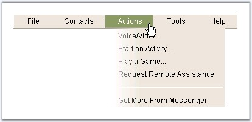
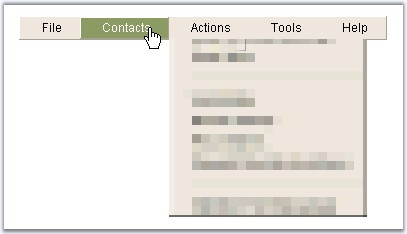

::: {style="DISPLAY: none"}
{#d2h_url_template}{#d2h_package_url style="WIDTH: 0px; DISPLAY: none; HEIGHT: 0px"}
:::

:::::: {.d2h_secondary_topic style="PADDING-BOTTOM: 10pt; MARGIN: 0pt; PADDING-LEFT: 0pt; PADDING-RIGHT: 0pt; PADDING-TOP: 0pt"}
##### Transition Settings {#transition-settings style="tab-stops: 0pt"}

[]{style="FONT-FAMILY: 'Trebuchet MS','sans-serif'; COLOR: #15428b; FONT-SIZE: 9pt"} 

Transition effect and slide effects can be applied for the expand and collapse actions for the parent menu items.

 

Transition effects can be set with one of the values which will be applied during the expand and collapse actions of the items. The values supported are shown below.

[]{style="FONT-FAMILY: 'Trebuchet MS','sans-serif'; COLOR: #15428b; FONT-SIZE: 9pt"} 

::: {align="center"}
+-----------------------------------+---------------------------------------------------------------------------------------------------------------------------+
|                                   |                                                                                                                           |
|                                   |                                                                                                                           |
| Property                          | Description                                                                                                               |
+-----------------------------------+---------------------------------------------------------------------------------------------------------------------------+
|                                   |                                                                                                                           |
|                                   |                                                                                                                           |
| CollapseTransition                | The visual effect to use for collapse animation. Default value is None. The options included are as follows:              |
|                                   |                                                                                                                           |
|                                   | [·      ]{style="FONT-FAMILY: Symbol"}None                                                                                |
|                                   |                                                                                                                           |
|                                   | [·      ]{style="FONT-FAMILY: Symbol"}Fade                                                                                |
|                                   |                                                                                                                           |
|                                   | [·      ]{style="FONT-FAMILY: Symbol"}Dissolve                                                                            |
|                                   |                                                                                                                           |
|                                   | [·      ]{style="FONT-FAMILY: Symbol"}Pixelate                                                                            |
|                                   |                                                                                                                           |
|                                   | [·      ]{style="FONT-FAMILY: Symbol"}WipeDown                                                                            |
|                                   |                                                                                                                           |
|                                   | [·      ]{style="FONT-FAMILY: Symbol"}WipeLeft                                                                            |
|                                   |                                                                                                                           |
|                                   | [·      ]{style="FONT-FAMILY: Symbol"}WipeRight                                                                           |
|                                   |                                                                                                                           |
|                                   | [·      ]{style="FONT-FAMILY: Symbol"}WipeUp                                                                              |
+-----------------------------------+---------------------------------------------------------------------------------------------------------------------------+
|                                   |                                                                                                                           |
|                                   |                                                                                                                           |
| ExpandTransition                  | Specifies the visual effects to use for the expand animation. Default value is None. The options included are as follows: |
|                                   |                                                                                                                           |
|                                   | [·      ]{style="FONT-FAMILY: Symbol"}None                                                                                |
|                                   |                                                                                                                           |
|                                   | [·      ]{style="FONT-FAMILY: Symbol"}Fade                                                                                |
|                                   |                                                                                                                           |
|                                   | [·      ]{style="FONT-FAMILY: Symbol"}Dissolve                                                                            |
|                                   |                                                                                                                           |
|                                   | [·      ]{style="FONT-FAMILY: Symbol"}Pixelate                                                                            |
|                                   |                                                                                                                           |
|                                   | [·      ]{style="FONT-FAMILY: Symbol"}WipeDown                                                                            |
|                                   |                                                                                                                           |
|                                   | [·      ]{style="FONT-FAMILY: Symbol"}WipeLeft                                                                            |
|                                   |                                                                                                                           |
|                                   | [·      ]{style="FONT-FAMILY: Symbol"}WipeRight                                                                           |
|                                   |                                                                                                                           |
|                                   | [·      ]{style="FONT-FAMILY: Symbol"}WipeUp                                                                              |
+-----------------------------------+---------------------------------------------------------------------------------------------------------------------------+
:::

[]{style="FONT-FAMILY: 'Trebuchet MS','sans-serif'; COLOR: #15428b; FONT-SIZE: 9pt"} 

{border="0"}

**[]{style="FONT-FAMILY: 'Trebuchet MS','sans-serif'; COLOR: #15428b; FONT-SIZE: 9pt"}** 

Figure 231: WipeRight effect applied for the Menu item expand

[]{style="FONT-FAMILY: 'Trebuchet MS','sans-serif'; COLOR: #15428b; FONT-SIZE: 9pt"} 

{border="0"}

**[]{style="FONT-FAMILY: 'Trebuchet MS','sans-serif'; COLOR: #15428b; FONT-SIZE: 9pt"}** 

Figure 232: Pixelate effect applied for the Menu item collapse

[]{style="FONT-FAMILY: 'Trebuchet MS','sans-serif'; COLOR: #15428b; FONT-SIZE: 9pt"} 

The html view of the transition effects and properties that are set for the expand / collapse actions of Menu.

[]{style="FONT-FAMILY: 'Courier New'; COLOR: blue; FONT-SIZE: 9pt"} 

  --------------------------------------------------------------------------------------------------------------------------------------------------------------------------------------------------------------------------------------------------------------------------------------------------------------------------------------------------------------------------------------------------------------------------------------------------------------------------------------------------------------------------------------------------------------------------------------------------------------------------------------------------------------------------------------------------------------------------------------------------------------------------------------------------------------------------------------------------------------------------------------------------------------------------------------------------------------------------------------------------------------------------------------------------------------------------------------------------------------------------------------------------------------------
  [\<]{style="FONT-FAMILY: 'Courier New'; COLOR: blue; FONT-SIZE: 9pt"}[cc1]{style="FONT-FAMILY: 'Courier New'; COLOR: maroon; FONT-SIZE: 9pt"}[:]{style="FONT-FAMILY: 'Courier New'; COLOR: blue; FONT-SIZE: 9pt"}[Menu]{style="FONT-FAMILY: 'Courier New'; COLOR: maroon; FONT-SIZE: 9pt"}[ [ID ]{style="COLOR: red"}[= \"Menu1\"]{style="COLOR: blue"} [runat ]{style="COLOR: red"}[= \"server\"]{style="COLOR: blue"} [AutoFormat ]{style="COLOR: red"}[= \"Office2000_Olive\"]{style="COLOR: blue"} [CollapseTransition ]{style="COLOR: red"}[= \"Pixelate\"]{style="COLOR: blue"} [CollapseDuration ]{style="COLOR: red"}[= \"5000\" ]{style="COLOR: blue"}[CollapseType ]{style="COLOR: red"}[= \"Constant\"]{style="COLOR: blue"} [CollapseDelay ]{style="COLOR: red"}[= \"300\" ]{style="COLOR: blue"}[ExpandTransition ]{style="COLOR: red"}[= \"WipeRight\"]{style="COLOR: blue"} [ExpandDuration ]{style="COLOR: red"}[= \"7000\" ]{style="COLOR: blue"}[ExpandType ]{style="COLOR: red"}[= \"Constant\"]{style="COLOR: blue"} [ExpandDelay ]{style="COLOR: red"}[= \"200\"\>]{style="COLOR: blue"}]{style="FONT-FAMILY: 'Courier New'; FONT-SIZE: 9pt"}
  --------------------------------------------------------------------------------------------------------------------------------------------------------------------------------------------------------------------------------------------------------------------------------------------------------------------------------------------------------------------------------------------------------------------------------------------------------------------------------------------------------------------------------------------------------------------------------------------------------------------------------------------------------------------------------------------------------------------------------------------------------------------------------------------------------------------------------------------------------------------------------------------------------------------------------------------------------------------------------------------------------------------------------------------------------------------------------------------------------------------------------------------------------------------

[]{style="FONT-FAMILY: 'Trebuchet MS','sans-serif'; COLOR: #15428b; FONT-SIZE: 9pt"} 

The rate at which the expand and collapse transition can be set using the **ExpandTypes** and **CollapseType** properties.

[]{style="FONT-FAMILY: 'Trebuchet MS','sans-serif'; COLOR: #15428b; FONT-SIZE: 9pt"} 

::: {align="center"}
+-----------------------------------+---------------------------------------------------------------------------------------------------------------------------------+
|                                   |                                                                                                                                 |
|                                   |                                                                                                                                 |
| Property                          | Description                                                                                                                     |
+-----------------------------------+---------------------------------------------------------------------------------------------------------------------------------+
| CollapseType                      | Specifies the type of slide effect to use for collapse animation. Default value is None. The options included are as follows:   |
|                                   |                                                                                                                                 |
|                                   | [·      ]{style="FONT-FAMILY: Symbol"}None                                                                                      |
|                                   |                                                                                                                                 |
|                                   | [·      ]{style="FONT-FAMILY: Symbol"}Constant                                                                                  |
|                                   |                                                                                                                                 |
|                                   | [·      ]{style="FONT-FAMILY: Symbol"}Accelerate                                                                                |
|                                   |                                                                                                                                 |
|                                   | [·      ]{style="FONT-FAMILY: Symbol"}Decelerate                                                                                |
+-----------------------------------+---------------------------------------------------------------------------------------------------------------------------------+
| ExpandType                        | Specifies the type of slide effect to use for the expand animation. Default value is None. The options included are as follows: |
|                                   |                                                                                                                                 |
|                                   | [·      ]{style="FONT-FAMILY: Symbol"}None                                                                                      |
|                                   |                                                                                                                                 |
|                                   | [·      ]{style="FONT-FAMILY: Symbol"}Constant                                                                                  |
|                                   |                                                                                                                                 |
|                                   | [·      ]{style="FONT-FAMILY: Symbol"}Accelerate                                                                                |
|                                   |                                                                                                                                 |
|                                   | [·      ]{style="FONT-FAMILY: Symbol"}Decelerate                                                                                |
+-----------------------------------+---------------------------------------------------------------------------------------------------------------------------------+
:::

[]{style="FONT-FAMILY: 'Trebuchet MS','sans-serif'; COLOR: #15428b; FONT-SIZE: 9pt"} 

The duration of the expand and collapse transition can be specified through **ExpandDuration** / **CollapseDuration** properties. Also, on clicking a parent item, the initial time after which the expand / collapse action should begin can be specified through **ExpandDelay** / **CollapseDelay** properties.

[]{style="FONT-FAMILY: 'Trebuchet MS','sans-serif'; COLOR: #15428b; FONT-SIZE: 9pt"} 

::: {align="center"}
+-----------------------------------+---------------------------------------------------------------------------------------------------------------------+
|                                   |                                                                                                                     |
|                                   |                                                                                                                     |
| Property                          | Description                                                                                                         |
+-----------------------------------+---------------------------------------------------------------------------------------------------------------------+
| CollapseDelay                     | Specifies delay in milliseconds. The time when mouse leaves the menu and the menu starts to collapse.               |
+-----------------------------------+---------------------------------------------------------------------------------------------------------------------+
| CollapseDuration                  | The duration of the collapse animation, in milliseconds.                                                            |
+-----------------------------------+---------------------------------------------------------------------------------------------------------------------+
| ExpandDelay                       | Specifies the delay, in milliseconds. The time when the mouse points a menu item and its subgroup begins to expand. |
+-----------------------------------+---------------------------------------------------------------------------------------------------------------------+
| ExpandDuration                    | Specifies the duration of expand animation, in milliseconds.                                                        |
+-----------------------------------+---------------------------------------------------------------------------------------------------------------------+
:::

 

[]{#related-topics}
::::::
