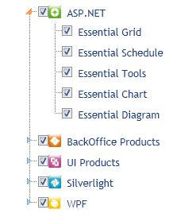

::: {style="DISPLAY: none"}
{#d2h_url_template}{#d2h_package_url style="WIDTH: 0px; DISPLAY: none; HEIGHT: 0px"}
:::

::::::::::::: {.d2h_secondary_topic style="PADDING-BOTTOM: 10pt; MARGIN: 0pt; PADDING-LEFT: 0pt; PADDING-RIGHT: 0pt; PADDING-TOP: 0pt"}
#### TreeView CheckBox Support {#treeview-checkbox-support style="tab-stops: 0pt"}

 

CheckBox Support for TreeView

The CheckBox support feature enables you to select multiple nodes from the TreeView and is provided next to every node.Check/Uncheck the CheckBox to select/deselect the nodes.

 

 Use Case Scenarios

When the user checks the checkbox of the Parent node, all the child nodes of a particular parent node are automatically selected. 

 

TreeView CheckBox Application

Using Builder

The following steps show you how to define the CheckBox in TreeView using Builder.

1.   Go to **View**, and create an *ul-li* hierarchy of tree-view nodes.

::: {style="BORDER-BOTTOM: windowtext 1pt solid; BORDER-LEFT: medium none; PADDING-BOTTOM: 1pt; MARGIN-TOP: 9pt; PADDING-LEFT: 0pt; PADDING-RIGHT: 0pt; MARGIN-BOTTOM: 9pt; BORDER-TOP: windowtext 1pt solid; BORDER-RIGHT: medium none; PADDING-TOP: 1pt"}
Note: A ul-li heirarchy is related to unordered lists.
:::

 

2.   In the **View**, invoke the **TreeView** helper with the control ID as first argument, and the tree-view content ID as the second argument.

3.   The use of CheckBox for Properties and Events in TreeView is shown below.

 

::: {align="center"}
+------------------------------------------------------------------------------------------------------------------------------------------------------------------------------------------------------------------------------------------------------------------------------------------------------------------------------------------------------------------------------------------------------------------+
| **View\[ASPX\]**                                                                                                                                                                                                                                                                                                                                                                                                 |
|                                                                                                                                                                                                                                                                                                                                                                                                                  |
| [    [\<%]{style="BACKGROUND: yellow"}[=]{style="COLOR: blue"}Html.Syncfusion().TreeView([\"MyTreeView\"]{style="COLOR: #a31515"}, [\"]{style="COLOR: #a31515"}]{style="FONT-FAMILY: Consolas; FONT-SIZE: 9.5pt"}[treeViewContents]{style="FONT-FAMILY: 'Courier New'; COLOR: #a31515"}[\"]{style="FONT-FAMILY: Consolas; COLOR: #a31515; FONT-SIZE: 9.5pt"}[)]{style="FONT-FAMILY: Consolas; FONT-SIZE: 9.5pt"} |
|                                                                                                                                                                                                                                                                                                                                                                                                                  |
| [            .ShowCheckbox([true]{style="COLOR: blue"})]{style="FONT-FAMILY: Consolas; FONT-SIZE: 9.5pt"}                                                                                                                                                                                                                                                                                                        |
|                                                                                                                                                                                                                                                                                                                                                                                                                  |
| [            .CheckAll([true]{style="COLOR: blue"})]{style="FONT-FAMILY: Consolas; FONT-SIZE: 9.5pt"}                                                                                                                                                                                                                                                                                                            |
|                                                                                                                                                                                                                                                                                                                                                                                                                  |
| [            .ClientSideOnChecked([\"ClientSideChecked\"]{style="COLOR: #a31515"})]{style="FONT-FAMILY: Consolas; FONT-SIZE: 9.5pt"}                                                                                                                                                                                                                                                                             |
|                                                                                                                                                                                                                                                                                                                                                                                                                  |
| [            .ClientSideOnUnChecked([\"ClientSideUnChecked\"]{style="COLOR: #a31515"})]{style="FONT-FAMILY: Consolas; FONT-SIZE: 9.5pt"}                                                                                                                                                                                                                                                                         |
|                                                                                                                                                                                                                                                                                                                                                                                                                  |
| [    [%\>]{style="BACKGROUND: yellow"}]{style="FONT-FAMILY: Consolas; FONT-SIZE: 9.5pt"}[ ]{style="FONT-FAMILY: Consolas"}                                                                                                                                                                                                                                                                                       |
+------------------------------------------------------------------------------------------------------------------------------------------------------------------------------------------------------------------------------------------------------------------------------------------------------------------------------------------------------------------------------------------------------------------+
:::

 

::: {align="center"}
+-------------------------------------------------------------------------------------------------------------------------------------------------------------------------------------------------------------------------------------------------------------------------------------------------------------------------------------------------------------------------------------------+
| **View\[cshtml\]**                                                                                                                                                                                                                                                                                                                                                                        |
|                                                                                                                                                                                                                                                                                                                                                                                           |
| [    [\@{]{style="BACKGROUND: yellow"} Html.Syncfusion().TreeView([\"MyTreeView\"]{style="COLOR: #a31515"}, [\"]{style="COLOR: #a31515"}]{style="FONT-FAMILY: Consolas; FONT-SIZE: 9.5pt"}[treeViewContents]{style="FONT-FAMILY: 'Courier New'; COLOR: #a31515"}[\"]{style="FONT-FAMILY: Consolas; COLOR: #a31515; FONT-SIZE: 9.5pt"}[)]{style="FONT-FAMILY: Consolas; FONT-SIZE: 9.5pt"} |
|                                                                                                                                                                                                                                                                                                                                                                                           |
| [            .ShowCheckbox([true]{style="COLOR: blue"})]{style="FONT-FAMILY: Consolas; FONT-SIZE: 9.5pt"}                                                                                                                                                                                                                                                                                 |
|                                                                                                                                                                                                                                                                                                                                                                                           |
| [            .CheckAll([true]{style="COLOR: blue"})]{style="FONT-FAMILY: Consolas; FONT-SIZE: 9.5pt"}                                                                                                                                                                                                                                                                                     |
|                                                                                                                                                                                                                                                                                                                                                                                           |
| [            .ClientSideOnChecked([\"ClientSideChecked\"]{style="COLOR: #a31515"})]{style="FONT-FAMILY: Consolas; FONT-SIZE: 9.5pt"}                                                                                                                                                                                                                                                      |
|                                                                                                                                                                                                                                                                                                                                                                                           |
| [            .ClientSideOnUnChecked([\"ClientSideUnChecked\"]{style="COLOR: #a31515"}).Render();]{style="FONT-FAMILY: Consolas; FONT-SIZE: 9.5pt"}                                                                                                                                                                                                                                        |
|                                                                                                                                                                                                                                                                                                                                                                                           |
| [    [}]{style="BACKGROUND: yellow"}]{style="FONT-FAMILY: Consolas; FONT-SIZE: 9.5pt"}[ ]{style="FONT-FAMILY: Consolas"}                                                                                                                                                                                                                                                                  |
+-------------------------------------------------------------------------------------------------------------------------------------------------------------------------------------------------------------------------------------------------------------------------------------------------------------------------------------------------------------------------------------------+
:::

 

4.   In the **Controller**, navigate to the **View** page.

 

::: {align="center"}
+-------------------------------------------------------------------------------------------------------------------------------------------------------------------------------------------------------------------+
| **[\[C#\]]{style="FONT-FAMILY: 'Courier New'"}**                                                                                                                                                                  |
|                                                                                                                                                                                                                   |
| [   ]{style="FONT-FAMILY: 'Courier New'"}[public]{style="FONT-FAMILY: Consolas; COLOR: blue; FONT-SIZE: 9.5pt"}[ [ActionResult]{style="COLOR: #2b91af"} Index()]{style="FONT-FAMILY: Consolas; FONT-SIZE: 9.5pt"} |
|                                                                                                                                                                                                                   |
| [        {]{style="FONT-FAMILY: Consolas; FONT-SIZE: 9.5pt"}                                                                                                                                                      |
|                                                                                                                                                                                                                   |
| [            [return]{style="COLOR: blue"} View();]{style="FONT-FAMILY: Consolas; FONT-SIZE: 9.5pt"}                                                                                                              |
|                                                                                                                                                                                                                   |
| [        }]{style="FONT-FAMILY: Consolas; FONT-SIZE: 9.5pt"}                                                                                                                                                      |
|                                                                                                                                                                                                                   |
| []{style="FONT-FAMILY: 'Courier New'"}                                                                                                                                                                            |
+-------------------------------------------------------------------------------------------------------------------------------------------------------------------------------------------------------------------+
:::

 

5.   When you build and run the application, the TreeView will appear as shown below:

 

{border="0"}

Figure 323: Checkbox Supported Treeview Control

 

Using Properties Model 

The following steps describe how to define the CheckBox in TreeView, through the properties model.

1.   Navigate to **View**, and create an *ul-li* hierarchy of tree-view nodes.

2.   In the **View**, invoke the **TreeView** helper with the control ID as first argument and the tree-view content ID as the second argument.

 

::: {align="center"}
+-------------------------------------------------------------------------------------------------------------------------------------------------------------------------------------------------------------------------------------------------------------------------------------------------------------------------------------------------------------------------------------------------------------------------------------------------------------------------------------------------------------------------------------------------------------+
| **View\[ASPX\]**                                                                                                                                                                                                                                                                                                                                                                                                                                                                                                                                            |
|                                                                                                                                                                                                                                                                                                                                                                                                                                                                                                                                                             |
| [\<%]{style="FONT-FAMILY: Consolas; BACKGROUND: yellow; FONT-SIZE: 9.5pt"}[=]{style="FONT-FAMILY: Consolas; COLOR: blue; FONT-SIZE: 9.5pt"}[Html.Syncfusion ().TreeView ([\"MyTreeView\"]{style="COLOR: #a31515"}, [\"TreeView\"]{style="COLOR: #a31515"}, ([TreeViewModel]{style="COLOR: #2b91af"})ViewData\[[\"TreeViewModel\"]{style="COLOR: #a31515"}\])[%\>]{style="BACKGROUND: yellow"}]{style="FONT-FAMILY: Consolas; FONT-SIZE: 9.5pt"}[ ]{style="FONT-FAMILY: Consolas"}   []{style="FONT-FAMILY: Consolas; BACKGROUND: yellow; FONT-SIZE: 9.5pt"} |
+-------------------------------------------------------------------------------------------------------------------------------------------------------------------------------------------------------------------------------------------------------------------------------------------------------------------------------------------------------------------------------------------------------------------------------------------------------------------------------------------------------------------------------------------------------------+
:::

 

 

::: {align="center"}
+------------------------------------------------------------------------------------------------------------------------------------------------------------------------------------------------------------------------------------------------------------------------------------------------------------------------------------------------------------------------------------------------------------------------------------------------------------------------------------------------------------------------------------------+
| **View\[cshtml\]**                                                                                                                                                                                                                                                                                                                                                                                                                                                                                                                       |
|                                                                                                                                                                                                                                                                                                                                                                                                                                                                                                                                          |
|                                                                                                                                                                                                                                                                                                                                                                                                                                                                                                                                          |
|                                                                                                                                                                                                                                                                                                                                                                                                                                                                                                                                          |
| [@(]{style="FONT-FAMILY: Consolas; BACKGROUND: yellow; FONT-SIZE: 9.5pt"}[new]{style="FONT-FAMILY: Consolas; COLOR: blue; FONT-SIZE: 9.5pt"}[ [HtmlString]{style="COLOR: #2b91af"}(Html.Syncfusion().TreeView([\"MyTreeView\"]{style="COLOR: #a31515"}, [\"TreeView\"]{style="COLOR: #a31515"}, ([TreeViewModel]{style="COLOR: #2b91af"})ViewData\[[\"TreeViewModel\"]{style="COLOR: #a31515"}\]).ToString())[)]{style="BACKGROUND: yellow"}]{style="FONT-FAMILY: Consolas; FONT-SIZE: 9.5pt"}**[]{style="FONT-FAMILY: 'Courier New'"}** |
|                                                                                                                                                                                                                                                                                                                                                                                                                                                                                                                                          |
| [ ]{style="FONT-FAMILY: Consolas"}   []{style="FONT-FAMILY: Consolas; BACKGROUND: yellow; FONT-SIZE: 9.5pt"}                                                                                                                                                                                                                                                                                                                                                                                                                             |
+------------------------------------------------------------------------------------------------------------------------------------------------------------------------------------------------------------------------------------------------------------------------------------------------------------------------------------------------------------------------------------------------------------------------------------------------------------------------------------------------------------------------------------------+
:::

 

3.   To view using the controller, define the CheckBox's use of the properties and events in the TreeView. This can be done through the view-specific data.

 

::: {align="center"}
+-------------------------------------------------------------------------------------------------------------------------------------------------------------------------------------------------------------------------------------------------------------------------+
| **[\[C#\]]{style="FONT-FAMILY: 'Courier New'"}**                                                                                                                                                                                                                        |
|                                                                                                                                                                                                                                                                         |
| [public]{style="FONT-FAMILY: Consolas; COLOR: blue; FONT-SIZE: 9.5pt"}[ [ActionResult]{style="COLOR: #2b91af"} Index([string]{style="COLOR: blue"} SourceType, [TreeViewModel]{style="COLOR: #2b91af"} treeviewModel)]{style="FONT-FAMILY: Consolas; FONT-SIZE: 9.5pt"} |
|                                                                                                                                                                                                                                                                         |
| [        {]{style="FONT-FAMILY: Consolas; FONT-SIZE: 9.5pt"}                                                                                                                                                                                                            |
|                                                                                                                                                                                                                                                                         |
| [            [TreeViewModel]{style="COLOR: #2b91af"} treeview = [new]{style="COLOR: blue"} [TreeViewModel]{style="COLOR: #2b91af"}();]{style="FONT-FAMILY: Consolas; FONT-SIZE: 9.5pt"}                                                                                 |
|                                                                                                                                                                                                                                                                         |
| [            treeview.CheckAll = true;]{style="FONT-FAMILY: Consolas; FONT-SIZE: 9.5pt"}                                                                                                                                                                                |
|                                                                                                                                                                                                                                                                         |
| [            ViewData\[[\"TreeViewModel\"]{style="COLOR: #a31515"}\]=treeview;]{style="FONT-FAMILY: Consolas; FONT-SIZE: 9.5pt"}                                                                                                                                        |
|                                                                                                                                                                                                                                                                         |
| [            return]{style="FONT-FAMILY: Consolas; COLOR: blue; FONT-SIZE: 9.5pt"}[ View();]{style="FONT-FAMILY: Consolas; FONT-SIZE: 9.5pt"}                                                                                                                           |
|                                                                                                                                                                                                                                                                         |
| [        }]{style="FONT-FAMILY: Consolas; FONT-SIZE: 9.5pt"}                                                                                                                                                                                                            |
|                                                                                                                                                                                                                                                                         |
| []{style="FONT-FAMILY: 'Courier New'"}                                                                                                                                                                                                                                  |
+-------------------------------------------------------------------------------------------------------------------------------------------------------------------------------------------------------------------------------------------------------------------------+
:::

 

4.   When you build and run the application, the TreeView will appear as shown below:

 

{border="0"}

Figure 324: Checkbox support for Treeview

 

 

Properties

**** 

::: {align="center"}
  -------------- --------------------------------------------------------------------------------------------------------------------------- ------------- ----------- ------------------------------
  Property       Description                                                                                                                 Type          Data Type   Reference links
  ShowCheckBox   When set to true, the property displays the Checkbox for that particular node.                                              Server-Side   Boolean     NA[]{style="COLOR: #c00000"}
  CheckAll       When it is true, this property checks all the node checkboxes, and when it is false, it unchecks all the node checkboxes.   Server-Side   Boolean     NA[]{style="COLOR: #c00000"}
  -------------- --------------------------------------------------------------------------------------------------------------------------- ------------- ----------- ------------------------------
:::

[]{style="FONT-FAMILY: 'Calibri','sans-serif'; COLOR: black"} 

Methods

 

::: {align="center"}
  Method       Description                              Parameters      Type              Return Type   Reference links
  ------------ ---------------------------------------- --------------- ----------------- ------------- -----------------
  CheckAll     Checks all the node checkboxes           Not Available   **Client-side**   Void          NA
  UnCheckAll   UnChecks all the node checkboxes         Not Available   **Client-side**   Void          NA
  CheckAt      Checks the node of the specified ID.     ID              **Client-side**   NA            NA
  UnCheckAt    UnChecks the node of the specified ID.   ID              **Client-side**   NA            NA
:::

[]{style="FONT-FAMILY: 'Calibri','sans-serif'; COLOR: black"} 

Events

 

::: {align="center"}
  Event                   Description                                                                                Arguments   Type          Reference links
  ----------------------- ------------------------------------------------------------------------------------------ ----------- ------------- -----------------
  ClientSideOnChecked     This event is raised when you check the checkbox of any node.(Every node has a checkbox)   args        Client-side   NA
  ClientSideOnUnChecked   This event is raised when you uncheck the checkbox of any node.                            args        Client-side   NA
:::

[]{style="FONT-FAMILY: 'Calibri','sans-serif'; COLOR: black"} 

Sample Link

To view the samples,

1.   Open the Grid sample browser from the dashboard. (Refer to the **Samples and Location** chapter)

2.   Navigate to **Tools.MVC -\> TreeView**

**[]{style="COLOR: red"}** 

 

[]{#related-topics}
:::::::::::::
