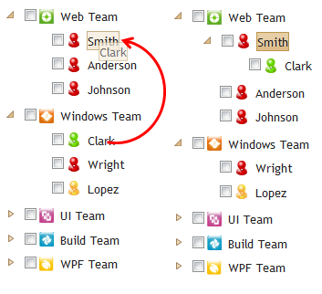

::: {style="DISPLAY: none"}
{#d2h_url_template}{#d2h_package_url style="WIDTH: 0px; DISPLAY: none; HEIGHT: 0px"}
:::

:::::::: {.d2h_secondary_topic style="PADDING-BOTTOM: 10pt; MARGIN: 0pt; PADDING-LEFT: 0pt; PADDING-RIGHT: 0pt; PADDING-TOP: 0pt"}
#### TreeView Drag and Drop   {#treeview-drag-and-drop style="tab-stops: 0pt"}

Drag and Drop support allows users to drag-and-drop the nodes within the TreeView control and also drag a particular node from one tree to another tree.

 

Use Case Scenarios

You can reorder nodes by using this drag-and-drop support.

You can move a particular node from one tree to another tree.

Properties

+---------------------------------------+----------------------------------------------------------------------------+----------------------------------------+-----------------------------------------------+-------------------------------+
| **Property**                          | **Description**                                                            | **Type**                               | **Data Type**                                 | **Reference**                 |
+---------------------------------------+----------------------------------------------------------------------------+----------------------------------------+-----------------------------------------------+-------------------------------+
| DragandDrop[]{style="COLOR: #c00000"} | It gives the functionality to drag-and-drop nodes in the TreeView control. | Server side []{style="COLOR: #c00000"} | Binary, true/false[ ]{style="COLOR: #c00000"} | NA []{style="COLOR: #c00000"} |
|                                       |                                                                            |                                        |                                               |                               |
|                                       | The default value is false.[]{style="COLOR: #c00000"}                      |                                        |                                               |                               |
+---------------------------------------+----------------------------------------------------------------------------+----------------------------------------+-----------------------------------------------+-------------------------------+

 

Events

  **[Event ]{style="COLOR: black"}**[]{style="COLOR: black"}   **[Description ]{style="COLOR: black"}**[]{style="COLOR: black"}   **[Arguments ]{style="COLOR: black"}**[]{style="COLOR: black"}   **[Type ]{style="COLOR: black"}**[]{style="COLOR: black"}
  ------------------------------------------------------------ ------------------------------------------------------------------ ---------------------------------------------------------------- -----------------------------------------------------------
  ClientSideOnDragStarts                                       Raised when the drag starts.                                       obj, args                                                        Client Side
  ClientSideOnDragging                                         Raised during node dragging.                                       obj, args                                                        Client Side
  ClientSideOnDropping                                         Raised when the node is dropped.                                   obj, args                                                        Client Side
  ClientSideOnDropped                                          Triggered when dropped node is added in Target.                    obj, args                                                        Client Side

 

Sample Link

To view a sample:

1.   Open the Essential Tools sample browser from the dashboard. (Refer to the Samples and Location chapter).

2.   Navigate to **Tools.MVC** \> **TreeView** \> **Drag and Drop**[]{style="COLOR: #c00000"}

 

Adding Drag-and-Drop to an Application\
Using TreeViewBuilder

Implement the drag-and-drop option in the TreeView control by using TreeViewBuilder:

1.   Create a **view**.

2.   In the **view**, invoke the **TreeView** helper with the control ID.

3.   Set the **DragandDrop** property as **True**.

::: {align="center"}
+------------------------------------------------------------------------------------------------------------------------------------------------------------------------------------------------------------------------------------------------------------------------------------------------------------------------------------------------------------------------------------+
| **[\[ASPX\]]{style="FONT-FAMILY: 'Courier New'"}**                                                                                                                                                                                                                                                                                                                                 |
|                                                                                                                                                                                                                                                                                                                                                                                    |
| **[]{style="FONT-FAMILY: 'Courier New'"}**                                                                                                                                                                                                                                                                                                                                         |
|                                                                                                                                                                                                                                                                                                                                                                                    |
| [\<%]{style="FONT-FAMILY: Consolas; BACKGROUND: yellow; FONT-SIZE: 9.5pt"}[=]{style="FONT-FAMILY: Consolas; COLOR: blue; FONT-SIZE: 9.5pt"}[Html.Syncfusion().TreeView([\"myTreeView\"]{style="COLOR: #a31515"})**.**DragandDrop([true]{style="COLOR: blue"})]{style="FONT-FAMILY: Consolas; FONT-SIZE: 9.5pt"}[.Items(items =\>]{style="FONT-FAMILY: Consolas; FONT-SIZE: 9.5pt"} |
|                                                                                                                                                                                                                                                                                                                                                                                    |
| [                        { ]{style="FONT-FAMILY: Consolas; FONT-SIZE: 9.5pt"}                                                                                                                                                                                                                                                                                                      |
|                                                                                                                                                                                                                                                                                                                                                                                    |
| [                            items.Add().Text([\"Web Team\"]{style="COLOR: #a31515"}).Value([\"BI\"]{style="COLOR: #a31515"}).Children(child =\>]{style="FONT-FAMILY: Consolas; FONT-SIZE: 9.5pt"}                                                                                                                                                                                 |
|                                                                                                                                                                                                                                                                                                                                                                                    |
| [                            {]{style="FONT-FAMILY: Consolas; FONT-SIZE: 9.5pt"}                                                                                                                                                                                                                                                                                                   |
|                                                                                                                                                                                                                                                                                                                                                                                    |
| [                                child.Add().Text([\"Smith\"]{style="COLOR: #a31515"}).Value([\"BIC\"]{style="COLOR: #a31515"});]{style="FONT-FAMILY: Consolas; FONT-SIZE: 9.5pt"}                                                                                                                                                                                                 |
|                                                                                                                                                                                                                                                                                                                                                                                    |
| [                                child.Add().Text([\"Johnson\"]{style="COLOR: #a31515"}).Value([\"BICl\"]{style="COLOR: #a31515"});]{style="FONT-FAMILY: Consolas; FONT-SIZE: 9.5pt"}                                                                                                                                                                                              |
|                                                                                                                                                                                                                                                                                                                                                                                    |
| [                                child.Add().Text([\"Anderson\"]{style="COLOR: #a31515"}).Value([\"BIG\"]{style="COLOR: #a31515"});]{style="FONT-FAMILY: Consolas; FONT-SIZE: 9.5pt"}                                                                                                                                                                                              |
|                                                                                                                                                                                                                                                                                                                                                                                    |
| [                            });]{style="FONT-FAMILY: Consolas; FONT-SIZE: 9.5pt"}                                                                                                                                                                                                                                                                                                 |
|                                                                                                                                                                                                                                                                                                                                                                                    |
| [                            items.Add().Text([\"Windows Team\"]{style="COLOR: #a31515"}).Value([\"R\"]{style="COLOR: #a31515"})]{style="FONT-FAMILY: Consolas; FONT-SIZE: 9.5pt"}                                                                                                                                                                                                 |
|                                                                                                                                                                                                                                                                                                                                                                                    |
| [.Children(child =\>]{style="FONT-FAMILY: Consolas; FONT-SIZE: 9.5pt"}                                                                                                                                                                                                                                                                                                             |
|                                                                                                                                                                                                                                                                                                                                                                                    |
| [                            {]{style="FONT-FAMILY: Consolas; FONT-SIZE: 9.5pt"}                                                                                                                                                                                                                                                                                                   |
|                                                                                                                                                                                                                                                                                                                                                                                    |
| [                                child.Add().Text([\"Clark\"]{style="COLOR: #a31515"}).Value([\"REX\"]{style="COLOR: #a31515"});]{style="FONT-FAMILY: Consolas; FONT-SIZE: 9.5pt"}                                                                                                                                                                                                 |
|                                                                                                                                                                                                                                                                                                                                                                                    |
| [                                child.Add().Text([\"Wright\"]{style="COLOR: #a31515"}).Value([\"RED\"]{style="COLOR: #a31515"});]{style="FONT-FAMILY: Consolas; FONT-SIZE: 9.5pt"}                                                                                                                                                                                                |
|                                                                                                                                                                                                                                                                                                                                                                                    |
| [                                child.Add().Text([\"Lopez\"]{style="COLOR: #a31515"}).Value([\"REP\"]{style="COLOR: #a31515"});]{style="FONT-FAMILY: Consolas; FONT-SIZE: 9.5pt"}                                                                                                                                                                                                 |
|                                                                                                                                                                                                                                                                                                                                                                                    |
| [                            });]{style="FONT-FAMILY: Consolas; FONT-SIZE: 9.5pt"}                                                                                                                                                                                                                                                                                                 |
|                                                                                                                                                                                                                                                                                                                                                                                    |
| [\...]{style="FONT-FAMILY: Consolas; FONT-SIZE: 9.5pt"}                                                                                                                                                                                                                                                                                                                            |
|                                                                                                                                                                                                                                                                                                                                                                                    |
| [\...]{style="FONT-FAMILY: Consolas; FONT-SIZE: 9.5pt"}                                                                                                                                                                                                                                                                                                                            |
|                                                                                                                                                                                                                                                                                                                                                                                    |
| [                        })]{style="FONT-FAMILY: Consolas; FONT-SIZE: 9.5pt"}                                                                                                                                                                                                                                                                                                      |
|                                                                                                                                                                                                                                                                                                                                                                                    |
| []{style="FONT-FAMILY: Consolas; FONT-SIZE: 9.5pt"}                                                                                                                                                                                                                                                                                                                                |
|                                                                                                                                                                                                                                                                                                                                                                                    |
| [%\>]{style="FONT-FAMILY: Consolas; BACKGROUND: yellow; FONT-SIZE: 9.5pt"}[]{style="FONT-FAMILY: 'Courier New'"}                                                                                                                                                                                                                                                                   |
+------------------------------------------------------------------------------------------------------------------------------------------------------------------------------------------------------------------------------------------------------------------------------------------------------------------------------------------------------------------------------------+
:::

 

::: {align="center"}
+-------------------------------------------------------------------------------------------------------------------------------------------------------------------------------------------------------------------------------------------------------------------------------------------------------------------------------------------------------+
| **[\[Razor\]]{style="FONT-FAMILY: 'Courier New'"}**                                                                                                                                                                                                                                                                                                   |
|                                                                                                                                                                                                                                                                                                                                                       |
| **[]{style="FONT-FAMILY: 'Courier New'"}**                                                                                                                                                                                                                                                                                                            |
|                                                                                                                                                                                                                                                                                                                                                       |
| [\@{]{style="FONT-FAMILY: 'Courier New'; BACKGROUND: yellow"}[Html.Syncfusion]{style="FONT-FAMILY: Consolas; FONT-SIZE: 9.5pt"}[.TreeView([\"myTreeView\"]{style="COLOR: #a31515"})**.**DragandDrop([true]{style="COLOR: blue"})]{style="FONT-FAMILY: Consolas; FONT-SIZE: 9.5pt"}[.Items(items =\>]{style="FONT-FAMILY: Consolas; FONT-SIZE: 9.5pt"} |
|                                                                                                                                                                                                                                                                                                                                                       |
| [                        { ]{style="FONT-FAMILY: Consolas; FONT-SIZE: 9.5pt"}                                                                                                                                                                                                                                                                         |
|                                                                                                                                                                                                                                                                                                                                                       |
| [                            items.Add().Text([\"Web Team\"]{style="COLOR: #a31515"}).Value([\"BI\"]{style="COLOR: #a31515"}).Children(child =\>]{style="FONT-FAMILY: Consolas; FONT-SIZE: 9.5pt"}                                                                                                                                                    |
|                                                                                                                                                                                                                                                                                                                                                       |
| [                            {]{style="FONT-FAMILY: Consolas; FONT-SIZE: 9.5pt"}                                                                                                                                                                                                                                                                      |
|                                                                                                                                                                                                                                                                                                                                                       |
| [                                child.Add().Text([\"Smith\"]{style="COLOR: #a31515"}).Value([\"BIC\"]{style="COLOR: #a31515"});]{style="FONT-FAMILY: Consolas; FONT-SIZE: 9.5pt"}                                                                                                                                                                    |
|                                                                                                                                                                                                                                                                                                                                                       |
| [                                child.Add().Text([\"Johnson\"]{style="COLOR: #a31515"}).Value([\"BICl\"]{style="COLOR: #a31515"});]{style="FONT-FAMILY: Consolas; FONT-SIZE: 9.5pt"}                                                                                                                                                                 |
|                                                                                                                                                                                                                                                                                                                                                       |
| [                                child.Add().Text([\"Anderson\"]{style="COLOR: #a31515"}).Value([\"BIG\"]{style="COLOR: #a31515"});]{style="FONT-FAMILY: Consolas; FONT-SIZE: 9.5pt"}                                                                                                                                                                 |
|                                                                                                                                                                                                                                                                                                                                                       |
| [                            });]{style="FONT-FAMILY: Consolas; FONT-SIZE: 9.5pt"}                                                                                                                                                                                                                                                                    |
|                                                                                                                                                                                                                                                                                                                                                       |
| [                            items.Add().Text([\"Windows Team\"]{style="COLOR: #a31515"}).Value([\"R\"]{style="COLOR: #a31515"})]{style="FONT-FAMILY: Consolas; FONT-SIZE: 9.5pt"}                                                                                                                                                                    |
|                                                                                                                                                                                                                                                                                                                                                       |
| [.Children(child =\>]{style="FONT-FAMILY: Consolas; FONT-SIZE: 9.5pt"}                                                                                                                                                                                                                                                                                |
|                                                                                                                                                                                                                                                                                                                                                       |
| [                            {]{style="FONT-FAMILY: Consolas; FONT-SIZE: 9.5pt"}                                                                                                                                                                                                                                                                      |
|                                                                                                                                                                                                                                                                                                                                                       |
| [                                child.Add().Text([\"Clark\"]{style="COLOR: #a31515"}).Value([\"REX\"]{style="COLOR: #a31515"});]{style="FONT-FAMILY: Consolas; FONT-SIZE: 9.5pt"}                                                                                                                                                                    |
|                                                                                                                                                                                                                                                                                                                                                       |
| [                                child.Add().Text([\"Wright\"]{style="COLOR: #a31515"}).Value([\"RED\"]{style="COLOR: #a31515"});]{style="FONT-FAMILY: Consolas; FONT-SIZE: 9.5pt"}                                                                                                                                                                   |
|                                                                                                                                                                                                                                                                                                                                                       |
| [                                child.Add().Text([\"Lopez\"]{style="COLOR: #a31515"}).Value([\"REP\"]{style="COLOR: #a31515"});]{style="FONT-FAMILY: Consolas; FONT-SIZE: 9.5pt"}                                                                                                                                                                    |
|                                                                                                                                                                                                                                                                                                                                                       |
| [                            });]{style="FONT-FAMILY: Consolas; FONT-SIZE: 9.5pt"}                                                                                                                                                                                                                                                                    |
|                                                                                                                                                                                                                                                                                                                                                       |
| [\...]{style="FONT-FAMILY: Consolas; FONT-SIZE: 9.5pt"}                                                                                                                                                                                                                                                                                               |
|                                                                                                                                                                                                                                                                                                                                                       |
| [\...]{style="FONT-FAMILY: Consolas; FONT-SIZE: 9.5pt"}                                                                                                                                                                                                                                                                                               |
|                                                                                                                                                                                                                                                                                                                                                       |
| [                        })]{style="FONT-FAMILY: Consolas; FONT-SIZE: 9.5pt"}                                                                                                                                                                                                                                                                         |
|                                                                                                                                                                                                                                                                                                                                                       |
| [.Render();]{style="FONT-FAMILY: Consolas; FONT-SIZE: 9.5pt"}                                                                                                                                                                                                                                                                                         |
|                                                                                                                                                                                                                                                                                                                                                       |
| [}]{style="FONT-FAMILY: 'Courier New'; BACKGROUND: yellow"}[]{style="FONT-FAMILY: 'Courier New'"}                                                                                                                                                                                                                                                     |
|                                                                                                                                                                                                                                                                                                                                                       |
| []{style="FONT-FAMILY: 'Courier New'"}                                                                                                                                                                                                                                                                                                                |
+-------------------------------------------------------------------------------------------------------------------------------------------------------------------------------------------------------------------------------------------------------------------------------------------------------------------------------------------------------+
:::

 

 

4.   Build and run the application.

{border="0"} 

Figure 313: TreeView---Drag-and-Drop (Before and After)

 

Using TreeViewModel

Implement the drag-and-drop option in the TreeView control by using TreeViewModel:

1.   In the **controller**, create an object for the **TreeViewModel** class.

2.   Set the **DragandDrop** property as **True**.

3.   Pass the **TreeViewModel** class to the **ViewData**.

 

::: {align="center"}
+-------------------------------------------------------------------------------------------------------------------------------------------------------------------------------------------------------------------------------------------------------+
| [      **\[Controller\]**]{style="FONT-FAMILY: 'Courier New'"}                                                                                                                                                                                        |
|                                                                                                                                                                                                                                                       |
| [        [public]{style="COLOR: blue"} [ActionResult]{style="COLOR: #2b91af"} Index()]{style="FONT-FAMILY: Consolas; FONT-SIZE: 9.5pt"}                                                                                                               |
|                                                                                                                                                                                                                                                       |
| [        {]{style="FONT-FAMILY: Consolas; FONT-SIZE: 9.5pt"}                                                                                                                                                                                          |
|                                                                                                                                                                                                                                                       |
| [            [TreeViewModel]{style="COLOR: #2b91af"} myModel = [new]{style="COLOR: blue"} [TreeViewModel]{style="COLOR: #2b91af"}();]{style="FONT-FAMILY: Consolas; FONT-SIZE: 9.5pt"}                                                                |
|                                                                                                                                                                                                                                                       |
| [            [List]{style="COLOR: #2b91af"}\<[TreeViewItem]{style="COLOR: #2b91af"}\> list = [new]{style="COLOR: blue"} [List]{style="COLOR: #2b91af"}\<[TreeViewItem]{style="COLOR: #2b91af"}\>();]{style="FONT-FAMILY: Consolas; FONT-SIZE: 9.5pt"} |
|                                                                                                                                                                                                                                                       |
| [            list.Add([new]{style="COLOR: blue"} [TreeViewItem]{style="COLOR: #2b91af"} { Text = [\"Smith\"]{style="COLOR: #a31515"} });]{style="FONT-FAMILY: Consolas; FONT-SIZE: 9.5pt"}                                                            |
|                                                                                                                                                                                                                                                       |
| [            list.Add([new]{style="COLOR: blue"} [TreeViewItem]{style="COLOR: #2b91af"} { Text = [\"Johnson\"]{style="COLOR: #a31515"} });]{style="FONT-FAMILY: Consolas; FONT-SIZE: 9.5pt"}                                                          |
|                                                                                                                                                                                                                                                       |
| [            list.Add([new]{style="COLOR: blue"} [TreeViewItem]{style="COLOR: #2b91af"} { Text = [\"Anderson\"]{style="COLOR: #a31515"} });]{style="FONT-FAMILY: Consolas; FONT-SIZE: 9.5pt"}                                                         |
|                                                                                                                                                                                                                                                       |
| []{style="FONT-FAMILY: Consolas; FONT-SIZE: 9.5pt"}                                                                                                                                                                                                   |
|                                                                                                                                                                                                                                                       |
| [            myModel.Items.Add([new]{style="COLOR: blue"} [TreeViewItem]{style="COLOR: #2b91af"}() { Text = [\"Web Team\"]{style="COLOR: #a31515"}, Children = list });]{style="FONT-FAMILY: Consolas; FONT-SIZE: 9.5pt"}                             |
|                                                                                                                                                                                                                                                       |
| [            myModel.Items.Add([new]{style="COLOR: blue"} [TreeViewItem]{style="COLOR: #2b91af"}() { Text = [\"Windows Team\"]{style="COLOR: #a31515"} });]{style="FONT-FAMILY: Consolas; FONT-SIZE: 9.5pt"}                                          |
|                                                                                                                                                                                                                                                       |
| [\...]{style="FONT-FAMILY: Consolas; FONT-SIZE: 9.5pt"}                                                                                                                                                                                               |
|                                                                                                                                                                                                                                                       |
| [\...]{style="FONT-FAMILY: Consolas; FONT-SIZE: 9.5pt"}                                                                                                                                                                                               |
|                                                                                                                                                                                                                                                       |
| [            myModel.]{style="FONT-FAMILY: Consolas; FONT-SIZE: 9.5pt"}[DragandDrop]{style="FONT-FAMILY: Consolas; FONT-SIZE: 9.5pt"}[ = [true]{style="COLOR: blue"};[     ]{style="COLOR: blue"}]{style="FONT-FAMILY: Consolas; FONT-SIZE: 9.5pt"}   |
|                                                                                                                                                                                                                                                       |
| [            ViewData\[[\"myTreeView\"]{style="COLOR: #a31515"}\] = myModel;]{style="FONT-FAMILY: Consolas; FONT-SIZE: 9.5pt"}                                                                                                                        |
|                                                                                                                                                                                                                                                       |
| [            [return]{style="COLOR: blue"} View();]{style="FONT-FAMILY: Consolas; FONT-SIZE: 9.5pt"}                                                                                                                                                  |
|                                                                                                                                                                                                                                                       |
| [        }]{style="FONT-FAMILY: Consolas; FONT-SIZE: 9.5pt"}[]{style="FONT-FAMILY: 'Courier New'"}                                                                                                                                                    |
+-------------------------------------------------------------------------------------------------------------------------------------------------------------------------------------------------------------------------------------------------------+
:::

**[]{style="FONT-FAMILY: 'Calibri','sans-serif'"}** 

4.   Create a **view**.

5.   In the **view**, invoke the **TreeView** helper with the control ID.

6.   From the **ViewData**, assign the **TreeViewModel** class to the **TreeView** helper.

::: {align="center"}
+-----------------------------------------------------------------------------------------------------------------------------------------------------------------------------------------------------------------------------------------------------------------------------------------------------------------------------------------------------------------------+
| **[\[ASPX\]]{style="FONT-FAMILY: 'Courier New'"}**                                                                                                                                                                                                                                                                                                                    |
|                                                                                                                                                                                                                                                                                                                                                                       |
| **[]{style="FONT-FAMILY: 'Courier New'"}**                                                                                                                                                                                                                                                                                                                            |
|                                                                                                                                                                                                                                                                                                                                                                       |
| [\<%]{style="FONT-FAMILY: Consolas; BACKGROUND: yellow; FONT-SIZE: 9.5pt"}[=]{style="FONT-FAMILY: Consolas; COLOR: blue; FONT-SIZE: 9.5pt"}[Html.Syncfusion().TreeView([\"myTreeView\"]{style="COLOR: #a31515"})]{style="FONT-FAMILY: Consolas; FONT-SIZE: 9.5pt"}[%\>]{style="FONT-FAMILY: 'Courier New'; BACKGROUND: yellow"}[]{style="FONT-FAMILY: 'Courier New'"} |
|                                                                                                                                                                                                                                                                                                                                                                       |
| []{style="FONT-FAMILY: 'Courier New'"}                                                                                                                                                                                                                                                                                                                                |
+-----------------------------------------------------------------------------------------------------------------------------------------------------------------------------------------------------------------------------------------------------------------------------------------------------------------------------------------------------------------------+
:::

 

::: {align="center"}
+---------------------------------------------------------------------------------------------------------------------------------------------------------------------------------------------------------------------------------------------------------------------------+
| **[\[Razor\]]{style="FONT-FAMILY: 'Courier New'"}**                                                                                                                                                                                                                       |
|                                                                                                                                                                                                                                                                           |
| **[]{style="FONT-FAMILY: 'Courier New'"}**                                                                                                                                                                                                                                |
|                                                                                                                                                                                                                                                                           |
| [@]{style="FONT-FAMILY: 'Courier New'; BACKGROUND: yellow"}[Html.Syncfusion]{style="FONT-FAMILY: Consolas; FONT-SIZE: 9.5pt"}[.TreeView([\"myTreeView\"]{style="COLOR: #a31515"})]{style="FONT-FAMILY: Consolas; FONT-SIZE: 9.5pt"}[]{style="FONT-FAMILY: 'Courier New'"} |
+---------------------------------------------------------------------------------------------------------------------------------------------------------------------------------------------------------------------------------------------------------------------------+
:::

[]{style="FONT-FAMILY: Consolas; BACKGROUND: yellow; FONT-SIZE: 9.5pt"} 

7.   Build and run the application.

{border="0"}  

Figure 314: TreeView---Drag and Drop (Before and After)

More:

[ ]{#related-topics}

[{border="0" align="absMiddle"}Drag and Drop Customization](ms-xhelp:///?Id=aff48f74-cf1a-495b-ad2a-b99a04401955){style="TEXT-DECORATION: none"}
::::::::
