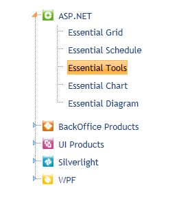

::: {style="DISPLAY: none"}
{#d2h_url_template}{#d2h_package_url style="WIDTH: 0px; DISPLAY: none; HEIGHT: 0px"}
:::

::::::::::: {.d2h_secondary_topic style="PADDING-BOTTOM: 10pt; MARGIN: 0pt; PADDING-LEFT: 0pt; PADDING-RIGHT: 0pt; PADDING-TOP: 0pt"}
#### TreeView - Keyboard Navigation Support {#treeview---keyboard-navigation-support style="tab-stops: 0pt"}

 

Keyboard Navigation Support for TreeView

The Keyboard Navigation support for TreeView breathes life into the concept of selecting, expanding, editing, collapsing nodes and moving from one node to another using keyboard keys.

Use Case Scenarios

The use case scenarios for Keyboard Navigation support are:

1.   The user can easily navigate from one node to another node using the Keyboard.

2.   The user can also add new node by using Keyboard keys.

 

Keyboard Navigation Application

Using Builder

The following steps explain how to define TreeView's Keyboard Navigation, using Builder.

1.   In **View**, create an *ul-li* hierarchy of tree-view nodes.

::: {style="BORDER-BOTTOM: windowtext 1pt solid; BORDER-LEFT: medium none; PADDING-BOTTOM: 1pt; MARGIN-TOP: 9pt; PADDING-LEFT: 0pt; PADDING-RIGHT: 0pt; MARGIN-BOTTOM: 9pt; BORDER-TOP: windowtext 1pt solid; BORDER-RIGHT: medium none; PADDING-TOP: 1pt"}
Note: An ul-li is related to an unordered list.
:::

2.   Invoke the **TreeView** helper with the control ID as first argument and the tree-view content ID as the second argument.

3.   The Properties and Events used for Keyboard Navigation in TreeView are shown below.

 

::: {align="center"}
+------------------------------------------------------------------------------------------------------------------------------------------------------------------------------------------------------------------------------------------------------------------------------------------------------------------------------------------------------------------------------------------------------------------+
| **View\[ASPX\]**                                                                                                                                                                                                                                                                                                                                                                                                 |
|                                                                                                                                                                                                                                                                                                                                                                                                                  |
| [    [\<%]{style="BACKGROUND: yellow"}[=]{style="COLOR: blue"}Html.Syncfusion().TreeView([\"MyTreeView\"]{style="COLOR: #a31515"}, [\"]{style="COLOR: #a31515"}]{style="FONT-FAMILY: Consolas; FONT-SIZE: 9.5pt"}[treeViewContents]{style="FONT-FAMILY: 'Courier New'; COLOR: #a31515"}[\"]{style="FONT-FAMILY: Consolas; COLOR: #a31515; FONT-SIZE: 9.5pt"}[)]{style="FONT-FAMILY: Consolas; FONT-SIZE: 9.5pt"} |
|                                                                                                                                                                                                                                                                                                                                                                                                                  |
| [            .AllowKeyboardNavigation([true]{style="COLOR: blue"})]{style="FONT-FAMILY: Consolas; FONT-SIZE: 9.5pt"}                                                                                                                                                                                                                                                                                             |
|                                                                                                                                                                                                                                                                                                                                                                                                                  |
| [            .ClientSideKeyPress([\"ClientSideKeyPress\"]{style="COLOR: #a31515"})]{style="FONT-FAMILY: Consolas; FONT-SIZE: 9.5pt"}                                                                                                                                                                                                                                                                             |
|                                                                                                                                                                                                                                                                                                                                                                                                                  |
| []{style="FONT-FAMILY: Consolas; FONT-SIZE: 9.5pt"}                                                                                                                                                                                                                                                                                                                                                              |
|                                                                                                                                                                                                                                                                                                                                                                                                                  |
| [    [%\>]{style="BACKGROUND: yellow"}]{style="FONT-FAMILY: Consolas; FONT-SIZE: 9.5pt"}                                                                                                                                                                                                                                                                                                                         |
+------------------------------------------------------------------------------------------------------------------------------------------------------------------------------------------------------------------------------------------------------------------------------------------------------------------------------------------------------------------------------------------------------------------+
:::

 

::: {align="center"}
+-------------------------------------------------------------------------------------------------------------------------------------------------------------------------------------------------------------------------------------------------------------------------------------------------------------------------------------------------------------------------------------------+
| **View\[cshtml\]**                                                                                                                                                                                                                                                                                                                                                                        |
|                                                                                                                                                                                                                                                                                                                                                                                           |
| [    [\@{]{style="BACKGROUND: yellow"} Html.Syncfusion().TreeView([\"MyTreeView\"]{style="COLOR: #a31515"}, [\"]{style="COLOR: #a31515"}]{style="FONT-FAMILY: Consolas; FONT-SIZE: 9.5pt"}[treeViewContents]{style="FONT-FAMILY: 'Courier New'; COLOR: #a31515"}[\"]{style="FONT-FAMILY: Consolas; COLOR: #a31515; FONT-SIZE: 9.5pt"}[)]{style="FONT-FAMILY: Consolas; FONT-SIZE: 9.5pt"} |
|                                                                                                                                                                                                                                                                                                                                                                                           |
| [            .AllowKeyboardNavigation([true]{style="COLOR: blue"})]{style="FONT-FAMILY: Consolas; FONT-SIZE: 9.5pt"}                                                                                                                                                                                                                                                                      |
|                                                                                                                                                                                                                                                                                                                                                                                           |
| [            .ClientSideKeyPress([\"ClientSideKeyPress\"]{style="COLOR: #a31515"}).Render();]{style="FONT-FAMILY: Consolas; FONT-SIZE: 9.5pt"}                                                                                                                                                                                                                                            |
|                                                                                                                                                                                                                                                                                                                                                                                           |
| [    [}]{style="BACKGROUND: yellow"}]{style="FONT-FAMILY: Consolas; FONT-SIZE: 9.5pt"}                                                                                                                                                                                                                                                                                                    |
+-------------------------------------------------------------------------------------------------------------------------------------------------------------------------------------------------------------------------------------------------------------------------------------------------------------------------------------------------------------------------------------------+
:::

 

 

4.   In the **Controller**, navigate to the **View** page.

 

::: {align="center"}
+-------------------------------------------------------------------------------------------------------------------------------------------------------------------------------------------------------------------+
| **[\[C#\]]{style="FONT-FAMILY: 'Courier New'"}**                                                                                                                                                                  |
|                                                                                                                                                                                                                   |
| [   ]{style="FONT-FAMILY: 'Courier New'"}[public]{style="FONT-FAMILY: Consolas; COLOR: blue; FONT-SIZE: 9.5pt"}[ [ActionResult]{style="COLOR: #2b91af"} Index()]{style="FONT-FAMILY: Consolas; FONT-SIZE: 9.5pt"} |
|                                                                                                                                                                                                                   |
| [        {]{style="FONT-FAMILY: Consolas; FONT-SIZE: 9.5pt"}                                                                                                                                                      |
|                                                                                                                                                                                                                   |
| [            ]{style="FONT-FAMILY: Consolas; FONT-SIZE: 9.5pt"}                                                                                                                                                   |
|                                                                                                                                                                                                                   |
| [            [return]{style="COLOR: blue"} View();]{style="FONT-FAMILY: Consolas; FONT-SIZE: 9.5pt"}                                                                                                              |
|                                                                                                                                                                                                                   |
| [        }]{style="FONT-FAMILY: Consolas; FONT-SIZE: 9.5pt"}                                                                                                                                                      |
+-------------------------------------------------------------------------------------------------------------------------------------------------------------------------------------------------------------------+
:::

 

5.   Build and run the application, and the TreeView appears as shown below:

 

{border="0"}

Figure 321: Keyboard Navigation supported TreeView

 

Using Properties Model 

The following steps tell you how to define the Keyboard Navigation in TreeView, through the properties model.

1.   Under **View**, create an *ul-li* hierarchy of tree-view nodes.

2.   Invoke the **TreeView** helper with the control ID as first argument and the tree-view content ID as the second argument.

 

::: {align="center"}
+-----------------------------------------------------------------------------------------------------------------------------------------------------------------------------------------------------------------------------------------------------------------------------------------------------------------------------------------------------------------------------------------------------------------------------------------------+
| **View\[ASPX\]**                                                                                                                                                                                                                                                                                                                                                                                                                              |
|                                                                                                                                                                                                                                                                                                                                                                                                                                               |
| [\<%]{style="FONT-FAMILY: Consolas; BACKGROUND: yellow; FONT-SIZE: 9.5pt"}[=]{style="FONT-FAMILY: Consolas; COLOR: blue; FONT-SIZE: 9.5pt"}[Html.Syncfusion().TreeView([\"MyTreeView\"]{style="COLOR: #a31515"}, [\"TreeView\"]{style="COLOR: #a31515"}, ([TreeViewModel]{style="COLOR: #2b91af"})ViewData\[[\"TreeViewModel\"]{style="COLOR: #a31515"}\])[%\>]{style="BACKGROUND: yellow"}]{style="FONT-FAMILY: Consolas; FONT-SIZE: 9.5pt"} |
|                                                                                                                                                                                                                                                                                                                                                                                                                                               |
| **[]{style="FONT-FAMILY: 'Courier New'"}**                                                                                                                                                                                                                                                                                                                                                                                                    |
|                                                                                                                                                                                                                                                                                                                                                                                                                                               |
| [ ]{style="FONT-FAMILY: Consolas"}                                                                                                                                                                                                                                                                                                                                                                                                            |
+-----------------------------------------------------------------------------------------------------------------------------------------------------------------------------------------------------------------------------------------------------------------------------------------------------------------------------------------------------------------------------------------------------------------------------------------------+
:::

 

 

::: {align="center"}
+------------------------------------------------------------------------------------------------------------------------------------------------------------------------------------------------------------------------------------------------------------------------------------------------------------------------------------------------------------------------------------------------------------------------------------------------------------------------------------------------------------------------------------------+
| **View\[cshtml\]**                                                                                                                                                                                                                                                                                                                                                                                                                                                                                                                       |
|                                                                                                                                                                                                                                                                                                                                                                                                                                                                                                                                          |
|                                                                                                                                                                                                                                                                                                                                                                                                                                                                                                                                          |
|                                                                                                                                                                                                                                                                                                                                                                                                                                                                                                                                          |
| [@(]{style="FONT-FAMILY: Consolas; BACKGROUND: yellow; FONT-SIZE: 9.5pt"}[new]{style="FONT-FAMILY: Consolas; COLOR: blue; FONT-SIZE: 9.5pt"}[ [HtmlString]{style="COLOR: #2b91af"}(Html.Syncfusion().TreeView([\"MyTreeView\"]{style="COLOR: #a31515"}, [\"TreeView\"]{style="COLOR: #a31515"}, ([TreeViewModel]{style="COLOR: #2b91af"})ViewData\[[\"TreeViewModel\"]{style="COLOR: #a31515"}\]).ToString())[)]{style="BACKGROUND: yellow"}]{style="FONT-FAMILY: Consolas; FONT-SIZE: 9.5pt"}**[]{style="FONT-FAMILY: 'Courier New'"}** |
|                                                                                                                                                                                                                                                                                                                                                                                                                                                                                                                                          |
| [ ]{style="FONT-FAMILY: Consolas"}                                                                                                                                                                                                                                                                                                                                                                                                                                                                                                       |
+------------------------------------------------------------------------------------------------------------------------------------------------------------------------------------------------------------------------------------------------------------------------------------------------------------------------------------------------------------------------------------------------------------------------------------------------------------------------------------------------------------------------------------------+
:::

3.   Define the ClientSideKeypress Event, using the view-specific data. This way, you will be able to view using the Tree View's controller.

 

 

::: {align="center"}
+-------------------------------------------------------------------------------------------------------------------------------------------------------------------------------------------------------------------------------------------------------------------------+
| **[\[C#\]]{style="FONT-FAMILY: 'Courier New'"}**                                                                                                                                                                                                                        |
|                                                                                                                                                                                                                                                                         |
| [public]{style="FONT-FAMILY: Consolas; COLOR: blue; FONT-SIZE: 9.5pt"}[ [ActionResult]{style="COLOR: #2b91af"} Index([string]{style="COLOR: blue"} SourceType, [TreeViewModel]{style="COLOR: #2b91af"} treeviewModel)]{style="FONT-FAMILY: Consolas; FONT-SIZE: 9.5pt"} |
|                                                                                                                                                                                                                                                                         |
| [        {]{style="FONT-FAMILY: Consolas; FONT-SIZE: 9.5pt"}                                                                                                                                                                                                            |
|                                                                                                                                                                                                                                                                         |
| [            [TreeViewModel]{style="COLOR: #2b91af"} treeview = [new]{style="COLOR: blue"} [TreeViewModel]{style="COLOR: #2b91af"}();]{style="FONT-FAMILY: Consolas; FONT-SIZE: 9.5pt"}                                                                                 |
|                                                                                                                                                                                                                                                                         |
| [            treeview. AllowKeyboardNavigation = true;]{style="FONT-FAMILY: Consolas; FONT-SIZE: 9.5pt"}                                                                                                                                                                |
|                                                                                                                                                                                                                                                                         |
| [            ViewData\[[\"TreeViewModel\"]{style="COLOR: #a31515"}\]=treeview;]{style="FONT-FAMILY: Consolas; FONT-SIZE: 9.5pt"}                                                                                                                                        |
|                                                                                                                                                                                                                                                                         |
| [            [return]{style="COLOR: blue"} View();]{style="FONT-FAMILY: Consolas; FONT-SIZE: 9.5pt"}                                                                                                                                                                    |
|                                                                                                                                                                                                                                                                         |
| [        }]{style="FONT-FAMILY: Consolas; FONT-SIZE: 9.5pt"}                                                                                                                                                                                                            |
|                                                                                                                                                                                                                                                                         |
| []{style="FONT-FAMILY: 'Courier New'"}                                                                                                                                                                                                                                  |
+-------------------------------------------------------------------------------------------------------------------------------------------------------------------------------------------------------------------------------------------------------------------------+
:::

 

4.   Build and run the application, and the TreeView will appear as shown below:

{border="0"}

Figure 322: Keyboard Navigation supported TreeView

 

 

Properties

**** 

  ------------------------- ----------------------------------- ------------- --------------- -------------------------------
  **Property**              **Description**                     **Type**      **Data Type**   **Reference links**
  AllowKeyboardNavigation   Used to enable KeyboardNavigation   Server-Side   Boolean         NA[ ]{style="COLOR: #c00000"}
  ------------------------- ----------------------------------- ------------- --------------- -------------------------------

[]{style="FONT-FAMILY: 'Calibri','sans-serif'; COLOR: black"} 

[]{style="FONT-FAMILY: 'Calibri','sans-serif'; COLOR: black"} 

 

Events

 

+--------------------+---------------------------------------------+-----------------+-----------------+-----------------+
| Event              | Description                                 | Arguments       | Type            | Reference links |
+--------------------+---------------------------------------------+-----------------+-----------------+-----------------+
| ClientSideKeypress | This event is raised when you press any key | keyPressHandler | **Client-Side** | NA              |
|                    |                                             |                 |                 |                 |
|                    |                                             |                 |                 |                 |
+====================+=============================================+=================+=================+=================+

[]{style="FONT-FAMILY: 'Calibri','sans-serif'; COLOR: black"} 

Key Configuration Table

Tabulated below, are all the key configurations needed for TreeView Navigation:

 

 

::: {align="center"}
  --------------- ---------------
  Action          Default Keys
  Delete Node     Delete
  Cut Node        Ctrl + X
  Copy Node       Ctrl + C
  Paste Node      Ctrl + V
  Select Node     Enter
  Next Node       DownArrowKey
  Previous Node   UpArrowKey
  Expand Node     RightArrowKey
  Collapse Node   LeftArrowKey
  First Node      Home
  Last Node       End
  First Child     Ctrl + Home
  Last Child      Ctrl + End
  Focus           Shift + F
  --------------- ---------------
:::

 

 

Sample Link

To view the samples, follow the steps below:

1.   Open the Grid sample browser from the dashboard. (Refer to the Samples and Location chapter)

2.   Navigate to Tools.MVC \--\> TreeView

 

 

[]{#related-topics}
:::::::::::
