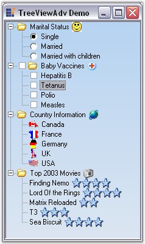

::: {style="DISPLAY: none"}
{#d2h_url_template}{#d2h_package_url style="WIDTH: 0px; DISPLAY: none; HEIGHT: 0px"}
:::

::::: {#nsbanner .d2h_main_nsbanner style="BORDER-BOTTOM: #999999 1px solid; POSITION: relative; PADDING-BOTTOM: 0px; BACKGROUND-COLOR: transparent; PADDING-LEFT: 0px; PADDING-RIGHT: 0px; DISPLAY: none; BORDER-TOP: #999999 1px solid; PADDING-TOP: 0px; LEFT: 0px"}
:::: {#TitleRow .d2h_main_titlerow style="PADDING-BOTTOM: 4px; BACKGROUND-COLOR: transparent; PADDING-LEFT: 22px; WIDTH: 100%; PADDING-RIGHT: 10px; DISPLAY: none; PADDING-TOP: 4px"}
::: {#ienav .d2h_main_ienav style="DISPLAY: none"}
{#D2HPrevious .D2HPreviousEnabled}  {#D2HNext .D2HNextEnabled}
:::
::::
:::::

:::: {#nstext .d2h_main_nstext style="PADDING-BOTTOM: 10px; BACKGROUND-COLOR: transparent; PADDING-LEFT: 22px; PADDING-RIGHT: 10px; HEIGHT: 100%; OVERFLOW: auto; PADDING-TOP: 5px" hasuserbackground="true" valign="bottom"}
::: {#d2h_breadcrumbs .d2h_breadcrumbs}
[Essential Studio User Guide Documentation](ms-xhelp:///?Id=12457748-09e3-4d74-a240-8e049cedf030){.d2h_breadcrumbsNormal}[ \> ]{.d2h_breadcrumbsLinkSeparator}[User Interface Edition](ms-xhelp:///?Id=c29296b7-531c-413b-a0ec-488ca1f7f669){.d2h_breadcrumbsNormal}[ \> ]{.d2h_breadcrumbsLinkSeparator}[Essential Windows](ms-xhelp:///?Id=e60759d8-47a4-4570-9d7a-16a68d63f2ea){.d2h_breadcrumbsNormal}[ \> ]{.d2h_breadcrumbsLinkSeparator}[Essential Tools]{.d2h_breadcrumbsContentsOnly}[ \> ]{.d2h_breadcrumbsLinkSeparator}[Tools Controls](ms-xhelp:///?Id=13c3c4f4-9d16-4b69-93f2-7e98eec67452){.d2h_breadcrumbsNormal}
:::

## TreeView Package {#treeview-package style="MARGIN-LEFT: 18pt; tab-stops: 18.0pt"}

[]{style="COLOR: #15428b"} 

The Essential Tools\' **TreeViewAdv** control implements a classical tree structure with support for left, right and state images, check box and option buttons, tooltips and help text capabilities. It has special features to give the TreeViewAdv control a neat look, like Gutter space, Indent Space, changing color of the lines connecting the nodes, color options for the check boxes. It provides advanced drag-and-drop UI support, context-menu association, gradient backgrounds and multiple border styles, unlimited number of controls for each nodes. The control comes with complete design-time support.

[]{style="COLOR: #15428b"} 

[·      ]{style="FONT-FAMILY: Symbol"}The TreeViewAdv control contains a hierarchical collection of **TreeNodeAdv** objects which gets rendered in a classical tree structure.

[·      ]{style="FONT-FAMILY: Symbol"}The top level nodes and the children nodes of the TreeNodeAdv can be accessed through the node\'s properties.

[·      ]{style="FONT-FAMILY: Symbol"}While the TreeViewAdv exposes some global styles that are to be applied for all the nodes, the TreeNodeAdv lets the users to specify styles for a specific node. The [[Styles Architecture]{.UGHyperlink}](../../../../../../../../Documents%20and%20Settings/sylviap/Desktop/Tools%20-%20Part%202.docx#_Styles_Architecture) which will be discussed later in this section, lets the users to define styles for nodes at different levels of the tree. This allows the users to specify styles for a class of nodes.

[]{style="COLOR: #15428b"} 

{border="0"}

**[]{style="COLOR: #15428b"}** 

Figure 1115: TreeViewAdv Control

 

 

 

 

More:

[ ]{#related-topics}

[{border="0" align="absMiddle"}Features Overview](ms-xhelp:///?Id=2568f1ac-e8b9-4c86-af01-1e9c85d7820e){style="TEXT-DECORATION: none"}

[{border="0" align="absMiddle"}Creating TreeViewAdv](ms-xhelp:///?Id=44a347bf-25b2-468c-85a9-913c4df13b31){style="TEXT-DECORATION: none"}

[{border="0" align="absMiddle"}Concepts and Features](ms-xhelp:///?Id=3bfe63dc-78eb-4bad-aeb8-32ef96e667ce){style="TEXT-DECORATION: none"}

[{border="0" align="absMiddle"}TreeViewAdv Events](ms-xhelp:///?Id=a9cfa23b-7d78-434b-8871-bc08cff57c7f){style="TEXT-DECORATION: none"}

[{border="0" align="absMiddle"}Frequenty Asked Questions](ms-xhelp:///?Id=3de6f518-6163-495f-a895-6ba88e2ae6c7){style="TEXT-DECORATION: none"}
::::
