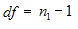

::: {style="DISPLAY: none"}
{#d2h_url_template}{#d2h_package_url style="WIDTH: 0px; DISPLAY: none; HEIGHT: 0px"}
:::

:::: {.d2h_secondary_topic style="PADDING-BOTTOM: 10pt; MARGIN: 0pt; PADDING-LEFT: 0pt; PADDING-RIGHT: 0pt; PADDING-TOP: 0pt"}
##### TTest Paired {#ttest-paired style="tab-stops: 0pt"}

 

This formula is used when there is a dependency between the samples. The two possible scenarios could be when there is a single sample that is tested twice (before and after an experiment), or when there are two samples whose values can be matched. This test assumes that there is some difference between the means of two input series populations. Input series are regarded as samples from normally distributed populations. The population variances are assumed to be unequal. This test is otherwise called as **Robust TTest**.

 

Steps to perform the test

 

1.   1. Specify the null hypothesis and alternate hypothesis.

 

[·      ]{style="FONT-FAMILY: Symbol"}Null Hypothesis: Difference between the two means is zero.

[·      ]{style="FONT-FAMILY: Symbol"}Alternate Hypothesis: Difference between the two means is not zero.

 

2.   Calculate the difference between two series on each pair of values.

*[]{style="FONT-FAMILY: 'Segoe UI','sans-serif'"}* 

Calculate the mean difference ***( Mdiff )***, ie., mean of the new series values.

 

3.   Calculate the Standard Deviation of the differences( *[Sd]{style="FONT-FAMILY: 'Segoe UI','sans-serif'"}* ).

 

4.   Get the degrees of freedom.

 

{border="0"}

 

5.   Compute the t-statistic as given below.

*t = ( Mdiff - Md ) / \[Sd \* Sqrt( 1/n1 )\]*

 

6.   Construct a t-table at (n1 - 1) degrees of freedom and get the tabulated value for a given level of significance(probability).

 

7.   If the calculated tvalue exceeds the tabulated value we can say that the means are significantly different at that level of probability.

[]{style="FONT-SIZE: 8pt"} 

Using the Formula

 

The TTest formula for dependent samples can be calculated by using the **TTestPaired** method of the **BasicStatisticalFormulas** class. The following table presents the details of this method. This method returns an instance of **TTestResult** class that stores the resultant values of this test such as means of the two series, T value, degrees of freedom, number of points in every series, T critical value and confidence level(probability).

 

::: {align="center"}
+-----------------------+----------------------------------------------------------------------------------------------------------------+-------------------------------------------------------------+
|                       |                                                                                                                |                                                             |
|                       |                                                                                                                |                                                             |
| Method Name           | Parameters                                                                                                     | Return Value                                                |
+-----------------------+----------------------------------------------------------------------------------------------------------------+-------------------------------------------------------------+
|                       |                                                                                                                |                                                             |
|                       |                                                                                                                |                                                             |
| TTestPaired           | 1\. **HypothesizedMeanDifference**: A **double** value specifying the difference between two population means. | A TTestResult object that has the following members:        |
|                       |                                                                                                                |                                                             |
|                       | 2\. **Probability**: A **double** value  that denotes the probability that gives the confidence level.         | [·      ]{style="FONT-FAMILY: Symbol"}FirstSeriesMean       |
|                       |                                                                                                                |                                                             |
|                       | 3\. **FirstSeries**: A ChartSeries object that stores the first group of data.                                 | [·      ]{style="FONT-FAMILY: Symbol"}SecondSeriesMean      |
|                       |                                                                                                                |                                                             |
|                       | 4\. **SecondSeries**: A ChartSeries object that stores the second group of data.                               | [·      ]{style="FONT-FAMILY: Symbol"}FirstSeriesVariance   |
|                       |                                                                                                                |                                                             |
|                       |                                                                                                                | [·      ]{style="FONT-FAMILY: Symbol"}SecondSeriesVariance  |
|                       |                                                                                                                |                                                             |
|                       |                                                                                                                | [·      ]{style="FONT-FAMILY: Symbol"}Tvalue                |
|                       |                                                                                                                |                                                             |
|                       |                                                                                                                | [·      ]{style="FONT-FAMILY: Symbol"}DegreeOfFreedom       |
|                       |                                                                                                                |                                                             |
|                       |                                                                                                                | [·      ]{style="FONT-FAMILY: Symbol"}ProbabilityTOneTail   |
|                       |                                                                                                                |                                                             |
|                       |                                                                                                                | [·      ]{style="FONT-FAMILY: Symbol"}TCriticalValueOneTail |
|                       |                                                                                                                |                                                             |
|                       |                                                                                                                | [·      ]{style="FONT-FAMILY: Symbol"}ProbabilityTTwoTail   |
|                       |                                                                                                                |                                                             |
|                       |                                                                                                                | [·      ]{style="FONT-FAMILY: Symbol"}TCriticalValueTwoTail |
+-----------------------+----------------------------------------------------------------------------------------------------------------+-------------------------------------------------------------+
:::

 

Example

 

Here is a code snippet that shows a sample usage.

 

+---------------------------------------------------------------------------------------------------------------------------------------------------------+
| **[\[C#\]]{style="FONT-FAMILY: 'Courier New'; COLOR: black"}**                                                                                          |
|                                                                                                                                                         |
| **[]{style="FONT-FAMILY: 'Courier New'; COLOR: black"}**                                                                                                |
|                                                                                                                                                         |
| [using]{style="FONT-FAMILY: 'Courier New'; COLOR: blue"}[ Syncfusion.Windows.Forms.Chart.Statistics;]{style="FONT-FAMILY: 'Courier New'; COLOR: black"} |
|                                                                                                                                                         |
| []{style="FONT-FAMILY: 'Courier New'; COLOR: black"}                                                                                                    |
|                                                                                                                                                         |
| [TTestResult ttr = BasicStatisticalFormulas.TTestPaired(0.2, 0.05, series1, series2);]{style="FONT-FAMILY: 'Courier New'; COLOR: black"}                |
+---------------------------------------------------------------------------------------------------------------------------------------------------------+

 

+----------------------------------------------------------------------------------------------------------------------------------------------------------------------------------------------------------------------------------------------------------------------------------------------------------+
| **[\[VB.NET\]]{style="FONT-FAMILY: 'Courier New'; COLOR: black"}**                                                                                                                                                                                                                                       |
|                                                                                                                                                                                                                                                                                                          |
| **[]{style="FONT-FAMILY: 'Courier New'; COLOR: black"}**                                                                                                                                                                                                                                                 |
|                                                                                                                                                                                                                                                                                                          |
| [Imports]{style="FONT-FAMILY: 'Courier New'; COLOR: blue"}[ Syncfusion.Windows.Forms.Chart.Statistics]{style="FONT-FAMILY: 'Courier New'; COLOR: black"}                                                                                                                                                 |
|                                                                                                                                                                                                                                                                                                          |
| []{style="FONT-FAMILY: 'Courier New'; COLOR: black"}                                                                                                                                                                                                                                                     |
|                                                                                                                                                                                                                                                                                                          |
| [Dim]{style="FONT-FAMILY: 'Courier New'; COLOR: blue"}[ ttr ]{style="FONT-FAMILY: 'Courier New'; COLOR: black"}[As]{style="FONT-FAMILY: 'Courier New'; COLOR: blue"}[ TTestResult = BasicStatisticalFormulas.TTestPaired(0.2, 0.05, series1, series2)]{style="FONT-FAMILY: 'Courier New'; COLOR: black"} |
+----------------------------------------------------------------------------------------------------------------------------------------------------------------------------------------------------------------------------------------------------------------------------------------------------------+

 

[]{#p228} 

 

[]{#related-topics}
::::
