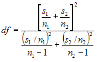

::: {style="DISPLAY: none"}
{#d2h_url_template}{#d2h_package_url style="WIDTH: 0px; DISPLAY: none; HEIGHT: 0px"}
:::

:::: {.d2h_secondary_topic style="PADDING-BOTTOM: 10pt; MARGIN: 0pt; PADDING-LEFT: 0pt; PADDING-RIGHT: 0pt; PADDING-TOP: 0pt"}
##### T-Test with UnEqual Variance {#t-test-with-unequal-variance style="tab-stops: 0pt"}

[]{style="FONT-FAMILY: 'Trebuchet MS','sans-serif'; FONT-SIZE: 9pt"} 

If the assumption of \'equal variances\' is violated, then we have to compute the test statistic using the individual sample\'s standard deviation instead of pooled standard deviation. Like the TTestEqualVariances formula, the **TTestUnequalVariances** formula also will be carried out on two independent samples. The only difference with unequal variances test is that the sample should be of different sizes.

[]{style="FONT-FAMILY: 'Trebuchet MS','sans-serif'; FONT-SIZE: 9pt"} 

Steps to perform the test

**[]{style="FONT-FAMILY: 'Trebuchet MS','sans-serif'"}** 

1.   Specify the null hypothesis and alternate hypothesis.

[]{style="FONT-FAMILY: 'Trebuchet MS','sans-serif'; FONT-SIZE: 9pt"} 

[·      ]{style="FONT-FAMILY: Symbol"}Null Hypothesis - Difference between the two means is **zero**.

[·      ]{style="FONT-FAMILY: Symbol"}Alternate Hypothesis - Difference between the two means is not **zero**.

[]{style="FONT-FAMILY: 'Trebuchet MS','sans-serif'; FONT-SIZE: 9pt"} 

2.   Calculate the means of the two input series (µ1 and µ2)and calculate their difference (Md).

[]{style="FONT-FAMILY: 'Trebuchet MS','sans-serif'; FONT-SIZE: 9pt"} 

Md = µ1 - µ2

[]{style="FONT-FAMILY: 'Trebuchet MS','sans-serif'; FONT-SIZE: 9pt"} 

3.   Calculate the variances of the two input series (s1 and s2).

 

4.   Let n1 and n2 be the number of data points in first and second series respectively.

 

5.   Calculate the degrees of freedom.

[]{style="FONT-FAMILY: 'Trebuchet MS','sans-serif'; FONT-SIZE: 9pt"} 

[{border="0"}]{style="FONT-FAMILY: 'Trebuchet MS','sans-serif'; FONT-SIZE: 9pt"}[]{style="FONT-FAMILY: 'Trebuchet MS','sans-serif'; FONT-SIZE: 9pt"}

[]{style="FONT-FAMILY: 'Trebuchet MS','sans-serif'; FONT-SIZE: 9pt"} 

6.   Calculate the T-statistic as given below.

[]{style="FONT-FAMILY: 'Trebuchet MS','sans-serif'; FONT-SIZE: 9pt"} 

t = (µ1 - µ2 - Md) / Sqrt ( s1/n1 + s2/n2 )

[]{style="FONT-FAMILY: 'Trebuchet MS','sans-serif'; FONT-SIZE: 9pt"} 

7.   Choose a level of significance (probability), say p = 0.05 and read the tabulated value.

8.   If the calculated tvalue exceeds the tabulated value we can say that the means are significantly different at that level of probability.

[]{style="FONT-FAMILY: 'Trebuchet MS','sans-serif'; FONT-SIZE: 9pt"} 

Using the Formula

**[]{style="FONT-FAMILY: 'Trebuchet MS','sans-serif'"}** 

The TTest formula for unequal variances can be calculated by using the **TTestUnEqualVariances** method of the **BasicStatisticalFormulas** class. The following table presents the details of this method. This method returns an instance of **TTestResult** class that stores the resultant values of this test such as means of the two series, T value, degrees of freedom, number of points in every series, T critical value and confidence level (probability).

[]{style="FONT-FAMILY: 'Trebuchet MS','sans-serif'; FONT-SIZE: 9pt"} 

::: {align="center"}
+-----------------------+------------------------------------------------------------------------------------------------------------------------------+-------------------------------------------------------------+
|                       |                                                                                                                              |                                                             |
|                       |                                                                                                                              |                                                             |
| Method Name           | Parameters                                                                                                                   | Return Value                                                |
+-----------------------+------------------------------------------------------------------------------------------------------------------------------+-------------------------------------------------------------+
| TTestUnEqualVariances | 1.   **HypothesizedMeanDifference**: A **double** value that gives the difference between the means of the two input series. | A TTestResult object that has the following members:        |
|                       |                                                                                                                              |                                                             |
|                       | 2.   **Probability**: A **double** value that denotes the probability that gives the confidence level.                       |                                                             |
|                       |                                                                                                                              |                                                             |
|                       | 3.   **FirstSeries**: A ChartSeries object that stores the first group of data.                                              | [·      ]{style="FONT-FAMILY: Symbol"}FirstSeriesMean       |
|                       |                                                                                                                              |                                                             |
|                       | 4.   **SecondSeries**: A ChartSeries object that stores the second group of data.                                            | [·      ]{style="FONT-FAMILY: Symbol"}SecondSeriesMean      |
|                       |                                                                                                                              |                                                             |
|                       |                                                                                                                              | [·      ]{style="FONT-FAMILY: Symbol"}FirstSeriesVariance   |
|                       |                                                                                                                              |                                                             |
|                       |                                                                                                                              | [·      ]{style="FONT-FAMILY: Symbol"}SecondSeriesVariance  |
|                       |                                                                                                                              |                                                             |
|                       |                                                                                                                              | [·      ]{style="FONT-FAMILY: Symbol"}Tvalue                |
|                       |                                                                                                                              |                                                             |
|                       |                                                                                                                              | [·      ]{style="FONT-FAMILY: Symbol"}DegreeOfFreedom       |
|                       |                                                                                                                              |                                                             |
|                       |                                                                                                                              | [·      ]{style="FONT-FAMILY: Symbol"}ProbabilityTOneTail   |
|                       |                                                                                                                              |                                                             |
|                       |                                                                                                                              | [·      ]{style="FONT-FAMILY: Symbol"}TCriticalValueOneTail |
|                       |                                                                                                                              |                                                             |
|                       |                                                                                                                              | [·      ]{style="FONT-FAMILY: Symbol"}ProbabilityTTwoTail   |
|                       |                                                                                                                              |                                                             |
|                       |                                                                                                                              | [·      ]{style="FONT-FAMILY: Symbol"}TCriticalValueTwoTail |
+-----------------------+------------------------------------------------------------------------------------------------------------------------------+-------------------------------------------------------------+
:::

[]{style="FONT-FAMILY: 'Trebuchet MS','sans-serif'; FONT-SIZE: 9pt"} 

Example

[]{style="FONT-FAMILY: 'Trebuchet MS','sans-serif'; FONT-SIZE: 9pt"} 

Here is a code snippet that shows a sample usage.

[]{style="FONT-FAMILY: 'Trebuchet MS','sans-serif'; FONT-SIZE: 9pt"} 

+--------------------------------------------------------------------------------------------------------------------------------------------------+
| **[\[C#\]]{style="FONT-FAMILY: 'Courier New'; COLOR: black"}**                                                                                   |
|                                                                                                                                                  |
| []{style="FONT-FAMILY: 'Courier New'; COLOR: black"}                                                                                             |
|                                                                                                                                                  |
| [TTestResult ttr = BasicStatisticalFormulas.TTestUnEqualVariances(0.2, 0.05,series1,series2);]{style="FONT-FAMILY: 'Courier New'; COLOR: black"} |
+--------------------------------------------------------------------------------------------------------------------------------------------------+

[]{style="FONT-FAMILY: 'Trebuchet MS','sans-serif'; FONT-SIZE: 9pt"} 

+--------------------------------------------------------------------------------------------------------------------------------------------------------------------------------------------------------------------------------------------------------------------------------------------------------------------+
| **[\[VB.NET\]]{style="FONT-FAMILY: 'Courier New'; COLOR: black"}**                                                                                                                                                                                                                                                 |
|                                                                                                                                                                                                                                                                                                                    |
| []{style="FONT-FAMILY: 'Courier New'; COLOR: black"}                                                                                                                                                                                                                                                               |
|                                                                                                                                                                                                                                                                                                                    |
| [Dim]{style="FONT-FAMILY: 'Courier New'; COLOR: blue"}[ ttr ]{style="FONT-FAMILY: 'Courier New'; COLOR: black"}[As]{style="FONT-FAMILY: 'Courier New'; COLOR: blue"}[ TTestResult = BasicStatisticalFormulas.TTestUnEqualVariances(0.2, 0.05, series1, series2)]{style="FONT-FAMILY: 'Courier New'; COLOR: black"} |
+--------------------------------------------------------------------------------------------------------------------------------------------------------------------------------------------------------------------------------------------------------------------------------------------------------------------+

[]{#p227} 

[]{#related-topics}
::::
