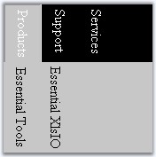
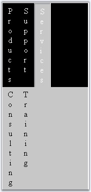
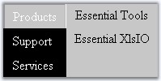
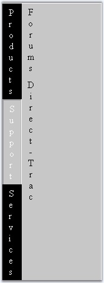
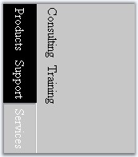

::: {style="DISPLAY: none"}
{#d2h_url_template}{#d2h_package_url style="WIDTH: 0px; DISPLAY: none; HEIGHT: 0px"}
:::

::::::::::::: {.d2h_secondary_topic style="PADDING-BOTTOM: 10pt; MARGIN: 0pt; PADDING-LEFT: 0pt; PADDING-RIGHT: 0pt; PADDING-TOP: 0pt"}
##### Types of Orientation {#types-of-orientation style="tab-stops: 0pt"}

[]{style="FONT-FAMILY: 'Trebuchet MS','sans-serif'; COLOR: #15428b; FONT-SIZE: 9pt"} 

The TabStrip enables you to render tab elements and text in different orientations.

[]{style="FONT-FAMILY: 'Trebuchet MS','sans-serif'; COLOR: #15428b; FONT-SIZE: 9pt"} 

::: {align="center"}
+-----------------------------------+----------------------------------------------------------------------------------------------------------------------------------+
| Property                          | Description                                                                                                                      |
+-----------------------------------+----------------------------------------------------------------------------------------------------------------------------------+
| ImageAndTextPosition              | Specifies the orientation of text and the image in an item. Default value is ImageOverText. The options included are as follows: |
|                                   |                                                                                                                                  |
|                                   | [·      ]{style="FONT-FAMILY: Symbol"}ImageOverText                                                                              |
|                                   |                                                                                                                                  |
|                                   | [·      ]{style="FONT-FAMILY: Symbol"}TextOverImage                                                                              |
|                                   |                                                                                                                                  |
|                                   | [·      ]{style="FONT-FAMILY: Symbol"}ImageLeftTextRight                                                                         |
|                                   |                                                                                                                                  |
|                                   | [·      ]{style="FONT-FAMILY: Symbol"}TextLeftImageRight                                                                         |
+-----------------------------------+----------------------------------------------------------------------------------------------------------------------------------+
| TextAlign                         | Specifies the alignment of text. The options included are as follows:                                                            |
|                                   |                                                                                                                                  |
|                                   | [·      ]{style="FONT-FAMILY: Symbol"}Left                                                                                       |
|                                   |                                                                                                                                  |
|                                   | [·      ]{style="FONT-FAMILY: Symbol"}Right                                                                                      |
|                                   |                                                                                                                                  |
|                                   | [·      ]{style="FONT-FAMILY: Symbol"}Center                                                                                     |
|                                   |                                                                                                                                  |
|                                   | [·      ]{style="FONT-FAMILY: Symbol"}Justify                                                                                    |
+-----------------------------------+----------------------------------------------------------------------------------------------------------------------------------+
:::

[]{style="FONT-FAMILY: 'Trebuchet MS','sans-serif'; COLOR: #15428b; FONT-SIZE: 9pt"} 

ChildItemsPosition

[]{style="FONT-FAMILY: 'Trebuchet MS','sans-serif'; COLOR: #15428b; FONT-SIZE: 9pt"} 

The **ChildItemsPosition** specifies the relative positioning of the child elements to the parent. There are four types of orientation which are as follows.

[]{style="FONT-FAMILY: 'Trebuchet MS','sans-serif'; COLOR: #15428b; FONT-SIZE: 9pt"} 

::: {align="center"}
+-----------------------------------+----------------------------------------------------------------------------------------------------------------------------+
| Property                          | Description                                                                                                                |
+-----------------------------------+----------------------------------------------------------------------------------------------------------------------------+
| ChildItemsPosition                | Specifies the position of child item relative to the parent. Default value is Bottom. The options included are as follows: |
|                                   |                                                                                                                            |
|                                   | [·      ]{style="FONT-FAMILY: Symbol"}Bottom                                                                               |
|                                   |                                                                                                                            |
|                                   | [·      ]{style="FONT-FAMILY: Symbol"}Top                                                                                  |
|                                   |                                                                                                                            |
|                                   | [·      ]{style="FONT-FAMILY: Symbol"}Left                                                                                 |
|                                   |                                                                                                                            |
|                                   | [·      ]{style="FONT-FAMILY: Symbol"}Right                                                                                |
+-----------------------------------+----------------------------------------------------------------------------------------------------------------------------+
:::

[]{style="FONT-FAMILY: 'Trebuchet MS','sans-serif'; COLOR: #15428b; FONT-SIZE: 9pt"} 

::: {align="center"}
  ------------------------- ------------------------------------------------------------------------
  ChildItemsPosition Type   Description
  Bottom                    The child elements will be displayed at the bottom of the parent node.
  Top                       The child elements will be displayed on top of the parent node.
  Left                      The child elements will be displayed to the left of the parent node.
  Right                     The child elements will be displayed to the right of the parent node.
  ------------------------- ------------------------------------------------------------------------
:::

[]{style="FONT-FAMILY: 'Trebuchet MS','sans-serif'; COLOR: #15428b; FONT-SIZE: 9pt"} 

ChidLayout

[]{style="FONT-FAMILY: 'Trebuchet MS','sans-serif'; COLOR: #15428b; FONT-SIZE: 9pt"} 

The **ChildLayout** specifies the orientation of child elements. There are two types of tab orientation which are as follows.

[]{style="FONT-FAMILY: 'Trebuchet MS','sans-serif'; COLOR: #15428b; FONT-SIZE: 9pt"} 

::: {align="center"}
+-----------------------------------+--------------------------------------------------------------------------------------------------------+
| Property                          | Description                                                                                            |
+-----------------------------------+--------------------------------------------------------------------------------------------------------+
| ChildLayout                       | Specifies the layout of child items. Default value is Horizontal. The options included are as follows: |
|                                   |                                                                                                        |
|                                   | [·      ]{style="FONT-FAMILY: Symbol"}Horizontal                                                       |
|                                   |                                                                                                        |
|                                   | [·      ]{style="FONT-FAMILY: Symbol"}Vertical                                                         |
+-----------------------------------+--------------------------------------------------------------------------------------------------------+
:::

[]{style="FONT-FAMILY: 'Trebuchet MS','sans-serif'; COLOR: #15428b; FONT-SIZE: 9pt"} 

::: {align="center"}
  ------------------ ----------------------------------------------------
  ChildLayout Type   Description
  Horizontal         The child elements will be displayed horizontally.
  Vertical           The child elements will be displayed vertically.
  ------------------ ----------------------------------------------------
:::

[]{style="FONT-FAMILY: 'Trebuchet MS','sans-serif'; COLOR: #15428b; FONT-SIZE: 9pt"} 

TabLayout

[]{style="FONT-FAMILY: 'Trebuchet MS','sans-serif'; COLOR: #15428b; FONT-SIZE: 9pt"} 

This property setting specifies the relative positioning of the different rows in a multi-level tab. There are four types of orientation which are as follows.

[]{style="FONT-FAMILY: 'Trebuchet MS','sans-serif'; COLOR: #15428b; FONT-SIZE: 9pt"} 

::: {align="center"}
+-----------------------------------+-------------------------------------------------------------------------------------------------------------+
| Property                          | Description                                                                                                 |
+-----------------------------------+-------------------------------------------------------------------------------------------------------------+
| TabLayout                         | Specifies the layout of the tab elements. Default value is Horizontal. The options included are as follows: |
|                                   |                                                                                                             |
|                                   | [·      ]{style="FONT-FAMILY: Symbol"}Horizontal                                                            |
|                                   |                                                                                                             |
|                                   | [·      ]{style="FONT-FAMILY: Symbol"}Vertical                                                              |
+-----------------------------------+-------------------------------------------------------------------------------------------------------------+
:::

[]{style="FONT-FAMILY: 'Trebuchet MS','sans-serif'; COLOR: #15428b; FONT-SIZE: 9pt"} 

::: {align="center"}
  ---------------- -------------------------------------------------------
  TabLayout Type   Description
  Horizontal       The root tab elements will be displayed horizontally.
  Vertical         The root tab elements will be displayed vertically.
  ---------------- -------------------------------------------------------
:::

[]{style="FONT-FAMILY: 'Trebuchet MS','sans-serif'; COLOR: #15428b; FONT-SIZE: 9pt"} 

TextLayout

[]{style="FONT-FAMILY: 'Trebuchet MS','sans-serif'; COLOR: #15428b; FONT-SIZE: 9pt"} 

The **TextLayout** specifies the alignment of content within tab elements. There are four types of text orientation which are as follows.

[]{style="FONT-FAMILY: 'Trebuchet MS','sans-serif'; COLOR: #15428b; FONT-SIZE: 9pt"} 

::: {align="center"}
+-----------------------------------+--------------------------------------------------------------------+
| Property                          | Description                                                        |
+-----------------------------------+--------------------------------------------------------------------+
| TextLayout                        | Specifies the layout of text. The options included are as follows: |
|                                   |                                                                    |
|                                   | [·      ]{style="FONT-FAMILY: Symbol"}Horizontal                   |
|                                   |                                                                    |
|                                   | [·      ]{style="FONT-FAMILY: Symbol"}Vertical                     |
|                                   |                                                                    |
|                                   | [·      ]{style="FONT-FAMILY: Symbol"}LeftToRight                  |
|                                   |                                                                    |
|                                   | [·      ]{style="FONT-FAMILY: Symbol"}RightToLeft                  |
+-----------------------------------+--------------------------------------------------------------------+
:::

[]{style="FONT-FAMILY: 'Trebuchet MS','sans-serif'; COLOR: #15428b; FONT-SIZE: 9pt"} 

::: {align="center"}
+-----------------------------------+------------------------------------------------+
| TextLayout Type                   | Description                                    |
+-----------------------------------+------------------------------------------------+
| Horizontal                        | The text will be displayed horizontally.       |
+-----------------------------------+------------------------------------------------+
| Vertical                          | The                                            |
|                                   |                                                |
|                                   | text will be displayed vertically.             |
+-----------------------------------+------------------------------------------------+
| LeftToRight                       | The text will be displayed from left to right. |
+-----------------------------------+------------------------------------------------+
| RightToLeft                       | The text will be displayed from right to left. |
+-----------------------------------+------------------------------------------------+
:::

[]{style="FONT-FAMILY: 'Trebuchet MS','sans-serif'; COLOR: #15428b; FONT-SIZE: 9pt"} 

Here are some example settings with screen shots on how they affect the tab rendering.

[]{style="FONT-FAMILY: 'Trebuchet MS','sans-serif'; COLOR: #15428b; FONT-SIZE: 9pt"} 

::: {align="center"}
  ------------ ------------- ------------------- ------------- --------------------------------------------
  TabLayout    TextLayout    ChildItemPosition   ChildLayout   Example
  Horizontal   Horizontal    Bottom              Horizontal    {border="0"}
  Horizontal   RightToLeft   Bottom              Horizontal    {border="0"}
  Horizontal   Vertical      Bottom              Horizontal    {border="0"}
  Vertical     Horizontal    Right               Vertical      {border="0"}
  Vertical     Vertical      Right               Vertical      {border="0"}
  Vertical     LeftToRight   Right               Vertical      {border="0"}
  ------------ ------------- ------------------- ------------- --------------------------------------------
:::

 

[]{#related-topics}
:::::::::::::
