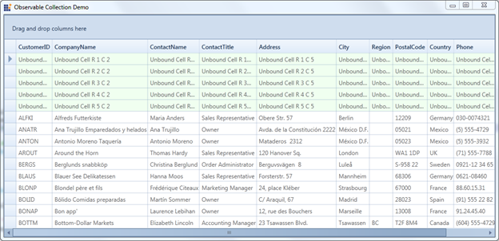
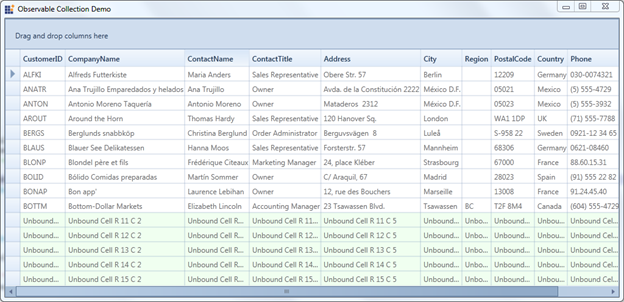

::: {style="DISPLAY: none"}
{#d2h_url_template}{#d2h_package_url style="WIDTH: 0px; DISPLAY: none; HEIGHT: 0px"}
:::

::: {.d2h_secondary_topic style="PADDING-BOTTOM: 10pt; MARGIN: 0pt; PADDING-LEFT: 0pt; PADDING-RIGHT: 0pt; PADDING-TOP: 0pt"}
#### UnboundRows {#unboundrows style="tab-stops: 0pt"}

Essential Grid supports addition of extra rows in the view which will not affect the DataSource. Such additional rows are called UnboundRows as they do not belong to the data source. These unbound fields can be used, when you want to add some additional or custom information for GridDataControl 

You can create an UnboundRow by just setting the UnboundRowCount. It contains a property named Format, which is used to specify a format for the UnboundRow. Given an UnboundRow we can check if this is an UnboundRow or not using IsInUnboundRow(int Rowindex) method in Grid Model.

[]{style="FONT-FAMILY: 'Arial','sans-serif'; COLOR: black; FONT-SIZE: 10pt"} 

+-----------------------------------------------------------------------------------------------------------------------------------------------------------------------------------------------------------------------------------------------------------------------------------------------------------------------+
| [    ]{style="FONT-FAMILY: 'Courier New'; COLOR: black"}[this]{style="FONT-FAMILY: 'Courier New'; COLOR: blue"}[.grid.Model.UnboundRowsCount = 5;]{style="FONT-FAMILY: 'Courier New'; COLOR: black"}                                                                                                                  |
|                                                                                                                                                                                                                                                                                                                       |
| [    ]{style="FONT-FAMILY: 'Courier New'; COLOR: black"}[this]{style="FONT-FAMILY: 'Courier New'; COLOR: blue"}[.grid.UnboundRowPosition = ]{style="FONT-FAMILY: 'Courier New'; COLOR: black"}[Position]{style="FONT-FAMILY: 'Courier New'; COLOR: #2b91af"}[.Top;]{style="FONT-FAMILY: 'Courier New'; COLOR: black"} |
|                                                                                                                                                                                                                                                                                                                       |
| []{style="FONT-FAMILY: 'Courier New'; COLOR: black; FONT-SIZE: 10pt"}                                                                                                                                                                                                                                                 |
+-----------------------------------------------------------------------------------------------------------------------------------------------------------------------------------------------------------------------------------------------------------------------------------------------------------------------+

 

{border="0"}

Figure 164: [Unbound Rows at Top]{style="COLOR: black"}

 

{border="0"}

Figure 165: [Unbound Rows at Bottom ]{style="COLOR: black"}

 

Properties, Methods and Events tables

 

Properties

  Properties               Description                                                                Type Of Property   Acceptable Value   Reference Link
  ------------------------ -------------------------------------------------------------------------- ------------------ ------------------ ----------------
  **UnboundRowPosition**   Gets or sets a value, which represents the position of the Unbound Rows.   Position           Top/Bottom         NA

 

 

Methods

+-----------------------------------+--------------------------------------------------------------------------+----------------+-------------+-------------+
| Method                            | Description                                                              | Parameters     | Type        | Return Type |
+-----------------------------------+--------------------------------------------------------------------------+----------------+-------------+-------------+
| **IsInUnboundRows(int RowIndex)** | This method checks if the rows provided is an unbound row or not.        | (int RowIndex) | Integer     | Boolean     |
|                                   |                                                                          |                |             |             |
|                                   | This can be accessed from Grid Model as grid.Model.IsInUnboundRows(row); |                |             |             |
+===================================+==========================================================================+================+=============+=============+

 

[]{#related-topics}
:::
