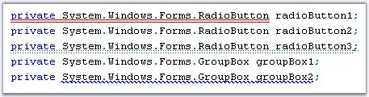
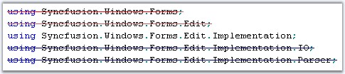

::: {style="DISPLAY: none"}
{#d2h_url_template}{#d2h_package_url style="WIDTH: 0px; DISPLAY: none; HEIGHT: 0px"}
:::

::::: {#nsbanner .d2h_main_nsbanner style="BORDER-BOTTOM: #999999 1px solid; POSITION: relative; PADDING-BOTTOM: 0px; BACKGROUND-COLOR: transparent; PADDING-LEFT: 0px; PADDING-RIGHT: 0px; DISPLAY: none; BORDER-TOP: #999999 1px solid; PADDING-TOP: 0px; LEFT: 0px"}
:::: {#TitleRow .d2h_main_titlerow style="PADDING-BOTTOM: 4px; BACKGROUND-COLOR: transparent; PADDING-LEFT: 22px; WIDTH: 100%; PADDING-RIGHT: 10px; DISPLAY: none; PADDING-TOP: 4px"}
::: {#ienav .d2h_main_ienav style="DISPLAY: none"}
{#D2HPrevious .D2HPreviousEnabled}  {#D2HNext .D2HNextEnabled}
:::
::::
:::::

:::::: {#nstext .d2h_main_nstext style="PADDING-BOTTOM: 10px; BACKGROUND-COLOR: transparent; PADDING-LEFT: 22px; PADDING-RIGHT: 10px; HEIGHT: 100%; OVERFLOW: auto; PADDING-TOP: 5px" hasuserbackground="true" valign="bottom"}
::: {#d2h_breadcrumbs .d2h_breadcrumbs}
[Essential Studio User Guide Documentation](ms-xhelp:///?Id=12457748-09e3-4d74-a240-8e049cedf030){.d2h_breadcrumbsNormal}[ \> ]{.d2h_breadcrumbsLinkSeparator}[User Interface Edition](ms-xhelp:///?Id=c29296b7-531c-413b-a0ec-488ca1f7f669){.d2h_breadcrumbsNormal}[ \> ]{.d2h_breadcrumbsLinkSeparator}[Essential Windows](ms-xhelp:///?Id=e60759d8-47a4-4570-9d7a-16a68d63f2ea){.d2h_breadcrumbsNormal}[ \> ]{.d2h_breadcrumbsLinkSeparator}[Essential Edit]{.d2h_breadcrumbsContentsOnly}[ \> ]{.d2h_breadcrumbsLinkSeparator}[Concepts And Features](ms-xhelp:///?Id=7c39cee6-8434-4711-a18e-efaba8ac85c0){.d2h_breadcrumbsNormal}[ \> ]{.d2h_breadcrumbsLinkSeparator}[Text Visualization](ms-xhelp:///?Id=03937960-0195-4ded-b842-e48212f822d3){.d2h_breadcrumbsNormal}
:::

### Underlines, Wavelines and StrikeThrough {#underlines-wavelines-and-strikethrough style="tab-stops: 0pt"}

 

Underlines and Wavelines are mainly used to highlight certain sections of text, possibly to notify the user about errors or important sections of the document. Edit Control allows you to underline any desired text in its contents. The underlines can be of different styles, colors and weights, with each of them being used to convey a different meaning. Edit Control supports underlines of the following styles: **Solid**, **Dot**, **Dash**, **Wave** and **DashDot** styles. You can also specify the weight of the underlines to be **Single** or **Double**.

 

Before the underlining can be applied to the selected text, a custom underlining format has to be defined. The **RegisterUnderlineFormat** method of ISnippetFormat, registers the custom underline format to be used while underlining a region. You can create a custom underlining format, as shown in the code below.

 

+----------------------------------------------------------------------------------------------------------------------------------------------------+
| **[\[C#\]]{style="FONT-FAMILY: 'Courier New'; COLOR: black"}**                                                                                     |
|                                                                                                                                                    |
| []{style="FONT-FAMILY: 'Courier New'; COLOR: black"}                                                                                               |
|                                                                                                                                                    |
| [// Registers the custom underline format.]{style="FONT-FAMILY: 'Courier New'; COLOR: green"}                                                      |
|                                                                                                                                                    |
| [ISnippetFormat format = editControl1.RegisterUnderlineFormat (SelectedColor, SelectedStyle, SelectedWeight);]{style="FONT-FAMILY: 'Courier New'"} |
+----------------------------------------------------------------------------------------------------------------------------------------------------+

[]{style="FONT-FAMILY: 'Trebuchet MS','sans-serif'; COLOR: #15428b; FONT-SIZE: 9pt"} 

+-----------------------------------------------------------------------------------------------------------------------------------------------------------------------------------------------------------------------------------+
| **[\[VB.NET\]]{style="FONT-FAMILY: 'Courier New'; COLOR: black"}**                                                                                                                                                                |
|                                                                                                                                                                                                                                   |
| []{style="FONT-FAMILY: 'Courier New'; COLOR: black"}                                                                                                                                                                              |
|                                                                                                                                                                                                                                   |
| [\' Registers the custom underline format.]{style="FONT-FAMILY: 'Courier New'; COLOR: green"}                                                                                                                                     |
|                                                                                                                                                                                                                                   |
| [Dim]{style="FONT-FAMILY: 'Courier New'; COLOR: blue"}[ format [As]{style="COLOR: blue"} ISnippetFormat = editControl1.RegisterUnderlineFormat(SelectedColor, SelectedStyle, SelectedWeight)]{style="FONT-FAMILY: 'Courier New'"} |
+-----------------------------------------------------------------------------------------------------------------------------------------------------------------------------------------------------------------------------------+

 

The **SelectedColor** value can be set to any desired color. The **SelectedStyle** value is specified by using the **UnderlineStyle** enumerator. The **SelectedWeight** value is specified by using the **UnderlineWeight** enumerator.

 

::: {align="center"}
+-----------------------------------+------------------------------------+
| Edit Control Underline Enumerator | Description                        |
+-----------------------------------+------------------------------------+
| UnderlineStyle                    | UnderlineStyle.Solid(default),     |
|                                   |                                    |
|                                   | UnderlineStyle.Dot,                |
|                                   |                                    |
|                                   | UnderlineStyle.Dash,               |
|                                   |                                    |
|                                   | UnderlineStyle.Wave, and           |
|                                   |                                    |
|                                   | UnderlineStyle.DashDot.            |
+-----------------------------------+------------------------------------+
| UnderlineWeight                   | UnderlineWeight.Thick(default) and |
|                                   |                                    |
|                                   | UnderlineWeight.Double.            |
+-----------------------------------+------------------------------------+
:::

 

**Underlining Selected Text**

 

Underlining can be set and removed for selected text by using the below given methods.

 

::: {align="center"}
  --------------------- ------------------------------------------------
  Edit Control Method   Description
  SetUnderline          Sets underlining of the specified text region.
  RemoveUnderLine       Removes underlining in the specified region.
  --------------------- ------------------------------------------------
:::

[]{style="FONT-FAMILY: 'Trebuchet MS','sans-serif'; COLOR: #15428b; FONT-SIZE: 9pt"} 

+-----------------------------------------------------------------------------------------------------------------------------------------------------------------------------------------------------------------------------------------------------+
| **[\[C#\]]{style="FONT-FAMILY: 'Courier New'; COLOR: black"}**                                                                                                                                                                                      |
|                                                                                                                                                                                                                                                     |
| []{style="FONT-FAMILY: 'Courier New'; COLOR: green"}                                                                                                                                                                                                |
|                                                                                                                                                                                                                                                     |
| [this]{style="FONT-FAMILY: 'Courier New'; COLOR: blue"}[.editControl1.SetUnderline([this]{style="COLOR: blue"}.editControl1.Selection.Top, [this]{style="COLOR: blue"}.editControl1.Selection.Bottom, format);]{style="FONT-FAMILY: 'Courier New'"} |
|                                                                                                                                                                                                                                                     |
| [this]{style="FONT-FAMILY: 'Courier New'; COLOR: blue"}[.editControl1.RemoveUnderline([this]{style="COLOR: blue"}.editControl1.Selection.Top, [this]{style="COLOR: blue"}.editControl1.Selection.Bottom);]{style="FONT-FAMILY: 'Courier New'"}      |
+-----------------------------------------------------------------------------------------------------------------------------------------------------------------------------------------------------------------------------------------------------+

[]{style="FONT-FAMILY: 'Trebuchet MS','sans-serif'; COLOR: #15428b; FONT-SIZE: 9pt"} 

+----------------------------------------------------------------------------------------------------------------------------------------------------------------------------------------------------------------------------------------------+
| **[\[VB.NET\]]{style="FONT-FAMILY: 'Courier New'; COLOR: black"}**                                                                                                                                                                           |
|                                                                                                                                                                                                                                              |
| []{style="FONT-FAMILY: 'Courier New'; COLOR: green"}                                                                                                                                                                                         |
|                                                                                                                                                                                                                                              |
| [Me]{style="FONT-FAMILY: 'Courier New'; COLOR: blue"}[.editControl1.SetUnderline([Me]{style="COLOR: blue"}.editControl1.Selection.Top, [Me]{style="COLOR: blue"}.editControl1.Selection.Bottom, format)]{style="FONT-FAMILY: 'Courier New'"} |
|                                                                                                                                                                                                                                              |
| [Me]{style="FONT-FAMILY: 'Courier New'; COLOR: blue"}[.editControl1.RemoveUnderline([Me]{style="COLOR: blue"}.editControl1.Selection.Top, [Me]{style="COLOR: blue"}.editControl1.Selection.Bottom)]{style="FONT-FAMILY: 'Courier New'"}      |
+----------------------------------------------------------------------------------------------------------------------------------------------------------------------------------------------------------------------------------------------+

 

**Underlining using Configuration File**

 

You can also set the underlining from the configuration file, as shown in the below example.

 

+------------------------------------------------------------------------------------------------------------------------------------------------------------------------------------------------------------------------------------------------------------------------------------------------------------------------------------------------------------------------------------------------------------------------------------------------------------------------------------------------------------------------------------------------------------------------------------------------------------------------------------------------------------------------------------------------------------------------------------------------------------------------------------------------------------------------------------------------------------------------------------------------------------------------------------------------------------------------------------------------------------------------------------------------------------------------------------------------------------------+
| **[\[XML\]]{style="FONT-FAMILY: 'Courier New'; COLOR: black"}**                                                                                                                                                                                                                                                                                                                                                                                                                                                                                                                                                                                                                                                                                                                                                                                                                                                                                                                                                                                                                                                  |
|                                                                                                                                                                                                                                                                                                                                                                                                                                                                                                                                                                                                                                                                                                                                                                                                                                                                                                                                                                                                                                                                                                                  |
| []{style="FONT-FAMILY: 'Courier New'; COLOR: black"}                                                                                                                                                                                                                                                                                                                                                                                                                                                                                                                                                                                                                                                                                                                                                                                                                                                                                                                                                                                                                                                             |
|                                                                                                                                                                                                                                                                                                                                                                                                                                                                                                                                                                                                                                                                                                                                                                                                                                                                                                                                                                                                                                                                                                                  |
| [\<]{style="FONT-FAMILY: 'Courier New'; COLOR: blue"}[format name]{style="FONT-FAMILY: 'Courier New'; COLOR: red"}[=\"Comment\"]{style="FONT-FAMILY: 'Courier New'; COLOR: blue"}[ ]{style="FONT-FAMILY: 'Courier New'; COLOR: fuchsia"}[Font]{style="FONT-FAMILY: 'Courier New'; COLOR: red"}[=\"Courier New, 10pt, style=Bold\"]{style="FONT-FAMILY: 'Courier New'; COLOR: blue"}[ ]{style="FONT-FAMILY: 'Courier New'; COLOR: fuchsia"}[FontColor]{style="FONT-FAMILY: 'Courier New'; COLOR: red"}[=\"Green\"]{style="FONT-FAMILY: 'Courier New'; COLOR: blue"}[ ]{style="FONT-FAMILY: 'Courier New'; COLOR: fuchsia"}[LineColor]{style="FONT-FAMILY: 'Courier New'; COLOR: red"}[=\"Red\"]{style="FONT-FAMILY: 'Courier New'; COLOR: blue"}[ ]{style="FONT-FAMILY: 'Courier New'; COLOR: fuchsia"}[Weight]{style="FONT-FAMILY: 'Courier New'; COLOR: red"}[=\"Thick\"]{style="FONT-FAMILY: 'Courier New'; COLOR: blue"}[ ]{style="FONT-FAMILY: 'Courier New'; COLOR: fuchsia"}[Underline]{style="FONT-FAMILY: 'Courier New'; COLOR: red"}[=\"DashDot\" /\>]{style="FONT-FAMILY: 'Courier New'; COLOR: blue"} |
+------------------------------------------------------------------------------------------------------------------------------------------------------------------------------------------------------------------------------------------------------------------------------------------------------------------------------------------------------------------------------------------------------------------------------------------------------------------------------------------------------------------------------------------------------------------------------------------------------------------------------------------------------------------------------------------------------------------------------------------------------------------------------------------------------------------------------------------------------------------------------------------------------------------------------------------------------------------------------------------------------------------------------------------------------------------------------------------------------------------+

 

**LineColor**, **Weight** and **Underline** parameters are used to specify the type of underlining to be used.

[]{style="FONT-FAMILY: 'Verdana','sans-serif'; COLOR: red; FONT-SIZE: 8pt"} 

{border="0"}

Figure 18: Text with Double Solid Style, Double Dot Style, Wave Style Underlines

 

A sample which demonstrates this feature is available in the below location.

 

..\\My Documents\\Syncfusion\\EssentialStudio***\\Version Number***\\Windows\\Edit.Windows\\Samples\\2.0\\Advanced Editor Functions\\UnderlinesDemo

 

**Striking Through Text**

 

The **StrikeThrough** method allows you to perform strikethrough operation on the text contained in the Edit Control. This is a very useful feature in denoting text that was deleted from the original document or highlighting offending code. You can also specify any custom color for the strikethrough line.

 

+---------------------------------------------------------------------------------------------------------------------------------------------------------------------------------------------------------------------------------------------------------------------------------+
| **[\[C#\]]{style="FONT-FAMILY: 'Courier New'; COLOR: black"}**                                                                                                                                                                                                                  |
|                                                                                                                                                                                                                                                                                 |
| []{style="FONT-FAMILY: 'Courier New'; COLOR: black"}                                                                                                                                                                                                                            |
|                                                                                                                                                                                                                                                                                 |
| [// Strikeout the current line.]{style="FONT-FAMILY: 'Courier New'; COLOR: green"}                                                                                                                                                                                              |
|                                                                                                                                                                                                                                                                                 |
| [this]{style="FONT-FAMILY: 'Courier New'; COLOR: blue"}[.editControl1.StrikeThrough([this]{style="COLOR: blue"}.editControl1.CurrentLine, [Color]{style="COLOR: teal"}.IndianRed);]{style="FONT-FAMILY: 'Courier New'"}                                                         |
|                                                                                                                                                                                                                                                                                 |
| []{style="FONT-FAMILY: 'Courier New'"}                                                                                                                                                                                                                                          |
|                                                                                                                                                                                                                                                                                 |
| [// Strikeout the selected text.]{style="FONT-FAMILY: 'Courier New'; COLOR: green"}                                                                                                                                                                                             |
|                                                                                                                                                                                                                                                                                 |
| [this]{style="FONT-FAMILY: 'Courier New'; COLOR: blue"}[.editControl1.StrikeThrough([this]{style="COLOR: blue"}.editControl1.Selection.Top, [this]{style="COLOR: blue"}.editControl1.Selection.Bottom, [Color]{style="COLOR: teal"}.Navy);]{style="FONT-FAMILY: 'Courier New'"} |
|                                                                                                                                                                                                                                                                                 |
| []{style="FONT-FAMILY: 'Courier New'"}                                                                                                                                                                                                                                          |
|                                                                                                                                                                                                                                                                                 |
| [// Strikeout the text in the specified text range.]{style="FONT-FAMILY: 'Courier New'; COLOR: green"}                                                                                                                                                                          |
|                                                                                                                                                                                                                                                                                 |
| [this]{style="FONT-FAMILY: 'Courier New'; COLOR: blue"}[.editControl1.StrikeThrough(startCoordinatePoint, endCoordinatePoint, [Color]{style="COLOR: teal"}.Aqua);]{style="FONT-FAMILY: 'Courier New'"}                                                                          |
+---------------------------------------------------------------------------------------------------------------------------------------------------------------------------------------------------------------------------------------------------------------------------------+

[]{style="FONT-FAMILY: 'Trebuchet MS','sans-serif'; COLOR: #15428b; FONT-SIZE: 9pt"} 

+---------------------------------------------------------------------------------------------------------------------------------------------------------------------------------------------------------------------------------------------------+
| **[\[VB.NET\]]{style="FONT-FAMILY: 'Courier New'; COLOR: black"}**                                                                                                                                                                                |
|                                                                                                                                                                                                                                                   |
| []{style="FONT-FAMILY: 'Courier New'; COLOR: black"}                                                                                                                                                                                              |
|                                                                                                                                                                                                                                                   |
| [\' Strikeout the current line.]{style="FONT-FAMILY: 'Courier New'; COLOR: green"}                                                                                                                                                                |
|                                                                                                                                                                                                                                                   |
| [Me]{style="FONT-FAMILY: 'Courier New'; COLOR: blue"}[.editControl1.StrikeThrough([Me]{style="COLOR: blue"}.editControl1.CurrentLine, Color.IndianRed)]{style="FONT-FAMILY: 'Courier New'"}                                                       |
|                                                                                                                                                                                                                                                   |
| []{style="FONT-FAMILY: 'Courier New'; COLOR: black"}                                                                                                                                                                                              |
|                                                                                                                                                                                                                                                   |
| [\' Strikeout the selected text.]{style="FONT-FAMILY: 'Courier New'; COLOR: green"}                                                                                                                                                               |
|                                                                                                                                                                                                                                                   |
| [Me]{style="FONT-FAMILY: 'Courier New'; COLOR: blue"}[.editControl1.StrikeThrough([Me]{style="COLOR: blue"}.editControl1.Selection.Top, [Me]{style="COLOR: blue"}.editControl1.Selection.Bottom, Color.Navy)]{style="FONT-FAMILY: 'Courier New'"} |
|                                                                                                                                                                                                                                                   |
| []{style="FONT-FAMILY: 'Courier New'; COLOR: black"}                                                                                                                                                                                              |
|                                                                                                                                                                                                                                                   |
| [\' Strikeout the text in the specified text range.]{style="FONT-FAMILY: 'Courier New'; COLOR: green"}                                                                                                                                            |
|                                                                                                                                                                                                                                                   |
| [Me]{style="FONT-FAMILY: 'Courier New'; COLOR: blue"}[.editControl1.StrikeThrough(startCoordinatePoint, endCoordinatePoint, Color.Aqua)]{style="FONT-FAMILY: 'Courier New'"}                                                                      |
+---------------------------------------------------------------------------------------------------------------------------------------------------------------------------------------------------------------------------------------------------+

 

To remove the strikethrough line, just call one of the above mentioned methods and specify the **Color** parameter as **Color.Empty**.

 

{border="0"}

Figure 19: Striking Through Range of Text

 

A sample which demonstrates the StrikeThrough feature is available in the following sample installation path.

 

*..\\My Documents\\Syncfusion\\EssentialStudio\\Version Number\\Windows\\Edit.Windows\\Samples\\2.0\\Advanced Editor Functions\\StrikeThroughDemo*

 

See Also

[]{style="FONT-FAMILY: 'Segoe UI','sans-serif'; COLOR: #4a5c8c; FONT-SIZE: 9pt"} 

[Text Border]{style="FONT-FAMILY: 'Trebuchet MS','sans-serif'; FONT-SIZE: 9pt"}[, ]{style="FONT-FAMILY: 'Trebuchet MS','sans-serif'; COLOR: #15428b; FONT-SIZE: 9pt"}[Text Selection]{style="FONT-FAMILY: 'Trebuchet MS','sans-serif'; FONT-SIZE: 9pt"}[]{style="FONT-FAMILY: 'Trebuchet MS','sans-serif'; COLOR: black; FONT-SIZE: 9pt"}

[]{#p37} 

 

[]{#related-topics}
::::::
