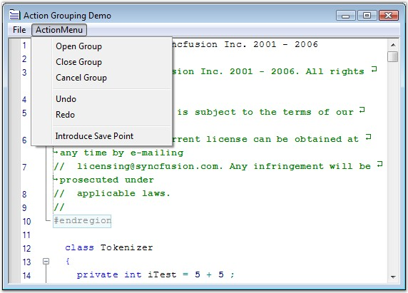

::: {style="DISPLAY: none"}
{#d2h_url_template}{#d2h_package_url style="WIDTH: 0px; DISPLAY: none; HEIGHT: 0px"}
:::

::::: {#nsbanner .d2h_main_nsbanner style="BORDER-BOTTOM: #999999 1px solid; POSITION: relative; PADDING-BOTTOM: 0px; BACKGROUND-COLOR: transparent; PADDING-LEFT: 0px; PADDING-RIGHT: 0px; DISPLAY: none; BORDER-TOP: #999999 1px solid; PADDING-TOP: 0px; LEFT: 0px"}
:::: {#TitleRow .d2h_main_titlerow style="PADDING-BOTTOM: 4px; BACKGROUND-COLOR: transparent; PADDING-LEFT: 22px; WIDTH: 100%; PADDING-RIGHT: 10px; DISPLAY: none; PADDING-TOP: 4px"}
::: {#ienav .d2h_main_ienav style="DISPLAY: none"}
{#D2HPrevious .D2HPreviousEnabled}  {#D2HNext .D2HNextEnabled}
:::
::::
:::::

::::::: {#nstext .d2h_main_nstext style="PADDING-BOTTOM: 10px; BACKGROUND-COLOR: transparent; PADDING-LEFT: 22px; PADDING-RIGHT: 10px; HEIGHT: 100%; OVERFLOW: auto; PADDING-TOP: 5px" hasuserbackground="true" valign="bottom"}
::: {#d2h_breadcrumbs .d2h_breadcrumbs}
[Essential Studio User Guide Documentation](ms-xhelp:///?Id=12457748-09e3-4d74-a240-8e049cedf030){.d2h_breadcrumbsNormal}[ \> ]{.d2h_breadcrumbsLinkSeparator}[User Interface Edition](ms-xhelp:///?Id=c29296b7-531c-413b-a0ec-488ca1f7f669){.d2h_breadcrumbsNormal}[ \> ]{.d2h_breadcrumbsLinkSeparator}[Essential Windows](ms-xhelp:///?Id=e60759d8-47a4-4570-9d7a-16a68d63f2ea){.d2h_breadcrumbsNormal}[ \> ]{.d2h_breadcrumbsLinkSeparator}[Essential Edit]{.d2h_breadcrumbsContentsOnly}[ \> ]{.d2h_breadcrumbsLinkSeparator}[Concepts And Features](ms-xhelp:///?Id=7c39cee6-8434-4711-a18e-efaba8ac85c0){.d2h_breadcrumbsNormal}[ \> ]{.d2h_breadcrumbsLinkSeparator}[Editing Features](ms-xhelp:///?Id=09b6fb4f-a916-4433-9bd6-4b72b9546754){.d2h_breadcrumbsNormal}
:::

### Undo / Redo Actions {#undo-redo-actions style="tab-stops: 0pt"}

[]{style="FONT-FAMILY: 'Trebuchet MS','sans-serif'; COLOR: #15428b; FONT-SIZE: 9pt"} 

Action Grouping allows you to specify a set of actions as groups for **Undo** / **Redo** purposes. When an action group is created, and a set of actions is added to it, the entire set is considered as one entity. This implies that the set of actions can be performed or undone using the **Redo** or **Undo** method call. You can use the **UndoGroupOpen**, **UndoGroupClose** and **UndoGroupCancel** methods to programmatically manipulate the undo / redo action grouping.

[]{style="FONT-FAMILY: 'Trebuchet MS','sans-serif'; COLOR: #15428b; FONT-SIZE: 9pt"} 

Grouping Actions

 

To undo/redo an action group, do the following steps:

 

1.   Invoke the **UndoGroupOpen** method to begin a new action group.

[]{style="FONT-FAMILY: 'Trebuchet MS','sans-serif'; COLOR: #15428b; FONT-SIZE: 9pt"} 

2.   Perform any desired set of actions, and invoke the **UndoGroupClose** method to close the action group. All the actions performed between the UndoGroupOpen() and UndoGroupClose() method calls get grouped as one entity.

[]{style="FONT-FAMILY: 'Trebuchet MS','sans-serif'; COLOR: #15428b; FONT-SIZE: 9pt"} 

3.   Now, when the **Undo** / **Redo** methods are invoked, the newly created group (or set of actions) gets undone / redone appropriately.

 

4.   To cancel an already open action group, you have to invoke the **UndoGroupCancel** method.

 

5.   The **CanUndo** property gets a flag that determines whether the undo operation can be performed in the Edit Control.

 

6.   The **CanRedo** property gets a flag that determines whether the redo operation can be performed in the Edit Control.

 

**Unlimited Undo and Redo**

[]{style="COLOR: #4a5c8c"} 

Essential Edit supports multiple levels of undo / redo, whereas the default Edit Control in Windows Forms supports just one level of undo / redo. This makes Essential Edit a better choice for all your editing needs. The ability to undo and redo changes in Essential Edit improves the usability of any application that has any form of text editing.

 

Essential Edit allows the following methods to be invoked any number of times.

 

::: {align="center"}
  --------------------- -----------------------------------------------------------------------------------------------------------------------------
  Edit Control Method   Description
  Undo                  Performs an undo operation. (CTRL+Z)
  Redo                  Performs a redo operation. (CTRL+Y)
  CanUndo               Indicates whether it is possible to undo the actions in the Edit Control.
  CanRedo               Indicates whether it is possible to redo the actions in the Edit Control.
  ResetUndoInfo         Clear the undo buffer. Hence undo operation is not allowed on contents/actions previously added/performed up to that point.
  --------------------- -----------------------------------------------------------------------------------------------------------------------------
:::

[]{style="FONT-FAMILY: 'Trebuchet MS','sans-serif'; COLOR: #15428b; FONT-SIZE: 9pt"} 

::: {style="BORDER-BOTTOM: windowtext 1pt solid; BORDER-LEFT: medium none; PADDING-BOTTOM: 1pt; MARGIN-TOP: 9pt; PADDING-LEFT: 0pt; PADDING-RIGHT: 0pt; MARGIN-BOTTOM: 9pt; BORDER-TOP: windowtext 1pt solid; BORDER-RIGHT: medium none; PADDING-TOP: 1pt"}
{border="0"}Note: The undo/redo buffer is cleared after the \'Save\' operation.
:::

[]{style="FONT-FAMILY: 'Trebuchet MS','sans-serif'; COLOR: #4a5c8c; FONT-SIZE: 9pt"} 

Enabling Grouping

 

Grouping is enabled using the below given property.

[]{style="COLOR: #15428b"} 

::: {align="center"}
  ----------------------- ---------------------------------------------------------------------
  Edit Control Property   Description
  GroupUndo               Specifies whether grouping should be enabled for undo/redo actions.
  ----------------------- ---------------------------------------------------------------------
:::

[]{style="FONT-FAMILY: 'Trebuchet MS','sans-serif'; COLOR: #15428b; FONT-SIZE: 9pt"} 

+-----------------------------------------------------------------------------------------------------------------------------------------------------------+
| **[\[C#\]]{style="FONT-FAMILY: 'Courier New'; COLOR: black"}**                                                                                            |
|                                                                                                                                                           |
| []{style="FONT-FAMILY: 'Courier New'; COLOR: black"}                                                                                                      |
|                                                                                                                                                           |
| [// Accomplish Undo operation.]{style="FONT-FAMILY: 'Courier New'; COLOR: green"}                                                                         |
|                                                                                                                                                           |
| [this]{style="FONT-FAMILY: 'Courier New'; COLOR: blue"}[.editControl1.Undo();]{style="FONT-FAMILY: 'Courier New'"}                                        |
|                                                                                                                                                           |
| []{style="FONT-FAMILY: 'Courier New'"}                                                                                                                    |
|                                                                                                                                                           |
| [// Accomplish Redo operation. ]{style="FONT-FAMILY: 'Courier New'; COLOR: green"}                                                                        |
|                                                                                                                                                           |
| [this]{style="FONT-FAMILY: 'Courier New'; COLOR: blue"}[.editControl1.Redo();]{style="FONT-FAMILY: 'Courier New'"}                                        |
|                                                                                                                                                           |
| []{style="FONT-FAMILY: 'Courier New'"}                                                                                                                    |
|                                                                                                                                                           |
| [// Indicates whether it is possible to Undo in the Edit Control. ]{style="FONT-FAMILY: 'Courier New'; COLOR: green"}                                     |
|                                                                                                                                                           |
| [bool]{style="FONT-FAMILY: 'Courier New'; COLOR: blue"}[ canUndo = [this]{style="COLOR: blue"}.editControl1.CanUndo;]{style="FONT-FAMILY: 'Courier New'"} |
|                                                                                                                                                           |
| []{style="FONT-FAMILY: 'Courier New'"}                                                                                                                    |
|                                                                                                                                                           |
| [// Indicates whether it is possible to Redo in the Edit Control. ]{style="FONT-FAMILY: 'Courier New'; COLOR: green"}                                     |
|                                                                                                                                                           |
| [bool]{style="FONT-FAMILY: 'Courier New'; COLOR: blue"}[ canRedo = [this]{style="COLOR: blue"}.editControl1.CanRedo;]{style="FONT-FAMILY: 'Courier New'"} |
|                                                                                                                                                           |
| []{style="FONT-FAMILY: 'Courier New'"}                                                                                                                    |
|                                                                                                                                                           |
| [// Clears the Undo buffer. ]{style="FONT-FAMILY: 'Courier New'; COLOR: green"}                                                                           |
|                                                                                                                                                           |
| [this]{style="FONT-FAMILY: 'Courier New'; COLOR: blue"}[.editControl1.ResetUndoInfo();]{style="FONT-FAMILY: 'Courier New'"}                               |
|                                                                                                                                                           |
| []{style="FONT-FAMILY: 'Courier New'"}                                                                                                                    |
|                                                                                                                                                           |
| [// Enable grouping for Undo / Redo actions.]{style="FONT-FAMILY: 'Courier New'; COLOR: green"}                                                           |
|                                                                                                                                                           |
| [this]{style="FONT-FAMILY: 'Courier New'; COLOR: blue"}[.editControl1.GroupUndo = [true]{style="COLOR: blue"};]{style="FONT-FAMILY: 'Courier New'"}       |
+-----------------------------------------------------------------------------------------------------------------------------------------------------------+

[]{style="FONT-FAMILY: 'Trebuchet MS','sans-serif'; COLOR: #15428b; FONT-SIZE: 9pt"} 

+--------------------------------------------------------------------------------------------------------------------------------------------------------------------------------------+
| **[\[VB.NET\]]{style="FONT-FAMILY: 'Courier New'; COLOR: black"}**                                                                                                                   |
|                                                                                                                                                                                      |
| []{style="FONT-FAMILY: 'Courier New'; COLOR: black"}                                                                                                                                 |
|                                                                                                                                                                                      |
| [\' Accomplish Undo operation.]{style="FONT-FAMILY: 'Courier New'; COLOR: green"}                                                                                                    |
|                                                                                                                                                                                      |
| [Me]{style="FONT-FAMILY: 'Courier New'; COLOR: blue"}[.editControl1.Undo()]{style="FONT-FAMILY: 'Courier New'"}                                                                      |
|                                                                                                                                                                                      |
| []{style="FONT-FAMILY: 'Courier New'"}                                                                                                                                               |
|                                                                                                                                                                                      |
| [\' Accomplish Redo operation.]{style="FONT-FAMILY: 'Courier New'; COLOR: green"}                                                                                                    |
|                                                                                                                                                                                      |
| [Me]{style="FONT-FAMILY: 'Courier New'; COLOR: blue"}[.editControl1.Redo()]{style="FONT-FAMILY: 'Courier New'"}                                                                      |
|                                                                                                                                                                                      |
| []{style="FONT-FAMILY: 'Courier New'"}                                                                                                                                               |
|                                                                                                                                                                                      |
| [\' Indicates whether it is possible to Undo in the Edit Control.]{style="FONT-FAMILY: 'Courier New'; COLOR: green"}                                                                 |
|                                                                                                                                                                                      |
| [Dim ]{style="FONT-FAMILY: 'Courier New'; COLOR: blue"}[canUndo [as bool]{style="COLOR: blue"} = [Me]{style="COLOR: blue"}.editControl1.CanUndo]{style="FONT-FAMILY: 'Courier New'"} |
|                                                                                                                                                                                      |
| []{style="FONT-FAMILY: 'Courier New'"}                                                                                                                                               |
|                                                                                                                                                                                      |
| [\' Indicates whether it is possible to Redo in the Edit Control.]{style="FONT-FAMILY: 'Courier New'; COLOR: green"}                                                                 |
|                                                                                                                                                                                      |
| [Dim ]{style="FONT-FAMILY: 'Courier New'; COLOR: blue"}[canRedo [as bool]{style="COLOR: blue"} = [Me]{style="COLOR: blue"}.editControl1.CanRedo]{style="FONT-FAMILY: 'Courier New'"} |
|                                                                                                                                                                                      |
| []{style="FONT-FAMILY: 'Courier New'"}                                                                                                                                               |
|                                                                                                                                                                                      |
| [\' Clears the Undo buffer.]{style="FONT-FAMILY: 'Courier New'; COLOR: green"}                                                                                                       |
|                                                                                                                                                                                      |
| [Me]{style="FONT-FAMILY: 'Courier New'; COLOR: blue"}[.editControl1.ResetUndoInfo()]{style="FONT-FAMILY: 'Courier New'"}                                                             |
|                                                                                                                                                                                      |
| []{style="FONT-FAMILY: 'Courier New'"}                                                                                                                                               |
|                                                                                                                                                                                      |
| [\' Enable grouping for Undo / Redo actions.]{style="FONT-FAMILY: 'Courier New'; COLOR: green"}                                                                                      |
|                                                                                                                                                                                      |
| [Me]{style="FONT-FAMILY: 'Courier New'; COLOR: blue"}[.editControl1.GroupUndo = [True]{style="COLOR: blue"}]{style="FONT-FAMILY: 'Courier New'"}                                     |
+--------------------------------------------------------------------------------------------------------------------------------------------------------------------------------------+

 

The following screen shot shows action grouping in Edit Control.

 

{border="0"}

Figure 9: Grouping Actions in Edit Control

 

A sample which demonstrates Action Grouping is available in the following sample installation location.

**** 

***..\\My Documents\\Syncfusion\\EssentialStudio\\Version Number\\Windows\\Edit.Windows\\Samples\\2.0\\Advanced Editor Functions\\ActionGroupingDemo***

 

[]{#related-topics}
:::::::
