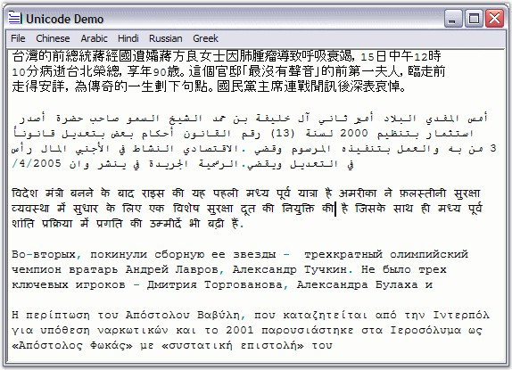

::: {style="DISPLAY: none"}
{#d2h_url_template}{#d2h_package_url style="WIDTH: 0px; DISPLAY: none; HEIGHT: 0px"}
:::

::: {.d2h_secondary_topic style="PADDING-BOTTOM: 10pt; MARGIN: 0pt; PADDING-LEFT: 0pt; PADDING-RIGHT: 0pt; PADDING-TOP: 0pt"}
#### Unicode {#unicode style="tab-stops: 0pt"}

 

Unicode is a standard used to encode all the languages of the world in computers. It is an international standard used with the goal to resolve ambiguities that traditionally arise with complex scripts like Japanese, Arabian or Chinese, on computer systems. Beside solving many Internationalization issues, Unicode-enabled programs also run faster under Windows NT, 2000 and XP.

 

Edit Control fully supports serializing and displaying Unicode characters. All Unicode text is saved in UTF-8 format, by default. Moving Unicode text between Edit Control and other Word Processing software programs is also straightforward through Copy / Paste clipboard functions.

 

Essential Edit also supports handling of all other text encoding formats specified in the **System.Text.Encoding** class like ASCII, UTF7, UTF8 and BigEndianUnicode.

 

The following screenshot illustrates the use of Chinese, Arabic, Hindi, Russian and Greek text in the Edit Control.

 

{border="0"}

Figure 34: Unicode support in Edit Control

 

A sample which demonstrates Unicode is available in the following sample installation path.

**** 

***..\\My Documents\\Syncfusion\\EssentialStudio\\Version Number\\Windows\\Edit.Windows\\Samples\\2.0\\Text Formatting\\UnicodeDemo***

[]{#p50} 

[]{#related-topics}
:::
