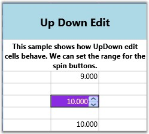

::: {style="DISPLAY: none"}
{#d2h_url_template}{#d2h_package_url style="WIDTH: 0px; DISPLAY: none; HEIGHT: 0px"}
:::

::::: {.d2h_secondary_topic style="PADDING-BOTTOM: 10pt; MARGIN: 0pt; PADDING-LEFT: 0pt; PADDING-RIGHT: 0pt; PADDING-TOP: 0pt"}
##### Up Down Edit Cells {#up-down-edit-cells style="tab-stops: 0pt"}

UpDownEdit cell type makes the grid cell to host an Up and Down edit control which contains a pair of arrow buttons that increase or decrease the cell value. The style properties applicable to this cell type are provided below.

 

Table 12: GridStyleInfo Property

::: {align="center"}
  ------------------------ -----------------------------------------------------------------------------------
  GridStyleInfo Property   Description
  Cell Type                Set to "UpDownEdit"
  NumberGroupSeparator     String that separates group of digits to the left of the decimal
  NumberDecimalDigits      Number of digits that appear after the decimal
  MaxValue                 Upper limit in the range of applicable values
  MinValue                 Lower limit in the range of applicable values
  Step                     Unit value that is to be increased or decreased when the spin buttons are clicked
  FocusedBorderBrush       Border brush; applied only when the cell is in focus
  FocusedForeground        Foreground brush; applied only when the cell is in focus
  FocusedBackground        Background brush; applied only when the cell is in focus
  ------------------------ -----------------------------------------------------------------------------------
:::

**[]{style="COLOR: #15428b"}** 

Example

The code below sets up two different Up and Down controls in grid cells.

[]{style="COLOR: #15428b"} 

+--------------------------------------------------------------------------------------------------------------------------------------------------------------------------------------------------------+
| [\[C#\]]{style="FONT-FAMILY: 'Courier New'; COLOR: black"}                                                                                                                                             |
|                                                                                                                                                                                                        |
| []{style="FONT-FAMILY: 'Courier New'"}                                                                                                                                                                 |
|                                                                                                                                                                                                        |
| [var updownStyleInfo = [this]{style="COLOR: blue"}.grid.Model\[6, 2\];]{style="FONT-FAMILY: 'Courier New'"}                                                                                            |
|                                                                                                                                                                                                        |
| [updownStyleInfo.CellType = [\"UpDownEdit\"]{style="COLOR: #a31515"};]{style="FONT-FAMILY: 'Courier New'"}                                                                                             |
|                                                                                                                                                                                                        |
| [updownStyleInfo.NumberFormat = [new]{style="COLOR: blue"} NumberFormatInfo { NumberGroupSeparator = [\" \"]{style="COLOR: #a31515"}, NumberDecimalDigits = 3 };]{style="FONT-FAMILY: 'Courier New'"}  |
|                                                                                                                                                                                                        |
| [updownStyleInfo.UpDownEdit.FocusedBackground = Brushes.Tan;]{style="FONT-FAMILY: 'Courier New'"}                                                                                                      |
|                                                                                                                                                                                                        |
| [updownStyleInfo.UpDownEdit.FocusedBorderBrush = Brushes.Red;]{style="FONT-FAMILY: 'Courier New'"}                                                                                                     |
|                                                                                                                                                                                                        |
| [updownStyleInfo.UpDownEdit.FocusedForeground = Brushes.Yellow;]{style="FONT-FAMILY: 'Courier New'"}                                                                                                   |
|                                                                                                                                                                                                        |
| [updownStyleInfo.UpDownEdit.MaxValue = 10.00;]{style="FONT-FAMILY: 'Courier New'"}                                                                                                                     |
|                                                                                                                                                                                                        |
| [updownStyleInfo.UpDownEdit.MinValue = 0;]{style="FONT-FAMILY: 'Courier New'"}                                                                                                                         |
|                                                                                                                                                                                                        |
| [updownStyleInfo.CellValue = 10.000;]{style="FONT-FAMILY: 'Courier New'"}                                                                                                                              |
|                                                                                                                                                                                                        |
| []{style="FONT-FAMILY: 'Courier New'"}                                                                                                                                                                 |
|                                                                                                                                                                                                        |
| [var updownStyleInfo1 = [this]{style="COLOR: blue"}.grid.Model\[8 , 2\];]{style="FONT-FAMILY: 'Courier New'"}                                                                                          |
|                                                                                                                                                                                                        |
| [updownStyleInfo1.CellType = [\"UpDownEdit\"]{style="COLOR: #a31515"};]{style="FONT-FAMILY: 'Courier New'"}                                                                                            |
|                                                                                                                                                                                                        |
| [updownStyleInfo1.NumberFormat = [new]{style="COLOR: blue"} NumberFormatInfo { NumberGroupSeparator = [\" \"]{style="COLOR: #a31515"}, NumberDecimalDigits = 3 };]{style="FONT-FAMILY: 'Courier New'"} |
|                                                                                                                                                                                                        |
| [updownStyleInfo1.UpDownEdit.FocusedBackground = Brushes.BlueViolet ;]{style="FONT-FAMILY: 'Courier New'"}                                                                                             |
|                                                                                                                                                                                                        |
| [updownStyleInfo1.UpDownEdit.FocusedBorderBrush = Brushes.Red;]{style="FONT-FAMILY: 'Courier New'"}                                                                                                    |
|                                                                                                                                                                                                        |
| [updownStyleInfo1.UpDownEdit.FocusedForeground = Brushes.Bisque ;]{style="FONT-FAMILY: 'Courier New'"}                                                                                                 |
|                                                                                                                                                                                                        |
| [updownStyleInfo1.UpDownEdit.MaxValue = 100.00;]{style="FONT-FAMILY: 'Courier New'"}                                                                                                                   |
|                                                                                                                                                                                                        |
| [updownStyleInfo1.UpDownEdit.MinValue = 0;]{style="FONT-FAMILY: 'Courier New'"}                                                                                                                        |
|                                                                                                                                                                                                        |
| [updownStyleInfo1.CellValue = 10.000;]{style="FONT-FAMILY: 'Courier New'"}                                                                                                                             |
+--------------------------------------------------------------------------------------------------------------------------------------------------------------------------------------------------------+

 

Output

The following output is generated using the code above.

 

{border="0"}

Figure 34: Up Down Edit

 

::: {style="BORDER-BOTTOM: windowtext 1pt solid; BORDER-LEFT: medium none; PADDING-BOTTOM: 1pt; MARGIN-TOP: 9pt; PADDING-LEFT: 0pt; PADDING-RIGHT: 0pt; MARGIN-BOTTOM: 9pt; BORDER-TOP: windowtext 1pt solid; BORDER-RIGHT: medium none; PADDING-TOP: 1pt"}
{border="0"}Note: For complete code, please refer to the following browser sample.
:::

 

***\...\\My Documents\\Syncfusion\\EssentialStudio\\\<Version Number\>\\WPF\\Grid.WPF\\Samples\\3.5\\WindowsSamples\\Cell Types\\UpDown Cell Demo***

**** 

[]{#related-topics}
:::::
