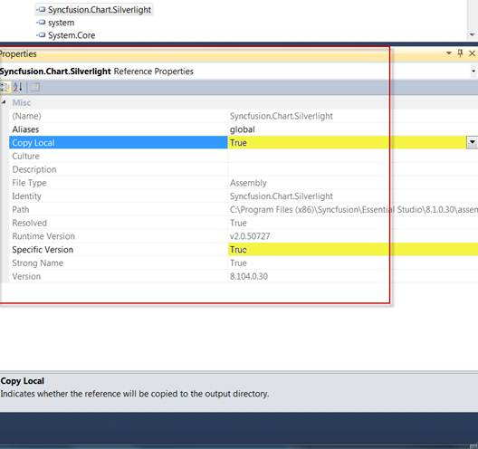

::: {style="DISPLAY: none"}
{#d2h_url_template}{#d2h_package_url style="WIDTH: 0px; DISPLAY: none; HEIGHT: 0px"}
:::

::::: {#nsbanner .d2h_main_nsbanner style="BORDER-BOTTOM: #999999 1px solid; POSITION: relative; PADDING-BOTTOM: 0px; BACKGROUND-COLOR: transparent; PADDING-LEFT: 0px; PADDING-RIGHT: 0px; DISPLAY: none; BORDER-TOP: #999999 1px solid; PADDING-TOP: 0px; LEFT: 0px"}
:::: {#TitleRow .d2h_main_titlerow style="PADDING-BOTTOM: 4px; BACKGROUND-COLOR: transparent; PADDING-LEFT: 22px; WIDTH: 100%; PADDING-RIGHT: 10px; DISPLAY: none; PADDING-TOP: 4px"}
::: {#ienav .d2h_main_ienav style="DISPLAY: none"}
{#D2HPrevious .D2HPreviousEnabled}  {#D2HNext .D2HNextEnabled}
:::
::::
:::::

::::: {#nstext .d2h_main_nstext style="PADDING-BOTTOM: 10px; BACKGROUND-COLOR: transparent; PADDING-LEFT: 22px; PADDING-RIGHT: 10px; HEIGHT: 100%; OVERFLOW: auto; PADDING-TOP: 5px" hasuserbackground="true" valign="bottom"}
::: {#d2h_breadcrumbs .d2h_breadcrumbs}
[Essential Studio User Guide Documentation](ms-xhelp:///?Id=12457748-09e3-4d74-a240-8e049cedf030){.d2h_breadcrumbsNormal}[ \> ]{.d2h_breadcrumbsLinkSeparator}[Essential Common](ms-xhelp:///?Id=2bfe10b6-fac1-4f91-a173-04db314f10c3){.d2h_breadcrumbsNormal}[ \> ]{.d2h_breadcrumbsLinkSeparator}[Frequently Asked Questions](ms-xhelp:///?Id=8c0b82fa-382a-437e-9ce1-9b9ffd3f2ead){.d2h_breadcrumbsNormal}[ \> ]{.d2h_breadcrumbsLinkSeparator}[How to Upgrade the Project into New Syncfusion Version?](ms-xhelp:///?Id=cfd06fb3-7d57-48a9-873d-55243fb6d956){.d2h_breadcrumbsNormal}
:::

### Upgrading the Projects Manually {#upgrading-the-projects-manually style="tab-stops: 0pt"}

You can upgrade the project in two methods based on the procedure used in your project to reference the Syncfusion assemblies. They are:

 

[·      ]{style="FONT-FAMILY: Symbol; FONT-WEIGHT: normal"}CopyLocal=True

1.   Set the **SpecificVersion** to **False**.

2.   Remove the **bin** and **obj** folders in your local project directory.

3.   Replace the latest assemblies with the upgraded assemblies in the **local** folder of your project.

4.   Recompile the project.

 

[·      ]{style="FONT-FAMILY: Symbol; FONT-WEIGHT: normal"}CopyLocal=False

1.   Ensure that the old Syncfusion assemblies are removed from GAC.

[o  ]{style="FONT-FAMILY: 'Courier New'"}For 2.0 and 3.5 assemblies:(C:\\windows\\assembly)

[o  ]{style="FONT-FAMILY: 'Courier New'"}For 4.0 assemblies: (C:\\Windows\\Microsoft.NET\\assembly\\GAC_MSIL)

2.   Install the latest Syncfusion assemblies on your machine using the **Syncfusion Assembly Manager**.

3.   Set the **SpecificVersion** to **False**.

4.   Recompile your project; the latest assemblies from GAC will refer to your project automatically.

 

{border="0"}

Figure 160: Properties Window

 

Switching the Framework Version While Upgrading the Project

If you want to switch the framework version while upgrading the project, use the **MultiTarget Manager** from the Syncfusion Dashboard.

After switching the framework version using **MultiTarget Manager**, remove the **bin** and **obj** folders from your local project directory, and then recompile your project.

For more details about MultiTarget Manager, refer to [[Multi-Target Manager]{style="FONT-FAMILY: 'Calibri','sans-serif'"}](http://help.syncfusion.com/Ug_101/Common/default.htm#!documents/652multitargetmanager.htm)[[.]{style="FONT-FAMILY: 'Calibri','sans-serif'"}]{.MsoHyperlink}

 

Migrating the Resource Files

Follow the below stepd to migrate the resource files (.resx) file of your project to the newer version:

 

1.   Open **Start-\>Syncfusion-\>Essential Studio x.x.x.x-\>Utilities-\>Migration-\>ConvertResx(Framework 2.0,3.5 or 4.0).**

2.   Click the **Choose ResX Files** to Convert.

3.   Select the **Resx files** you wanted to convert.

4.   Click **Start Converting Files**.

5.   After the conversion, the new Resx files will have the same name as the original files. Copies of the original files will have the .old suffix added to their names.

For more details about the Convert Resx utility, refer to [ConvertResxUtility](http://help.syncfusion.com/Ug_101/Common/documents/651convertresxutility.htm)[]{.MsoHyperlink}

::: {style="BORDER-BOTTOM: windowtext 1pt solid; BORDER-LEFT: medium none; PADDING-BOTTOM: 1pt; MARGIN-TOP: 9pt; PADDING-LEFT: 0pt; PADDING-RIGHT: 0pt; MARGIN-BOTTOM: 9pt; BORDER-TOP: windowtext 1pt solid; BORDER-RIGHT: medium none; PADDING-TOP: 1pt"}
[[]{style="TEXT-DECORATION: none"}]{.MsoHyperlink} 

[[]{style="TEXT-DECORATION: none"}]{.MsoHyperlink} 

[[]{style="TEXT-DECORATION: none"}]{.MsoHyperlink} 
:::

[]{#related-topics}
:::::
