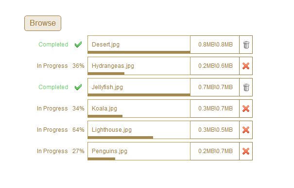

::: {style="DISPLAY: none"}
{#d2h_url_template}{#d2h_package_url style="WIDTH: 0px; DISPLAY: none; HEIGHT: 0px"}
:::

::::: {#nsbanner .d2h_main_nsbanner style="BORDER-BOTTOM: #999999 1px solid; POSITION: relative; PADDING-BOTTOM: 0px; BACKGROUND-COLOR: transparent; PADDING-LEFT: 0px; PADDING-RIGHT: 0px; DISPLAY: none; BORDER-TOP: #999999 1px solid; PADDING-TOP: 0px; LEFT: 0px"}
:::: {#TitleRow .d2h_main_titlerow style="PADDING-BOTTOM: 4px; BACKGROUND-COLOR: transparent; PADDING-LEFT: 22px; WIDTH: 100%; PADDING-RIGHT: 10px; DISPLAY: none; PADDING-TOP: 4px"}
::: {#ienav .d2h_main_ienav style="DISPLAY: none"}
{#D2HPrevious .D2HPreviousEnabled}  {#D2HNext .D2HNextEnabled}
:::
::::
:::::

:::: {#nstext .d2h_main_nstext style="PADDING-BOTTOM: 10px; BACKGROUND-COLOR: transparent; PADDING-LEFT: 22px; PADDING-RIGHT: 10px; HEIGHT: 100%; OVERFLOW: auto; PADDING-TOP: 5px" hasuserbackground="true" valign="bottom"}
::: {#d2h_breadcrumbs .d2h_breadcrumbs}
[Essential Studio User Guide Documentation](ms-xhelp:///?Id=12457748-09e3-4d74-a240-8e049cedf030){.d2h_breadcrumbsNormal}[ \> ]{.d2h_breadcrumbsLinkSeparator}[User Interface Edition](ms-xhelp:///?Id=c29296b7-531c-413b-a0ec-488ca1f7f669){.d2h_breadcrumbsNormal}[ \> ]{.d2h_breadcrumbsLinkSeparator}[Essential ASP.NET MVC](ms-xhelp:///?Id=4b14e7d1-65c4-4f67-b1aa-2c37709905a5){.d2h_breadcrumbsNormal}[ \> ]{.d2h_breadcrumbsLinkSeparator}[Essential Tools]{.d2h_breadcrumbsContentsOnly}[ \> ]{.d2h_breadcrumbsLinkSeparator}[Controls and Components](ms-xhelp:///?Id=f0af2fff-6f00-4ca4-85a6-54e41ac5dc96){.d2h_breadcrumbsNormal}
:::

## UploadBox Control {#uploadbox-control style="tab-stops: 0pt"}

This control helps you to upload files onto your server, no matter which format they are in.

The various features of the UploadBox Control are:

1.   Automatic and manual file upload options.

2.   Support for uploading multiple files.

3.   Support for synchronous and asynchronous file uploading

4.   Support for removing uploaded files.

5.   Support for client-side events.

6.   Localization support.

 

There are 14 in-built skins that can be used to customize the look and feel of this control.[]{style="FONT-FAMILY: 'Calibri','sans-serif'; FONT-SIZE: 11pt"}

Moreover, this control supports progress bars to show the status of the file-upload.

 

Appearance and Structure

The following figure gives you a basic idea of the structure and appearance of the File Upload control in MVC Tools-

{border="0"}

Figure 331: UploadBox with Asynchronous upload

 

More:

[ ]{#related-topics}

[{border="0" align="absMiddle"}Where do I find Installed samples?](ms-xhelp:///?Id=9208a652-2221-4cff-9fd1-e090206e20ec){style="TEXT-DECORATION: none"}

[{border="0" align="absMiddle"}Adding UploadBox control to MVC Tools](ms-xhelp:///?Id=6549f79a-9f8d-4174-846f-488135d5407b){style="TEXT-DECORATION: none"}

[{border="0" align="absMiddle"}Concepts and Features](ms-xhelp:///?Id=274a2e62-432c-48b9-997a-263cf5eb077e){style="TEXT-DECORATION: none"}
::::
