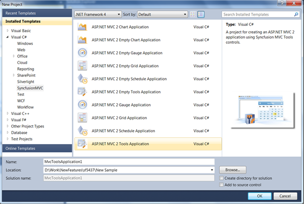
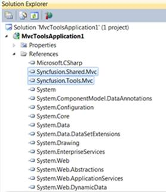
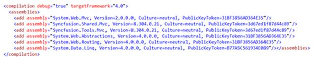
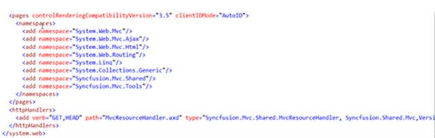
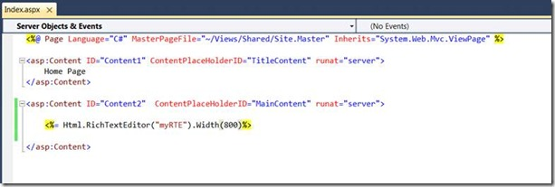
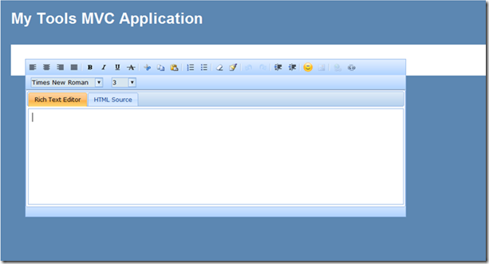

::: {style="DISPLAY: none"}
{#d2h_url_template}{#d2h_package_url style="WIDTH: 0px; DISPLAY: none; HEIGHT: 0px"}
:::

:::: {.d2h_secondary_topic style="PADDING-BOTTOM: 10pt; MARGIN: 0pt; PADDING-LEFT: 0pt; PADDING-RIGHT: 0pt; PADDING-TOP: 0pt"}
#### Usage Details {#usage-details style="tab-stops: 0pt"}

 

Once the project templates are installed, all the product templates are displayed on selecting Syncfusion MVC from the left tree of **VS2010 New Project** window. To use the project templates, select the appropriate template and start using the controls.

To show how effortless it is to get started with these templates when using Syncfusion MVC controls, let us create a simple application using the Syncfusion RichTextEditor control (RTE). In order to use the RTE control:

1.   Select VS2010\>New Project\>Visual C#\>Syncfusion MVC.

2.   Select **MVCToolsApplication** project template.

3.   Name the application.

4.   Click **OK**.

 

{border="0"}

Figure 12: MVCToolsApplication Selected

**[]{style="BACKGROUND: #dfe9f5; COLOR: #333333"}** 

This will create a new MVC application with all the predefined settings (which we call the steps for the configuration phase).

As in the References section, the **Tools** and **Shared** DLL references are already added.

 

{border="0"}

Figure 13: Appropriate DLLs Referred

**[]{style="BACKGROUND: #dfe9f5; COLOR: #333333"}** 

The Web.config file will contain the assembly references, namespaces, and all the handlers. Also, the scripts, StyleManager, and the ScriptManager will be added in the Site.Master.

 

::: {style="BORDER-BOTTOM: windowtext 1pt solid; BORDER-LEFT: medium none; PADDING-BOTTOM: 1pt; MARGIN-TOP: 9pt; PADDING-LEFT: 0pt; PADDING-RIGHT: 0pt; MARGIN-BOTTOM: 9pt; BORDER-TOP: windowtext 1pt solid; BORDER-RIGHT: medium none; PADDING-TOP: 1pt"}
{border="0"}Note: For versions previous to 8.4, RegisterStaticResources() will be added in the Site.Master.
:::

 

 

{border="0"}

Figure 14: Assembly References Added

**[]{style="FONT-FAMILY: 'Myriad Pro','sans-serif'"}** 

**[]{style="BACKGROUND: #dfe9f5; COLOR: #333333"}** 

{border="0"}

Figure 15: Handlers Added[]{style="BACKGROUND: #dfe9f5; COLOR: #333333"}

[]{style="BACKGROUND: #dfe9f5; COLOR: #333333"} 

Now all that you need to do is create an object of the RTE control in View.

 

[[{border="0" width="613" height="207"}]{style="BACKGROUND: #dfe9f5; COLOR: windowtext"}](http://www.syncfusion.com/blogs/image.axd?picture=clip_image009.jpg)[]{style="FONT-FAMILY: 'Times New Roman','serif'; FONT-SIZE: 12pt"}

Figure 16: Creating an Instance of RTE Control

**[]{style="BACKGROUND: #dfe9f5; COLOR: #333333"}** 

Run the solution and the RTE control will be displayed on the screen.

 

[[{border="0" width="613" height="331"}]{style="BACKGROUND: #dfe9f5; COLOR: windowtext"}](http://www.syncfusion.com/blogs/image.axd?picture=clip_image010_1.png)[]{style="FONT-FAMILY: 'Times New Roman','serif'; FONT-SIZE: 12pt"}

Figure 17: RichTextEditor Added to an Application[]{style="BACKGROUND: #dfe9f5; COLOR: #333333"}

 

[]{#related-topics}
::::
