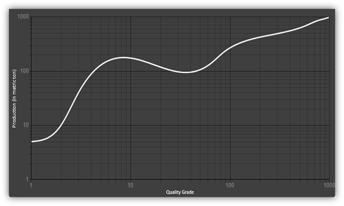

::: {style="DISPLAY: none"}
{#d2h_url_template}{#d2h_package_url style="WIDTH: 0px; DISPLAY: none; HEIGHT: 0px"}
:::

::: {.d2h_secondary_topic style="PADDING-BOTTOM: 10pt; MARGIN: 0pt; PADDING-LEFT: 0pt; PADDING-RIGHT: 0pt; PADDING-TOP: 0pt"}
##### Use Case Scenarios {#use-case-scenarios style="tab-stops: 0pt"}

If customers have a function on a very large scale but it has a very small slope, they can make use of this logarithmic scale (power of 10). A logarithmic scale is used in in the Richter scale, which is used for measuring how strong or powerful an earthquake is and showing it as a graph.

{border="0"}[]{style="COLOR: #c00000"}

Figure 107: Homogenous Mesh Grid in a Logarithmic Chart

[]{#related-topics}
:::
