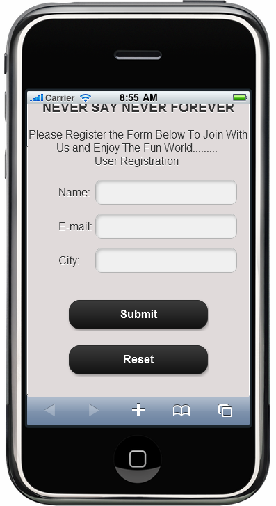
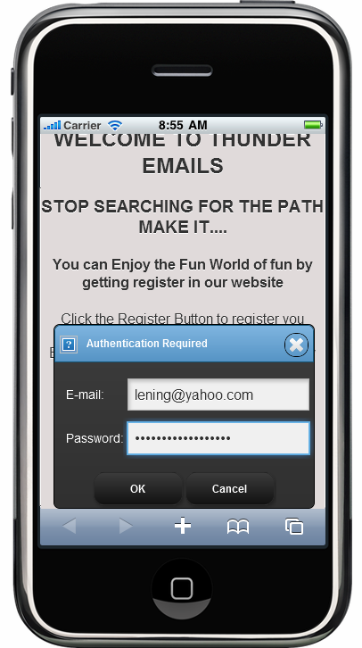

::: {style="DISPLAY: none"}
{#d2h_url_template} {#d2h_package_url style="WIDTH: 0px; DISPLAY: none; HEIGHT: 0px"}
:::

::: {.d2h_secondary_topic style="PADDING-BOTTOM: 10pt; MARGIN: 0pt; PADDING-LEFT: 0pt; PADDING-RIGHT: 0pt; PADDING-TOP: 0pt"}
#### Use Case Scenarios {#use-case-scenarios style="tab-stops: 0pt"}

The form button can be used in any kind of registration form and authentication pages.

For example:

1.  [Submit Button---Used to submit the form values for some process like registration or railway ticket reservation, etc.]{style="FONT-FAMILY: 'Arial','sans-serif'"}

2.  [Reset Button---Used when the user wants to reset to the default values in the form in case they entered incorrect information.]{style="FONT-FAMILY: 'Arial','sans-serif'"}

3.  [Button---Used to go to the next page after giving the proper authentication.]{style="FONT-FAMILY: 'Arial','sans-serif'"}

Examples of this form button are shown in screenshots as follows:

{border="0"}

Figure 3: Form Button in Registration Form

{border="0"}

Figure 210: Form Button in Authentication Form

[]{#related-topics}
:::
