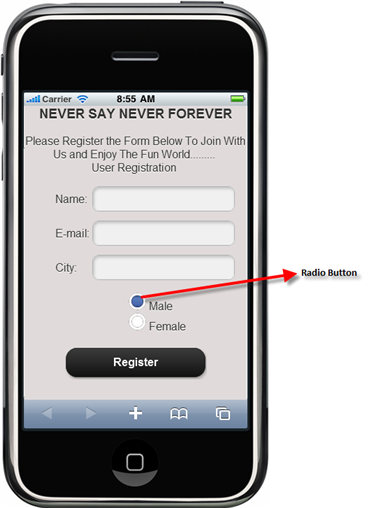

::: {style="DISPLAY: none"}
{#d2h_url_template} {#d2h_package_url style="WIDTH: 0px; DISPLAY: none; HEIGHT: 0px"}
:::

::: {.d2h_secondary_topic style="PADDING-BOTTOM: 10pt; MARGIN: 0pt; PADDING-LEFT: 0pt; PADDING-RIGHT: 0pt; PADDING-TOP: 0pt"}
#### Use Case Scenarios {#use-case-scenarios style="tab-stops: 0pt"}

The RadioButton control is most widely used in form-based, real-time systems, such as in the case of picking one item from a group of items. The RadioButtonFor control is used to create radio buttons for a number of items in the same group if the items count is very large.

For example, a radio button is used to select the gender details in a registration form, and then used to select the Installation details while installing software.

{border="0"}

Figure 222: Radio Button Use Case Sample

[]{#related-topics}
:::
