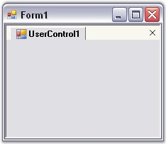

::: {style="DISPLAY: none"}
{#d2h_url_template}{#d2h_package_url style="WIDTH: 0px; DISPLAY: none; HEIGHT: 0px"}
:::

::: {.d2h_secondary_topic style="PADDING-BOTTOM: 10pt; MARGIN: 0pt; PADDING-LEFT: 0pt; PADDING-RIGHT: 0pt; PADDING-TOP: 0pt"}
#### UserControls as Tabs {#usercontrols-as-tabs style="MARGIN-LEFT: 18pt; tab-stops: 18.0pt"}

 

Normally TabbedMDI is used in MDI applications where the Child forms are the children that get tabbed. But, we can also use TabbedMDI with User Controls as children that are dockable.

 

Add a UserControl to the form and initialize it inside the parent form. Add a DockingManager and a TabbedMDIManager Control. Dock the User Control and set it as an MDIChild using the below code snippet.

[]{style="COLOR: #15428b"} 

+---------------------------------------------------------------------------------------------------------------------------------------------------------------------------------------------------------------------------------------------+
| **[\[C#\]]{style="FONT-FAMILY: 'Courier New'; COLOR: black"}**                                                                                                                                                                              |
|                                                                                                                                                                                                                                             |
| []{style="FONT-FAMILY: 'Courier New'; COLOR: black"}                                                                                                                                                                                        |
|                                                                                                                                                                                                                                             |
| [UserControl]{style="FONT-FAMILY: 'Courier New'; COLOR: teal"}[ Uc = [new]{style="COLOR: blue"} [UserControl]{style="COLOR: teal"}();]{style="FONT-FAMILY: 'Courier New'"}                                                                  |
|                                                                                                                                                                                                                                             |
| [Uc.Parent = [this]{style="COLOR: blue"};]{style="FONT-FAMILY: 'Courier New'"}                                                                                                                                                              |
|                                                                                                                                                                                                                                             |
| [// Dock the user contro1 to the form. ]{style="FONT-FAMILY: 'Courier New'; COLOR: green"}                                                                                                                                                  |
|                                                                                                                                                                                                                                             |
| [this]{style="FONT-FAMILY: 'Courier New'; COLOR: blue"}[.dockingManager1.DockControl(Uc, [this]{style="COLOR: blue"}, Syncfusion.Windows.Forms.Tools.[DockingStyle]{style="COLOR: teal"}.Tabbed, 200);]{style="FONT-FAMILY: 'Courier New'"} |
|                                                                                                                                                                                                                                             |
| [// Set the user controls to MDI mode. ]{style="FONT-FAMILY: 'Courier New'; COLOR: green"}                                                                                                                                                  |
|                                                                                                                                                                                                                                             |
| [this]{style="FONT-FAMILY: 'Courier New'; COLOR: blue"}[.dockingManager1.SetAsMDIChild(Uc, [true]{style="COLOR: blue"});]{style="FONT-FAMILY: 'Courier New'"}                                                                               |
+---------------------------------------------------------------------------------------------------------------------------------------------------------------------------------------------------------------------------------------------+

[]{style="COLOR: #15428b"} 

+------------------------------------------------------------------------------------------------------------------------------------------------------------------------------------------------------------------+
| **[\[VB.NET\]]{style="FONT-FAMILY: 'Courier New'; COLOR: black"}**                                                                                                                                               |
|                                                                                                                                                                                                                  |
| []{style="FONT-FAMILY: 'Courier New'"}                                                                                                                                                                           |
|                                                                                                                                                                                                                  |
| [Dim]{style="FONT-FAMILY: 'Courier New'; COLOR: blue"}[ Uc [As]{style="COLOR: blue"} [New]{style="COLOR: blue"} UserControl()]{style="FONT-FAMILY: 'Courier New'"}                                               |
|                                                                                                                                                                                                                  |
| [Uc.Parent = [Me]{style="COLOR: blue"} ]{style="FONT-FAMILY: 'Courier New'"}                                                                                                                                     |
|                                                                                                                                                                                                                  |
| [\' Dock the user contro1 to the form. ]{style="FONT-FAMILY: 'Courier New'; COLOR: green"}                                                                                                                       |
|                                                                                                                                                                                                                  |
| [Me]{style="FONT-FAMILY: 'Courier New'; COLOR: blue"}[.dockingManager1.DockControl(Uc, [Me]{style="COLOR: blue"}, Syncfusion.Windows.Forms.Tools.DockingStyle.Tabbed, 200) ]{style="FONT-FAMILY: 'Courier New'"} |
|                                                                                                                                                                                                                  |
| [\' Set the user controls to MDI mode. ]{style="FONT-FAMILY: 'Courier New'; COLOR: green"}                                                                                                                       |
|                                                                                                                                                                                                                  |
| [Me]{style="FONT-FAMILY: 'Courier New'; COLOR: blue"}[.dockingManager1.SetAsMDIChild(Uc, [True]{style="COLOR: blue"}) ]{style="FONT-FAMILY: 'Courier New'"}                                                      |
+------------------------------------------------------------------------------------------------------------------------------------------------------------------------------------------------------------------+

[]{style="COLOR: #15428b"} 

{border="0"}

[]{style="COLOR: #15428b"} 

Figure 1098: User Controls as MDI Child Form

**[]{style="COLOR: #15428b"}** 

See Also

**[]{style="COLOR: #15428b"}** 

[[MDI List]{.UGHyperlink}](../../../../../../../../Documents%20and%20Settings/sylviap/Desktop/Tools%20-%20Part%202.docx#_MDI_List)[]{.UGHyperlink}

 

 

 

[]{#p916} 

[]{#related-topics}
:::
