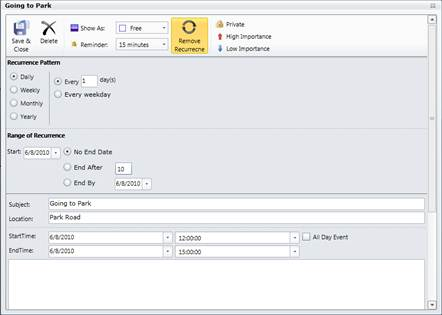

::: {style="DISPLAY: none"}
{#d2h_url_template}{#d2h_package_url style="WIDTH: 0px; DISPLAY: none; HEIGHT: 0px"}
:::

::: {.d2h_secondary_topic style="PADDING-BOTTOM: 10pt; MARGIN: 0pt; PADDING-LEFT: 0pt; PADDING-RIGHT: 0pt; PADDING-TOP: 0pt"}
##### Using Appointment Window {#using-appointment-window style="tab-stops: 0pt"}

1.   You can add the recurrence appointment dynamically using the appointment window.

2.   On that window, click **Enable Recurrence**. You can view the details for the recurrence appointment.

3.   Here, choose the type of recurrence appointment you require.

[]{style="LINE-HEIGHT: 150%; FONT-FAMILY: 'Trebuchet MS','sans-serif'; COLOR: #15428b; FONT-SIZE: 9pt"} 

{border="0"}

Figure 7: Adding Recurrence Appointment using Appointment Window

[]{style="FONT-FAMILY: 'Trebuchet MS','sans-serif'; COLOR: #15428b"} 

[]{#related-topics}
:::
