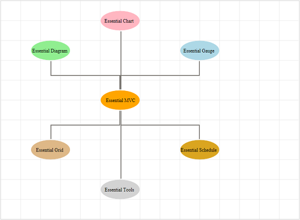

::: {style="DISPLAY: none"}
{#d2h_url_template}{#d2h_package_url style="WIDTH: 0px; DISPLAY: none; HEIGHT: 0px"}
:::

:::: {.d2h_secondary_topic style="PADDING-BOTTOM: 10pt; MARGIN: 0pt; PADDING-LEFT: 0pt; PADDING-RIGHT: 0pt; PADDING-TOP: 0pt"}
#### Using Builder {#using-builder style="PAGE-BREAK-AFTER: auto; tab-stops: 0pt"}

1.   In the **view**, invoke the **Diagram** helper with control ID and set the **GridLineHorizontalOffset** and **GridLineVerticalOffset** properties.

::: {align="center"}
+-----------------------------------------------------------------------------------------------------------------------------------------------------------------------------------------------------------------------------------------------------+
| **[View]{style="FONT-FAMILY: 'Courier New'"}**                                                                                                                                                                                                      |
|                                                                                                                                                                                                                                                     |
| [        [\<%]{style="BACKGROUND: yellow"}{]{style="FONT-FAMILY: 'Courier New'"}                                                                                                                                                                    |
|                                                                                                                                                                                                                                                     |
| [              Html.Syncfusion().Diagram([\"GridLines\"]{style="COLOR: #a31515"})]{style="FONT-FAMILY: 'Courier New'"}                                                                                                                              |
|                                                                                                                                                                                                                                                     |
| [                  .ShowHorizontalGridLine([true]{style="COLOR: blue"})]{style="FONT-FAMILY: 'Courier New'"}                                                                                                                                        |
|                                                                                                                                                                                                                                                     |
| [                  .ShowVerticalGridLine([true]{style="COLOR: blue"})]{style="FONT-FAMILY: 'Courier New'"}                                                                                                                                          |
|                                                                                                                                                                                                                                                     |
| [                  .GridLineHorizontalOffset(50)]{style="FONT-FAMILY: 'Courier New'"}                                                                                                                                                               |
|                                                                                                                                                                                                                                                     |
| [                  .GridLineVerticalOffset(50)]{style="FONT-FAMILY: 'Courier New'"}                                                                                                                                                                 |
|                                                                                                                                                                                                                                                     |
| [                  .DiagramMode(]{style="FONT-FAMILY: 'Courier New'; COLOR: black"}[DiagramMode]{style="FONT-FAMILY: 'Courier New'; COLOR: #2b91af"}[.SVG)]{style="FONT-FAMILY: 'Courier New'; COLOR: black"}[]{style="FONT-FAMILY: 'Courier New'"} |
|                                                                                                                                                                                                                                                     |
| [                  .Render();]{style="FONT-FAMILY: 'Courier New'"}                                                                                                                                                                                  |
|                                                                                                                                                                                                                                                     |
| [          }[%\>]{style="BACKGROUND: yellow"}]{style="FONT-FAMILY: 'Courier New'"}[]{style="FONT-FAMILY: 'Courier New'; COLOR: #a31515"}                                                                                                            |
+-----------------------------------------------------------------------------------------------------------------------------------------------------------------------------------------------------------------------------------------------------+
:::

**Note:** If you want to create the diagram in the Canvas mode, change the **DiagramMode** to **Canvas**. By default the diagram is rendered in the SVG mode.

 

2.   Build and run the application.

{border="0"}

Figure 139: Customized Gridline Offset

 

[]{#related-topics}
::::
