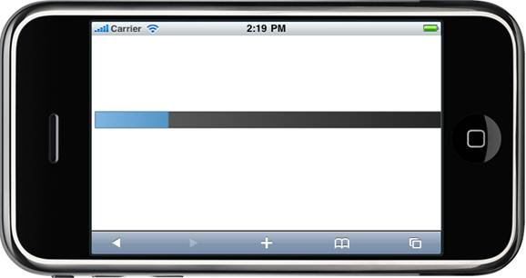

::: {style="DISPLAY: none"}
[](ms-xhelp:///?Id=d2h_url_template){#d2h_url_template} {#d2h_package_url style="WIDTH: 0px; DISPLAY: none; HEIGHT: 0px"}
:::

::: {.d2h_secondary_topic style="PADDING-BOTTOM: 10pt; MARGIN: 0pt; PADDING-LEFT: 0pt; PADDING-RIGHT: 0pt; PADDING-TOP: 0pt"}
##### Using Builder {#using-builder style="tab-stops: 0pt"}

1.   In **View**, invoke the ProgressBar helper with the control ID as an argument, followed by the **Maximum, Minimum, StepValue and Value** method, with the desired value as an argument.

+---------------------------------------------------------------------------------------------------------------------------------------------------------------------------------+
| [\[ASPX\]]{style="FONT-FAMILY: 'Courier New'; BACKGROUND: yellow"}                                                                                                              |
|                                                                                                                                                                                 |
| [\<%]{style="FONT-FAMILY: 'Courier New'; BACKGROUND: yellow"} [Html.MobSyncfusion().ProgressBar([\"progressBar\"]{style="COLOR: #a31515"})]{style="FONT-FAMILY: 'Courier New'"} |
|                                                                                                                                                                                 |
| [       .Value(30)]{style="FONT-FAMILY: 'Courier New'"}                                                                                                                         |
|                                                                                                                                                                                 |
| [       .Width(500)]{style="FONT-FAMILY: 'Courier New'"}                                                                                                                        |
|                                                                                                                                                                                 |
| [       .**Maximum(100)**]{style="FONT-FAMILY: 'Courier New'"}                                                                                                                  |
|                                                                                                                                                                                 |
| **[       .Minimum(10)]{style="FONT-FAMILY: 'Courier New'"}**                                                                                                                   |
|                                                                                                                                                                                 |
| **[       .Value(20)]{style="FONT-FAMILY: 'Courier New'"}**                                                                                                                     |
|                                                                                                                                                                                 |
| **[       .StepValue(10)]{style="FONT-FAMILY: 'Courier New'"}**                                                                                                                 |
|                                                                                                                                                                                 |
| [       ]{style="FONT-FAMILY: 'Courier New'"}                                                                                                                                   |
|                                                                                                                                                                                 |
| [      .Render();]{style="FONT-FAMILY: 'Courier New'"}                                                                                                                          |
|                                                                                                                                                                                 |
| [    [%\>]{style="BACKGROUND: yellow"}]{style="FONT-FAMILY: 'Courier New'"}                                                                                                     |
|                                                                                                                                                                                 |
| **[]{style="FONT-FAMILY: 'Courier New'"}**                                                                                                                                      |
+---------------------------------------------------------------------------------------------------------------------------------------------------------------------------------+

 

+----------------------------------------------------------------------------------------------------------------------------------------------------------------+
| ``` {style="BACKGROUND: #f2f2f2"}                                                                                                                              |
|                 [Razor]                                                                                                                                        |
|                                                                                                                                                                |
| ```                                                                                                                                                            |
|                                                                                                                                                                |
| ``` {style="BACKGROUND: #f2f2f2"}                                                                                                                              |
|                                                                                                                                                                |
|                                                                                                                                                                |
| ```                                                                                                                                                            |
|                                                                                                                                                                |
| [\@{]{style="FONT-FAMILY: 'Courier New'; BACKGROUND: yellow; COLOR: black"} []{style="FONT-FAMILY: 'Courier New'; COLOR: black"}                               |
|                                                                                                                                                                |
| [       ]{style="COLOR: black"} [Html.MobSyncfusion().ProgressBar([\"progressBar\"]{style="COLOR: #a31515"})]{style="FONT-FAMILY: Consolas; FONT-SIZE: 9.5pt"} |
|                                                                                                                                                                |
| [       .Value(30)]{style="FONT-FAMILY: Consolas; FONT-SIZE: 9.5pt"}                                                                                           |
|                                                                                                                                                                |
| [       .Width(500)]{style="FONT-FAMILY: Consolas; FONT-SIZE: 9.5pt"}                                                                                          |
|                                                                                                                                                                |
| [       .**Maximum(100)**]{style="FONT-FAMILY: Consolas; FONT-SIZE: 9.5pt"}                                                                                    |
|                                                                                                                                                                |
| **[       .Minimum(10)]{style="FONT-FAMILY: Consolas; FONT-SIZE: 9.5pt"}**                                                                                     |
|                                                                                                                                                                |
| **[       .Value(20)]{style="FONT-FAMILY: Consolas; FONT-SIZE: 9.5pt"}**                                                                                       |
|                                                                                                                                                                |
| **[       .StepValue(10)]{style="FONT-FAMILY: Consolas; FONT-SIZE: 9.5pt"}**                                                                                   |
|                                                                                                                                                                |
| [       ]{style="FONT-FAMILY: Consolas; FONT-SIZE: 9.5pt"}                                                                                                     |
|                                                                                                                                                                |
| [      .Render();]{style="FONT-FAMILY: Consolas; FONT-SIZE: 9.5pt"}                                                                                            |
|                                                                                                                                                                |
| [}]{style="FONT-FAMILY: 'Courier New'; BACKGROUND: yellow; COLOR: black"} []{style="FONT-FAMILY: 'Courier New'; COLOR: black"}                                 |
|                                                                                                                                                                |
| []{style="FONT-FAMILY: 'Courier New'"}                                                                                                                         |
+----------------------------------------------------------------------------------------------------------------------------------------------------------------+

[]{style="FONT-SIZE: 12pt"} 

7.   Build and run the application.

 

 

{border="0"}

Figure 85: Progressbar with range set

 

 

[]{#related-topics}
:::
