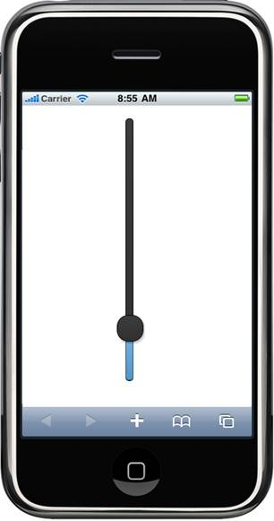

::: {style="DISPLAY: none"}
{#d2h_url_template} {#d2h_package_url style="WIDTH: 0px; DISPLAY: none; HEIGHT: 0px"}
:::

:::: {.d2h_secondary_topic style="PADDING-BOTTOM: 10pt; MARGIN: 0pt; PADDING-LEFT: 0pt; PADDING-RIGHT: 0pt; PADDING-TOP: 0pt"}
##### Using Builder {#using-builder style="tab-stops: 0pt"}

The following steps explain how to set slider orientation using Builder:**

1.   In **View**, invoke the slider helper with the control ID as an argument, followed by the **Orientation** method with the desired orientation as an argument.

 

 

+----------------------------------------------------------------------------------------------------------------------------------------------------------------------------------------------------------------------------+
| **[\[ASPX\]]{style="FONT-FAMILY: 'Courier New'"}**                                                                                                                                                                         |
|                                                                                                                                                                                                                            |
| [\<%]{style="FONT-FAMILY: 'Courier New'; BACKGROUND: yellow"} [=]{style="FONT-FAMILY: 'Courier New'; COLOR: blue"} [Html.MobSyncfusion().Slider([\"slider\"]{style="COLOR: #a31515"})]{style="FONT-FAMILY: 'Courier New'"} |
|                                                                                                                                                                                                                            |
| [    .Value(20)]{style="FONT-FAMILY: 'Courier New'"}                                                                                                                                                                       |
|                                                                                                                                                                                                                            |
| [    .Height(400)]{style="FONT-FAMILY: 'Courier New'"}                                                                                                                                                                     |
|                                                                                                                                                                                                                            |
| [    .Width(10)]{style="FONT-FAMILY: 'Courier New'"}                                                                                                                                                                       |
|                                                                                                                                                                                                                            |
| [    **.Orientation([SliderOrientation]{style="COLOR: #2b91af"}.Vertical)**]{style="FONT-FAMILY: 'Courier New'"}                                                                                                           |
|                                                                                                                                                                                                                            |
| [    [%\>]{style="BACKGROUND: yellow"}]{style="FONT-FAMILY: 'Courier New'"}                                                                                                                                                |
+----------------------------------------------------------------------------------------------------------------------------------------------------------------------------------------------------------------------------+

[]{style="BACKGROUND: yellow"} 

+------------------------------------------------------------------------------------------------------------------------------------------------------------------------+
| **[\[Razor\]]{style="FONT-FAMILY: 'Courier New'"}**                                                                                                                    |
|                                                                                                                                                                        |
| [\@{]{style="FONT-FAMILY: 'Courier New'; BACKGROUND: yellow"} [ Html.MobSyncfusion().Slider([\"slider\"]{style="COLOR: #a31515"})]{style="FONT-FAMILY: 'Courier New'"} |
|                                                                                                                                                                        |
| [    .Value(20)]{style="FONT-FAMILY: 'Courier New'"}                                                                                                                   |
|                                                                                                                                                                        |
| [    .Height(400)]{style="FONT-FAMILY: 'Courier New'"}                                                                                                                 |
|                                                                                                                                                                        |
| [    .Width(10)]{style="FONT-FAMILY: 'Courier New'"}                                                                                                                   |
|                                                                                                                                                                        |
| [    **.Orientation([SliderOrientation]{style="COLOR: #2b91af"}.Vertical)**]{style="FONT-FAMILY: 'Courier New'"}                                                       |
|                                                                                                                                                                        |
| [    .Render();]{style="FONT-FAMILY: 'Courier New'"}                                                                                                                   |
|                                                                                                                                                                        |
| [    [}]{style="BACKGROUND: yellow"}]{style="FONT-FAMILY: 'Courier New'"}                                                                                              |
|                                                                                                                                                                        |
| []{style="FONT-FAMILY: 'Courier New'; BACKGROUND: yellow"}                                                                                                             |
+------------------------------------------------------------------------------------------------------------------------------------------------------------------------+

[]{style="BACKGROUND: yellow"} 

::: {style="BORDER-BOTTOM: windowtext 1pt solid; BORDER-LEFT: medium none; PADDING-BOTTOM: 1pt; MARGIN-TOP: 9pt; PADDING-LEFT: 0pt; PADDING-RIGHT: 0pt; MARGIN-BOTTOM: 9pt; BORDER-TOP: windowtext 1pt solid; BORDER-RIGHT: medium none; PADDING-TOP: 1pt"}
Note: For vertical orientation, you need to register the stylesheet for the SliderVertical Component as in the below code snippets.
:::

 

+---------------------------------------------------------------------------------------------------------------------------------------------+
| **[\[ASPX\]]{style="FONT-FAMILY: 'Courier New'"}**                                                                                          |
|                                                                                                                                             |
| [\<%]{style="FONT-FAMILY: 'Courier New'; BACKGROUND: yellow"} [{]{style="FONT-FAMILY: 'Courier New'"}                                       |
|                                                                                                                                             |
| [          Html.MobSyncfusion().StyleManager()]{style="FONT-FAMILY: 'Courier New'"}                                                         |
|                                                                                                                                             |
| [          .Register(stylesheets =\>]{style="FONT-FAMILY: 'Courier New'"}                                                                   |
|                                                                                                                                             |
| [                  {]{style="FONT-FAMILY: 'Courier New'"}                                                                                   |
|                                                                                                                                             |
| [                      **stylesheets.Add([MobComponentType]{style="COLOR: #2b91af"}.SliderVertical);**]{style="FONT-FAMILY: 'Courier New'"} |
|                                                                                                                                             |
| [                  }).Render();]{style="FONT-FAMILY: 'Courier New'"}                                                                        |
|                                                                                                                                             |
| [      }[%\>]{style="BACKGROUND: yellow"}]{style="FONT-FAMILY: 'Courier New'"}                                                              |
|                                                                                                                                             |
| []{style="FONT-FAMILY: 'Courier New'; BACKGROUND: yellow"}                                                                                  |
+---------------------------------------------------------------------------------------------------------------------------------------------+

 

+---------------------------------------------------------------------------------------------------------------------------------------------+
| **[\[Razor\]]{style="FONT-FAMILY: 'Courier New'"}**                                                                                         |
|                                                                                                                                             |
| [\@{]{style="FONT-FAMILY: 'Courier New'; BACKGROUND: yellow"} [ Html.MobSyncfusion().StyleManager()]{style="FONT-FAMILY: 'Courier New'"}    |
|                                                                                                                                             |
| [          .Register(stylesheets =\>]{style="FONT-FAMILY: 'Courier New'"}                                                                   |
|                                                                                                                                             |
| [                  {]{style="FONT-FAMILY: 'Courier New'"}                                                                                   |
|                                                                                                                                             |
| [                      **stylesheets.Add([MobComponentType]{style="COLOR: #2b91af"}.SliderVertical);**]{style="FONT-FAMILY: 'Courier New'"} |
|                                                                                                                                             |
| [                  }).Render();]{style="FONT-FAMILY: 'Courier New'"}                                                                        |
|                                                                                                                                             |
| [    [}]{style="BACKGROUND: yellow"}]{style="FONT-FAMILY: 'Courier New'"}                                                                   |
|                                                                                                                                             |
| []{style="FONT-FAMILY: 'Courier New'; BACKGROUND: yellow"}                                                                                  |
+---------------------------------------------------------------------------------------------------------------------------------------------+

[]{style="BACKGROUND: yellow"} 

[]{style="FONT-FAMILY: Consolas; BACKGROUND: yellow; FONT-SIZE: 9.5pt"} 

[]{style="FONT-FAMILY: Consolas; BACKGROUND: yellow; FONT-SIZE: 9.5pt"} 

2.   Build and run the application in the emulator.

 

[ {border="0"} ]{style="LINE-HEIGHT: 115%; FONT-FAMILY: 'Calibri','sans-serif'; FONT-SIZE: 11pt"}

Figure 125: Vertical Slider[]{style="FONT-FAMILY: 'Calibri','sans-serif'; FONT-SIZE: 11pt"}

 

[]{#related-topics}
::::
