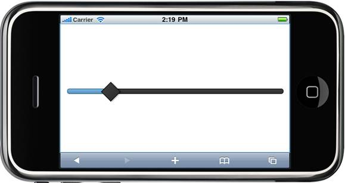

::: {style="DISPLAY: none"}
{#d2h_url_template} {#d2h_package_url style="WIDTH: 0px; DISPLAY: none; HEIGHT: 0px"}
:::

::: {.d2h_secondary_topic style="PADDING-BOTTOM: 10pt; MARGIN: 0pt; PADDING-LEFT: 0pt; PADDING-RIGHT: 0pt; PADDING-TOP: 0pt"}
##### Using Builder {#using-builder style="tab-stops: 0pt"}

 

The following steps explain how to customize the slider handle through the builder:**

1.   In **View**, invoke the slider helper with the control ID as an argument followed by the ShowThumb and ThumbStyle method with the desired value as an argument.

[]{style="FONT-FAMILY: 'Calibri','sans-serif'"} 

[]{style="FONT-FAMILY: 'Courier New'; BACKGROUND: yellow"} 

+----------------------------------------------------------------------------------------------------------------------------------------------------------------------------------------------------------------------------+
| **[\[ASPX\]]{style="FONT-FAMILY: 'Courier New'"}**                                                                                                                                                                         |
|                                                                                                                                                                                                                            |
| [\<%]{style="FONT-FAMILY: 'Courier New'; BACKGROUND: yellow"} [=]{style="FONT-FAMILY: 'Courier New'; COLOR: blue"} [Html.MobSyncfusion().Slider([\"slider\"]{style="COLOR: #a31515"})]{style="FONT-FAMILY: 'Courier New'"} |
|                                                                                                                                                                                                                            |
| [        .Value(20)]{style="FONT-FAMILY: 'Courier New'"}                                                                                                                                                                   |
|                                                                                                                                                                                                                            |
| [        **.ShowThumb([true]{style="COLOR: blue"})**]{style="FONT-FAMILY: 'Courier New'"}                                                                                                                                  |
|                                                                                                                                                                                                                            |
| **[        .ThumbStyle([ThumbStyle]{style="COLOR: #2b91af"}.Diamond)]{style="FONT-FAMILY: 'Courier New'"}**                                                                                                                |
|                                                                                                                                                                                                                            |
| [    [%\>]{style="BACKGROUND: yellow"}]{style="FONT-FAMILY: 'Courier New'"}                                                                                                                                                |
+----------------------------------------------------------------------------------------------------------------------------------------------------------------------------------------------------------------------------+

[]{style="BACKGROUND: yellow"} 

+------------------------------------------------------------------------------------------------------------------------------------------------------------------------+
| **[\[Razor\]]{style="FONT-FAMILY: 'Courier New'"}**                                                                                                                    |
|                                                                                                                                                                        |
| [\@{]{style="FONT-FAMILY: 'Courier New'; BACKGROUND: yellow"} [ Html.MobSyncfusion().Slider([\"slider\"]{style="COLOR: #a31515"})]{style="FONT-FAMILY: 'Courier New'"} |
|                                                                                                                                                                        |
| [       .Value(20)]{style="FONT-FAMILY: 'Courier New'"}                                                                                                                |
|                                                                                                                                                                        |
| [        **.ShowThumb([true]{style="COLOR: blue"})**]{style="FONT-FAMILY: 'Courier New'"}                                                                              |
|                                                                                                                                                                        |
| **[        .ThumbStyle([ThumbStyle]{style="COLOR: #2b91af"}.Diamond)]{style="FONT-FAMILY: 'Courier New'"}**                                                            |
|                                                                                                                                                                        |
| [    .Render();]{style="FONT-FAMILY: 'Courier New'"}                                                                                                                   |
|                                                                                                                                                                        |
| [    [}]{style="BACKGROUND: yellow"}]{style="FONT-FAMILY: 'Courier New'"}                                                                                              |
+------------------------------------------------------------------------------------------------------------------------------------------------------------------------+

[]{style="BACKGROUND: yellow"} 

2.   Build and run the application in an emulator.

*[[ []{style="TEXT-DECORATION: none"} ]{style="FONT-FAMILY: 'Calibri','sans-serif'"}]{.underline}*  

[ {border="0"} ]{style="LINE-HEIGHT: 115%; FONT-FAMILY: 'Calibri','sans-serif'; FONT-SIZE: 11pt"}

Figure 136: Slider with Diamond Thumb style[]{style="FONT-FAMILY: 'Calibri','sans-serif'; FONT-SIZE: 11pt"}

*[[ []{style="TEXT-DECORATION: none"} ]{style="FONT-FAMILY: 'Calibri','sans-serif'"}]{.underline}*  

[]{#related-topics}
:::
