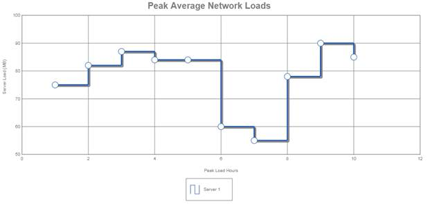

::: {style="DISPLAY: none"}
{#d2h_url_template} {#d2h_package_url style="WIDTH: 0px; DISPLAY: none; HEIGHT: 0px"}
:::

::: {.d2h_secondary_topic style="PADDING-BOTTOM: 10pt; MARGIN: 0pt; PADDING-LEFT: 0pt; PADDING-RIGHT: 0pt; PADDING-TOP: 0pt"}
##### Using Builder {#using-builder style="tab-stops: 0pt"}

 

The steps to create a Step Line chart through Builder are as follows:

1.   In Controller, return view to the corresponding View page.

[]{style="FONT-FAMILY: 'Calibri','sans-serif'; COLOR: black"} 

+------------------------------------------------------------------------------------------------------------------------------------------------------------------------------------------------------------------+
| [\[C#\]]{style="FONT-FAMILY: 'Courier New'"}                                                                                                                                                                     |
|                                                                                                                                                                                                                  |
| [  ]{style="FONT-FAMILY: 'Courier New'; FONT-SIZE: 9.5pt"} [public]{style="FONT-FAMILY: 'Courier New'; COLOR: blue"} [ [ActionResult]{style="COLOR: #2b91af"} SimpleChart()]{style="FONT-FAMILY: 'Courier New'"} |
|                                                                                                                                                                                                                  |
| [   { ]{style="FONT-FAMILY: 'Courier New'"}                                                                                                                                                                      |
|                                                                                                                                                                                                                  |
| [       return]{style="FONT-FAMILY: 'Courier New'; COLOR: blue"} [ View();]{style="FONT-FAMILY: 'Courier New'"}                                                                                                  |
|                                                                                                                                                                                                                  |
| [   }]{style="FONT-FAMILY: 'Courier New'"}                                                                                                                                                                       |
|                                                                                                                                                                                                                  |
| [      []{style="COLOR: blue"}]{style="FONT-FAMILY: 'Courier New'; FONT-SIZE: 9.5pt"}                                                                                                                            |
+------------------------------------------------------------------------------------------------------------------------------------------------------------------------------------------------------------------+

[]{style="FONT-FAMILY: 'Calibri','sans-serif'"} 

2.   In the View page, invoke the ChartBuilder by using the control ID as the first argument.

3.   Add the **Series** to the ChartModel and set the series type to **StepLine**, and add the **Points** to the series and set the style.

4.   Set the ChartModel and ChartArea properties.

[]{style="FONT-FAMILY: 'Calibri','sans-serif'; COLOR: black"} 

+----------------------------------------------------------------------------------------------------------------------------------------------------------------------------------------------------------------------+
| [\[ASPX\]]{style="FONT-FAMILY: 'Courier New'"}                                                                                                                                                                       |
|                                                                                                                                                                                                                      |
| [\<%]{style="FONT-FAMILY: 'Courier New'; BACKGROUND: yellow"} [=]{style="FONT-FAMILY: 'Courier New'; COLOR: blue"} [ Html.Syncfusion.Chart([\"Chart\"]{style="COLOR: #a31515"})]{style="FONT-FAMILY: 'Courier New'"} |
|                                                                                                                                                                                                                      |
| [          .LegendPosition([DockPosition]{style="COLOR: #2b91af"}.Bottom).Margin([new]{style="COLOR: blue"}[MarginInfo]{style="COLOR: #2b91af"}() { Left = 0 })]{style="FONT-FAMILY: 'Courier New'"}                 |
|                                                                                                                                                                                                                      |
| [              .Series(series =\>]{style="FONT-FAMILY: 'Courier New'"}                                                                                                                                               |
|                                                                                                                                                                                                                      |
| [              {]{style="FONT-FAMILY: 'Courier New'"}                                                                                                                                                                |
|                                                                                                                                                                                                                      |
| [               series.Add().Name([\"Series 1\"]{style="COLOR: #a31515"}).**Type([SeriesType]{style="COLOR: #2b91af"}.StepLine**).Points(p =\>]{style="FONT-FAMILY: 'Courier New'"}                                  |
|                                                                                                                                                                                                                      |
| [                  {]{style="FONT-FAMILY: 'Courier New'"}                                                                                                                                                            |
|                                                                                                                                                                                                                      |
| [                      p.Add(1, 75);]{style="FONT-FAMILY: 'Courier New'"}                                                                                                                                            |
|                                                                                                                                                                                                                      |
| [                      p.Add(2, 82);]{style="FONT-FAMILY: 'Courier New'"}                                                                                                                                            |
|                                                                                                                                                                                                                      |
| [                      p.Add(3, 87);]{style="FONT-FAMILY: 'Courier New'"}                                                                                                                                            |
|                                                                                                                                                                                                                      |
| [                      . . .      ]{style="FONT-FAMILY: 'Courier New'"}                                                                                                                                              |
|                                                                                                                                                                                                                      |
| [                  }).Style(style =\>]{style="FONT-FAMILY: 'Courier New'"}                                                                                                                                           |
|                                                                                                                                                                                                                      |
| [                  {]{style="FONT-FAMILY: 'Courier New'"}                                                                                                                                                            |
|                                                                                                                                                                                                                      |
| [                      style.Border(border =\> border.Width(3)).Opacity(0.8f);]{style="FONT-FAMILY: 'Courier New'"}                                                                                                  |
|                                                                                                                                                                                                                      |
| [                  }).DisplayText([true]{style="COLOR: blue"});]{style="FONT-FAMILY: 'Courier New'"}                                                                                                                 |
|                                                                                                                                                                                                                      |
| [               ]{style="FONT-FAMILY: 'Courier New'"}                                                                                                                                                                |
|                                                                                                                                                                                                                      |
| [              })]{style="FONT-FAMILY: 'Courier New'"}                                                                                                                                                               |
|                                                                                                                                                                                                                      |
| [    [%\>]{style="BACKGROUND: yellow"}]{style="FONT-FAMILY: 'Courier New'"}                                                                                                                                          |
|                                                                                                                                                                                                                      |
| []{style="FONT-FAMILY: 'Courier New'"}                                                                                                                                                                               |
|                                                                                                                                                                                                                      |
| []{style="FONT-FAMILY: 'Courier New'"}                                                                                                                                                                               |
+----------------------------------------------------------------------------------------------------------------------------------------------------------------------------------------------------------------------+

[]{style="FONT-FAMILY: 'Calibri','sans-serif'"} 

+------------------------------------------------------------------------------------------------------------------------------------+
| [\[Razor\]]{style="FONT-FAMILY: 'Courier New'"}                                                                                    |
|                                                                                                                                    |
| [\@{Html.Syncfusion.Chart(\"Chart\")]{style="FONT-FAMILY: 'Courier New'"}                                                          |
|                                                                                                                                    |
| [           .LegendPosition(DockPosition.Bottom).Margin(new MarginInfo() { Left = 0 })]{style="FONT-FAMILY: 'Courier New'"}        |
|                                                                                                                                    |
| [           .Series(series =\>]{style="FONT-FAMILY: 'Courier New'"}                                                                |
|                                                                                                                                    |
| [              {]{style="FONT-FAMILY: 'Courier New'"}                                                                              |
|                                                                                                                                    |
| [                  series.Add().Name(\"Seires 1\").**Type(SeriesType.StepLine).**Points(p =\>]{style="FONT-FAMILY: 'Courier New'"} |
|                                                                                                                                    |
| [                  {]{style="FONT-FAMILY: 'Courier New'"}                                                                          |
|                                                                                                                                    |
| [                      p.Add(1, 75);]{style="FONT-FAMILY: 'Courier New'"}                                                          |
|                                                                                                                                    |
| [                      p.Add(2, 82);]{style="FONT-FAMILY: 'Courier New'"}                                                          |
|                                                                                                                                    |
| [                      p.Add(3, 87);]{style="FONT-FAMILY: 'Courier New'"}                                                          |
|                                                                                                                                    |
| [                      . . .]{style="FONT-FAMILY: 'Courier New'"}                                                                  |
|                                                                                                                                    |
| [                      ]{style="FONT-FAMILY: 'Courier New'"}                                                                       |
|                                                                                                                                    |
| [                  }).Style(style =\>]{style="FONT-FAMILY: 'Courier New'"}                                                         |
|                                                                                                                                    |
| [                  {]{style="FONT-FAMILY: 'Courier New'"}                                                                          |
|                                                                                                                                    |
| [                      style.Border(border =\> border.Width(3)).Opacity(0.8f);]{style="FONT-FAMILY: 'Courier New'"}                |
|                                                                                                                                    |
| [                  }).DisplayText(true);]{style="FONT-FAMILY: 'Courier New'"}                                                      |
|                                                                                                                                    |
| [              }).Render();]{style="FONT-FAMILY: 'Courier New'"}                                                                   |
|                                                                                                                                    |
| [        }]{style="FONT-FAMILY: 'Courier New'"} []{style="FONT-FAMILY: 'Calibri','sans-serif'"}                                    |
+------------------------------------------------------------------------------------------------------------------------------------+

[]{style="FONT-FAMILY: 'Calibri','sans-serif'"} 

5.   Build and run the application, to get the following output:

[]{style="FONT-FAMILY: 'Calibri','sans-serif'"} 

{border="0"}

Figure 30: Step-line chart

 

[]{#related-topics}
:::
