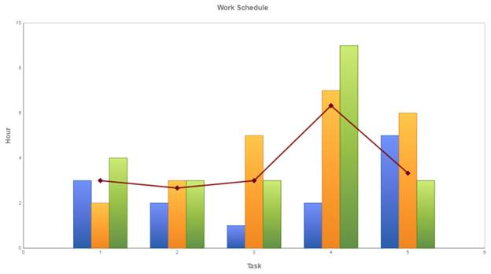

::: {style="DISPLAY: none"}
{#d2h_url_template} {#d2h_package_url style="WIDTH: 0px; DISPLAY: none; HEIGHT: 0px"}
:::

::: {.d2h_secondary_topic style="PADDING-BOTTOM: 10pt; MARGIN: 0pt; PADDING-LEFT: 0pt; PADDING-RIGHT: 0pt; PADDING-TOP: 0pt"}
#### Using Builder {#using-builder style="tab-stops: 0pt"}

[]{style="FONT-FAMILY: 'Calibri','sans-serif'"} 

The steps to create a Combination chart through Builder are as follows:

1.   In Controller, return view to the corresponding View page.

 

 

[]{style="FONT-FAMILY: 'Calibri','sans-serif'"} 

+-------------------------------------------------------------------------------------------------------------------------------------------------------+
| [\[C#\]]{style="FONT-FAMILY: 'Courier New'"}                                                                                                          |
|                                                                                                                                                       |
| [public]{style="FONT-FAMILY: 'Courier New'; COLOR: blue"} [ [ActionResult]{style="COLOR: #2b91af"} SimpleChart()]{style="FONT-FAMILY: 'Courier New'"} |
|                                                                                                                                                       |
| [{ ]{style="FONT-FAMILY: 'Courier New'"}                                                                                                              |
|                                                                                                                                                       |
| [return]{style="FONT-FAMILY: 'Courier New'; COLOR: blue"} [ View();]{style="FONT-FAMILY: 'Courier New'"}                                              |
|                                                                                                                                                       |
| [}]{style="FONT-FAMILY: 'Courier New'"}                                                                                                               |
|                                                                                                                                                       |
| []{style="FONT-FAMILY: 'Courier New'; COLOR: blue"}                                                                                                   |
+-------------------------------------------------------------------------------------------------------------------------------------------------------+

[]{style="FONT-FAMILY: 'Calibri','sans-serif'"} 

2.   In the View page, invoke the ChartBuilder by using the control ID as the first argument.

3.   Add the **Series** to the ChartModel and set the series type to **Line** and **Column**, and add the **Points** to the series and set the style.

4.   Set the ChartModel and ChartArea properties.

[]{style="FONT-FAMILY: 'Calibri','sans-serif'"} 

+---------------------------------------------------------------------------------------------------------------------------------------------------------------------+
| [\[ASPX\]]{style="FONT-FAMILY: 'Courier New'"}                                                                                                                      |
|                                                                                                                                                                     |
| []{style="FONT-FAMILY: Consolas; FONT-SIZE: 9.5pt"}                                                                                                                 |
|                                                                                                                                                                     |
| [    [\<%]{style="BACKGROUND: yellow"}[=]{style="COLOR: blue"} Html.Syncfusion.Chart(\"Chart\")  ]{style="FONT-FAMILY: Consolas; FONT-SIZE: 9.5pt"}                 |
|                                                                                                                                                                     |
| [              .Series(series =\>]{style="FONT-FAMILY: Consolas; FONT-SIZE: 9.5pt"}                                                                                 |
|                                                                                                                                                                     |
| [              {]{style="FONT-FAMILY: Consolas; FONT-SIZE: 9.5pt"}                                                                                                  |
|                                                                                                                                                                     |
| [                  series.Add().Name(\"John\")**.Type(SeriesType.Column).**Points(p =\>]{style="FONT-FAMILY: Consolas; FONT-SIZE: 9.5pt"}                           |
|                                                                                                                                                                     |
| [                  {]{style="FONT-FAMILY: Consolas; FONT-SIZE: 9.5pt"}                                                                                              |
|                                                                                                                                                                     |
| [                      p.Add(1, 3);]{style="FONT-FAMILY: Consolas; FONT-SIZE: 9.5pt"}                                                                               |
|                                                                                                                                                                     |
| [                      p.Add(2, 2);]{style="FONT-FAMILY: Consolas; FONT-SIZE: 9.5pt"}                                                                               |
|                                                                                                                                                                     |
| [                      p.Add(3, 1);]{style="FONT-FAMILY: Consolas; FONT-SIZE: 9.5pt"}                                                                               |
|                                                                                                                                                                     |
| [                      p.Add(4, 2);]{style="FONT-FAMILY: Consolas; FONT-SIZE: 9.5pt"}                                                                               |
|                                                                                                                                                                     |
| [                      p.Add(5, 5);]{style="FONT-FAMILY: Consolas; FONT-SIZE: 9.5pt"}                                                                               |
|                                                                                                                                                                     |
| []{style="FONT-FAMILY: Consolas; FONT-SIZE: 9.5pt"}                                                                                                                 |
|                                                                                                                                                                     |
| [                  });                  ]{style="FONT-FAMILY: Consolas; FONT-SIZE: 9.5pt"}                                                                          |
|                                                                                                                                                                     |
| [                  ]{style="FONT-FAMILY: Consolas; FONT-SIZE: 9.5pt"}                                                                                               |
|                                                                                                                                                                     |
| [                  series.Add().Name(\"Average\")**.Type(SeriesType.Line).**Points(p =\>]{style="FONT-FAMILY: Consolas; FONT-SIZE: 9.5pt"}                          |
|                                                                                                                                                                     |
| [                  {]{style="FONT-FAMILY: Consolas; FONT-SIZE: 9.5pt"}                                                                                              |
|                                                                                                                                                                     |
| [                      p.Add(1, 3); ]{style="FONT-FAMILY: Consolas; FONT-SIZE: 9.5pt"}                                                                              |
|                                                                                                                                                                     |
| [                      p.Add(2, 2.67);]{style="FONT-FAMILY: Consolas; FONT-SIZE: 9.5pt"}                                                                            |
|                                                                                                                                                                     |
| [                      p.Add(3, 3); ]{style="FONT-FAMILY: Consolas; FONT-SIZE: 9.5pt"}                                                                              |
|                                                                                                                                                                     |
| [                      p.Add(4, 6.33);]{style="FONT-FAMILY: Consolas; FONT-SIZE: 9.5pt"}                                                                            |
|                                                                                                                                                                     |
| [                      p.Add(5, 3.33);]{style="FONT-FAMILY: Consolas; FONT-SIZE: 9.5pt"}                                                                            |
|                                                                                                                                                                     |
| []{style="FONT-FAMILY: Consolas; FONT-SIZE: 9.5pt"}                                                                                                                 |
|                                                                                                                                                                     |
| []{style="FONT-FAMILY: Consolas; FONT-SIZE: 9.5pt"}                                                                                                                 |
|                                                                                                                                                                     |
| [                  }).Style(style =\>]{style="FONT-FAMILY: Consolas; FONT-SIZE: 9.5pt"}                                                                             |
|                                                                                                                                                                     |
| [                  {]{style="FONT-FAMILY: Consolas; FONT-SIZE: 9.5pt"}                                                                                              |
|                                                                                                                                                                     |
| [                      style.Border(border =\> border.Width(3)).Opacity(0.8f);]{style="FONT-FAMILY: Consolas; FONT-SIZE: 9.5pt"}                                    |
|                                                                                                                                                                     |
| [                      style.Interior(new Syncfusion.Mvc.ChartAdv.GradientInfo(new ColorInfo(Color.Maroon)));    ]{style="FONT-FAMILY: Consolas; FONT-SIZE: 9.5pt"} |
|                                                                                                                                                                     |
| [                  }).DisplayText(false).Symbol(symbol =\> symbol.Visible(true).Shape(SymbolShape.Diamond));    ]{style="FONT-FAMILY: Consolas; FONT-SIZE: 9.5pt"}  |
|                                                                                                                                                                     |
| [               ]{style="FONT-FAMILY: Consolas; FONT-SIZE: 9.5pt"}                                                                                                  |
|                                                                                                                                                                     |
| [              })]{style="FONT-FAMILY: Consolas; FONT-SIZE: 9.5pt"}                                                                                                 |
|                                                                                                                                                                     |
| [                 ]{style="FONT-FAMILY: Consolas; FONT-SIZE: 9.5pt"}                                                                                                |
|                                                                                                                                                                     |
| [%\>]{style="FONT-FAMILY: Consolas; BACKGROUND: yellow; FONT-SIZE: 9.5pt"}                                                                                          |
|                                                                                                                                                                     |
| []{style="FONT-FAMILY: 'Courier New'; COLOR: blue; FONT-SIZE: 9.5pt"}                                                                                               |
+---------------------------------------------------------------------------------------------------------------------------------------------------------------------+

[]{style="FONT-FAMILY: 'Calibri','sans-serif'"} 

+--------------------------------------------------------------------------------------------------------------------------------------------------------+
| [\[Razor\]]{style="FONT-FAMILY: 'Courier New'"}                                                                                                        |
|                                                                                                                                                        |
| [\@{]{style="FONT-FAMILY: 'Courier New'; BACKGROUND: yellow"} [Html.Syncfusion.ChartAdv(\"ChartAdv\")  ]{style="FONT-FAMILY: 'Courier New'"}           |
|                                                                                                                                                        |
| [              .LegendPosition(DockPosition.Bottom)         ]{style="FONT-FAMILY: 'Courier New'"}                                                      |
|                                                                                                                                                        |
| [              .Series(series =\>]{style="FONT-FAMILY: 'Courier New'"}                                                                                 |
|                                                                                                                                                        |
| [              {]{style="FONT-FAMILY: 'Courier New'"}                                                                                                  |
|                                                                                                                                                        |
| [                  series.Add().Name(\"John**\").Type(SeriesType.Column)**.Points(p =\>]{style="FONT-FAMILY: 'Courier New'"}                           |
|                                                                                                                                                        |
| [                  {]{style="FONT-FAMILY: 'Courier New'"}                                                                                              |
|                                                                                                                                                        |
| [                      p.Add(1, 3);]{style="FONT-FAMILY: 'Courier New'"}                                                                               |
|                                                                                                                                                        |
| [                      p.Add(2, 2);]{style="FONT-FAMILY: 'Courier New'"}                                                                               |
|                                                                                                                                                        |
| [                      p.Add(3, 1);]{style="FONT-FAMILY: 'Courier New'"}                                                                               |
|                                                                                                                                                        |
| [                      p.Add(4, 2);]{style="FONT-FAMILY: 'Courier New'"}                                                                               |
|                                                                                                                                                        |
| [                      p.Add(5, 5);]{style="FONT-FAMILY: 'Courier New'"}                                                                               |
|                                                                                                                                                        |
| []{style="FONT-FAMILY: 'Courier New'"}                                                                                                                 |
|                                                                                                                                                        |
| [                  });                  ]{style="FONT-FAMILY: 'Courier New'"}                                                                          |
|                                                                                                                                                        |
| [                  series.Add().Name(\"Doss**\").Type(SeriesType.Line)**.Points(p =\>]{style="FONT-FAMILY: 'Courier New'"}                             |
|                                                                                                                                                        |
| [                  {]{style="FONT-FAMILY: 'Courier New'"}                                                                                              |
|                                                                                                                                                        |
| [                      p.Add(1, 3); ]{style="FONT-FAMILY: 'Courier New'"}                                                                              |
|                                                                                                                                                        |
| [                      p.Add(2, 2.67);]{style="FONT-FAMILY: 'Courier New'"}                                                                            |
|                                                                                                                                                        |
| [                      p.Add(3, 3); ]{style="FONT-FAMILY: 'Courier New'"}                                                                              |
|                                                                                                                                                        |
| [                      p.Add(4, 6.33);]{style="FONT-FAMILY: 'Courier New'"}                                                                            |
|                                                                                                                                                        |
| [                      p.Add(5, 3.33);]{style="FONT-FAMILY: 'Courier New'"}                                                                            |
|                                                                                                                                                        |
| []{style="FONT-FAMILY: 'Courier New'"}                                                                                                                 |
|                                                                                                                                                        |
| []{style="FONT-FAMILY: 'Courier New'"}                                                                                                                 |
|                                                                                                                                                        |
| [                  }).Style(style =\>]{style="FONT-FAMILY: 'Courier New'"}                                                                             |
|                                                                                                                                                        |
| [                  {]{style="FONT-FAMILY: 'Courier New'"}                                                                                              |
|                                                                                                                                                        |
| [                      style.Border(border =\> border.Width(3)).Opacity(0.8f);]{style="FONT-FAMILY: 'Courier New'"}                                    |
|                                                                                                                                                        |
| [                      style.Interior(new Syncfusion.Mvc.ChartAdv.GradientInfo(new ColorInfo(Color.Maroon)));    ]{style="FONT-FAMILY: 'Courier New'"} |
|                                                                                                                                                        |
| [                  }).DisplayText(false).Symbol(symbol =\> symbol.Visible(true).Shape(SymbolShape.Diamond));    ]{style="FONT-FAMILY: 'Courier New'"}  |
|                                                                                                                                                        |
| [               ]{style="FONT-FAMILY: 'Courier New'"}                                                                                                  |
|                                                                                                                                                        |
| [              }).Render();]{style="FONT-FAMILY: 'Courier New'"}                                                                                       |
|                                                                                                                                                        |
| [}]{style="FONT-FAMILY: 'Courier New'; BACKGROUND: yellow"} []{style="FONT-FAMILY: 'Courier New'"}                                                     |
|                                                                                                                                                        |
| []{style="FONT-FAMILY: 'Courier New'"}                                                                                                                 |
+--------------------------------------------------------------------------------------------------------------------------------------------------------+

[]{style="FONT-FAMILY: 'Calibri','sans-serif'"} 

5.   Build and run the application, to get the following output:

 

[ {border="0"} ]{style="FONT-FAMILY: 'Calibri','sans-serif'"}

Figure 42: Combination Chart[]{style="FONT-FAMILY: 'Calibri','sans-serif'"}

 

[]{#related-topics}
:::
