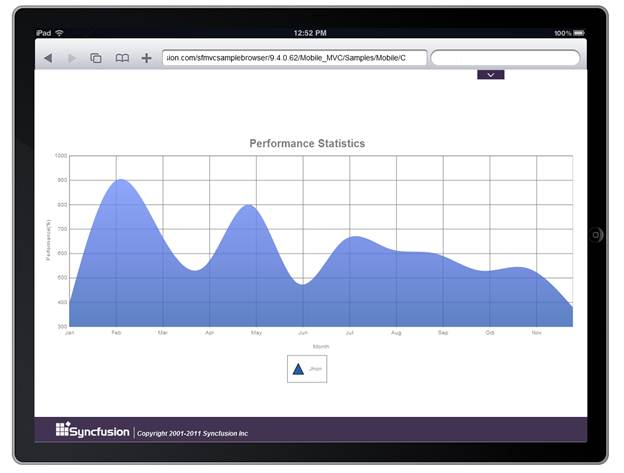

::: {style="DISPLAY: none"}
{#d2h_url_template} {#d2h_package_url style="WIDTH: 0px; DISPLAY: none; HEIGHT: 0px"}
:::

::: {.d2h_secondary_topic style="PADDING-BOTTOM: 10pt; MARGIN: 0pt; PADDING-LEFT: 0pt; PADDING-RIGHT: 0pt; PADDING-TOP: 0pt"}
##### Using Builder {#using-builder style="tab-stops: 0pt"}

[]{style="FONT-FAMILY: 'Calibri','sans-serif'"} 

The steps to create a Spline Area chart through Builder are as follows:

1.   In Controller, return view to the corresponding View page.

[]{style="FONT-FAMILY: 'Calibri','sans-serif'"} 

+-------------------------------------------------------------------------------------------------------------------------------------------------------+
| [\[C#\]]{style="FONT-FAMILY: 'Courier New'"}                                                                                                          |
|                                                                                                                                                       |
| [public]{style="FONT-FAMILY: 'Courier New'; COLOR: blue"} [ [ActionResult]{style="COLOR: #2b91af"} SimpleChart()]{style="FONT-FAMILY: 'Courier New'"} |
|                                                                                                                                                       |
| [{ ]{style="FONT-FAMILY: 'Courier New'"}                                                                                                              |
|                                                                                                                                                       |
| [return]{style="FONT-FAMILY: 'Courier New'; COLOR: blue"} [ View();]{style="FONT-FAMILY: 'Courier New'"}                                              |
|                                                                                                                                                       |
| [}]{style="FONT-FAMILY: 'Courier New'"}                                                                                                               |
|                                                                                                                                                       |
| []{style="FONT-FAMILY: 'Courier New'; COLOR: blue; FONT-SIZE: 9.5pt"}                                                                                 |
+-------------------------------------------------------------------------------------------------------------------------------------------------------+

[]{style="FONT-FAMILY: 'Calibri','sans-serif'"} 

2.   In the View page, invoke the ChartBuilder by using the control ID as the first argument.

3.   Add the **Series** to the ChartModel and set the series type to **SplineArea**, and add the **Points** to the series and set the style.

4.   Set the ChartModel and ChartArea properties.

[]{style="FONT-FAMILY: 'Calibri','sans-serif'"} 

+------------------------------------------------------------------------------------------------------------------------------------------------------------------------------------------------------------------------------------------------------------------------------------------------------------------------+
| [\[ASPX\]]{style="FONT-FAMILY: 'Courier New'"}                                                                                                                                                                                                                                                                         |
|                                                                                                                                                                                                                                                                                                                        |
| [\<%]{style="FONT-FAMILY: Consolas; BACKGROUND: yellow; FONT-SIZE: 9.5pt"} [MinMaxInfo]{style="FONT-FAMILY: Consolas; COLOR: #2b91af; FONT-SIZE: 9.5pt"} [ ass = [new]{style="COLOR: blue"}[MinMaxInfo]{style="COLOR: #2b91af"}(); [%\>]{style="BACKGROUND: yellow"}]{style="FONT-FAMILY: Consolas; FONT-SIZE: 9.5pt"} |
|                                                                                                                                                                                                                                                                                                                        |
| [\<%]{style="FONT-FAMILY: Consolas; BACKGROUND: yellow; FONT-SIZE: 9.5pt"} [ass.Start = [new]{style="COLOR: blue"}[DateTime]{style="COLOR: #2b91af"}(2010,1,1).ToOADate(); [%\>]{style="BACKGROUND: yellow"}]{style="FONT-FAMILY: Consolas; FONT-SIZE: 9.5pt"}                                                         |
|                                                                                                                                                                                                                                                                                                                        |
| [\<%]{style="FONT-FAMILY: Consolas; BACKGROUND: yellow; FONT-SIZE: 9.5pt"} [ass.End = [new]{style="COLOR: blue"}[DateTime]{style="COLOR: #2b91af"}(2010, 12, 1).ToOADate(); [%\>]{style="BACKGROUND: yellow"}]{style="FONT-FAMILY: Consolas; FONT-SIZE: 9.5pt"}                                                        |
|                                                                                                                                                                                                                                                                                                                        |
| [\<%]{style="FONT-FAMILY: Consolas; BACKGROUND: yellow; FONT-SIZE: 9.5pt"} [ass.Interval = 60; [%\>]{style="BACKGROUND: yellow"}]{style="FONT-FAMILY: Consolas; FONT-SIZE: 9.5pt"}                                                                                                                                     |
|                                                                                                                                                                                                                                                                                                                        |
| [   [\<%]{style="BACKGROUND: yellow"}[=]{style="COLOR: blue"} Html.MobSyncfusion().Chart([\"Chart\"]{style="COLOR: #a31515"})]{style="FONT-FAMILY: Consolas; FONT-SIZE: 9.5pt"}                                                                                                                                        |
|                                                                                                                                                                                                                                                                                                                        |
| [                     .LegendPosition([DockPosition]{style="COLOR: #2b91af"}.Bottom).Margin([new]{style="COLOR: blue"}[MarginInfo]{style="COLOR: #2b91af"}() { Left = 0 })]{style="FONT-FAMILY: Consolas; FONT-SIZE: 9.5pt"}                                                                                           |
|                                                                                                                                                                                                                                                                                                                        |
| [              .Series(series =\>]{style="FONT-FAMILY: Consolas; FONT-SIZE: 9.5pt"}                                                                                                                                                                                                                                    |
|                                                                                                                                                                                                                                                                                                                        |
| [              {]{style="FONT-FAMILY: Consolas; FONT-SIZE: 9.5pt"}                                                                                                                                                                                                                                                     |
|                                                                                                                                                                                                                                                                                                                        |
| [                  series.Add().Name([\"Jhon\"]{style="COLOR: #a31515"})**.Type([SeriesType]{style="COLOR: #2b91af"}.SplineArea).**Points(p =\>]{style="FONT-FAMILY: Consolas; FONT-SIZE: 9.5pt"}                                                                                                                      |
|                                                                                                                                                                                                                                                                                                                        |
| [                  {]{style="FONT-FAMILY: Consolas; FONT-SIZE: 9.5pt"}                                                                                                                                                                                                                                                 |
|                                                                                                                                                                                                                                                                                                                        |
| [                      p.Add([new]{style="COLOR: blue"}[DateTime]{style="COLOR: #2b91af"}(2010,1,1), 400);]{style="FONT-FAMILY: Consolas; FONT-SIZE: 9.5pt"}                                                                                                                                                           |
|                                                                                                                                                                                                                                                                                                                        |
| [                      p.Add([new]{style="COLOR: blue"}[DateTime]{style="COLOR: #2b91af"}(2010, 2, 1), 900);]{style="FONT-FAMILY: Consolas; FONT-SIZE: 9.5pt"}                                                                                                                                                         |
|                                                                                                                                                                                                                                                                                                                        |
| [                      p.Add([new]{style="COLOR: blue"}[DateTime]{style="COLOR: #2b91af"}(2010, 3, 1), 700);]{style="FONT-FAMILY: Consolas; FONT-SIZE: 9.5pt"}                                                                                                                                                         |
|                                                                                                                                                                                                                                                                                                                        |
| [                      p.Add([new]{style="COLOR: blue"}[DateTime]{style="COLOR: #2b91af"}(2010, 4, 1), 550);]{style="FONT-FAMILY: Consolas; FONT-SIZE: 9.5pt"}                                                                                                                                                         |
|                                                                                                                                                                                                                                                                                                                        |
| [                      p.Add([new]{style="COLOR: blue"}[DateTime]{style="COLOR: #2b91af"}(2010, 5, 1), 800);]{style="FONT-FAMILY: Consolas; FONT-SIZE: 9.5pt"}                                                                                                                                                         |
|                                                                                                                                                                                                                                                                                                                        |
| [                      p.Add([new]{style="COLOR: blue"}[DateTime]{style="COLOR: #2b91af"}(2010, 6, 1), 480);]{style="FONT-FAMILY: Consolas; FONT-SIZE: 9.5pt"}                                                                                                                                                         |
|                                                                                                                                                                                                                                                                                                                        |
| [                      p.Add([new]{style="COLOR: blue"}[DateTime]{style="COLOR: #2b91af"}(2010, 7, 1), 650);]{style="FONT-FAMILY: Consolas; FONT-SIZE: 9.5pt"}                                                                                                                                                         |
|                                                                                                                                                                                                                                                                                                                        |
| [                      p.Add([new]{style="COLOR: blue"}[DateTime]{style="COLOR: #2b91af"}(2010, 8, 1), 620);]{style="FONT-FAMILY: Consolas; FONT-SIZE: 9.5pt"}                                                                                                                                                         |
|                                                                                                                                                                                                                                                                                                                        |
| [                      p.Add([new]{style="COLOR: blue"}[DateTime]{style="COLOR: #2b91af"}(2010, 9, 1), 600);]{style="FONT-FAMILY: Consolas; FONT-SIZE: 9.5pt"}                                                                                                                                                         |
|                                                                                                                                                                                                                                                                                                                        |
| [                      p.Add([new]{style="COLOR: blue"}[DateTime]{style="COLOR: #2b91af"}(2010, 10, 1), 530);]{style="FONT-FAMILY: Consolas; FONT-SIZE: 9.5pt"}                                                                                                                                                        |
|                                                                                                                                                                                                                                                                                                                        |
| [                      p.Add([new]{style="COLOR: blue"}[DateTime]{style="COLOR: #2b91af"}(2010, 11, 1), 540);]{style="FONT-FAMILY: Consolas; FONT-SIZE: 9.5pt"}                                                                                                                                                        |
|                                                                                                                                                                                                                                                                                                                        |
| [                      p.Add([new]{style="COLOR: blue"}[DateTime]{style="COLOR: #2b91af"}(2010, 12, 1), 380);]{style="FONT-FAMILY: Consolas; FONT-SIZE: 9.5pt"}                                                                                                                                                        |
|                                                                                                                                                                                                                                                                                                                        |
| []{style="FONT-FAMILY: Consolas; FONT-SIZE: 9.5pt"}                                                                                                                                                                                                                                                                    |
|                                                                                                                                                                                                                                                                                                                        |
| [                  }).Style(style =\>]{style="FONT-FAMILY: Consolas; FONT-SIZE: 9.5pt"}                                                                                                                                                                                                                                |
|                                                                                                                                                                                                                                                                                                                        |
| [                  {]{style="FONT-FAMILY: Consolas; FONT-SIZE: 9.5pt"}                                                                                                                                                                                                                                                 |
|                                                                                                                                                                                                                                                                                                                        |
| [                      style.Border(border =\> border.Width(3)).Opacity(0.8f);]{style="FONT-FAMILY: Consolas; FONT-SIZE: 9.5pt"}                                                                                                                                                                                       |
|                                                                                                                                                                                                                                                                                                                        |
| [                  });]{style="FONT-FAMILY: Consolas; FONT-SIZE: 9.5pt"}                                                                                                                                                                                                                                               |
|                                                                                                                                                                                                                                                                                                                        |
| [               ]{style="FONT-FAMILY: Consolas; FONT-SIZE: 9.5pt"}                                                                                                                                                                                                                                                     |
|                                                                                                                                                                                                                                                                                                                        |
| [              })]{style="FONT-FAMILY: Consolas; FONT-SIZE: 9.5pt"}                                                                                                                                                                                                                                                    |
|                                                                                                                                                                                                                                                                                                                        |
| [    [%\>]{style="BACKGROUND: yellow"}]{style="FONT-FAMILY: Consolas; FONT-SIZE: 9.5pt"}                                                                                                                                                                                                                               |
|                                                                                                                                                                                                                                                                                                                        |
| []{style="FONT-FAMILY: Consolas; FONT-SIZE: 9.5pt"}                                                                                                                                                                                                                                                                    |
|                                                                                                                                                                                                                                                                                                                        |
| []{style="FONT-FAMILY: 'Courier New'; COLOR: blue; FONT-SIZE: 9.5pt"}                                                                                                                                                                                                                                                  |
+------------------------------------------------------------------------------------------------------------------------------------------------------------------------------------------------------------------------------------------------------------------------------------------------------------------------+

[  ]{style="FONT-FAMILY: 'Calibri','sans-serif'"}

[]{style="FONT-FAMILY: 'Calibri','sans-serif'"} 

+-----------------------------------------------------------------------------------------------------------------------------------------------------------------------------+
| [\[Razor\]]{style="FONT-FAMILY: 'Courier New'"}                                                                                                                             |
|                                                                                                                                                                             |
| [        [\@{]{style="BACKGROUND: yellow"}MinMaxInfo ass = new MinMaxInfo(); [}]{style="BACKGROUND: yellow"}]{style="FONT-FAMILY: Consolas; FONT-SIZE: 9.5pt"}              |
|                                                                                                                                                                             |
| [        [\@{]{style="BACKGROUND: yellow"}ass.Start = new DateTime(2010, 1, 1).ToOADate();[}]{style="BACKGROUND: yellow"}]{style="FONT-FAMILY: Consolas; FONT-SIZE: 9.5pt"} |
|                                                                                                                                                                             |
| [        [\@{]{style="BACKGROUND: yellow"}ass.End = new DateTime(2010, 12, 1).ToOADate();[}]{style="BACKGROUND: yellow"}]{style="FONT-FAMILY: Consolas; FONT-SIZE: 9.5pt"}  |
|                                                                                                                                                                             |
| [        [\@{]{style="BACKGROUND: yellow"}ass.Interval = 31;[}]{style="BACKGROUND: yellow"}]{style="FONT-FAMILY: Consolas; FONT-SIZE: 9.5pt"}                               |
|                                                                                                                                                                             |
| [        [\@{]{style="BACKGROUND: yellow"}Html.MobSyncfusion().Chart(\"ChartAdv\")]{style="FONT-FAMILY: Consolas; FONT-SIZE: 9.5pt"}                                        |
|                                                                                                                                                                             |
| [              .Series(series =\>]{style="FONT-FAMILY: Consolas; FONT-SIZE: 9.5pt"}                                                                                         |
|                                                                                                                                                                             |
| [              {]{style="FONT-FAMILY: Consolas; FONT-SIZE: 9.5pt"}                                                                                                          |
|                                                                                                                                                                             |
| [                  series.Add().Name(\"Newyork\")**.Type(SeriesType.SplineArea).**Points(p =\>]{style="FONT-FAMILY: Consolas; FONT-SIZE: 9.5pt"}                            |
|                                                                                                                                                                             |
| [                  {]{style="FONT-FAMILY: Consolas; FONT-SIZE: 9.5pt"}                                                                                                      |
|                                                                                                                                                                             |
| [                      p.Add(new DateTime(2010, 1, 1), 400);]{style="FONT-FAMILY: Consolas; FONT-SIZE: 9.5pt"}                                                              |
|                                                                                                                                                                             |
| [                      p.Add(new DateTime(2010, 2, 1), 900);]{style="FONT-FAMILY: Consolas; FONT-SIZE: 9.5pt"}                                                              |
|                                                                                                                                                                             |
| [                      p.Add(new DateTime(2010, 3, 1), 700);]{style="FONT-FAMILY: Consolas; FONT-SIZE: 9.5pt"}                                                              |
|                                                                                                                                                                             |
| [                      p.Add(new DateTime(2010, 4, 1), 550);]{style="FONT-FAMILY: Consolas; FONT-SIZE: 9.5pt"}                                                              |
|                                                                                                                                                                             |
| [                      p.Add(new DateTime(2010, 5, 1), 800);]{style="FONT-FAMILY: Consolas; FONT-SIZE: 9.5pt"}                                                              |
|                                                                                                                                                                             |
| [                      p.Add(new DateTime(2010, 6, 1), 480);]{style="FONT-FAMILY: Consolas; FONT-SIZE: 9.5pt"}                                                              |
|                                                                                                                                                                             |
| [                      p.Add(new DateTime(2010, 7, 1), 650);]{style="FONT-FAMILY: Consolas; FONT-SIZE: 9.5pt"}                                                              |
|                                                                                                                                                                             |
| [                      p.Add(new DateTime(2010, 8, 1), 620);]{style="FONT-FAMILY: Consolas; FONT-SIZE: 9.5pt"}                                                              |
|                                                                                                                                                                             |
| [                      p.Add(new DateTime(2010, 9, 1), 600);]{style="FONT-FAMILY: Consolas; FONT-SIZE: 9.5pt"}                                                              |
|                                                                                                                                                                             |
| [                      p.Add(new DateTime(2010, 10, 1), 530);]{style="FONT-FAMILY: Consolas; FONT-SIZE: 9.5pt"}                                                             |
|                                                                                                                                                                             |
| [                      p.Add(new DateTime(2010, 11, 1), 540);]{style="FONT-FAMILY: Consolas; FONT-SIZE: 9.5pt"}                                                             |
|                                                                                                                                                                             |
| [                      p.Add(new DateTime(2010, 12, 1), 380);]{style="FONT-FAMILY: Consolas; FONT-SIZE: 9.5pt"}                                                             |
|                                                                                                                                                                             |
| []{style="FONT-FAMILY: Consolas; FONT-SIZE: 9.5pt"}                                                                                                                         |
|                                                                                                                                                                             |
| [                  }).Style(style =\>]{style="FONT-FAMILY: Consolas; FONT-SIZE: 9.5pt"}                                                                                     |
|                                                                                                                                                                             |
| [                  {]{style="FONT-FAMILY: Consolas; FONT-SIZE: 9.5pt"}                                                                                                      |
|                                                                                                                                                                             |
| [                      style.Border(border =\> border.Width(3)).Opacity(0.8f);]{style="FONT-FAMILY: Consolas; FONT-SIZE: 9.5pt"}                                            |
|                                                                                                                                                                             |
| [                  });]{style="FONT-FAMILY: Consolas; FONT-SIZE: 9.5pt"}                                                                                                    |
|                                                                                                                                                                             |
| []{style="FONT-FAMILY: Consolas; FONT-SIZE: 9.5pt"}                                                                                                                         |
|                                                                                                                                                                             |
| [              }).Render();]{style="FONT-FAMILY: Consolas; FONT-SIZE: 9.5pt"}                                                                                               |
|                                                                                                                                                                             |
| [        [}]{style="BACKGROUND: yellow"}]{style="FONT-FAMILY: Consolas; FONT-SIZE: 9.5pt"}                                                                                  |
|                                                                                                                                                                             |
| []{style="FONT-FAMILY: 'Courier New'"}                                                                                                                                      |
|                                                                                                                                                                             |
|                                                                                                                                                                             |
+-----------------------------------------------------------------------------------------------------------------------------------------------------------------------------+

[]{style="FONT-FAMILY: Consolas; BACKGROUND: yellow; FONT-SIZE: 9.5pt"} 

5.   Build and run the application, to get the following output:

[]{style="FONT-FAMILY: 'Calibri','sans-serif'"} 

{border="0"}

Figure 39: Spline area chart

[]{#related-topics}
:::
