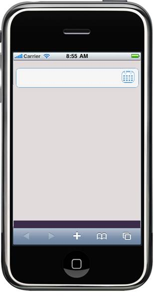

::: {style="DISPLAY: none"}
{#d2h_url_template} {#d2h_package_url style="WIDTH: 0px; DISPLAY: none; HEIGHT: 0px"}
:::

::: {.d2h_secondary_topic style="PADDING-BOTTOM: 10pt; MARGIN: 0pt; PADDING-LEFT: 0pt; PADDING-RIGHT: 0pt; PADDING-TOP: 0pt"}
#### Using Builder {#using-builder style="tab-stops: 0pt"}

[The following steps explain the addition of a date picker to an application using Builder.]{style="FONT-FAMILY: 'Arial','sans-serif'; FONT-SIZE: 10pt"}

1.  [In the **view**, invoke the **DatePicker** helper with the control ID as the first argument.]{style="FONT-FAMILY: 'Arial','sans-serif'"}

+-------------------------------------------------------------------------------------------------------------------------------------------------------------------------------------------------------------------+
| **[View \[ASPX\]]{style="FONT-FAMILY: 'Courier New'"}**                                                                                                                                                           |
|                                                                                                                                                                                                                   |
| [\<%]{style="FONT-FAMILY: 'Courier New'; BACKGROUND: yellow"} [{=Html.MobSyncfusion().DatePicker([\"DatePicker\"]{style="COLOR: #a31515"})}[%\>]{style="BACKGROUND: yellow"}]{style="FONT-FAMILY: 'Courier New'"} |
|                                                                                                                                                                                                                   |
| []{style="FONT-FAMILY: 'Courier New'; BACKGROUND: yellow"}                                                                                                                                                        |
|                                                                                                                                                                                                                   |
| [Style Manager:]{style="FONT-FAMILY: 'Courier New'; BACKGROUND: yellow"}                                                                                                                                          |
|                                                                                                                                                                                                                   |
| [\<%]{style="FONT-FAMILY: 'Courier New'; BACKGROUND: yellow"} [{]{style="FONT-FAMILY: 'Courier New'"}                                                                                                             |
|                                                                                                                                                                                                                   |
| [     Html.MobSyncfusion().StyleManager()]{style="FONT-FAMILY: 'Courier New'"}                                                                                                                                    |
|                                                                                                                                                                                                                   |
| [          .Register(stylesheets =\>]{style="FONT-FAMILY: 'Courier New'"}                                                                                                                                         |
|                                                                                                                                                                                                                   |
| [                  {]{style="FONT-FAMILY: 'Courier New'"}                                                                                                                                                         |
|                                                                                                                                                                                                                   |
| [                      stylesheets.Add([MobComponentType]{style="COLOR: #2b91af"}.DatePicker)]{style="FONT-FAMILY: 'Courier New'"}                                                                                |
|                                                                                                                                                                                                                   |
| [                                 .Theme([MobSkins]{style="COLOR: #2b91af"}.DarkNight);]{style="FONT-FAMILY: 'Courier New'"}                                                                                      |
|                                                                                                                                                                                                                   |
| [                  }).Render();]{style="FONT-FAMILY: 'Courier New'"}                                                                                                                                              |
|                                                                                                                                                                                                                   |
| [}[%\>]{style="BACKGROUND: yellow"}]{style="FONT-FAMILY: 'Courier New'"}                                                                                                                                          |
|                                                                                                                                                                                                                   |
| []{style="FONT-FAMILY: 'Courier New'"}                                                                                                                                                                            |
+-------------------------------------------------------------------------------------------------------------------------------------------------------------------------------------------------------------------+

[]{style="FONT-FAMILY: 'Calibri','sans-serif'; FONT-SIZE: 11pt"} 

+------------------------------------------------------------------------------------------------------------------------------------------------------------------------------------------------------------------------+
| **[View \[Razor\]]{style="FONT-FAMILY: 'Courier New'"}**                                                                                                                                                               |
|                                                                                                                                                                                                                        |
| [@]{style="FONT-FAMILY: 'Courier New'; BACKGROUND: yellow"} [{ Html.MobSyncfusion().DatePicker([\"DatePicker\"]{style="COLOR: #a31515"}).Render();[}]{style="BACKGROUND: yellow"}]{style="FONT-FAMILY: 'Courier New'"} |
|                                                                                                                                                                                                                        |
| []{style="FONT-FAMILY: 'Courier New'"}                                                                                                                                                                                 |
|                                                                                                                                                                                                                        |
| [Style Manager:]{style="FONT-FAMILY: 'Courier New'; BACKGROUND: yellow"}                                                                                                                                               |
|                                                                                                                                                                                                                        |
| [\@{]{style="FONT-FAMILY: 'Courier New'; BACKGROUND: yellow"} []{style="FONT-FAMILY: 'Courier New'"}                                                                                                                   |
|                                                                                                                                                                                                                        |
| [     Html.MobSyncfusion().StyleManager()]{style="FONT-FAMILY: 'Courier New'"}                                                                                                                                         |
|                                                                                                                                                                                                                        |
| [          .Register(stylesheets =\>]{style="FONT-FAMILY: 'Courier New'"}                                                                                                                                              |
|                                                                                                                                                                                                                        |
| [                  {]{style="FONT-FAMILY: 'Courier New'"}                                                                                                                                                              |
|                                                                                                                                                                                                                        |
| [                      stylesheets.Add([MobComponentType]{style="COLOR: #2b91af"}.DatePicker)]{style="FONT-FAMILY: 'Courier New'"}                                                                                     |
|                                                                                                                                                                                                                        |
| [                                 .Theme([MobSkins]{style="COLOR: #2b91af"}.DarkNight);]{style="FONT-FAMILY: 'Courier New'"}                                                                                           |
|                                                                                                                                                                                                                        |
| [                  }).Render();]{style="FONT-FAMILY: 'Courier New'"}                                                                                                                                                   |
|                                                                                                                                                                                                                        |
| [}]{style="FONT-FAMILY: 'Courier New'; BACKGROUND: yellow"}                                                                                                                                                            |
+------------------------------------------------------------------------------------------------------------------------------------------------------------------------------------------------------------------------+

[]{style="FONT-FAMILY: 'Calibri','sans-serif'"} 

2.  [Build and run the application. The output is shown in the following screenshot.]{style="FONT-FAMILY: 'Arial','sans-serif'"}

[]{style="FONT-FAMILY: 'Arial','sans-serif'"} 

{border="0"} []{style="FONT-FAMILY: 'Calibri','sans-serif'"}

Figure 176: DatePicker Input

[]{style="FONT-FAMILY: 'Calibri','sans-serif'"} 

[]{#related-topics}
:::
