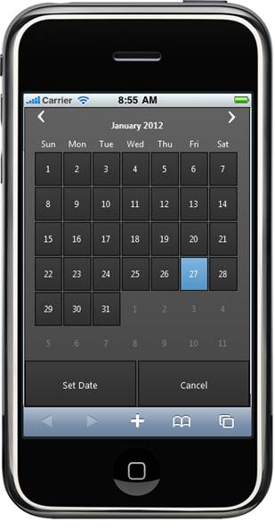
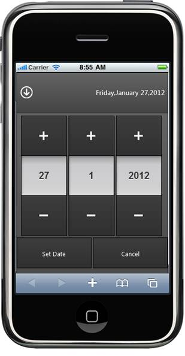

::: {style="DISPLAY: none"}
{#d2h_url_template} {#d2h_package_url style="WIDTH: 0px; DISPLAY: none; HEIGHT: 0px"}
:::

::: {.d2h_secondary_topic style="PADDING-BOTTOM: 10pt; MARGIN: 0pt; PADDING-LEFT: 0pt; PADDING-RIGHT: 0pt; PADDING-TOP: 0pt"}
##### Using Builder {#using-builder style="tab-stops: 0pt"}

The following steps enable three different date picker modes using Builder.

 

1.  [In the **view**, invoke the **DatePicker** helper with the control ID as the first argument followed by the **Mode** with the desired mode as an argument.]{style="FONT-FAMILY: 'Arial','sans-serif'"}

a.  [Simple Mode]{style="FONT-FAMILY: 'Arial','sans-serif'"}

+--------------------------------------------------------------------------------------------------------------------------------------------------------------------------------+
| **[View \[ASPX\]]{style="FONT-FAMILY: 'Courier New'"}**                                                                                                                        |
|                                                                                                                                                                                |
| [\<%]{style="FONT-FAMILY: 'Courier New'; BACKGROUND: yellow"} [{Html.MobSyncfusion().DatePicker([\"DatePicker\"]{style="COLOR: #a31515"})]{style="FONT-FAMILY: 'Courier New'"} |
|                                                                                                                                                                                |
| [                  \-\-\-\-\--]{style="FONT-FAMILY: 'Courier New'"}                                                                                                            |
|                                                                                                                                                                                |
| [                  .Mode([Mode]{style="COLOR: #2b91af"}.Simple)]{style="FONT-FAMILY: 'Courier New'"}                                                                           |
|                                                                                                                                                                                |
| [                  \-\-\-\-\--]{style="FONT-FAMILY: 'Courier New'"}                                                                                                            |
|                                                                                                                                                                                |
| [                  .Render();]{style="FONT-FAMILY: 'Courier New'"}                                                                                                             |
|                                                                                                                                                                                |
| [}[%\>]{style="BACKGROUND: yellow"}]{style="FONT-FAMILY: 'Courier New'"}                                                                                                       |
|                                                                                                                                                                                |
| []{style="FONT-FAMILY: 'Courier New'"}                                                                                                                                         |
+--------------------------------------------------------------------------------------------------------------------------------------------------------------------------------+

[]{style="FONT-FAMILY: 'Calibri','sans-serif'; FONT-SIZE: 11pt"} 

+------------------------------------------------------------------------------------------------------------------------------------------------------------------------------+
| **[View \[Razor\]]{style="FONT-FAMILY: 'Courier New'"}**                                                                                                                     |
|                                                                                                                                                                              |
| [@]{style="FONT-FAMILY: 'Courier New'; BACKGROUND: yellow"} [{Html.MobSyncfusion().DatePicker([\"DatePicker\"]{style="COLOR: #a31515"})]{style="FONT-FAMILY: 'Courier New'"} |
|                                                                                                                                                                              |
| [                  \-\-\-\-\--]{style="FONT-FAMILY: 'Courier New'"}                                                                                                          |
|                                                                                                                                                                              |
| [                  .Mode([Mode]{style="COLOR: #2b91af"}.Simple)]{style="FONT-FAMILY: 'Courier New'"}                                                                         |
|                                                                                                                                                                              |
| [                  \-\-\-\-\--]{style="FONT-FAMILY: 'Courier New'"}                                                                                                          |
|                                                                                                                                                                              |
| [                  .Render();]{style="FONT-FAMILY: 'Courier New'"}                                                                                                           |
|                                                                                                                                                                              |
| [}]{style="FONT-FAMILY: 'Courier New'; BACKGROUND: yellow"} []{style="FONT-FAMILY: 'Courier New'"}                                                                           |
|                                                                                                                                                                              |
| []{style="FONT-FAMILY: 'Courier New'"}                                                                                                                                       |
+------------------------------------------------------------------------------------------------------------------------------------------------------------------------------+

[]{style="FONT-FAMILY: 'Calibri','sans-serif'; FONT-SIZE: 11pt"} 

b.  [Android Mode]{style="FONT-FAMILY: 'Arial','sans-serif'"}

+--------------------------------------------------------------------------------------------------------------------------------------------------------------------------------+
| **[View \[ASPX\]]{style="FONT-FAMILY: 'Courier New'"}**                                                                                                                        |
|                                                                                                                                                                                |
| [\<%]{style="FONT-FAMILY: 'Courier New'; BACKGROUND: yellow"} [{Html.MobSyncfusion().DatePicker([\"DatePicker\"]{style="COLOR: #a31515"})]{style="FONT-FAMILY: 'Courier New'"} |
|                                                                                                                                                                                |
| [                  \-\-\-\-\--]{style="FONT-FAMILY: 'Courier New'"}                                                                                                            |
|                                                                                                                                                                                |
| [                  .Mode([Mode]{style="COLOR: #2b91af"}.Android)]{style="FONT-FAMILY: 'Courier New'"}                                                                          |
|                                                                                                                                                                                |
| [                  \-\-\-\-\--]{style="FONT-FAMILY: 'Courier New'"}                                                                                                            |
|                                                                                                                                                                                |
| [                  .Render();]{style="FONT-FAMILY: 'Courier New'"}                                                                                                             |
|                                                                                                                                                                                |
| [}[%\>]{style="BACKGROUND: yellow"}]{style="FONT-FAMILY: 'Courier New'"}                                                                                                       |
|                                                                                                                                                                                |
| []{style="FONT-FAMILY: 'Courier New'"}                                                                                                                                         |
+--------------------------------------------------------------------------------------------------------------------------------------------------------------------------------+

[]{style="FONT-FAMILY: 'Calibri','sans-serif'; FONT-SIZE: 11pt"} 

[]{style="FONT-FAMILY: 'Calibri','sans-serif'; FONT-SIZE: 11pt"} 

+------------------------------------------------------------------------------------------------------------------------------------------------------------------------------+
| **[View \[Razor\]]{style="FONT-FAMILY: 'Courier New'"}**                                                                                                                     |
|                                                                                                                                                                              |
| [@]{style="FONT-FAMILY: 'Courier New'; BACKGROUND: yellow"} [{Html.MobSyncfusion().DatePicker([\"DatePicker\"]{style="COLOR: #a31515"})]{style="FONT-FAMILY: 'Courier New'"} |
|                                                                                                                                                                              |
| [                  \-\-\-\-\--]{style="FONT-FAMILY: 'Courier New'"}                                                                                                          |
|                                                                                                                                                                              |
| [                  .Mode([Mode]{style="COLOR: #2b91af"}.Android)]{style="FONT-FAMILY: 'Courier New'"}                                                                        |
|                                                                                                                                                                              |
| [                  \-\-\-\-\--]{style="FONT-FAMILY: 'Courier New'"}                                                                                                          |
|                                                                                                                                                                              |
| [                  .Render();]{style="FONT-FAMILY: 'Courier New'"}                                                                                                           |
|                                                                                                                                                                              |
| [}]{style="FONT-FAMILY: 'Courier New'; BACKGROUND: yellow"} []{style="FONT-FAMILY: 'Courier New'"}                                                                           |
|                                                                                                                                                                              |
| []{style="FONT-FAMILY: 'Courier New'"}                                                                                                                                       |
+------------------------------------------------------------------------------------------------------------------------------------------------------------------------------+

[]{style="FONT-FAMILY: 'Calibri','sans-serif'; FONT-SIZE: 11pt"} 

c.  [Advanced Mode: In this mode, we can able to switch between both simple and android modes by simple touching the calendar header.]{style="FONT-FAMILY: 'Arial','sans-serif'"}

+--------------------------------------------------------------------------------------------------------------------------------------------------------------------------------+
| **[View \[ASPX\]]{style="FONT-FAMILY: 'Courier New'"}**                                                                                                                        |
|                                                                                                                                                                                |
| [\<%]{style="FONT-FAMILY: 'Courier New'; BACKGROUND: yellow"} [{Html.MobSyncfusion().DatePicker([\"DatePicker\"]{style="COLOR: #a31515"})]{style="FONT-FAMILY: 'Courier New'"} |
|                                                                                                                                                                                |
| [                  \-\-\-\-\--]{style="FONT-FAMILY: 'Courier New'"}                                                                                                            |
|                                                                                                                                                                                |
| [                  .Mode([Mode]{style="COLOR: #2b91af"}.Advanced)]{style="FONT-FAMILY: 'Courier New'"}                                                                         |
|                                                                                                                                                                                |
| [                  \-\-\-\-\--]{style="FONT-FAMILY: 'Courier New'"}                                                                                                            |
|                                                                                                                                                                                |
| [                  .Render();]{style="FONT-FAMILY: 'Courier New'"}                                                                                                             |
|                                                                                                                                                                                |
| [}[%\>]{style="BACKGROUND: yellow"}]{style="FONT-FAMILY: 'Courier New'"}                                                                                                       |
|                                                                                                                                                                                |
| []{style="FONT-FAMILY: 'Courier New'"}                                                                                                                                         |
+--------------------------------------------------------------------------------------------------------------------------------------------------------------------------------+

[]{style="FONT-FAMILY: 'Calibri','sans-serif'"} 

+------------------------------------------------------------------------------------------------------------------------------------------------------------------------------+
| **[View \[Razor\]]{style="FONT-FAMILY: 'Courier New'"}**                                                                                                                     |
|                                                                                                                                                                              |
| [@]{style="FONT-FAMILY: 'Courier New'; BACKGROUND: yellow"} [{Html.MobSyncfusion().DatePicker([\"DatePicker\"]{style="COLOR: #a31515"})]{style="FONT-FAMILY: 'Courier New'"} |
|                                                                                                                                                                              |
| [                  \-\-\-\-\--]{style="FONT-FAMILY: 'Courier New'"}                                                                                                          |
|                                                                                                                                                                              |
| [                  .Mode([Mode]{style="COLOR: #2b91af"}.Advanced)]{style="FONT-FAMILY: 'Courier New'"}                                                                       |
|                                                                                                                                                                              |
| [                  \-\-\-\-\--]{style="FONT-FAMILY: 'Courier New'"}                                                                                                          |
|                                                                                                                                                                              |
| [                  .Render();]{style="FONT-FAMILY: 'Courier New'"}                                                                                                           |
|                                                                                                                                                                              |
| [}]{style="FONT-FAMILY: 'Courier New'; BACKGROUND: yellow"} []{style="FONT-FAMILY: 'Courier New'"}                                                                           |
|                                                                                                                                                                              |
| []{style="FONT-FAMILY: 'Courier New'"}                                                                                                                                       |
+------------------------------------------------------------------------------------------------------------------------------------------------------------------------------+

[]{style="FONT-FAMILY: 'Calibri','sans-serif'"} 

2.  [Build and run the application in an emulator. The output will be as follows:]{style="FONT-FAMILY: 'Arial','sans-serif'"}

{border="0"} []{style="FONT-FAMILY: 'Calibri','sans-serif'; FONT-SIZE: 11pt"}

Figure 182: Calendar in Simple Mode

{border="0"} []{style="FONT-FAMILY: 'Calibri','sans-serif'; FONT-SIZE: 11pt"}

Figure 183: Calendar in Android Mode

[]{#related-topics}
:::
