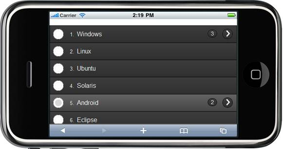

::: {style="DISPLAY: none"}
{#d2h_url_template} {#d2h_package_url style="WIDTH: 0px; DISPLAY: none; HEIGHT: 0px"}
:::

::: {.d2h_secondary_topic style="PADDING-BOTTOM: 10pt; MARGIN: 0pt; PADDING-LEFT: 0pt; PADDING-RIGHT: 0pt; PADDING-TOP: 0pt"}
##### Using Builder {#using-builder style="tab-stops: 0pt"}

The following steps explain how you can use the above property to display the child count:

1.   In **View**, invoke the Listbox Helper with the control ID as the first argument followed by the **ShowChildCount()** with the desired value as an argument.

[]{style="FONT-FAMILY: 'Calibri','sans-serif'"} 

+-------------------------------------------------------------------------------------------------------------------------------------------------------------------------------------------------------------------------------------------------------------------------+
| **[\[ASPX\]]{style="FONT-FAMILY: 'Courier New'"}**                                                                                                                                                                                                                      |
|                                                                                                                                                                                                                                                                         |
| **[]{style="FONT-FAMILY: 'Courier New'"}**                                                                                                                                                                                                                              |
|                                                                                                                                                                                                                                                                         |
| [    ]{style="FONT-FAMILY: 'Courier New'"} [\<%]{style="FONT-FAMILY: 'Courier New'; BACKGROUND: yellow"} [=]{style="FONT-FAMILY: 'Courier New'; COLOR: blue"} [ Html.MobSyncfusion().ListBox([\"lbCore\"]{style="COLOR: #a31515"})]{style="FONT-FAMILY: 'Courier New'"} |
|                                                                                                                                                                                                                                                                         |
| [            .ListStyle([ListStyle]{style="COLOR: #2b91af"}.Numbered)]{style="FONT-FAMILY: 'Courier New'"}                                                                                                                                                              |
|                                                                                                                                                                                                                                                                         |
| [            .ListItemStyle([ListItemStyle]{style="COLOR: #2b91af"}.Option)]{style="FONT-FAMILY: 'Courier New'"}                                                                                                                                                        |
|                                                                                                                                                                                                                                                                         |
| [           .Items(items =\>]{style="FONT-FAMILY: 'Courier New'"}                                                                                                                                                                                                       |
|                                                                                                                                                                                                                                                                         |
| [           {]{style="FONT-FAMILY: 'Courier New'"}                                                                                                                                                                                                                      |
|                                                                                                                                                                                                                                                                         |
| [               items.Add()]{style="FONT-FAMILY: 'Courier New'"}                                                                                                                                                                                                        |
|                                                                                                                                                                                                                                                                         |
| [                   .Text([\"Windows\"]{style="COLOR: #a31515"})]{style="FONT-FAMILY: 'Courier New'"}                                                                                                                                                                   |
|                                                                                                                                                                                                                                                                         |
| **[                    .ShowChildCount([true]{style="COLOR: blue"})]{style="FONT-FAMILY: 'Courier New'"}**                                                                                                                                                              |
|                                                                                                                                                                                                                                                                         |
| [                   .Children(child=\>]{style="FONT-FAMILY: 'Courier New'"}                                                                                                                                                                                             |
|                                                                                                                                                                                                                                                                         |
| [                       {]{style="FONT-FAMILY: 'Courier New'"}                                                                                                                                                                                                          |
|                                                                                                                                                                                                                                                                         |
| [                           child.Add().Text([\"Windows XP\"]{style="COLOR: #a31515"});]{style="FONT-FAMILY: 'Courier New'"}                                                                                                                                            |
|                                                                                                                                                                                                                                                                         |
| [                           child.Add().Text([\"Windows Vista\"]{style="COLOR: #a31515"});]{style="FONT-FAMILY: 'Courier New'"}                                                                                                                                         |
|                                                                                                                                                                                                                                                                         |
| [                           child.Add().Text([\"Windows 7\"]{style="COLOR: #a31515"});]{style="FONT-FAMILY: 'Courier New'"}                                                                                                                                             |
|                                                                                                                                                                                                                                                                         |
| [                       });]{style="FONT-FAMILY: 'Courier New'"}                                                                                                                                                                                                        |
|                                                                                                                                                                                                                                                                         |
| [               items.Add()]{style="FONT-FAMILY: 'Courier New'"}                                                                                                                                                                                                        |
|                                                                                                                                                                                                                                                                         |
| [                   .Text([\"Linux\"]{style="COLOR: #a31515"});]{style="FONT-FAMILY: 'Courier New'"}                                                                                                                                                                    |
|                                                                                                                                                                                                                                                                         |
| [               items.Add()]{style="FONT-FAMILY: 'Courier New'"}                                                                                                                                                                                                        |
|                                                                                                                                                                                                                                                                         |
| [                   .Text([\"Ubuntu\"]{style="COLOR: #a31515"});]{style="FONT-FAMILY: 'Courier New'"}                                                                                                                                                                   |
|                                                                                                                                                                                                                                                                         |
| [               items.Add()]{style="FONT-FAMILY: 'Courier New'"}                                                                                                                                                                                                        |
|                                                                                                                                                                                                                                                                         |
| [                   .Text([\"Solaris\"]{style="COLOR: #a31515"});]{style="FONT-FAMILY: 'Courier New'"}                                                                                                                                                                  |
|                                                                                                                                                                                                                                                                         |
| [               items.Add()]{style="FONT-FAMILY: 'Courier New'"}                                                                                                                                                                                                        |
|                                                                                                                                                                                                                                                                         |
| [                    .Text([\"Android\"]{style="COLOR: #a31515"})]{style="FONT-FAMILY: 'Courier New'"}                                                                                                                                                                  |
|                                                                                                                                                                                                                                                                         |
| **[                    .ShowChildCount([true]{style="COLOR: blue"})]{style="FONT-FAMILY: 'Courier New'"}**                                                                                                                                                              |
|                                                                                                                                                                                                                                                                         |
| **[                   ]{style="FONT-FAMILY: 'Courier New'"}** [.Children(child =\>]{style="FONT-FAMILY: 'Courier New'"}                                                                                                                                                 |
|                                                                                                                                                                                                                                                                         |
| [                   {]{style="FONT-FAMILY: 'Courier New'"}                                                                                                                                                                                                              |
|                                                                                                                                                                                                                                                                         |
| [                       child.Add().Text([\"Android 1.0\"]{style="COLOR: #a31515"});]{style="FONT-FAMILY: 'Courier New'"}                                                                                                                                               |
|                                                                                                                                                                                                                                                                         |
| [                       child.Add().Text([\"Android 2.0\"]{style="COLOR: #a31515"});]{style="FONT-FAMILY: 'Courier New'"}                                                                                                                                               |
|                                                                                                                                                                                                                                                                         |
| [                   });]{style="FONT-FAMILY: 'Courier New'"}                                                                                                                                                                                                            |
|                                                                                                                                                                                                                                                                         |
| [               items.Add()]{style="FONT-FAMILY: 'Courier New'"}                                                                                                                                                                                                        |
|                                                                                                                                                                                                                                                                         |
| [                   .Text([\"Eclipse\"]{style="COLOR: #a31515"});]{style="FONT-FAMILY: 'Courier New'"}                                                                                                                                                                  |
|                                                                                                                                                                                                                                                                         |
| [               items.Add()]{style="FONT-FAMILY: 'Courier New'"}                                                                                                                                                                                                        |
|                                                                                                                                                                                                                                                                         |
| [                   .Text([\"Unix\"]{style="COLOR: #a31515"});]{style="FONT-FAMILY: 'Courier New'"}                                                                                                                                                                     |
|                                                                                                                                                                                                                                                                         |
| [           })]{style="FONT-FAMILY: 'Courier New'"}                                                                                                                                                                                                                     |
|                                                                                                                                                                                                                                                                         |
| [     ]{style="FONT-FAMILY: 'Courier New'"}                                                                                                                                                                                                                             |
|                                                                                                                                                                                                                                                                         |
| [    [%\>]{style="BACKGROUND: yellow"}]{style="FONT-FAMILY: 'Courier New'"}                                                                                                                                                                                             |
|                                                                                                                                                                                                                                                                         |
| []{style="FONT-FAMILY: 'Courier New'"}                                                                                                                                                                                                                                  |
|                                                                                                                                                                                                                                                                         |
| []{style="FONT-FAMILY: 'Courier New'"}                                                                                                                                                                                                                                  |
+-------------------------------------------------------------------------------------------------------------------------------------------------------------------------------------------------------------------------------------------------------------------------+

 

+---------------------------------------------------------------------------------------------------------------------------------------------------------+
| **[\[Razor\]]{style="FONT-FAMILY: 'Courier New'"}**                                                                                                     |
|                                                                                                                                                         |
| **[]{style="FONT-FAMILY: 'Courier New'"}**                                                                                                              |
|                                                                                                                                                         |
| [    [\@{]{style="BACKGROUND: yellow"}]{style="FONT-FAMILY: 'Courier New'"}                                                                             |
|                                                                                                                                                         |
| [        ]{style="FONT-FAMILY: 'Courier New'"} [Html.MobSyncfusion().ListBox([\"lbCore\"]{style="COLOR: #a31515"})]{style="FONT-FAMILY: 'Courier New'"} |
|                                                                                                                                                         |
| [            .ListStyle([ListStyle]{style="COLOR: #2b91af"}.Numbered)]{style="FONT-FAMILY: 'Courier New'"}                                              |
|                                                                                                                                                         |
| [            .ListItemStyle([ListItemStyle]{style="COLOR: #2b91af"}.Option)]{style="FONT-FAMILY: 'Courier New'"}                                        |
|                                                                                                                                                         |
| [           .Items(items =\>]{style="FONT-FAMILY: 'Courier New'"}                                                                                       |
|                                                                                                                                                         |
| [           {]{style="FONT-FAMILY: 'Courier New'"}                                                                                                      |
|                                                                                                                                                         |
| [               items.Add()]{style="FONT-FAMILY: 'Courier New'"}                                                                                        |
|                                                                                                                                                         |
| [                   .Text([\"Windows\"]{style="COLOR: #a31515"})]{style="FONT-FAMILY: 'Courier New'"}                                                   |
|                                                                                                                                                         |
| **[                    .ShowChildCount([true]{style="COLOR: blue"})]{style="FONT-FAMILY: 'Courier New'"}**                                              |
|                                                                                                                                                         |
| [                   .Children(child=\>]{style="FONT-FAMILY: 'Courier New'"}                                                                             |
|                                                                                                                                                         |
| [                       {]{style="FONT-FAMILY: 'Courier New'"}                                                                                          |
|                                                                                                                                                         |
| [                           child.Add().Text([\"Windows XP\"]{style="COLOR: #a31515"});]{style="FONT-FAMILY: 'Courier New'"}                            |
|                                                                                                                                                         |
| [                           child.Add().Text([\"Windows Vista\"]{style="COLOR: #a31515"});]{style="FONT-FAMILY: 'Courier New'"}                         |
|                                                                                                                                                         |
| [                           child.Add().Text([\"Windows 7\"]{style="COLOR: #a31515"});]{style="FONT-FAMILY: 'Courier New'"}                             |
|                                                                                                                                                         |
| [                       });]{style="FONT-FAMILY: 'Courier New'"}                                                                                        |
|                                                                                                                                                         |
| [               items.Add()]{style="FONT-FAMILY: 'Courier New'"}                                                                                        |
|                                                                                                                                                         |
| [                   .Text([\"Linux\"]{style="COLOR: #a31515"});]{style="FONT-FAMILY: 'Courier New'"}                                                    |
|                                                                                                                                                         |
| [               items.Add()]{style="FONT-FAMILY: 'Courier New'"}                                                                                        |
|                                                                                                                                                         |
| [                   .Text([\"Ubuntu\"]{style="COLOR: #a31515"});]{style="FONT-FAMILY: 'Courier New'"}                                                   |
|                                                                                                                                                         |
| [               items.Add()]{style="FONT-FAMILY: 'Courier New'"}                                                                                        |
|                                                                                                                                                         |
| [                   .Text([\"Solaris\"]{style="COLOR: #a31515"});]{style="FONT-FAMILY: 'Courier New'"}                                                  |
|                                                                                                                                                         |
| [               items.Add()]{style="FONT-FAMILY: 'Courier New'"}                                                                                        |
|                                                                                                                                                         |
| [                   .Text([\"Android\"]{style="COLOR: #a31515"})]{style="FONT-FAMILY: 'Courier New'"}                                                   |
|                                                                                                                                                         |
| **[                    .ShowChildCount([true]{style="COLOR: blue"})]{style="FONT-FAMILY: 'Courier New'"}**                                              |
|                                                                                                                                                         |
| [                   .Children(child =\>]{style="FONT-FAMILY: 'Courier New'"}                                                                            |
|                                                                                                                                                         |
| [                   {]{style="FONT-FAMILY: 'Courier New'"}                                                                                              |
|                                                                                                                                                         |
| [                       child.Add().Text([\"Android 1.0\"]{style="COLOR: #a31515"});]{style="FONT-FAMILY: 'Courier New'"}                               |
|                                                                                                                                                         |
| [                       child.Add().Text([\"Android 2.0\"]{style="COLOR: #a31515"});]{style="FONT-FAMILY: 'Courier New'"}                               |
|                                                                                                                                                         |
| [                   });]{style="FONT-FAMILY: 'Courier New'"}                                                                                            |
|                                                                                                                                                         |
| [               items.Add()]{style="FONT-FAMILY: 'Courier New'"}                                                                                        |
|                                                                                                                                                         |
| [                   .Text([\"Eclipse\"]{style="COLOR: #a31515"});]{style="FONT-FAMILY: 'Courier New'"}                                                  |
|                                                                                                                                                         |
| [               items.Add()]{style="FONT-FAMILY: 'Courier New'"}                                                                                        |
|                                                                                                                                                         |
| [                   .Text([\"Unix\"]{style="COLOR: #a31515"});]{style="FONT-FAMILY: 'Courier New'"}                                                     |
|                                                                                                                                                         |
| [           })]{style="FONT-FAMILY: 'Courier New'"}                                                                                                     |
|                                                                                                                                                         |
| [.Render();]{style="FONT-FAMILY: 'Courier New'"}                                                                                                        |
|                                                                                                                                                         |
| [    [}]{style="BACKGROUND: yellow"}]{style="FONT-FAMILY: 'Courier New'"}                                                                               |
|                                                                                                                                                         |
| []{style="FONT-FAMILY: 'Courier New'"}                                                                                                                  |
+---------------------------------------------------------------------------------------------------------------------------------------------------------+

 

2.   Build and run the application.

 

[]{style="LINE-HEIGHT: 115%; FONT-FAMILY: 'Calibri','sans-serif'; FONT-SIZE: 11pt"} 

[ {border="0"} ]{style="LINE-HEIGHT: 115%; FONT-FAMILY: 'Calibri','sans-serif'; FONT-SIZE: 11pt"}

Figure 10 :ListBox - Displaying Child Count[]{style="FONT-FAMILY: 'Calibri','sans-serif'; FONT-SIZE: 11pt"}

 

**[]{style="FONT-FAMILY: 'Calibri','sans-serif'; FONT-SIZE: 12pt"}**  

[]{#related-topics}
:::
