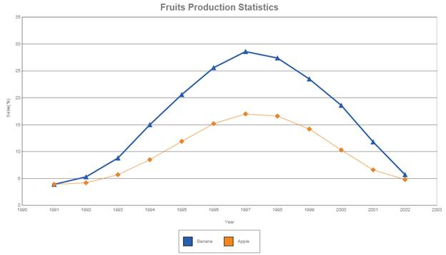

::: {style="DISPLAY: none"}
{#d2h_url_template} {#d2h_package_url style="WIDTH: 0px; DISPLAY: none; HEIGHT: 0px"}
:::

::: {.d2h_secondary_topic style="PADDING-BOTTOM: 10pt; MARGIN: 0pt; PADDING-LEFT: 0pt; PADDING-RIGHT: 0pt; PADDING-TOP: 0pt"}
##### Using ChartModel {#using-chartmodel style="tab-stops: 0pt"}

The steps to create a Line chart through ChartModel are as follows:

1.   In Controller, create an instance of MVCChartModel.

2.   Create an instance of ChartSeries, and set the Series Type to **Line.**

3.   Set the ChartSeries, ChartArea, and ChartModel properties.

4.   Return view to the corresponding View page after setting the ChartModel to the ViewData.

[]{style="FONT-FAMILY: 'Calibri','sans-serif'; COLOR: black"} 

+-------------------------------------------------------------------------------------------------------------------------------------------------------------------------------------------------------------------------------------------------------+
| [\[C#\]]{style="FONT-FAMILY: 'Courier New'"}                                                                                                                                                                                                          |
|                                                                                                                                                                                                                                                       |
| [public]{style="FONT-FAMILY: 'Courier New'; COLOR: blue"} [ [ActionResult]{style="COLOR: #2b91af"} SimpleChart()]{style="FONT-FAMILY: 'Courier New'"}                                                                                                 |
|                                                                                                                                                                                                                                                       |
| [        {]{style="FONT-FAMILY: 'Courier New'"}                                                                                                                                                                                                       |
|                                                                                                                                                                                                                                                       |
| [            [ChartModel]{style="COLOR: #2b91af"} model = [new]{style="COLOR: blue"}[ChartModel]{style="COLOR: #2b91af"}();]{style="FONT-FAMILY: 'Courier New'"}                                                                                      |
|                                                                                                                                                                                                                                                       |
| [            DateTime]{style="FONT-FAMILY: 'Courier New'; COLOR: #2b91af"} [ dt = [new]{style="COLOR: blue"}[DateTime]{style="COLOR: #2b91af"}(2010, 01, 01);]{style="FONT-FAMILY: 'Courier New'"}                                                    |
|                                                                                                                                                                                                                                                       |
| []{style="FONT-FAMILY: 'Courier New'"}                                                                                                                                                                                                                |
|                                                                                                                                                                                                                                                       |
| [            model.Legend.Visible = [true]{style="COLOR: blue"};]{style="FONT-FAMILY: 'Courier New'"}                                                                                                                                                 |
|                                                                                                                                                                                                                                                       |
| [            model.LegendPosition = [DockPosition]{style="COLOR: #2b91af"}.Bottom;]{style="FONT-FAMILY: 'Courier New'"}                                                                                                                               |
|                                                                                                                                                                                                                                                       |
| []{style="FONT-FAMILY: 'Courier New'"}                                                                                                                                                                                                                |
|                                                                                                                                                                                                                                                       |
| [            model.Axes\[[\"PrimaryX\"]{style="COLOR: #a31515"}\].MajorGridLines.Visible = [false]{style="COLOR: blue"};]{style="FONT-FAMILY: 'Courier New'"}                                                                                         |
|                                                                                                                                                                                                                                                       |
| []{style="FONT-FAMILY: 'Courier New'"}                                                                                                                                                                                                                |
|                                                                                                                                                                                                                                                       |
| [            [Series]{style="COLOR: #2b91af"} series = [new]{style="COLOR: blue"}[Series]{style="COLOR: #2b91af"}([\"Banana\"]{style="COLOR: #a31515"});]{style="FONT-FAMILY: 'Courier New'"}                                                         |
|                                                                                                                                                                                                                                                       |
| [            model.Text = [\"Fruits Production Statistics\"]{style="COLOR: #a31515"};]{style="FONT-FAMILY: 'Courier New'"}                                                                                                                            |
|                                                                                                                                                                                                                                                       |
| [            model.Axes\[[\"PrimaryX\"]{style="COLOR: #a31515"}\].Title = [\"Year\"]{style="COLOR: #a31515"};]{style="FONT-FAMILY: 'Courier New'"}                                                                                                    |
|                                                                                                                                                                                                                                                       |
| [            model.Axes\[[\"PrimaryY\"]{style="COLOR: #a31515"}\].Title = [\"Sales(%)\"]{style="COLOR: #a31515"};]{style="FONT-FAMILY: 'Courier New'"}                                                                                                |
|                                                                                                                                                                                                                                                       |
| [            model.Font = [new]{style="COLOR: blue"}[ChartFont]{style="COLOR: #2b91af"}([\"Arial\"]{style="COLOR: #a31515"}, [\"15pt\"]{style="COLOR: #a31515"}, [ChartFontStyle]{style="COLOR: #2b91af"}.Bold);]{style="FONT-FAMILY: 'Courier New'"} |
|                                                                                                                                                                                                                                                       |
| []{style="FONT-FAMILY: 'Courier New'"}                                                                                                                                                                                                                |
|                                                                                                                                                                                                                                                       |
| [            model.Axes\[[\"PrimaryX\"]{style="COLOR: #a31515"}\].RangeType = [RangeType]{style="COLOR: #2b91af"}.Set;]{style="FONT-FAMILY: 'Courier New'"}                                                                                           |
|                                                                                                                                                                                                                                                       |
| [            model.Axes\[[\"PrimaryX\"]{style="COLOR: #a31515"}\].ValueType = [ChartAxisValueType]{style="COLOR: #2b91af"}.Double;]{style="FONT-FAMILY: 'Courier New'"}                                                                               |
|                                                                                                                                                                                                                                                       |
| [            model.Axes\[[\"PrimaryX\"]{style="COLOR: #a31515"}\].Range = [new]{style="COLOR: blue"}[MinMaxInfo]{style="COLOR: #2b91af"}() { Start = 1990, End = 2003, Interval = 3 };]{style="FONT-FAMILY: 'Courier New'"}                           |
|                                                                                                                                                                                                                                                       |
| []{style="FONT-FAMILY: 'Courier New'"}                                                                                                                                                                                                                |
|                                                                                                                                                                                                                                                       |
| [            series.Points.Add(1991, 3.9);]{style="FONT-FAMILY: 'Courier New'"}                                                                                                                                                                       |
|                                                                                                                                                                                                                                                       |
| [            series.Points.Add(1992, 5.3);]{style="FONT-FAMILY: 'Courier New'"}                                                                                                                                                                       |
|                                                                                                                                                                                                                                                       |
| [            series.Points.Add(1993, 8.8);]{style="FONT-FAMILY: 'Courier New'"}                                                                                                                                                                       |
|                                                                                                                                                                                                                                                       |
| [            \...]{style="FONT-FAMILY: 'Courier New'"}                                                                                                                                                                                                |
|                                                                                                                                                                                                                                                       |
| [            series.Symbol.Visible = [true]{style="COLOR: blue"};]{style="FONT-FAMILY: 'Courier New'"}                                                                                                                                                |
|                                                                                                                                                                                                                                                       |
| [            series.Symbol.Shape = [SymbolShape]{style="COLOR: #2b91af"}.Triangle;]{style="FONT-FAMILY: 'Courier New'"}                                                                                                                               |
|                                                                                                                                                                                                                                                       |
| []{style="FONT-FAMILY: 'Courier New'"}                                                                                                                                                                                                                |
|                                                                                                                                                                                                                                                       |
| []{style="FONT-FAMILY: 'Courier New'"}                                                                                                                                                                                                                |
|                                                                                                                                                                                                                                                       |
| [            series.Type = [SeriesType]{style="COLOR: #2b91af"}.Line;]{style="FONT-FAMILY: 'Courier New'"}                                                                                                                                            |
|                                                                                                                                                                                                                                                       |
| [            model.Series.Add(series);]{style="FONT-FAMILY: 'Courier New'"}                                                                                                                                                                           |
|                                                                                                                                                                                                                                                       |
| []{style="FONT-FAMILY: 'Courier New'"}                                                                                                                                                                                                                |
|                                                                                                                                                                                                                                                       |
| [            [Series]{style="COLOR: #2b91af"} series1 = [new]{style="COLOR: blue"}[Series]{style="COLOR: #2b91af"}([\"Apple\"]{style="COLOR: #a31515"});]{style="FONT-FAMILY: 'Courier New'"}                                                         |
|                                                                                                                                                                                                                                                       |
| [            series1.Points.Add(1991, 3.9);]{style="FONT-FAMILY: 'Courier New'"}                                                                                                                                                                      |
|                                                                                                                                                                                                                                                       |
| [            series1.Points.Add(1992, 4.2);]{style="FONT-FAMILY: 'Courier New'"}                                                                                                                                                                      |
|                                                                                                                                                                                                                                                       |
| [            series1.Points.Add(1993, 5.7);]{style="FONT-FAMILY: 'Courier New'"}                                                                                                                                                                      |
|                                                                                                                                                                                                                                                       |
| [             . . .]{style="FONT-FAMILY: 'Courier New'"}                                                                                                                                                                                              |
|                                                                                                                                                                                                                                                       |
| []{style="FONT-FAMILY: 'Courier New'"}                                                                                                                                                                                                                |
|                                                                                                                                                                                                                                                       |
| [            series1.Symbol.Visible = [true]{style="COLOR: blue"};]{style="FONT-FAMILY: 'Courier New'"}                                                                                                                                               |
|                                                                                                                                                                                                                                                       |
| [            series1.Symbol.Shape = [SymbolShape]{style="COLOR: #2b91af"}.Diamond;]{style="FONT-FAMILY: 'Courier New'"}                                                                                                                               |
|                                                                                                                                                                                                                                                       |
| [            series1.Type = [SeriesType]{style="COLOR: #2b91af"}.Line;]{style="FONT-FAMILY: 'Courier New'"}                                                                                                                                           |
|                                                                                                                                                                                                                                                       |
| [            model.Series.Add(series1);]{style="FONT-FAMILY: 'Courier New'"}                                                                                                                                                                          |
|                                                                                                                                                                                                                                                       |
| []{style="FONT-FAMILY: 'Courier New'"}                                                                                                                                                                                                                |
|                                                                                                                                                                                                                                                       |
| [            model.Legend.Visible = [true]{style="COLOR: blue"};]{style="FONT-FAMILY: 'Courier New'"}                                                                                                                                                 |
|                                                                                                                                                                                                                                                       |
| [            model.Legend.Shape = [LegendShape]{style="COLOR: #2b91af"}.Rectangle;]{style="FONT-FAMILY: 'Courier New'"}                                                                                                                               |
|                                                                                                                                                                                                                                                       |
| [            model.ElementSpacing = 10;]{style="FONT-FAMILY: 'Courier New'"}                                                                                                                                                                          |
|                                                                                                                                                                                                                                                       |
| [            model.Margin = [new]{style="COLOR: blue"}[MarginInfo]{style="COLOR: #2b91af"}() { Left = 0 };]{style="FONT-FAMILY: 'Courier New'"}                                                                                                       |
|                                                                                                                                                                                                                                                       |
| [            series.Style.Border.Width = 3;]{style="FONT-FAMILY: 'Courier New'"}                                                                                                                                                                      |
|                                                                                                                                                                                                                                                       |
| [            ViewData\[[\"ChartModel\"]{style="COLOR: #a31515"}\] = model;]{style="FONT-FAMILY: 'Courier New'"}                                                                                                                                       |
|                                                                                                                                                                                                                                                       |
| [            [return]{style="COLOR: blue"} View();]{style="FONT-FAMILY: 'Courier New'"}                                                                                                                                                               |
|                                                                                                                                                                                                                                                       |
| [        }]{style="FONT-FAMILY: 'Courier New'"}                                                                                                                                                                                                       |
|                                                                                                                                                                                                                                                       |
| [            ]{style="FONT-FAMILY: 'Courier New'"} [ ]{style="FONT-FAMILY: 'Courier New'"} []{style="FONT-FAMILY: 'Courier New'"}                                                                                                                     |
+-------------------------------------------------------------------------------------------------------------------------------------------------------------------------------------------------------------------------------------------------------+

 

+-------------------------------------------------------------------------------------------------------------------------------------------------------+
| **[\[Razor\]]{style="FONT-FAMILY: 'Courier New'"}**                                                                                                   |
|                                                                                                                                                       |
| **[]{style="FONT-FAMILY: 'Courier New'"}**                                                                                                            |
|                                                                                                                                                       |
| [\@{]{style="FONT-FAMILY: 'Courier New'; BACKGROUND: yellow"} [Html.Syncfusion.Chart(\"Chart\")                 ]{style="FONT-FAMILY: 'Courier New'"} |
|                                                                                                                                                       |
| [              .Series(series =\>]{style="FONT-FAMILY: 'Courier New'"}                                                                                |
|                                                                                                                                                       |
| [              {]{style="FONT-FAMILY: 'Courier New'"}                                                                                                 |
|                                                                                                                                                       |
| [                  series.Add().Name(\"LineSeires**\").Type(SeriesType.Line)**.Points(p =\>]{style="FONT-FAMILY: 'Courier New'"}                      |
|                                                                                                                                                       |
| [                  {]{style="FONT-FAMILY: 'Courier New'"}                                                                                             |
|                                                                                                                                                       |
| [                      p.Add(1, 75);]{style="FONT-FAMILY: 'Courier New'"}                                                                             |
|                                                                                                                                                       |
| [                      p.Add(2, 82);]{style="FONT-FAMILY: 'Courier New'"}                                                                             |
|                                                                                                                                                       |
| [                      p.Add(3, 87);]{style="FONT-FAMILY: 'Courier New'"}                                                                             |
|                                                                                                                                                       |
| [                      p.Add(4, 84);]{style="FONT-FAMILY: 'Courier New'"}                                                                             |
|                                                                                                                                                       |
| [                      p.Add(5, 84);]{style="FONT-FAMILY: 'Courier New'"}                                                                             |
|                                                                                                                                                       |
| [                         . . . ]{style="FONT-FAMILY: 'Courier New'"}                                                                                 |
|                                                                                                                                                       |
| [                      ]{style="FONT-FAMILY: 'Courier New'"}                                                                                          |
|                                                                                                                                                       |
| [                  }).Style(style =\>]{style="FONT-FAMILY: 'Courier New'"}                                                                            |
|                                                                                                                                                       |
| [                  {]{style="FONT-FAMILY: 'Courier New'"}                                                                                             |
|                                                                                                                                                       |
| [                      style.Border(border =\> border.Width(3)).Opacity(0.8f);]{style="FONT-FAMILY: 'Courier New'"}                                   |
|                                                                                                                                                       |
| [                  }).DisplayText(true);]{style="FONT-FAMILY: 'Courier New'"}                                                                         |
|                                                                                                                                                       |
| [              }).Render();]{style="FONT-FAMILY: 'Courier New'"}                                                                                      |
|                                                                                                                                                       |
| [        [}]{style="BACKGROUND: yellow"}]{style="FONT-FAMILY: 'Courier New'"}                                                                         |
|                                                                                                                                                       |
| []{style="FONT-FAMILY: 'Courier New'; BACKGROUND: yellow"}                                                                                            |
+-------------------------------------------------------------------------------------------------------------------------------------------------------+

 

[]{style="FONT-FAMILY: Consolas; FONT-SIZE: 9.5pt"} 

5.   In the View page, invoke the ChartBuilder by using the control ID as the first argument, and convert the ViewData to **MVCChartModel** and set it as the second argument.

[]{style="FONT-FAMILY: 'Calibri','sans-serif'"} 

+---------------------------------------------------------------------------------------------------------------------------------------------------------------------------------------------------------------------------------------------------------------------------------------------------------------------------------------------------------+
| **[\[ASPX\]]{style="FONT-FAMILY: 'Courier New'"}**                                                                                                                                                                                                                                                                                                      |
|                                                                                                                                                                                                                                                                                                                                                         |
| []{style="FONT-FAMILY: 'Courier New'; BACKGROUND: yellow"}                                                                                                                                                                                                                                                                                              |
|                                                                                                                                                                                                                                                                                                                                                         |
| [\<%]{style="FONT-FAMILY: 'Courier New'; BACKGROUND: yellow"} [=]{style="FONT-FAMILY: 'Courier New'; COLOR: blue"} [ Html.Syncfusion.Chart([\"SimpleChart\"]{style="COLOR: #a31515"}, ([ChartModel]{style="COLOR: #2b91af"})ViewData\[[\"ChartModel\"]{style="COLOR: #a31515"}\])[%\>]{style="BACKGROUND: yellow"}]{style="FONT-FAMILY: 'Courier New'"} |
|                                                                                                                                                                                                                                                                                                                                                         |
| []{style="FONT-FAMILY: 'Courier New'"}                                                                                                                                                                                                                                                                                                                  |
|                                                                                                                                                                                                                                                                                                                                                         |
| []{style="FONT-FAMILY: 'Courier New'; COLOR: blue"}                                                                                                                                                                                                                                                                                                     |
+---------------------------------------------------------------------------------------------------------------------------------------------------------------------------------------------------------------------------------------------------------------------------------------------------------------------------------------------------------+

 

+-----------------------------------------------------------------------------------------------------------------------------------------------------------------------------------------------------------------------------+
| **[\[Razor\]]{style="FONT-FAMILY: 'Courier New'"}**                                                                                                                                                                         |
|                                                                                                                                                                                                                             |
| **[]{style="FONT-FAMILY: 'Courier New'"}**                                                                                                                                                                                  |
|                                                                                                                                                                                                                             |
| [  ]{style="FONT-FAMILY: 'Courier New'"} [@]{style="FONT-FAMILY: 'Courier New'; BACKGROUND: yellow"} [(Html.Syncfusion.Chart(\"SimpleChart\", (ChartModel)ViewData\[\"ChartModel\"\]))]{style="FONT-FAMILY: 'Courier New'"} |
|                                                                                                                                                                                                                             |
| []{style="FONT-FAMILY: 'Courier New'"}                                                                                                                                                                                      |
|                                                                                                                                                                                                                             |
| []{style="FONT-FAMILY: 'Courier New'; BACKGROUND: yellow"}                                                                                                                                                                  |
+-----------------------------------------------------------------------------------------------------------------------------------------------------------------------------------------------------------------------------+

[]{style="BACKGROUND: yellow"} 

6.   Build and run the code, to get the following output:

[]{style="FONT-FAMILY: Consolas; BACKGROUND: yellow; FONT-SIZE: 9.5pt"} 

[]{style="FONT-FAMILY: Consolas; BACKGROUND: yellow; FONT-SIZE: 9.5pt"} 

{border="0"}

Figure 27: Line Chart

 

 

 

[]{#related-topics}
:::
