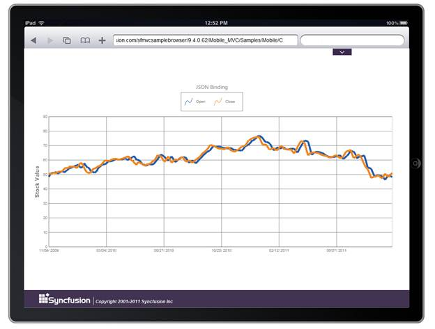

::: {style="DISPLAY: none"}
{#d2h_url_template} {#d2h_package_url style="WIDTH: 0px; DISPLAY: none; HEIGHT: 0px"}
:::

::: {.d2h_secondary_topic style="PADDING-BOTTOM: 10pt; MARGIN: 0pt; PADDING-LEFT: 0pt; PADDING-RIGHT: 0pt; PADDING-TOP: 0pt"}
#### Using ChartModel {#using-chartmodel style="tab-stops: 0pt"}

[]{style="FONT-FAMILY: 'Calibri','sans-serif'"} 

The steps to bind chart to datasource through the ChartModel are as follows:

1.   In Controller, create an instance of MVCChartModel.

[·      ]{style="FONT-FAMILY: Symbol"}Create an instance of ChartSeries.

[·      ]{style="FONT-FAMILY: Symbol"}In **BindTo** mapper of the series, set the **DataSource** as IEnumerable and **XName** property to any field name that is to be rendered as X-Axis in Chart and **YNames** as array of field names that are to be rendered as Y-Axis in Chart.

[·      ]{style="FONT-FAMILY: Symbol"}Set the ChartSeries, ChartArea, and ChartModel properties.

 

[]{style="FONT-FAMILY: 'Courier New'"} 

+--------------------------------------------------------------------------------------------------------------------------------------------------------------------------------------------------------------------------------------------------------------------------------------------------------------------------------------+
| [\[C#\]        ]{style="FONT-FAMILY: 'Courier New'"}                                                                                                                                                                                                                                                                                 |
|                                                                                                                                                                                                                                                                                                                                      |
| [public]{style="FONT-FAMILY: 'Courier New'; COLOR: blue"} [ [ActionResult]{style="COLOR: #2b91af"} SimpleChart(){]{style="FONT-FAMILY: 'Courier New'"}                                                                                                                                                                               |
|                                                                                                                                                                                                                                                                                                                                      |
| [  [ExcelEngine]{style="COLOR: #2b91af"} engine = [new]{style="COLOR: blue"}[ExcelEngine]{style="COLOR: #2b91af"}();]{style="FONT-FAMILY: Consolas; FONT-SIZE: 9.5pt"}                                                                                                                                                               |
|                                                                                                                                                                                                                                                                                                                                      |
| [  [IApplication]{style="COLOR: #2b91af"} app = engine.Excel;]{style="FONT-FAMILY: Consolas; FONT-SIZE: 9.5pt"}                                                                                                                                                                                                                      |
|                                                                                                                                                                                                                                                                                                                                      |
| [  [IWorkbook]{style="COLOR: #2b91af"} workBook = app.Workbooks.Open(HttpContext.Request.PhysicalApplicationPath + [@\"\\App_data\\ChartData.xlsx\"]{style="COLOR: #a31515"});]{style="FONT-FAMILY: Consolas; FONT-SIZE: 9.5pt"}                                                                                                     |
|                                                                                                                                                                                                                                                                                                                                      |
| [  IWorksheet]{style="FONT-FAMILY: Consolas; COLOR: #2b91af; FONT-SIZE: 9.5pt"} [ sheet = workBook.Worksheets\[0\];]{style="FONT-FAMILY: Consolas; FONT-SIZE: 9.5pt"}                                                                                                                                                                |
|                                                                                                                                                                                                                                                                                                                                      |
| [  [DataTable]{style="COLOR: #2b91af"} dt = sheet.ExportDataTable(sheet.UsedRange,        ]{style="FONT-FAMILY: Consolas; FONT-SIZE: 9.5pt"}                                                                                                                                                                                         |
|                                                                                                                                                                                                                                                                                                                                      |
| [  [ExcelExportDataTableOptions]{style="COLOR: #2b91af"}.DetectColumnTypes);]{style="FONT-FAMILY: Consolas; FONT-SIZE: 9.5pt"}                                                                                                                                                                                                       |
|                                                                                                                                                                                                                                                                                                                                      |
| [  [List]{style="COLOR: #2b91af"}\<[Chartdata]{style="COLOR: #2b91af"}\> data = [new]{style="COLOR: blue"}[List]{style="COLOR: #2b91af"}\<[Chartdata]{style="COLOR: #2b91af"}\>();]{style="FONT-FAMILY: Consolas; FONT-SIZE: 9.5pt"}                                                                                                 |
|                                                                                                                                                                                                                                                                                                                                      |
| []{style="FONT-FAMILY: Consolas; FONT-SIZE: 9.5pt"}                                                                                                                                                                                                                                                                                  |
|                                                                                                                                                                                                                                                                                                                                      |
| [  [for]{style="COLOR: blue"} ([int]{style="COLOR: blue"} i = 1; i \< 100; i++)]{style="FONT-FAMILY: Consolas; FONT-SIZE: 9.5pt"}                                                                                                                                                                                                    |
|                                                                                                                                                                                                                                                                                                                                      |
| [     data.Add([new]{style="COLOR: blue"}[Chartdata]{style="COLOR: #2b91af"}([Convert]{style="COLOR: #2b91af"}.ToDateTime(dt.Rows\[i\]\[0\]).ToOADate(), [Convert]{style="COLOR: #2b91af"}.ToDouble(dt.Rows\[i\]\[1\])));]{style="FONT-FAMILY: Consolas; FONT-SIZE: 9.5pt"}                                                          |
|                                                                                                                                                                                                                                                                                                                                      |
| []{style="FONT-FAMILY: Consolas; FONT-SIZE: 9.5pt"}                                                                                                                                                                                                                                                                                  |
|                                                                                                                                                                                                                                                                                                                                      |
| [    [ChartModel]{style="COLOR: #2b91af"} model = [new]{style="COLOR: blue"}[ChartModel]{style="COLOR: #2b91af"}();]{style="FONT-FAMILY: Consolas; FONT-SIZE: 9.5pt"}                                                                                                                                                                |
|                                                                                                                                                                                                                                                                                                                                      |
| []{style="FONT-FAMILY: Consolas; FONT-SIZE: 9.5pt"}                                                                                                                                                                                                                                                                                  |
|                                                                                                                                                                                                                                                                                                                                      |
| [     #region]{style="FONT-FAMILY: Consolas; COLOR: blue; FONT-SIZE: 9.5pt"} [ Chart Model Properties]{style="FONT-FAMILY: Consolas; FONT-SIZE: 9.5pt"}                                                                                                                                                                              |
|                                                                                                                                                                                                                                                                                                                                      |
| []{style="FONT-FAMILY: Consolas; FONT-SIZE: 9.5pt"}                                                                                                                                                                                                                                                                                  |
|                                                                                                                                                                                                                                                                                                                                      |
| [     model.Text = [\"List Chart\"]{style="COLOR: #a31515"};]{style="FONT-FAMILY: Consolas; FONT-SIZE: 9.5pt"}                                                                                                                                                                                                                       |
|                                                                                                                                                                                                                                                                                                                                      |
| [     model.Font = [new]{style="COLOR: blue"}[ChartFont]{style="COLOR: #2b91af"}([\"Segoe UI\"]{style="COLOR: #a31515"}, [\"14px\"]{style="COLOR: #a31515"}, [ChartFontStyle]{style="COLOR: #2b91af"}.Normal);]{style="FONT-FAMILY: Consolas; FONT-SIZE: 9.5pt"}                                                                     |
|                                                                                                                                                                                                                                                                                                                                      |
| [     model.Size = [new]{style="COLOR: blue"}[Size]{style="COLOR: #2b91af"}(1000, 500);]{style="FONT-FAMILY: Consolas; FONT-SIZE: 9.5pt"}                                                                                                                                                                                            |
|                                                                                                                                                                                                                                                                                                                                      |
| []{style="FONT-FAMILY: Consolas; FONT-SIZE: 9.5pt"}                                                                                                                                                                                                                                                                                  |
|                                                                                                                                                                                                                                                                                                                                      |
| [     #endregion]{style="FONT-FAMILY: Consolas; COLOR: blue; FONT-SIZE: 9.5pt"} []{style="FONT-FAMILY: Consolas; FONT-SIZE: 9.5pt"}                                                                                                                                                                                                  |
|                                                                                                                                                                                                                                                                                                                                      |
| []{style="FONT-FAMILY: Consolas; FONT-SIZE: 9.5pt"}                                                                                                                                                                                                                                                                                  |
|                                                                                                                                                                                                                                                                                                                                      |
| [     #region]{style="FONT-FAMILY: Consolas; COLOR: blue; FONT-SIZE: 9.5pt"} [ Series]{style="FONT-FAMILY: Consolas; FONT-SIZE: 9.5pt"}                                                                                                                                                                                              |
|                                                                                                                                                                                                                                                                                                                                      |
| []{style="FONT-FAMILY: Consolas; FONT-SIZE: 9.5pt"}                                                                                                                                                                                                                                                                                  |
|                                                                                                                                                                                                                                                                                                                                      |
| [    [Series]{style="COLOR: #2b91af"} areaSeries = [new]{style="COLOR: blue"}[Series]{style="COLOR: #2b91af"}([\"Area Series\"]{style="COLOR: #a31515"});]{style="FONT-FAMILY: Consolas; FONT-SIZE: 9.5pt"}                                                                                                                          |
|                                                                                                                                                                                                                                                                                                                                      |
| [    [Random]{style="COLOR: #2b91af"} ran = [new]{style="COLOR: blue"}[Random]{style="COLOR: #2b91af"}();]{style="FONT-FAMILY: Consolas; FONT-SIZE: 9.5pt"}                                                                                                                                                                          |
|                                                                                                                                                                                                                                                                                                                                      |
| [            ]{style="FONT-FAMILY: Consolas; FONT-SIZE: 9.5pt"}                                                                                                                                                                                                                                                                      |
|                                                                                                                                                                                                                                                                                                                                      |
| [    areaSeries.Type = [SeriesType]{style="COLOR: #2b91af"}.Area;]{style="FONT-FAMILY: Consolas; FONT-SIZE: 9.5pt"}                                                                                                                                                                                                                  |
|                                                                                                                                                                                                                                                                                                                                      |
| **[    areaSeries.BindTo = [new]{style="COLOR: blue"}[ChartDataBind]{style="COLOR: #2b91af"}() { DataSource = data, XName = [\"Date\"]{style="COLOR: #a31515"}, YNames = [new]{style="COLOR: blue"}[string]{style="COLOR: blue"}\[\] { [\"YValue\"]{style="COLOR: #a31515"} } };]{style="FONT-FAMILY: Consolas; FONT-SIZE: 9.5pt"}** |
|                                                                                                                                                                                                                                                                                                                                      |
| []{style="FONT-FAMILY: Consolas; FONT-SIZE: 9.5pt"}                                                                                                                                                                                                                                                                                  |
|                                                                                                                                                                                                                                                                                                                                      |
| []{style="FONT-FAMILY: Consolas; FONT-SIZE: 9.5pt"}                                                                                                                                                                                                                                                                                  |
|                                                                                                                                                                                                                                                                                                                                      |
| [    model.Series.Add(areaSeries);]{style="FONT-FAMILY: Consolas; FONT-SIZE: 9.5pt"}                                                                                                                                                                                                                                                 |
|                                                                                                                                                                                                                                                                                                                                      |
| []{style="FONT-FAMILY: Consolas; FONT-SIZE: 9.5pt"}                                                                                                                                                                                                                                                                                  |
|                                                                                                                                                                                                                                                                                                                                      |
| [    areaSeries.Style.Border.Width = 5;]{style="FONT-FAMILY: Consolas; FONT-SIZE: 9.5pt"}                                                                                                                                                                                                                                            |
|                                                                                                                                                                                                                                                                                                                                      |
| [    areaSeries.Style.Border.Color = [Color]{style="COLOR: #2b91af"}.FromArgb(51, 119, 181);]{style="FONT-FAMILY: Consolas; FONT-SIZE: 9.5pt"}                                                                                                                                                                                       |
|                                                                                                                                                                                                                                                                                                                                      |
| [    areaSeries.Style.Interior = [new]{style="COLOR: blue"}[GradientInfo]{style="COLOR: #2b91af"}([new]{style="COLOR: blue"}[ColorInfo]{style="COLOR: #2b91af"}([Color]{style="COLOR: #2b91af"}.FromArgb(241, 248, 254)));]{style="FONT-FAMILY: Consolas; FONT-SIZE: 9.5pt"}                                                         |
|                                                                                                                                                                                                                                                                                                                                      |
| [      #endregion]{style="FONT-FAMILY: Consolas; COLOR: blue; FONT-SIZE: 9.5pt"} []{style="FONT-FAMILY: Consolas; FONT-SIZE: 9.5pt"}                                                                                                                                                                                                 |
|                                                                                                                                                                                                                                                                                                                                      |
| []{style="FONT-FAMILY: Consolas; FONT-SIZE: 9.5pt"}                                                                                                                                                                                                                                                                                  |
|                                                                                                                                                                                                                                                                                                                                      |
| [      #region]{style="FONT-FAMILY: Consolas; COLOR: blue; FONT-SIZE: 9.5pt"} [ Axes Customization]{style="FONT-FAMILY: Consolas; FONT-SIZE: 9.5pt"}                                                                                                                                                                                 |
|                                                                                                                                                                                                                                                                                                                                      |
| [    model.Axes\[[\"PrimaryX\"]{style="COLOR: #a31515"}\].ValueType = [ChartAxisValueType]{style="COLOR: #2b91af"}.DateTime;]{style="FONT-FAMILY: Consolas; FONT-SIZE: 9.5pt"}                                                                                                                                                       |
|                                                                                                                                                                                                                                                                                                                                      |
| [    model.Axes\[[\"PrimaryX\"]{style="COLOR: #a31515"}\].RangeType = [RangeType]{style="COLOR: #2b91af"}.Set;]{style="FONT-FAMILY: Consolas; FONT-SIZE: 9.5pt"}                                                                                                                                                                     |
|                                                                                                                                                                                                                                                                                                                                      |
| [    model.Axes\[[\"PrimaryX\"]{style="COLOR: #a31515"}\].Range = [new]{style="COLOR: blue"}[MinMaxInfo]{style="COLOR: #2b91af"}() { Start = 40126, End = 40812, Interval = 115 };]{style="FONT-FAMILY: Consolas; FONT-SIZE: 9.5pt"}                                                                                                 |
|                                                                                                                                                                                                                                                                                                                                      |
| [    model.Axes\[[\"PrimaryX\"]{style="COLOR: #a31515"}\].DateFormat = [\"mm/dd/ yyyy\"]{style="COLOR: #a31515"};]{style="FONT-FAMILY: Consolas; FONT-SIZE: 9.5pt"}                                                                                                                                                                  |
|                                                                                                                                                                                                                                                                                                                                      |
| [    model.Axes\[[\"PrimaryY\"]{style="COLOR: #a31515"}\].RangeType = [RangeType]{style="COLOR: #2b91af"}.Set;]{style="FONT-FAMILY: Consolas; FONT-SIZE: 9.5pt"}                                                                                                                                                                     |
|                                                                                                                                                                                                                                                                                                                                      |
| [    model.Axes\[[\"PrimaryY\"]{style="COLOR: #a31515"}\].Range = [new]{style="COLOR: blue"}[MinMaxInfo]{style="COLOR: #2b91af"}() { Start = 0, End = 90, Interval = 10 };]{style="FONT-FAMILY: Consolas; FONT-SIZE: 9.5pt"}                                                                                                         |
|                                                                                                                                                                                                                                                                                                                                      |
| [    #endregion]{style="FONT-FAMILY: Consolas; COLOR: blue; FONT-SIZE: 9.5pt"} []{style="FONT-FAMILY: Consolas; FONT-SIZE: 9.5pt"}                                                                                                                                                                                                   |
|                                                                                                                                                                                                                                                                                                                                      |
| []{style="FONT-FAMILY: Consolas; FONT-SIZE: 9.5pt"}                                                                                                                                                                                                                                                                                  |
|                                                                                                                                                                                                                                                                                                                                      |
| [   ViewData\[[\"ChartModel\"]{style="COLOR: #a31515"}\] = model;]{style="FONT-FAMILY: Consolas; FONT-SIZE: 9.5pt"}                                                                                                                                                                                                                  |
|                                                                                                                                                                                                                                                                                                                                      |
| []{style="FONT-FAMILY: Consolas; FONT-SIZE: 9.5pt"}                                                                                                                                                                                                                                                                                  |
|                                                                                                                                                                                                                                                                                                                                      |
| [    [return]{style="COLOR: blue"} View();]{style="FONT-FAMILY: Consolas; FONT-SIZE: 9.5pt"}                                                                                                                                                                                                                                         |
|                                                                                                                                                                                                                                                                                                                                      |
| [}]{style="FONT-FAMILY: 'Courier New'; FONT-SIZE: 9.5pt"}                                                                                                                                                                                                                                                                            |
|                                                                                                                                                                                                                                                                                                                                      |
| [public]{style="FONT-FAMILY: Consolas; COLOR: blue; FONT-SIZE: 9.5pt"} [ [class]{style="COLOR: blue"} [Chartdata]{style="COLOR: #2b91af"} ]{style="FONT-FAMILY: Consolas; FONT-SIZE: 9.5pt"}                                                                                                                                         |
|                                                                                                                                                                                                                                                                                                                                      |
| [        {]{style="FONT-FAMILY: Consolas; FONT-SIZE: 9.5pt"}                                                                                                                                                                                                                                                                         |
|                                                                                                                                                                                                                                                                                                                                      |
| [            [public]{style="COLOR: blue"} Chartdata([double]{style="COLOR: blue"} date, [double]{style="COLOR: blue"} yValue)]{style="FONT-FAMILY: Consolas; FONT-SIZE: 9.5pt"}                                                                                                                                                     |
|                                                                                                                                                                                                                                                                                                                                      |
| [            {]{style="FONT-FAMILY: Consolas; FONT-SIZE: 9.5pt"}                                                                                                                                                                                                                                                                     |
|                                                                                                                                                                                                                                                                                                                                      |
| [                [this]{style="COLOR: blue"}.Date = date;]{style="FONT-FAMILY: Consolas; FONT-SIZE: 9.5pt"}                                                                                                                                                                                                                          |
|                                                                                                                                                                                                                                                                                                                                      |
| [                [this]{style="COLOR: blue"}.YValue = yValue;]{style="FONT-FAMILY: Consolas; FONT-SIZE: 9.5pt"}                                                                                                                                                                                                                      |
|                                                                                                                                                                                                                                                                                                                                      |
| [            }]{style="FONT-FAMILY: Consolas; FONT-SIZE: 9.5pt"}                                                                                                                                                                                                                                                                     |
|                                                                                                                                                                                                                                                                                                                                      |
| [            [public]{style="COLOR: blue"}[double]{style="COLOR: blue"} Date]{style="FONT-FAMILY: Consolas; FONT-SIZE: 9.5pt"}                                                                                                                                                                                                       |
|                                                                                                                                                                                                                                                                                                                                      |
| [            {]{style="FONT-FAMILY: Consolas; FONT-SIZE: 9.5pt"}                                                                                                                                                                                                                                                                     |
|                                                                                                                                                                                                                                                                                                                                      |
| [                [get]{style="COLOR: blue"};]{style="FONT-FAMILY: Consolas; FONT-SIZE: 9.5pt"}                                                                                                                                                                                                                                       |
|                                                                                                                                                                                                                                                                                                                                      |
| [                [set]{style="COLOR: blue"};]{style="FONT-FAMILY: Consolas; FONT-SIZE: 9.5pt"}                                                                                                                                                                                                                                       |
|                                                                                                                                                                                                                                                                                                                                      |
| [            }]{style="FONT-FAMILY: Consolas; FONT-SIZE: 9.5pt"}                                                                                                                                                                                                                                                                     |
|                                                                                                                                                                                                                                                                                                                                      |
| [            [public]{style="COLOR: blue"}[double]{style="COLOR: blue"} YValue]{style="FONT-FAMILY: Consolas; FONT-SIZE: 9.5pt"}                                                                                                                                                                                                     |
|                                                                                                                                                                                                                                                                                                                                      |
| [            {]{style="FONT-FAMILY: Consolas; FONT-SIZE: 9.5pt"}                                                                                                                                                                                                                                                                     |
|                                                                                                                                                                                                                                                                                                                                      |
| [                [get]{style="COLOR: blue"};]{style="FONT-FAMILY: Consolas; FONT-SIZE: 9.5pt"}                                                                                                                                                                                                                                       |
|                                                                                                                                                                                                                                                                                                                                      |
| [                [set]{style="COLOR: blue"};]{style="FONT-FAMILY: Consolas; FONT-SIZE: 9.5pt"}                                                                                                                                                                                                                                       |
|                                                                                                                                                                                                                                                                                                                                      |
| [            }]{style="FONT-FAMILY: Consolas; FONT-SIZE: 9.5pt"}                                                                                                                                                                                                                                                                     |
|                                                                                                                                                                                                                                                                                                                                      |
| []{style="FONT-FAMILY: Consolas; FONT-SIZE: 9.5pt"}                                                                                                                                                                                                                                                                                  |
|                                                                                                                                                                                                                                                                                                                                      |
| [        }]{style="FONT-FAMILY: Consolas; FONT-SIZE: 9.5pt"}                                                                                                                                                                                                                                                                         |
|                                                                                                                                                                                                                                                                                                                                      |
| []{style="FONT-FAMILY: 'Courier New'; COLOR: blue; FONT-SIZE: 9.5pt"}                                                                                                                                                                                                                                                                |
+--------------------------------------------------------------------------------------------------------------------------------------------------------------------------------------------------------------------------------------------------------------------------------------------------------------------------------------+

[]{style="FONT-FAMILY: Consolas; FONT-SIZE: 9.5pt"} 

2.   In the View page, invoke the ChartBuilder by using the control ID as the first argument, and convert the ViewData to **MVCChartModel** and set it as the second argument.

[]{style="FONT-FAMILY: 'Calibri','sans-serif'"} 

+-------------------------------------------------------------------------------------------------------------------------------------------------------------------------------------------------------------------------------------------------------------------------------------------------------------------------------------------------------------------------------------------------------------------------------------------------------------------------------------------------------------------------------------------------------------------------------------+
| **[\[ASPX\]]{style="FONT-FAMILY: 'Courier New'"}**                                                                                                                                                                                                                                                                                                                                                                                                                                                                                                                                  |
|                                                                                                                                                                                                                                                                                                                                                                                                                                                                                                                                                                                     |
| []{style="FONT-FAMILY: Consolas; BACKGROUND: yellow; FONT-SIZE: 9.5pt"}                                                                                                                                                                                                                                                                                                                                                                                                                                                                                                             |
|                                                                                                                                                                                                                                                                                                                                                                                                                                                                                                                                                                                     |
| [\<%]{style="FONT-FAMILY: Consolas; BACKGROUND: yellow; FONT-SIZE: 9.5pt"} [=]{style="FONT-FAMILY: Consolas; COLOR: blue; FONT-SIZE: 9.5pt"} [ Html.MobSyncfusion().Chart([\"]{style="COLOR: #a31515"}]{style="FONT-FAMILY: Consolas; FONT-SIZE: 9.5pt"} [SimpleChart]{style="FONT-FAMILY: 'Courier New'; COLOR: #a31515"} [ \"]{style="FONT-FAMILY: Consolas; COLOR: #a31515; FONT-SIZE: 9.5pt"} [, ([ChartModel]{style="COLOR: #2b91af"})ViewData\[[\"ChartModel\"]{style="COLOR: #a31515"}\])[%\>]{style="BACKGROUND: yellow"}]{style="FONT-FAMILY: Consolas; FONT-SIZE: 9.5pt"} |
|                                                                                                                                                                                                                                                                                                                                                                                                                                                                                                                                                                                     |
| []{style="FONT-FAMILY: Consolas; FONT-SIZE: 9.5pt"}                                                                                                                                                                                                                                                                                                                                                                                                                                                                                                                                 |
|                                                                                                                                                                                                                                                                                                                                                                                                                                                                                                                                                                                     |
| []{style="FONT-FAMILY: Consolas; FONT-SIZE: 9.5pt"}                                                                                                                                                                                                                                                                                                                                                                                                                                                                                                                                 |
|                                                                                                                                                                                                                                                                                                                                                                                                                                                                                                                                                                                     |
| []{style="FONT-FAMILY: 'Courier New'; COLOR: blue; FONT-SIZE: 9.5pt"}                                                                                                                                                                                                                                                                                                                                                                                                                                                                                                               |
+-------------------------------------------------------------------------------------------------------------------------------------------------------------------------------------------------------------------------------------------------------------------------------------------------------------------------------------------------------------------------------------------------------------------------------------------------------------------------------------------------------------------------------------------------------------------------------------+

[]{style="FONT-FAMILY: 'Calibri','sans-serif'"} 

[]{style="FONT-FAMILY: 'Calibri','sans-serif'"} 

+-------------------------------------------------------------------------------------------------------------------------------------------------------------------------------------------------------------------------------------------------------------------------+
| **[\[Razor\]]{style="FONT-FAMILY: 'Courier New'"}**                                                                                                                                                                                                                     |
|                                                                                                                                                                                                                                                                         |
| **[]{style="FONT-FAMILY: 'Courier New'"}**                                                                                                                                                                                                                              |
|                                                                                                                                                                                                                                                                         |
| [  ]{style="FONT-FAMILY: Consolas; FONT-SIZE: 9.5pt"} [@]{style="FONT-FAMILY: Consolas; BACKGROUND: yellow; FONT-SIZE: 9.5pt"} [(Html.MobSyncfusion().Chart(\"SimpleChart\", (ChartModel)ViewData\[\"ChartModel\"\]))]{style="FONT-FAMILY: Consolas; FONT-SIZE: 9.5pt"} |
|                                                                                                                                                                                                                                                                         |
|                                                                                                                                                                                                                                                                         |
+-------------------------------------------------------------------------------------------------------------------------------------------------------------------------------------------------------------------------------------------------------------------------+

[]{style="FONT-FAMILY: 'Calibri','sans-serif'"} 

[]{style="FONT-FAMILY: 'Calibri','sans-serif'"} 

3.   Build and run the code, to get the following output:

{border="0"}

Figure 50: Chart with data binding

 

[]{#related-topics}
:::
