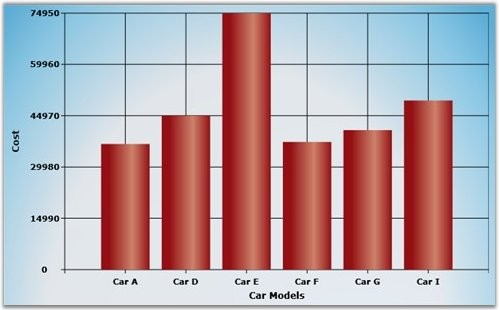

::: {style="DISPLAY: none"}
{#d2h_url_template}{#d2h_package_url style="WIDTH: 0px; DISPLAY: none; HEIGHT: 0px"}
:::

::::: {#nsbanner .d2h_main_nsbanner style="BORDER-BOTTOM: #999999 1px solid; POSITION: relative; PADDING-BOTTOM: 0px; BACKGROUND-COLOR: transparent; PADDING-LEFT: 0px; PADDING-RIGHT: 0px; DISPLAY: none; BORDER-TOP: #999999 1px solid; PADDING-TOP: 0px; LEFT: 0px"}
:::: {#TitleRow .d2h_main_titlerow style="PADDING-BOTTOM: 4px; BACKGROUND-COLOR: transparent; PADDING-LEFT: 22px; WIDTH: 100%; PADDING-RIGHT: 10px; DISPLAY: none; PADDING-TOP: 4px"}
::: {#ienav .d2h_main_ienav style="DISPLAY: none"}
{#D2HPrevious .D2HPreviousEnabled}  {#D2HNext .D2HNextEnabled}
:::
::::
:::::

:::: {#nstext .d2h_main_nstext style="PADDING-BOTTOM: 10px; BACKGROUND-COLOR: transparent; PADDING-LEFT: 22px; PADDING-RIGHT: 10px; HEIGHT: 100%; OVERFLOW: auto; PADDING-TOP: 5px" hasuserbackground="true" valign="bottom"}
::: {#d2h_breadcrumbs .d2h_breadcrumbs}
[Essential Studio User Guide Documentation](ms-xhelp:///?Id=12457748-09e3-4d74-a240-8e049cedf030){.d2h_breadcrumbsNormal}[ \> ]{.d2h_breadcrumbsLinkSeparator}[User Interface Edition](ms-xhelp:///?Id=c29296b7-531c-413b-a0ec-488ca1f7f669){.d2h_breadcrumbsNormal}[ \> ]{.d2h_breadcrumbsLinkSeparator}[Essential Silverlight](ms-xhelp:///?Id=66221bd1-ba2e-43c2-94a7-618f50e01d24){.d2h_breadcrumbsNormal}[ \> ]{.d2h_breadcrumbsLinkSeparator}[Essential Chart]{.d2h_breadcrumbsContentsOnly}[ \> ]{.d2h_breadcrumbsLinkSeparator}[Concepts and Features](ms-xhelp:///?Id=0f820843-9cdd-4436-8cae-3dc5a65fd5cd){.d2h_breadcrumbsNormal}[ \> ]{.d2h_breadcrumbsLinkSeparator}[Data Binding](ms-xhelp:///?Id=e238bc06-21fa-4fc8-a82e-5ccf0a47bb9b){.d2h_breadcrumbsNormal}
:::

### Using LINQ results as Data Source Data Binding {#using-linq-results-as-data-source-data-binding style="tab-stops: 0pt"}

[]{style="COLOR: #15428b"} 

LINQ results can be directly assigned to the Data Source property for a Chart Series.

[]{style="COLOR: #15428b"} 

The following lines of code describe how to assign LINQ result to the Data Source property of a Chart Series.

[]{style="COLOR: #15428b"} 

+-------------------------------------------------------------------------------------------------------------------------------------------------------------------------------------------------------------------------------------------------------------------+
| [\[C#\]]{style="FONT-FAMILY: 'Courier New'"}                                                                                                                                                                                                                      |
|                                                                                                                                                                                                                                                                   |
| []{style="FONT-FAMILY: 'Courier New'"}                                                                                                                                                                                                                            |
|                                                                                                                                                                                                                                                                   |
| [private]{style="FONT-FAMILY: 'Courier New'; COLOR: blue"}[ [IList]{style="COLOR: #2b91af"}\<[Car]{style="COLOR: #2b91af"}\> CreateDataToSeries()]{style="FONT-FAMILY: 'Courier New'"}                                                                            |
|                                                                                                                                                                                                                                                                   |
| [{]{style="FONT-FAMILY: 'Courier New'"}                                                                                                                                                                                                                           |
|                                                                                                                                                                                                                                                                   |
| [      IList]{style="FONT-FAMILY: 'Courier New'; COLOR: #2b91af"}[\<[Car]{style="COLOR: #2b91af"}\> carlist = [new]{style="COLOR: blue"} [List]{style="COLOR: #2b91af"}\<[Car]{style="COLOR: #2b91af"}\>();]{style="FONT-FAMILY: 'Courier New'"}                  |
|                                                                                                                                                                                                                                                                   |
| [      carlist.Add([new]{style="COLOR: blue"} [Car]{style="COLOR: #2b91af"}([\"Car A\"]{style="COLOR: #a31515"}, 36700, 200, 28));]{style="FONT-FAMILY: 'Courier New'"}                                                                                           |
|                                                                                                                                                                                                                                                                   |
| [      carlist.Add([new]{style="COLOR: blue"} [Car]{style="COLOR: #2b91af"}([\"Car B\"]{style="COLOR: #a31515"}, 23970, 170, 23));]{style="FONT-FAMILY: 'Courier New'"}                                                                                           |
|                                                                                                                                                                                                                                                                   |
| [      carlist.Add([new]{style="COLOR: blue"} [Car]{style="COLOR: #2b91af"}([\"Car C\"]{style="COLOR: #a31515"}, 34675, 160, 22));]{style="FONT-FAMILY: 'Courier New'"}                                                                                           |
|                                                                                                                                                                                                                                                                   |
| [      carlist.Add([new]{style="COLOR: blue"} [Car]{style="COLOR: #2b91af"}([\"Car D\"]{style="COLOR: #a31515"}, 44950, 180, 36));]{style="FONT-FAMILY: 'Courier New'"}                                                                                           |
|                                                                                                                                                                                                                                                                   |
| [      carlist.Add([new]{style="COLOR: blue"} [Car]{style="COLOR: #2b91af"}([\"Car E\"]{style="COLOR: #a31515"}, 74950, 150, 18));]{style="FONT-FAMILY: 'Courier New'"}                                                                                           |
|                                                                                                                                                                                                                                                                   |
| [      carlist.Add([new]{style="COLOR: blue"} [Car]{style="COLOR: #2b91af"}([\"Car F\"]{style="COLOR: #a31515"}, 37300, 190, 25));]{style="FONT-FAMILY: 'Courier New'"}                                                                                           |
|                                                                                                                                                                                                                                                                   |
| [      carlist.Add([new]{style="COLOR: blue"} [Car]{style="COLOR: #2b91af"}([\"Car G\"]{style="COLOR: #a31515"}, 40765, 200, 26));]{style="FONT-FAMILY: 'Courier New'"}                                                                                           |
|                                                                                                                                                                                                                                                                   |
| [      carlist.Add([new]{style="COLOR: blue"} [Car]{style="COLOR: #2b91af"}([\"Car H\"]{style="COLOR: #a31515"}, 23799, 150, 22));]{style="FONT-FAMILY: 'Courier New'"}                                                                                           |
|                                                                                                                                                                                                                                                                   |
| [      carlist.Add([new]{style="COLOR: blue"} [Car]{style="COLOR: #2b91af"}([\"Car I\"]{style="COLOR: #a31515"}, 49400, 160, 29));]{style="FONT-FAMILY: 'Courier New'"}                                                                                           |
|                                                                                                                                                                                                                                                                   |
| [      carlist.Add([new]{style="COLOR: blue"} [Car]{style="COLOR: #2b91af"}([\"Car J\"]{style="COLOR: #a31515"}, 25149, 200, 22));]{style="FONT-FAMILY: 'Courier New'"}                                                                                           |
|                                                                                                                                                                                                                                                                   |
| [      return]{style="FONT-FAMILY: 'Courier New'; COLOR: blue"}[ carlist;]{style="FONT-FAMILY: 'Courier New'"}                                                                                                                                                    |
|                                                                                                                                                                                                                                                                   |
| [}]{style="FONT-FAMILY: 'Courier New'"}                                                                                                                                                                                                                           |
|                                                                                                                                                                                                                                                                   |
| [private]{style="FONT-FAMILY: 'Courier New'; COLOR: blue"}[ [void]{style="COLOR: blue"} BindSource()]{style="FONT-FAMILY: 'Courier New'"}                                                                                                                         |
|                                                                                                                                                                                                                                                                   |
| [{]{style="FONT-FAMILY: 'Courier New'"}                                                                                                                                                                                                                           |
|                                                                                                                                                                                                                                                                   |
| [      IList]{style="FONT-FAMILY: 'Courier New'; COLOR: #2b91af"}[\<[Car]{style="COLOR: #2b91af"}\> data = CreateDataToSeries().Where(s =\> s.Price \> 35000).ToList(); ]{style="FONT-FAMILY: 'Courier New'"}                                                     |
|                                                                                                                                                                                                                                                                   |
| [      MyChart.Areas\[0\].Series\[0\].DataSource = data;]{style="FONT-FAMILY: 'Courier New'"}                                                                                                                                                                     |
|                                                                                                                                                                                                                                                                   |
| [      MyChart.Areas\[0\].Series\[0\].BindingPathX = [\"Name\"]{style="COLOR: #a31515"};]{style="FONT-FAMILY: 'Courier New'"}                                                                                                                                     |
|                                                                                                                                                                                                                                                                   |
| [      MyChart.Areas\[0\].Series\[0\].BindingPathsY = [new]{style="COLOR: blue"} [List]{style="COLOR: #2b91af"}\<[string]{style="COLOR: blue"}\>() { [\"Price\"]{style="COLOR: #a31515"} };]{style="FONT-FAMILY: 'Courier New'"}                                  |
|                                                                                                                                                                                                                                                                   |
| [      MyChart.Areas\[0\].PrimaryAxis.LabelsSource = data;]{style="FONT-FAMILY: 'Courier New'"}                                                                                                                                                                   |
|                                                                                                                                                                                                                                                                   |
| [      MyChart.Areas\[0\].PrimaryAxis.ContentPath = [\"Name\"]{style="COLOR: #a31515"};]{style="FONT-FAMILY: 'Courier New'"}                                                                                                                                      |
|                                                                                                                                                                                                                                                                   |
| [      MyChart.Areas\[0\].PrimaryAxis.PositionPath = [\"Name\"]{style="COLOR: #a31515"};]{style="FONT-FAMILY: 'Courier New'"}                                                                                                                                     |
|                                                                                                                                                                                                                                                                   |
| []{style="FONT-FAMILY: 'Courier New'"}                                                                                                                                                                                                                            |
|                                                                                                                                                                                                                                                                   |
| [      MyChart.Areas\[0\].LoadArea();]{style="FONT-FAMILY: 'Courier New'"}                                                                                                                                                                                        |
|                                                                                                                                                                                                                                                                   |
| [}]{style="FONT-FAMILY: 'Courier New'"}                                                                                                                                                                                                                           |
|                                                                                                                                                                                                                                                                   |
| [public]{style="FONT-FAMILY: 'Courier New'; COLOR: blue"}[ [class]{style="COLOR: blue"} [Car]{style="COLOR: #2b91af"}]{style="FONT-FAMILY: 'Courier New'"}                                                                                                        |
|                                                                                                                                                                                                                                                                   |
| [{]{style="FONT-FAMILY: 'Courier New'"}                                                                                                                                                                                                                           |
|                                                                                                                                                                                                                                                                   |
| [      public]{style="FONT-FAMILY: 'Courier New'; COLOR: blue"}[ [string]{style="COLOR: blue"} Name]{style="FONT-FAMILY: 'Courier New'"}                                                                                                                          |
|                                                                                                                                                                                                                                                                   |
| [      {]{style="FONT-FAMILY: 'Courier New'"}                                                                                                                                                                                                                     |
|                                                                                                                                                                                                                                                                   |
| [            get]{style="FONT-FAMILY: 'Courier New'; COLOR: blue"}[;]{style="FONT-FAMILY: 'Courier New'"}                                                                                                                                                         |
|                                                                                                                                                                                                                                                                   |
| [            set]{style="FONT-FAMILY: 'Courier New'; COLOR: blue"}[;]{style="FONT-FAMILY: 'Courier New'"}                                                                                                                                                         |
|                                                                                                                                                                                                                                                                   |
| [      }]{style="FONT-FAMILY: 'Courier New'"}                                                                                                                                                                                                                     |
|                                                                                                                                                                                                                                                                   |
| []{style="FONT-FAMILY: 'Courier New'"}                                                                                                                                                                                                                            |
|                                                                                                                                                                                                                                                                   |
| [      public]{style="FONT-FAMILY: 'Courier New'; COLOR: blue"}[ [double]{style="COLOR: blue"} Price]{style="FONT-FAMILY: 'Courier New'"}                                                                                                                         |
|                                                                                                                                                                                                                                                                   |
| [      {]{style="FONT-FAMILY: 'Courier New'"}                                                                                                                                                                                                                     |
|                                                                                                                                                                                                                                                                   |
| [            get]{style="FONT-FAMILY: 'Courier New'; COLOR: blue"}[;]{style="FONT-FAMILY: 'Courier New'"}                                                                                                                                                         |
|                                                                                                                                                                                                                                                                   |
| [            set]{style="FONT-FAMILY: 'Courier New'; COLOR: blue"}[;]{style="FONT-FAMILY: 'Courier New'"}                                                                                                                                                         |
|                                                                                                                                                                                                                                                                   |
| [      }]{style="FONT-FAMILY: 'Courier New'"}                                                                                                                                                                                                                     |
|                                                                                                                                                                                                                                                                   |
| []{style="FONT-FAMILY: 'Courier New'"}                                                                                                                                                                                                                            |
|                                                                                                                                                                                                                                                                   |
| [      public]{style="FONT-FAMILY: 'Courier New'; COLOR: blue"}[ [double]{style="COLOR: blue"} MaximumSpeed]{style="FONT-FAMILY: 'Courier New'"}                                                                                                                  |
|                                                                                                                                                                                                                                                                   |
| [      {]{style="FONT-FAMILY: 'Courier New'"}                                                                                                                                                                                                                     |
|                                                                                                                                                                                                                                                                   |
| [            get]{style="FONT-FAMILY: 'Courier New'; COLOR: blue"}[;]{style="FONT-FAMILY: 'Courier New'"}                                                                                                                                                         |
|                                                                                                                                                                                                                                                                   |
| [            set]{style="FONT-FAMILY: 'Courier New'; COLOR: blue"}[;]{style="FONT-FAMILY: 'Courier New'"}                                                                                                                                                         |
|                                                                                                                                                                                                                                                                   |
| [      }]{style="FONT-FAMILY: 'Courier New'"}                                                                                                                                                                                                                     |
|                                                                                                                                                                                                                                                                   |
| []{style="FONT-FAMILY: 'Courier New'"}                                                                                                                                                                                                                            |
|                                                                                                                                                                                                                                                                   |
| [      public]{style="FONT-FAMILY: 'Courier New'; COLOR: blue"}[ [double]{style="COLOR: blue"} Mileage]{style="FONT-FAMILY: 'Courier New'"}                                                                                                                       |
|                                                                                                                                                                                                                                                                   |
| [      {]{style="FONT-FAMILY: 'Courier New'"}                                                                                                                                                                                                                     |
|                                                                                                                                                                                                                                                                   |
| [            get]{style="FONT-FAMILY: 'Courier New'; COLOR: blue"}[;]{style="FONT-FAMILY: 'Courier New'"}                                                                                                                                                         |
|                                                                                                                                                                                                                                                                   |
| [            set]{style="FONT-FAMILY: 'Courier New'; COLOR: blue"}[;]{style="FONT-FAMILY: 'Courier New'"}                                                                                                                                                         |
|                                                                                                                                                                                                                                                                   |
| [      }]{style="FONT-FAMILY: 'Courier New'"}                                                                                                                                                                                                                     |
|                                                                                                                                                                                                                                                                   |
| []{style="FONT-FAMILY: 'Courier New'"}                                                                                                                                                                                                                            |
|                                                                                                                                                                                                                                                                   |
| [      public]{style="FONT-FAMILY: 'Courier New'; COLOR: blue"}[ Car([string]{style="COLOR: blue"} name, [double]{style="COLOR: blue"} price, [double]{style="COLOR: blue"} maxspeed, [double]{style="COLOR: blue"} mileage)]{style="FONT-FAMILY: 'Courier New'"} |
|                                                                                                                                                                                                                                                                   |
| [      {]{style="FONT-FAMILY: 'Courier New'"}                                                                                                                                                                                                                     |
|                                                                                                                                                                                                                                                                   |
| [            this]{style="FONT-FAMILY: 'Courier New'; COLOR: blue"}[.Name = name;]{style="FONT-FAMILY: 'Courier New'"}                                                                                                                                            |
|                                                                                                                                                                                                                                                                   |
| [            this]{style="FONT-FAMILY: 'Courier New'; COLOR: blue"}[.Price = price;]{style="FONT-FAMILY: 'Courier New'"}                                                                                                                                          |
|                                                                                                                                                                                                                                                                   |
| [            this]{style="FONT-FAMILY: 'Courier New'; COLOR: blue"}[.MaximumSpeed = maxspeed;]{style="FONT-FAMILY: 'Courier New'"}                                                                                                                                |
|                                                                                                                                                                                                                                                                   |
| [            this]{style="FONT-FAMILY: 'Courier New'; COLOR: blue"}[.Mileage = mileage;]{style="FONT-FAMILY: 'Courier New'"}                                                                                                                                      |
|                                                                                                                                                                                                                                                                   |
| [      }]{style="FONT-FAMILY: 'Courier New'"}                                                                                                                                                                                                                     |
|                                                                                                                                                                                                                                                                   |
| [}]{style="FONT-FAMILY: 'Courier New'"}                                                                                                                                                                                                                           |
+-------------------------------------------------------------------------------------------------------------------------------------------------------------------------------------------------------------------------------------------------------------------+

[]{style="COLOR: #15428b"} 

The following image illustrates the Chart with series associated by using LINQ results.

[]{style="COLOR: #15428b"} 

{border="0"}

Figure 14: LINQ results Data Binding

[]{#related-topics}
::::
