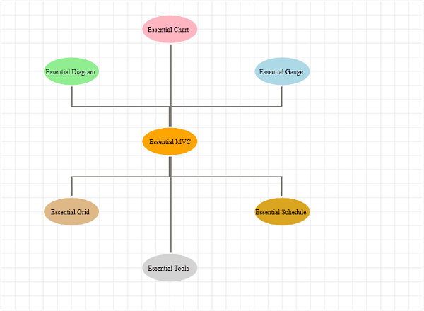

::: {style="DISPLAY: none"}
{#d2h_url_template}{#d2h_package_url style="WIDTH: 0px; DISPLAY: none; HEIGHT: 0px"}
:::

::::: {.d2h_secondary_topic style="PADDING-BOTTOM: 10pt; MARGIN: 0pt; PADDING-LEFT: 0pt; PADDING-RIGHT: 0pt; PADDING-TOP: 0pt"}
#### Using Properties Model {#using-properties-model style="PAGE-BREAK-AFTER: auto; tab-stops: 0pt"}

1.   In the **controller**, create an object for the **DiagramPropertiesModel** class and set the **ShowHorizontalGridLine** and **ShowVerticalGridLine** properties and pass this model class to **view data**.

 

::: {align="center"}
+------------------------------------------------------------------------------------------------------------------------------------------------------------------------------------------------------------------------------------------------------------------------------------------------------------------------------------+
| **[Controller]{style="FONT-FAMILY: 'Courier New'; FONT-SIZE: 11pt"}[]{style="FONT-FAMILY: 'Courier New'; FONT-SIZE: 11pt"}**                                                                                                                                                                                                       |
|                                                                                                                                                                                                                                                                                                                                    |
| [          [DiagramPropertiesModel]{style="COLOR: #2b91af"} model = [new]{style="COLOR: blue"} [DiagramPropertiesModel]{style="COLOR: #2b91af"}()]{style="FONT-FAMILY: 'Courier New'; FONT-SIZE: 11pt"}                                                                                                                            |
|                                                                                                                                                                                                                                                                                                                                    |
| [            {]{style="FONT-FAMILY: 'Courier New'; FONT-SIZE: 11pt"}                                                                                                                                                                                                                                                               |
|                                                                                                                                                                                                                                                                                                                                    |
| [                ShowHorizontalGridLine = [true]{style="COLOR: blue"},]{style="FONT-FAMILY: 'Courier New'; FONT-SIZE: 11pt"}                                                                                                                                                                                                       |
|                                                                                                                                                                                                                                                                                                                                    |
| [                ShowVerticalGridLine = [true,]{style="COLOR: blue"}]{style="FONT-FAMILY: 'Courier New'; FONT-SIZE: 11pt"}                                                                                                                                                                                                         |
|                                                                                                                                                                                                                                                                                                                                    |
| [                DiagramMode = ]{style="FONT-FAMILY: 'Courier New'; COLOR: black; FONT-SIZE: 11pt"}[DiagramMode]{style="FONT-FAMILY: 'Courier New'; COLOR: #2b91af; FONT-SIZE: 11pt"}[.SVG]{style="FONT-FAMILY: 'Courier New'; COLOR: black; FONT-SIZE: 11pt"}[]{style="FONT-FAMILY: 'Courier New'; COLOR: blue; FONT-SIZE: 11pt"} |
|                                                                                                                                                                                                                                                                                                                                    |
| [            };]{style="FONT-FAMILY: 'Courier New'; FONT-SIZE: 11pt"}                                                                                                                                                                                                                                                              |
|                                                                                                                                                                                                                                                                                                                                    |
| [            ViewData\[[\"GridLines\"]{style="COLOR: #a31515"}\] = model;]{style="FONT-FAMILY: 'Courier New'; FONT-SIZE: 11pt"}[]{style="FONT-FAMILY: 'Courier New'; FONT-SIZE: 11pt"}                                                                                                                                             |
+------------------------------------------------------------------------------------------------------------------------------------------------------------------------------------------------------------------------------------------------------------------------------------------------------------------------------------+
:::

**Note:** If you want to create the diagram in the Canvas mode, change the **DiagramMode** to **Canvas**. By default the diagram is rendered in the SVG mode.

**[]{style="FONT-FAMILY: 'Calibri','sans-serif'"}** 

2.   Create a **view**. In the **view**, invoke the **Diagram** helper with the control ID which is the same as the **view data** name.

 

::: {align="center"}
+------------------------------------------------------------------------------------------------------------------------------------------------------------------------+
| **[View]{style="FONT-FAMILY: 'Courier New'; FONT-SIZE: 11pt"}[]{style="FONT-FAMILY: 'Courier New'"}**                                                                  |
|                                                                                                                                                                        |
| [  [\<%]{style="BACKGROUND: yellow"}{]{style="FONT-FAMILY: 'Courier New'; FONT-SIZE: 11pt"}                                                                            |
|                                                                                                                                                                        |
| [              Html.Syncfusion().Diagram([\"GridLines\"]{style="COLOR: #a31515"})]{style="FONT-FAMILY: 'Courier New'; FONT-SIZE: 11pt"}                                |
|                                                                                                                                                                        |
| [                  .Render();]{style="FONT-FAMILY: 'Courier New'; FONT-SIZE: 11pt"}                                                                                    |
|                                                                                                                                                                        |
| [    }]{style="FONT-FAMILY: 'Courier New'; FONT-SIZE: 11pt"}                                                                                                           |
|                                                                                                                                                                        |
| [  [%\>]{style="BACKGROUND: yellow"}]{style="FONT-FAMILY: 'Courier New'; FONT-SIZE: 11pt"}[ ]{style="FONT-FAMILY: 'Courier New'; BACKGROUND: yellow; FONT-SIZE: 11pt"} |
+------------------------------------------------------------------------------------------------------------------------------------------------------------------------+
:::

[]{style="FONT-FAMILY: Consolas; BACKGROUND: yellow; FONT-SIZE: 9.5pt"} 

3.   Build and run the application.

{border="0"}

Figure 138: Gridlines

[]{#related-topics}
:::::
