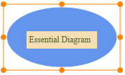
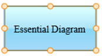
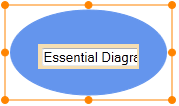
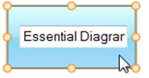

::: {style="DISPLAY: none"}
[](ms-xhelp:///?Id=d2h_url_template){#d2h_url_template}{#d2h_package_url style="WIDTH: 0px; DISPLAY: none; HEIGHT: 0px"}
:::

:::: {.d2h_secondary_topic style="PADDING-BOTTOM: 10pt; MARGIN: 0pt; PADDING-LEFT: 0pt; PADDING-RIGHT: 0pt; PADDING-TOP: 0pt"}
#### Using Properties Model {#using-properties-model style="tab-stops: 0pt"}

The following steps guide on adding a label to the node through the properties model.

1.   In the **controller**, create an object for the **Node** class and set the **Label** and **LabelVisibility** properties.

2.  Create an object for the **DiagramPropertiesModel** class and set the **Nodes** property. Pass this model class to the **view data**.

::: {align="center"}
+---------------------------------------------------------------------------------------------------------------------------------------------------------------------------------------------------------------------------------------------------------------------------------------------------------------------------------------------------------------------------------------------------------------------------------------------------------------------------------------------------------------------------------------------------------------+
| **[Controller]{style="FONT-FAMILY: 'Courier New'"}**                                                                                                                                                                                                                                                                                                                                                                                                                                                                                                          |
|                                                                                                                                                                                                                                                                                                                                                                                                                                                                                                                                                               |
| **[]{style="FONT-FAMILY: 'Courier New'"}**                                                                                                                                                                                                                                                                                                                                                                                                                                                                                                                    |
|                                                                                                                                                                                                                                                                                                                                                                                                                                                                                                                                                               |
| [    [Node]{style="COLOR: #2b91af"} node = [new]{style="COLOR: blue"} [Node]{style="COLOR: #2b91af"}()]{style="FONT-FAMILY: 'Courier New'; FONT-SIZE: 11pt"}                                                                                                                                                                                                                                                                                                                                                                                                  |
|                                                                                                                                                                                                                                                                                                                                                                                                                                                                                                                                                               |
| [    {]{style="FONT-FAMILY: 'Courier New'; FONT-SIZE: 11pt"}                                                                                                                                                                                                                                                                                                                                                                                                                                                                                                  |
|                                                                                                                                                                                                                                                                                                                                                                                                                                                                                                                                                               |
| [        Name = [\"EssentialDiagram\"]{style="COLOR: #a31515"},]{style="FONT-FAMILY: 'Courier New'; FONT-SIZE: 11pt"}                                                                                                                                                                                                                                                                                                                                                                                                                                         |
|                                                                                                                                                                                                                                                                                                                                                                                                                                                                                                                                                               |
| [        Shape = [Shapes]{style="COLOR: #2b91af"}.RoundedRectangle,]{style="FONT-FAMILY: 'Courier New'; FONT-SIZE: 11pt"}                                                                                                                                                                                                                                                                                                                                                                                                                                     |
|                                                                                                                                                                                                                                                                                                                                                                                                                                                                                                                                                               |
| [        LabelVisibility = [true,]{style="COLOR: blue"}]{style="FONT-FAMILY: 'Courier New'; FONT-SIZE: 11pt"}                                                                                                                                                                                                                                                                                                                                                                                                                                                 |
|                                                                                                                                                                                                                                                                                                                                                                                                                                                                                                                                                               |
| [        Label = [\"Essential Diagram\"]{style="COLOR: #a31515"}]{style="FONT-FAMILY: 'Courier New'; FONT-SIZE: 11pt"}                                                                                                                                                                                                                                                                                                                                                                                                                                        |
|                                                                                                                                                                                                                                                                                                                                                                                                                                                                                                                                                               |
| [    };]{style="FONT-FAMILY: 'Courier New'; FONT-SIZE: 11pt"}                                                                                                                                                                                                                                                                                                                                                                                                                                                                                                 |
|                                                                                                                                                                                                                                                                                                                                                                                                                                                                                                                                                               |
| [    ]{style="FONT-FAMILY: 'Courier New'; COLOR: #2b91af"}[DiagramPropertiesModel]{style="FONT-FAMILY: 'Courier New'; COLOR: #2b91af; FONT-SIZE: 11pt"}[ diagramModel = ]{style="FONT-FAMILY: 'Courier New'; COLOR: black; FONT-SIZE: 11pt"}[new]{style="FONT-FAMILY: 'Courier New'; COLOR: blue; FONT-SIZE: 11pt"}[ ]{style="FONT-FAMILY: 'Courier New'; COLOR: black; FONT-SIZE: 11pt"}[DiagramPropertiesModel]{style="FONT-FAMILY: 'Courier New'; COLOR: #2b91af; FONT-SIZE: 11pt"}[()]{style="FONT-FAMILY: 'Courier New'; COLOR: black; FONT-SIZE: 11pt"} |
|                                                                                                                                                                                                                                                                                                                                                                                                                                                                                                                                                               |
| [    {]{style="FONT-FAMILY: 'Courier New'; COLOR: black; FONT-SIZE: 11pt"}                                                                                                                                                                                                                                                                                                                                                                                                                                                                                    |
|                                                                                                                                                                                                                                                                                                                                                                                                                                                                                                                                                               |
| [         Width =  750,]{style="FONT-FAMILY: 'Courier New'; COLOR: black; FONT-SIZE: 11pt"}                                                                                                                                                                                                                                                                                                                                                                                                                                                                   |
|                                                                                                                                                                                                                                                                                                                                                                                                                                                                                                                                                               |
| [         Height =  500,]{style="FONT-FAMILY: 'Courier New'; COLOR: black; FONT-SIZE: 11pt"}                                                                                                                                                                                                                                                                                                                                                                                                                                                                  |
|                                                                                                                                                                                                                                                                                                                                                                                                                                                                                                                                                               |
| [         DiagramMode = ]{style="FONT-FAMILY: 'Courier New'; COLOR: black; FONT-SIZE: 11pt"}[DiagramMode]{style="FONT-FAMILY: 'Courier New'; COLOR: #2b91af; FONT-SIZE: 11pt"}[.SVG,]{style="FONT-FAMILY: 'Courier New'; COLOR: black; FONT-SIZE: 11pt"}                                                                                                                                                                                                                                                                                                      |
|                                                                                                                                                                                                                                                                                                                                                                                                                                                                                                                                                               |
|              Nodes = new NodesCollection(){ node }                                                                                                                                                                                                                                                                                                                                                                                                                                                                                                            |
|                                                                                                                                                                                                                                                                                                                                                                                                                                                                                                                                                               |
| [    };]{style="FONT-FAMILY: 'Courier New'; COLOR: black; FONT-SIZE: 11pt"}**[]{style="FONT-FAMILY: 'Courier New'; FONT-SIZE: 11pt"}**                                                                                                                                                                                                                                                                                                                                                                                                                        |
+---------------------------------------------------------------------------------------------------------------------------------------------------------------------------------------------------------------------------------------------------------------------------------------------------------------------------------------------------------------------------------------------------------------------------------------------------------------------------------------------------------------------------------------------------------------+
:::

**Note:** If you want to create the diagram in the Canvas mode, change the **DiagramMode** to **Canvas**. By default the diagram is rendered in the SVG mode.

 

3.   In the **view**, invoke the diagram helper with the control ID which is the same as the **view data** name.

 

+---------------------------------------------------------------------------------------+
| **[View]{style="FONT-FAMILY: 'Courier New'"}**[ ]{style="FONT-FAMILY: 'Courier New'"} |
|                                                                                       |
| ``` {style="BACKGROUND: #f2f2f2"}                                                     |
| <%{                                                                                   |
| ```                                                                                   |
|                                                                                       |
| ``` {style="BACKGROUND: #f2f2f2"}                                                     |
|       Html.Syncfusion().Diagram("FlatDiagram")                                        |
| ```                                                                                   |
|                                                                                       |
| [          .Render();]{style="FONT-FAMILY: 'Courier New'"}                            |
|                                                                                       |
| ``` {style="BACKGROUND: #f2f2f2"}                                                     |
|   }                                                                                   |
| ```                                                                                   |
|                                                                                       |
| [%\>]{style="BACKGROUND: yellow; COLOR: black"}[]{style="FONT-FAMILY: 'Courier New'"} |
+---------------------------------------------------------------------------------------+

 

4.   Build and run the application.

 

 

{border="0"}                           {border="0"}

Figure 46: Node Label(in Canvas Mode)                 Figure 47: Node Label(in SVG Mode)[]{style="COLOR: black"}

 

[Label Editing]{style="COLOR: black"}[]{style="COLOR: black; FONT-WEIGHT: normal"}

Create a diagram with a single node and the node\'s label can be edited at run time by setting the **IsLabelEditable** property to **True**.

 

 

To specify a label at run:

1.   Double-click on a node. A text box will appear with the cursor at the beginning.

2.   Now type the label name and press ENTER. The label will be displayed on the node.

 

{border="0"}                                      {border="0"}

Figure 48: Label Editor(in Canvas Mode)                              Figure 49: Label Editor(in SVG Mode)

 

[]{#related-topics}
::::
