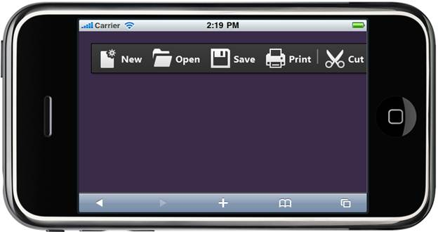

::: {style="DISPLAY: none"}
{#d2h_url_template} {#d2h_package_url style="WIDTH: 0px; DISPLAY: none; HEIGHT: 0px"}
:::

::: {.d2h_secondary_topic style="PADDING-BOTTOM: 10pt; MARGIN: 0pt; PADDING-LEFT: 0pt; PADDING-RIGHT: 0pt; PADDING-TOP: 0pt"}
##### Using Properties Model {#using-properties-model style="tab-stops: 0pt"}

The following steps, explains the appearance of Toolbar Control using the Properties model:

1.   In the **Controller**, create an instance for the **MobToolbarModel** and pass the instance through **ViewData** to **View** as given below.**

*[[ []{style="TEXT-DECORATION: none"} ]{style="FONT-FAMILY: 'Calibri','sans-serif'"}]{.underline}*  

+-----------------------------------------------------------------------------------------------------------------------------------------------------------------------------------------------------------------------------------------------------------------------------------+
| **[\[Controller\]]{style="FONT-FAMILY: 'Courier New'"}**                                                                                                                                                                                                                          |
|                                                                                                                                                                                                                                                                                   |
| **[]{style="FONT-FAMILY: 'Courier New'"}**                                                                                                                                                                                                                                        |
|                                                                                                                                                                                                                                                                                   |
| [ [public]{style="COLOR: blue"}[ActionResult]{style="COLOR: #2b91af"} Appearance()]{style="FONT-FAMILY: 'Courier New'"}                                                                                                                                                           |
|                                                                                                                                                                                                                                                                                   |
| [ {]{style="FONT-FAMILY: 'Courier New'"}                                                                                                                                                                                                                                          |
|                                                                                                                                                                                                                                                                                   |
| [   [MobToolbarModel]{style="COLOR: #2b91af"} model = [new]{style="COLOR: blue"}[MobToolbarModel]{style="COLOR: #2b91af"}()]{style="FONT-FAMILY: 'Courier New'"}                                                                                                                  |
|                                                                                                                                                                                                                                                                                   |
| [   {]{style="FONT-FAMILY: 'Courier New'"}                                                                                                                                                                                                                                        |
|                                                                                                                                                                                                                                                                                   |
| [     AutoFormat = [MobSkins]{style="COLOR: #2b91af"}.DarkNight,]{style="FONT-FAMILY: 'Courier New'"}                                                                                                                                                                             |
|                                                                                                                                                                                                                                                                                   |
| [     Items = [new]{style="COLOR: blue"}[List]{style="COLOR: #2b91af"}\<[ToolbarItem]{style="COLOR: #2b91af"}\>()]{style="FONT-FAMILY: 'Courier New'"}                                                                                                                            |
|                                                                                                                                                                                                                                                                                   |
| [     {]{style="FONT-FAMILY: 'Courier New'"}                                                                                                                                                                                                                                      |
|                                                                                                                                                                                                                                                                                   |
| [      [new]{style="COLOR: blue"}[ToolbarItem]{style="COLOR: #2b91af"}() { Value=[\"New\"]{style="COLOR: #a31515"}, Text=[\"New\"]{style="COLOR: #a31515"}, ImageUrl=[\"\~/Content/Toolbar/Images/new.png\"]{style="COLOR: #a31515"}},]{style="FONT-FAMILY: 'Courier New'"}       |
|                                                                                                                                                                                                                                                                                   |
| []{style="FONT-FAMILY: 'Courier New'"}                                                                                                                                                                                                                                            |
|                                                                                                                                                                                                                                                                                   |
| [      [new]{style="COLOR: blue"}[ToolbarItem]{style="COLOR: #2b91af"}() { Value=[\"Open\"]{style="COLOR: #a31515"}, Text=[\"Open\"]{style="COLOR: #a31515"}, ImageUrl=[\"\~/Content/Toolbar/Images/open.png\"]{style="COLOR: #a31515"}},]{style="FONT-FAMILY: 'Courier New'"}    |
|                                                                                                                                                                                                                                                                                   |
| []{style="FONT-FAMILY: 'Courier New'"}                                                                                                                                                                                                                                            |
|                                                                                                                                                                                                                                                                                   |
| [      [new]{style="COLOR: blue"}[ToolbarItem]{style="COLOR: #2b91af"}() { Value=[\"Save\"]{style="COLOR: #a31515"}, Text=[\"Save\"]{style="COLOR: #a31515"}, ImageUrl=[\"\~/Content/Toolbar/Images/save.png\"]{style="COLOR: #a31515"}},]{style="FONT-FAMILY: 'Courier New'"}    |
|                                                                                                                                                                                                                                                                                   |
| []{style="FONT-FAMILY: 'Courier New'"}                                                                                                                                                                                                                                            |
|                                                                                                                                                                                                                                                                                   |
| [      [new]{style="COLOR: blue"}[ToolbarItem]{style="COLOR: #2b91af"}() { Value=[\"Print\"]{style="COLOR: #a31515"}, Text=[\"Print\"]{style="COLOR: #a31515"}, ImageUrl=[\"\~/Content/Toolbar/Images/print.png\"]{style="COLOR: #a31515"}},]{style="FONT-FAMILY: 'Courier New'"} |
|                                                                                                                                                                                                                                                                                   |
| []{style="FONT-FAMILY: 'Courier New'"}                                                                                                                                                                                                                                            |
|                                                                                                                                                                                                                                                                                   |
| [      [new]{style="COLOR: blue"}[ToolbarItem]{style="COLOR: #2b91af"}() { IsSeparator=[true]{style="COLOR: blue"} },]{style="FONT-FAMILY: 'Courier New'"}                                                                                                                        |
|                                                                                                                                                                                                                                                                                   |
| []{style="FONT-FAMILY: 'Courier New'"}                                                                                                                                                                                                                                            |
|                                                                                                                                                                                                                                                                                   |
| [      [new]{style="COLOR: blue"}[ToolbarItem]{style="COLOR: #2b91af"}() { Value=[\"Cut\"]{style="COLOR: #a31515"}, Text=[\"Cut\"]{style="COLOR: #a31515"}, ImageUrl=[\"\~/Content/Toolbar/Images/Cut.png\"]{style="COLOR: #a31515"}}]{style="FONT-FAMILY: 'Courier New'"}        |
|                                                                                                                                                                                                                                                                                   |
| [      }]{style="FONT-FAMILY: 'Courier New'"}                                                                                                                                                                                                                                     |
|                                                                                                                                                                                                                                                                                   |
| [    };]{style="FONT-FAMILY: 'Courier New'"}                                                                                                                                                                                                                                      |
|                                                                                                                                                                                                                                                                                   |
| [    ViewData\[[\"ApperanceToolbar\"]{style="COLOR: #a31515"}\] = model;]{style="FONT-FAMILY: 'Courier New'"}                                                                                                                                                                     |
|                                                                                                                                                                                                                                                                                   |
| [    [return]{style="COLOR: blue"} View();]{style="FONT-FAMILY: 'Courier New'"}                                                                                                                                                                                                   |
|                                                                                                                                                                                                                                                                                   |
| [ }]{style="FONT-FAMILY: 'Courier New'"}                                                                                                                                                                                                                                          |
+-----------------------------------------------------------------------------------------------------------------------------------------------------------------------------------------------------------------------------------------------------------------------------------+

[]{style="FONT-FAMILY: Consolas; FONT-SIZE: 9.5pt"} 

2.   In **View**, invoke the Toolbar helper with the ViewData key as the first argument.

[]{style="FONT-FAMILY: 'Calibri','sans-serif'"} 

+------------------------------------------------------------------------------------------------------------------------------------------------------------------------------------------------------------------------------------------------------------------------+
| **[\[ASPX\]]{style="FONT-FAMILY: 'Courier New'"}**                                                                                                                                                                                                                     |
|                                                                                                                                                                                                                                                                        |
| **[]{style="FONT-FAMILY: 'Courier New'"}**                                                                                                                                                                                                                             |
|                                                                                                                                                                                                                                                                        |
| [\<%]{style="FONT-FAMILY: 'Courier New'; BACKGROUND: yellow"} [=]{style="FONT-FAMILY: 'Courier New'; COLOR: blue"} [Html.MobSyncfusion().Toolbar([\"ApperanceToolbar\"]{style="COLOR: #a31515"})[%\>]{style="BACKGROUND: yellow"}]{style="FONT-FAMILY: 'Courier New'"} |
|                                                                                                                                                                                                                                                                        |
| []{style="FONT-FAMILY: 'Courier New'"}                                                                                                                                                                                                                                 |
+------------------------------------------------------------------------------------------------------------------------------------------------------------------------------------------------------------------------------------------------------------------------+

[]{style="BACKGROUND: yellow"} 

+----------------------------------------------------------------------------------------------------------------------------+
| **[\[Razor\]]{style="FONT-FAMILY: 'Courier New'"}**                                                                        |
|                                                                                                                            |
| **[]{style="FONT-FAMILY: 'Courier New'"}**                                                                                 |
|                                                                                                                            |
| [  [\@{]{style="BACKGROUND: yellow"}]{style="FONT-FAMILY: 'Courier New'"}                                                  |
|                                                                                                                            |
| [        Html.MobSyncfusion().Toolbar([\"ApperanceToolbar\"]{style="COLOR: #a31515"})]{style="FONT-FAMILY: 'Courier New'"} |
|                                                                                                                            |
| [            .Render();]{style="FONT-FAMILY: 'Courier New'"}                                                               |
|                                                                                                                            |
| [   [}]{style="BACKGROUND: yellow"}]{style="FONT-FAMILY: 'Courier New'"} []{style="BACKGROUND: yellow"}                    |
+----------------------------------------------------------------------------------------------------------------------------+

[]{style="BACKGROUND: yellow"} 

3.   Build and run the application.

 

The output is shown in the following screenshot:[]{style="FONT-FAMILY: 'Calibri','sans-serif'"}

{border="0"}

Figure 172: Toolbar Control with DarkNight Theme

[]{#related-topics}
:::
