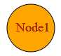

::: {style="DISPLAY: none"}
[](ms-xhelp:///?Id=d2h_url_template){#d2h_url_template}{#d2h_package_url style="WIDTH: 0px; DISPLAY: none; HEIGHT: 0px"}
:::

::: {.d2h_secondary_topic style="PADDING-BOTTOM: 10pt; MARGIN: 0pt; PADDING-LEFT: 0pt; PADDING-RIGHT: 0pt; PADDING-TOP: 0pt"}
#### Using Properties Model {#using-properties-model style="tab-stops: 0pt"}

The following steps guide in the customization of node labels through the properties model.

1.   In the **controller**, create object for Node class and set the **LabelFontColor, LabelBorderColor,** etc., properties.

2.   Create an object for the **DiagramPropertiesModel** class and set the **Nodes** property. Pass this model class to the **view data**.

 

[]{style="FONT-FAMILY: 'Calibri','sans-serif'"} 

+----------------------------------------------------------------------------------------------------------------------------------------------------------------------+
| **[Controller]{style="FONT-FAMILY: 'Courier New'; FONT-SIZE: 11pt"}**                                                                                                |
|                                                                                                                                                                      |
| [            ]{style="FONT-FAMILY: 'Courier New'; FONT-SIZE: 11pt"}                                                                                                  |
|                                                                                                                                                                      |
| [            [Node]{style="COLOR: #2b91af"} node = [new]{style="COLOR: blue"} [Node]{style="COLOR: #2b91af"}()]{style="FONT-FAMILY: 'Courier New'; FONT-SIZE: 11pt"} |
|                                                                                                                                                                      |
| [            {]{style="FONT-FAMILY: 'Courier New'; FONT-SIZE: 11pt"}                                                                                                 |
|                                                                                                                                                                      |
| [                Name = Node1,]{style="FONT-FAMILY: 'Courier New'; FONT-SIZE: 11pt"}                                                                                 |
|                                                                                                                                                                      |
| [                Label = Node1,]{style="FONT-FAMILY: 'Courier New'; FONT-SIZE: 11pt"}                                                                                |
|                                                                                                                                                                      |
| [                LabelBackground = \"#fcb\",]{style="FONT-FAMILY: 'Courier New'; FONT-SIZE: 11pt"}                                                                   |
|                                                                                                                                                                      |
| [                LabelBorderColor = \"#bcf\",]{style="FONT-FAMILY: 'Courier New'; FONT-SIZE: 11pt"}                                                                  |
|                                                                                                                                                                      |
| [                LabelBorderWidth = 1,]{style="FONT-FAMILY: 'Courier New'; FONT-SIZE: 11pt"}                                                                         |
|                                                                                                                                                                      |
| [                LabelFontColor = \"#aad\",]{style="FONT-FAMILY: 'Courier New'; FONT-SIZE: 11pt"}                                                                    |
|                                                                                                                                                                      |
| [                LabelFontFamily = \"Arial\",]{style="FONT-FAMILY: 'Courier New'; FONT-SIZE: 11pt"}                                                                  |
|                                                                                                                                                                      |
| [                LabelFontSize = 12,]{style="FONT-FAMILY: 'Courier New'; FONT-SIZE: 11pt"}                                                                           |
|                                                                                                                                                                      |
| [                LabelHeight = 30,]{style="FONT-FAMILY: 'Courier New'; FONT-SIZE: 11pt"}                                                                             |
|                                                                                                                                                                      |
| [                LabelWidth = 100,]{style="FONT-FAMILY: 'Courier New'; FONT-SIZE: 11pt"}                                                                             |
|                                                                                                                                                                      |
| [                LabelHorizontalAlignment = [Horizontal]{style="COLOR: #2b91af"}.Center,]{style="FONT-FAMILY: 'Courier New'; FONT-SIZE: 11pt"}                       |
|                                                                                                                                                                      |
| [                LabelVerticalAlignment = [Vertical]{style="COLOR: #2b91af"}.Middle,]{style="FONT-FAMILY: 'Courier New'; FONT-SIZE: 11pt"}                           |
|                                                                                                                                                                      |
| [                LabelFontColor = [\"red\"]{style="COLOR: #a31515"},]{style="FONT-FAMILY: 'Courier New'; FONT-SIZE: 11pt"}                                           |
|                                                                                                                                                                      |
| [                LabelFontSize = 16,]{style="FONT-FAMILY: 'Courier New'; FONT-SIZE: 11pt"}                                                                           |
|                                                                                                                                                                      |
| [                LabelFontFamily = [\"Times New Roman]{style="COLOR: #a31515"}]{style="FONT-FAMILY: 'Courier New'; FONT-SIZE: 11pt"}                                 |
|                                                                                                                                                                      |
| [            }; ]{style="FONT-FAMILY: 'Courier New'; FONT-SIZE: 11pt"}                                                                                               |
+----------------------------------------------------------------------------------------------------------------------------------------------------------------------+

[]{style="FONT-FAMILY: Consolas"} 

3.   In the **view**, invoke the **Diagram** helper with the control ID which is same as the **viewdata** name.

 

+---------------------------------------------------------------------------------------+
| **[View]{style="FONT-FAMILY: 'Courier New'"}**[ ]{style="FONT-FAMILY: 'Courier New'"} |
|                                                                                       |
| ``` {style="BACKGROUND: #f2f2f2"}                                                     |
| <%{                                                                                   |
| ```                                                                                   |
|                                                                                       |
| ``` {style="BACKGROUND: #f2f2f2"}                                                     |
|       Html.Syncfusion().Diagram("FlatDiagram")                                        |
| ```                                                                                   |
|                                                                                       |
| [          .Render();]{style="FONT-FAMILY: 'Courier New'"}                            |
|                                                                                       |
| ``` {style="BACKGROUND: #f2f2f2"}                                                     |
|   }                                                                                   |
| ```                                                                                   |
|                                                                                       |
| [%\>]{style="BACKGROUND: yellow; COLOR: black"}[]{style="FONT-FAMILY: 'Courier New'"} |
+---------------------------------------------------------------------------------------+

 

4.   Build and run the application.

[]{style="FONT-FAMILY: 'Calibri','sans-serif'; BACKGROUND: yellow"} 

The following output is generated using the code snippets above.

 

{border="0"}

Figure 50: Customized Label[]{style="FONT-FAMILY: 'Calibri','sans-serif'"}

 

[]{#related-topics}
:::
