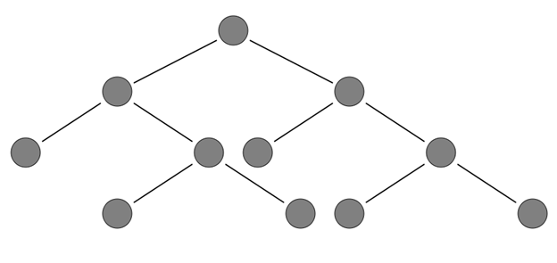
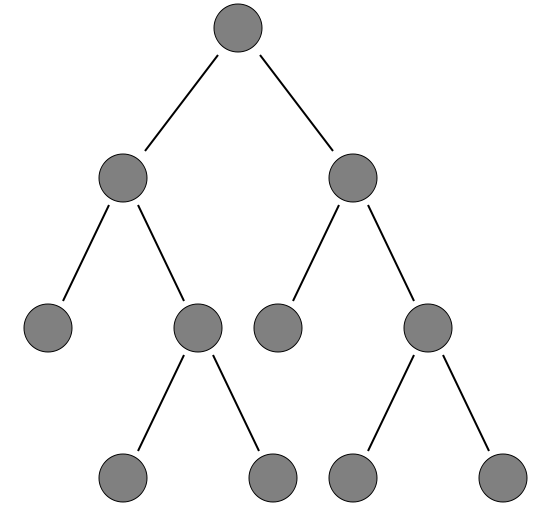
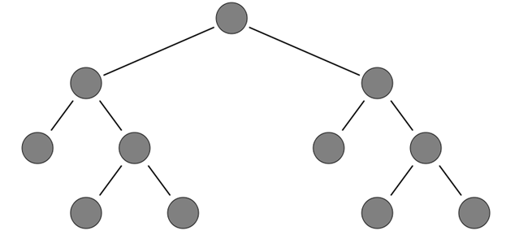

::: {style="DISPLAY: none"}
{#d2h_url_template}{#d2h_package_url style="WIDTH: 0px; DISPLAY: none; HEIGHT: 0px"}
:::

:::: {.d2h_secondary_topic style="PADDING-BOTTOM: 10pt; MARGIN: 0pt; PADDING-LEFT: 0pt; PADDING-RIGHT: 0pt; PADDING-TOP: 0pt"}
#### Using Properties Model {#using-properties-model style="tab-stops: 0pt"}

1.   In the **controller**, create an object for the **DiagramPropertiesModel** class and set the **HorizontalSpacing**, **Vertical Spacing**, and **SpaceBetweenSubTrees** properties. Pass this model class to the **view data**.

 

+---------------------------------------------------------------------------------------------------------------------------------------------------------------------------------------------------------------------------------------------------------------------------------------------------------------------------------------------------------------------------------------+
| **[Controller]{style="FONT-FAMILY: 'Courier New'; FONT-SIZE: 11pt"}**                                                                                                                                                                                                                                                                                                                 |
|                                                                                                                                                                                                                                                                                                                                                                                       |
| [DiagramPropertiesModel]{style="FONT-FAMILY: 'Courier New'; COLOR: #2b91af; FONT-SIZE: 11pt"}[ diagramModel = [new]{style="COLOR: blue"} [DiagramPropertiesModel]{style="COLOR: #2b91af"}();]{style="FONT-FAMILY: 'Courier New'; FONT-SIZE: 11pt"}                                                                                                                                    |
|                                                                                                                                                                                                                                                                                                                                                                                       |
| [            diagramModel.HorizontalSpacing = 100;]{style="FONT-FAMILY: 'Courier New'; FONT-SIZE: 11pt"}                                                                                                                                                                                                                                                                              |
|                                                                                                                                                                                                                                                                                                                                                                                       |
| [            diagramModel.VerticalSpacing = 50;]{style="FONT-FAMILY: 'Courier New'; FONT-SIZE: 11pt"}                                                                                                                                                                                                                                                                                 |
|                                                                                                                                                                                                                                                                                                                                                                                       |
| [            diagramModel.SpaceBetweenSubTrees = 30;]{style="FONT-FAMILY: 'Courier New'; FONT-SIZE: 11pt"}                                                                                                                                                                                                                                                                            |
|                                                                                                                                                                                                                                                                                                                                                                                       |
| [           diagramModel]{style="FONT-FAMILY: 'Courier New'; FONT-SIZE: 11pt"}[.DiagramMode = ]{style="FONT-FAMILY: 'Courier New'; COLOR: black; FONT-SIZE: 11pt"}[DiagramMode]{style="FONT-FAMILY: 'Courier New'; COLOR: #2b91af; FONT-SIZE: 11pt"}[.SVG;]{style="FONT-FAMILY: 'Courier New'; COLOR: black; FONT-SIZE: 11pt"}[]{style="FONT-FAMILY: 'Courier New'; FONT-SIZE: 11pt"} |
+---------------------------------------------------------------------------------------------------------------------------------------------------------------------------------------------------------------------------------------------------------------------------------------------------------------------------------------------------------------------------------------+

**Note:** If you want to create the diagram in the Canvas mode, change the **DiagramMode** to **Canvas**. By default the diagram is rendered in the SVG mode.

**[]{style="FONT-FAMILY: 'Calibri','sans-serif'"}** 

2.   Create a **view**. In the **view**, invoke the **Diagram** helper with the control ID which is the same as the **view data** name.

 

::: {align="center"}
+----------------------------------------------------------------------------------------------------------------------------------------------------------------------------------------------------------------------+
| **[View]{style="FONT-FAMILY: 'Courier New'; FONT-SIZE: 11pt"}**                                                                                                                                                      |
|                                                                                                                                                                                                                      |
| [  [\<%]{style="BACKGROUND: yellow"}{]{style="FONT-FAMILY: 'Courier New'"}                                                                                                                                           |
|                                                                                                                                                                                                                      |
| [              Html.Syncfusion().Diagram([\"]{style="COLOR: #a31515"}]{style="FONT-FAMILY: 'Courier New'"}[FlatDiagram\"]{style="FONT-FAMILY: 'Courier New'; COLOR: #a31515"}[)]{style="FONT-FAMILY: 'Courier New'"} |
|                                                                                                                                                                                                                      |
| [                  .Render();]{style="FONT-FAMILY: 'Courier New'"}                                                                                                                                                   |
|                                                                                                                                                                                                                      |
| [    }]{style="FONT-FAMILY: 'Courier New'"}                                                                                                                                                                          |
|                                                                                                                                                                                                                      |
| [  [%\>]{style="BACKGROUND: yellow"}]{style="FONT-FAMILY: 'Courier New'"}[ ]{style="FONT-FAMILY: 'Courier New'; BACKGROUND: yellow"}                                                                                 |
+----------------------------------------------------------------------------------------------------------------------------------------------------------------------------------------------------------------------+
:::

[]{style="FONT-FAMILY: Consolas; BACKGROUND: yellow; FONT-SIZE: 9.5pt"} 

3.   Build and run the application.

 

The following screen shots illustrate the layout spacing.{border="0"}

Figure 101: Horizontal Spacing  

 

{border="0"}

Figure 102: Vertical Spacing

                                                                 

{border="0"}

Figure 103: Space between Sub-Trees

                                      * *

[]{#related-topics}
::::
