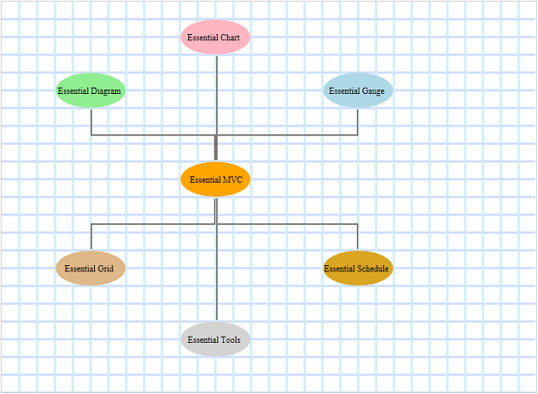

::: {style="DISPLAY: none"}
{#d2h_url_template}{#d2h_package_url style="WIDTH: 0px; DISPLAY: none; HEIGHT: 0px"}
:::

::::: {.d2h_secondary_topic style="PADDING-BOTTOM: 10pt; MARGIN: 0pt; PADDING-LEFT: 0pt; PADDING-RIGHT: 0pt; PADDING-TOP: 0pt"}
#### Using Properties Model {#using-properties-model style="PAGE-BREAK-AFTER: auto; tab-stops: 0pt"}

1.   In the **controller**, create an object for the **DiagramPropertiesModel** class and set the **HorizontalGridLineStyle** and **VerticalGridLineStyle** properties and pass this model class to **view data**.

 

::: {align="center"}
+-----------------------------------------------------------------------------------------------------------------------------------------------------------------------------------------------------------------------------------------------------------------------------------------------------------+
| **[Controller]{style="FONT-FAMILY: 'Courier New'; FONT-SIZE: 11pt"}[]{style="FONT-FAMILY: 'Courier New'; FONT-SIZE: 11pt"}**                                                                                                                                                                              |
|                                                                                                                                                                                                                                                                                                           |
| [DiagramPropertiesModel]{style="FONT-FAMILY: 'Courier New'; COLOR: #2b91af; FONT-SIZE: 11pt"}[ model = [new]{style="COLOR: blue"} [DiagramPropertiesModel]{style="COLOR: #2b91af"}()]{style="FONT-FAMILY: 'Courier New'; FONT-SIZE: 11pt"}                                                                |
|                                                                                                                                                                                                                                                                                                           |
| [{]{style="FONT-FAMILY: 'Courier New'; FONT-SIZE: 11pt"}                                                                                                                                                                                                                                                  |
|                                                                                                                                                                                                                                                                                                           |
| [    ShowHorizontalGridLine = [true]{style="COLOR: blue"},]{style="FONT-FAMILY: 'Courier New'; FONT-SIZE: 11pt"}                                                                                                                                                                                          |
|                                                                                                                                                                                                                                                                                                           |
| [    ShowVerticalGridLine = [true]{style="COLOR: blue"},]{style="FONT-FAMILY: 'Courier New'; FONT-SIZE: 11pt"}                                                                                                                                                                                            |
|                                                                                                                                                                                                                                                                                                           |
| [    HorizontalGridLineStyle = [new]{style="COLOR: blue"} [GridLineStyle]{style="COLOR: #2b91af"}() { GridLineColor = [\"#ccddff\"]{style="COLOR: #a31515"}, GridLineThickness = 3.0 },]{style="FONT-FAMILY: 'Courier New'; FONT-SIZE: 11pt"}                                                             |
|                                                                                                                                                                                                                                                                                                           |
| [    VerticalGridLineStyle = [new]{style="COLOR: blue"} [GridLineStyle]{style="COLOR: #2b91af"}() { GridLineColor = [\"#cceeff\"]{style="COLOR: #a31515"}, GridLineThickness = 3.0 },]{style="FONT-FAMILY: 'Courier New'; FONT-SIZE: 11pt"}                                                               |
|                                                                                                                                                                                                                                                                                                           |
| [    DiagramMode = ]{style="FONT-FAMILY: 'Courier New'; COLOR: black; FONT-SIZE: 11pt"}[DiagramMode]{style="FONT-FAMILY: 'Courier New'; COLOR: #2b91af; FONT-SIZE: 11pt"}[.SVG]{style="FONT-FAMILY: 'Courier New'; COLOR: black; FONT-SIZE: 11pt"}[]{style="FONT-FAMILY: 'Courier New'; FONT-SIZE: 11pt"} |
|                                                                                                                                                                                                                                                                                                           |
| [};]{style="FONT-FAMILY: 'Courier New'; FONT-SIZE: 11pt"}                                                                                                                                                                                                                                                 |
|                                                                                                                                                                                                                                                                                                           |
| [ViewData\[[\"GridLines\"]{style="COLOR: #a31515"}\] = model;]{style="FONT-FAMILY: 'Courier New'; FONT-SIZE: 11pt"}[]{style="FONT-FAMILY: 'Courier New'; FONT-SIZE: 11pt"}                                                                                                                                |
+-----------------------------------------------------------------------------------------------------------------------------------------------------------------------------------------------------------------------------------------------------------------------------------------------------------+
:::

**Note:** If you want to create the diagram in the Canvas mode, change the **DiagramMode** to **Canvas**. By default the diagram is rendered in the SVG mode.

**[]{style="FONT-FAMILY: 'Calibri','sans-serif'"}** 

2.   Create a **view**. In the **view**, invoke the **Diagram** helper with the control ID which is the same as the **view data** name.

::: {align="center"}
+------------------------------------------------------------------------------------------------------------------------------------------------------------------------+
| **[View]{style="FONT-FAMILY: 'Courier New'; FONT-SIZE: 11pt"}[]{style="FONT-FAMILY: 'Courier New'"}**                                                                  |
|                                                                                                                                                                        |
| [  [\<%]{style="BACKGROUND: yellow"}{]{style="FONT-FAMILY: 'Courier New'; FONT-SIZE: 11pt"}                                                                            |
|                                                                                                                                                                        |
| [              Html.Syncfusion().Diagram([\"GridLines\"]{style="COLOR: #a31515"})]{style="FONT-FAMILY: 'Courier New'; FONT-SIZE: 11pt"}                                |
|                                                                                                                                                                        |
| [                  .Render();]{style="FONT-FAMILY: 'Courier New'; FONT-SIZE: 11pt"}                                                                                    |
|                                                                                                                                                                        |
| [    }]{style="FONT-FAMILY: 'Courier New'; FONT-SIZE: 11pt"}                                                                                                           |
|                                                                                                                                                                        |
| [  [%\>]{style="BACKGROUND: yellow"}]{style="FONT-FAMILY: 'Courier New'; FONT-SIZE: 11pt"}[ ]{style="FONT-FAMILY: 'Courier New'; BACKGROUND: yellow; FONT-SIZE: 11pt"} |
+------------------------------------------------------------------------------------------------------------------------------------------------------------------------+
:::

[]{style="FONT-FAMILY: Consolas; BACKGROUND: yellow; FONT-SIZE: 9.5pt"} 

3.   Build and run the application.

 

 

{border="0"}

Figure 142: Custom Gridline Style

 

Tables for Properties, Methods, and Events

Properties

The properties of gridlines are tabulated as follows:

  ------------------------------------------------------------------------------------------------------------ ----------------------------------------------------------------------------------------------------------------------------------------------------------------------------------------------------- ------------------------------------- -----------------------------------------------
  **[Property]{style="COLOR: black"}**                                                                         **[Description]{style="COLOR: black"}**                                                                                                                                                               **[Type]{style="COLOR: black"}**      **[Data Type]{style="COLOR: black"}**
  [ShowVerticalGridLine]{style="COLOR: black"}[]{style="FONT-FAMILY: 'Segoe UI','sans-serif'; COLOR: black"}   [Gets or sets a value indicating whether the vertical gridlines will be displayed. The default value is False.]{style="COLOR: black"}[]{style="FONT-FAMILY: 'Segoe UI','sans-serif'; COLOR: black"}   [Server side]{style="COLOR: black"}   [Binary, true or false]{style="COLOR: black"}
  [ShowHorizontalGridLine]{style="COLOR: black"}                                                               [Gets or sets a value indicating whether the horizontal gridlines will be displayed. The default value is False.]{style="COLOR: black"}                                                               [Server side]{style="COLOR: black"}   [Binary, true or false]{style="COLOR: black"}
  [GridHorizontalOffset]{style="COLOR: black"}                                                                 [Gets or sets the horizontal offset value for the grid.]{style="COLOR: black"}                                                                                                                        [Server side]{style="COLOR: black"}   [Double]{style="COLOR: black"}
  [GridVerticalOffset]{style="COLOR: black"}                                                                   [Gets or sets the vertical offset value for the grid.]{style="COLOR: black"}                                                                                                                          [Server side]{style="COLOR: black"}   [Double]{style="COLOR: black"}
  [HorizontalGridLineStyle]{style="COLOR: black"}                                                              [Gets or sets the style for the horizontal gridlines.]{style="COLOR: black"}                                                                                                                          [Server side]{style="COLOR: black"}   [GridLineStyle]{style="COLOR: black"}
  [VerticalGridLineStyle]{style="COLOR: black"}                                                                [Gets or sets the style for the vertical gridlines.]{style="COLOR: black"}                                                                                                                            [Server side]{style="COLOR: black"}   [GridLineStyle]{style="COLOR: black"}
  ------------------------------------------------------------------------------------------------------------ ----------------------------------------------------------------------------------------------------------------------------------------------------------------------------------------------------- ------------------------------------- -----------------------------------------------

[]{style="COLOR: black"} 

Methods

  Method                           Description                                                                                                                     Parameters                                      Type                                  Return Type
  -------------------------------- ------------------------------------------------------------------------------------------------------------------------------- ----------------------------------------------- ------------------------------------- ------------------------------
  showHorizontalGridLine           [Sets a value indicating whether the horizontal gridlines will be displayed.]{style="COLOR: black"}[]{style="COLOR: #c00000"}   Binary, true or false[]{style="COLOR: black"}   [Client side]{style="COLOR: black"}   [Void]{style="COLOR: black"}
  showVerticalGridLine             [Sets a value indicating whether the vertical gridlines will be displayed.]{style="COLOR: black"}                               Binary, true or false[]{style="COLOR: black"}   [Client side]{style="COLOR: black"}   [Void]{style="COLOR: black"}
  setGridLineHorizontalOffset      [Sets the horizontal offset value.]{style="COLOR: black"}                                                                       Float offsetValue[]{style="COLOR: black"}       [Client side]{style="COLOR: black"}   [Void]{style="COLOR: black"}
  setGridLineVerticalOffset        [Sets the vertical offset value.]{style="COLOR: black"}                                                                         Float offsetValue[]{style="COLOR: black"}       [Client side]{style="COLOR: black"}   [Void]{style="COLOR: black"}
  setHorizontalGridLineThickness   [Sets the horizontal gridline thickness.]{style="COLOR: black"}                                                                 Float thickness[]{style="COLOR: black"}         [Client side]{style="COLOR: black"}   [Void]{style="COLOR: black"}
  setVerticalGridLineThickness     [Sets the vertical gridline thickness.]{style="COLOR: black"}                                                                   Float thickness[]{style="COLOR: black"}         [Client side]{style="COLOR: black"}   [Void]{style="COLOR: black"}
  setHorizontalGridLineColor       [Sets the horizontal gridline color.]{style="COLOR: black"}                                                                     String color[]{style="COLOR: black"}            [Client side]{style="COLOR: black"}   [Void]{style="COLOR: black"}
  setVerticalGridLineColor         [Sets the vertical gridline color.]{style="COLOR: black"}                                                                       String color[]{style="COLOR: black"}            [Client side]{style="COLOR: black"}   [Void]{style="COLOR: black"}

 

Sample Link

To view samples:

1.   Open the **Diagram** sample browser from the dashboard (Refer to the [Samples and Location](http://help.syncfusion.com/ug_92/User%20Interface/ASP.NET%20MVC/Diagram/default.htm?turl=Documents%2F22samplesandlocation.htm) chapter).

2.  Navigate to **Diagram.Mvc** \> **Getting Started** \> **Grid Lines demo**.

[]{#related-topics}
:::::
