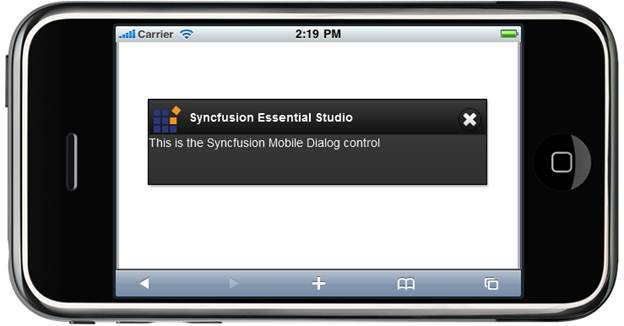

::: {style="DISPLAY: none"}
{#d2h_url_template} {#d2h_package_url style="WIDTH: 0px; DISPLAY: none; HEIGHT: 0px"}
:::

::: {.d2h_secondary_topic style="PADDING-BOTTOM: 10pt; MARGIN: 0pt; PADDING-LEFT: 0pt; PADDING-RIGHT: 0pt; PADDING-TOP: 0pt"}
##### Using Properties Model {#using-properties-model style="tab-stops: 0pt"}

The following steps explain the setting of the dimensions of the dialog using the Properties model:

1.   In the **Controller**, create an instance of **MobDialogModel**, define the **Height** and **Width** and pass the instance through **View Specific Data** to **View** as given below.**

*[[ []{style="TEXT-DECORATION: none"} ]{style="FONT-FAMILY: 'Calibri','sans-serif'"}]{.underline}*  

+-------------------------------------------------------------------------------------------------------------------------------------------------------------------------+
| []{style="FONT-FAMILY: 'Courier New'; BACKGROUND: yellow"}                                                                                                              |
|                                                                                                                                                                         |
| **[\[Controller\]]{style="FONT-FAMILY: 'Courier New'"}**                                                                                                                |
|                                                                                                                                                                         |
| **[]{style="FONT-FAMILY: 'Courier New'"}**                                                                                                                              |
|                                                                                                                                                                         |
| [        [public]{style="COLOR: blue"}[ActionResult]{style="COLOR: #2b91af"} Dialog()]{style="FONT-FAMILY: 'Courier New'"}                                              |
|                                                                                                                                                                         |
| [        {]{style="FONT-FAMILY: 'Courier New'"}                                                                                                                         |
|                                                                                                                                                                         |
| [            [//create an instance of MobDialogModel]{style="COLOR: green"}]{style="FONT-FAMILY: 'Courier New'"}                                                        |
|                                                                                                                                                                         |
| [            [MobDialogModel]{style="COLOR: #2b91af"} model = [new]{style="COLOR: blue"}[MobDialogModel]{style="COLOR: #2b91af"}()]{style="FONT-FAMILY: 'Courier New'"} |
|                                                                                                                                                                         |
| [            {]{style="FONT-FAMILY: 'Courier New'"}                                                                                                                     |
|                                                                                                                                                                         |
| [                Height = 100,]{style="FONT-FAMILY: 'Courier New'"}                                                                                                     |
|                                                                                                                                                                         |
| [                Width = 400,]{style="FONT-FAMILY: 'Courier New'"}                                                                                                      |
|                                                                                                                                                                         |
| [                Title = [\"Syncfusion Essential Studio\"]{style="COLOR: #a31515"},]{style="FONT-FAMILY: 'Courier New'"}                                                |
|                                                                                                                                                                         |
| [                DialogIconUrl = [\"\~/Content/Images/favicon.ico\"]{style="COLOR: #a31515"}]{style="FONT-FAMILY: 'Courier New'"}                                       |
|                                                                                                                                                                         |
| [            };]{style="FONT-FAMILY: 'Courier New'"}                                                                                                                    |
|                                                                                                                                                                         |
| [            ViewData\[[\"MobDialog\"]{style="COLOR: #a31515"}\] = model;]{style="FONT-FAMILY: 'Courier New'"}                                                          |
|                                                                                                                                                                         |
| [            [return]{style="COLOR: blue"} View();]{style="FONT-FAMILY: 'Courier New'"}                                                                                 |
|                                                                                                                                                                         |
| [        }]{style="FONT-FAMILY: 'Courier New'"}                                                                                                                         |
|                                                                                                                                                                         |
| []{style="FONT-FAMILY: 'Courier New'"}                                                                                                                                  |
+-------------------------------------------------------------------------------------------------------------------------------------------------------------------------+

[]{style="FONT-FAMILY: Consolas; FONT-SIZE: 9.5pt"} 

2.   In **View**, create the dialog contents and invoke the dialog helper with the **View Data** key as the first argument.

[]{style="FONT-FAMILY: 'Calibri','sans-serif'"} 

+----------------------------------------------------------------------------------------------------------------------------------------------------------------------+
| **[\[ASPX\]]{style="FONT-FAMILY: 'Courier New'"}**                                                                                                                   |
|                                                                                                                                                                      |
| **[]{style="FONT-FAMILY: 'Courier New'"}**                                                                                                                           |
|                                                                                                                                                                      |
| [        [\<%]{style="BACKGROUND: yellow"}{]{style="FONT-FAMILY: 'Courier New'"}                                                                                     |
|                                                                                                                                                                      |
| [          Html.MobSyncfusion().Dialog([\"MobDialog\"]{style="COLOR: #a31515"})]{style="FONT-FAMILY: 'Courier New'"}                                                 |
|                                                                                                                                                                      |
| [              .Template(() =\>]{style="FONT-FAMILY: 'Courier New'"}                                                                                                 |
|                                                                                                                                                                      |
| [              {[%\>]{style="BACKGROUND: yellow"}[\<]{style="COLOR: blue"}[div]{style="COLOR: maroon"}[\>]{style="COLOR: blue"}]{style="FONT-FAMILY: 'Courier New'"} |
|                                                                                                                                                                      |
| [                  This is the Syncfusion Mobile Dialog control]{style="FONT-FAMILY: 'Courier New'"}                                                                 |
|                                                                                                                                                                      |
| [              [\</]{style="COLOR: blue"}[div]{style="COLOR: maroon"}[\>]{style="COLOR: blue"}]{style="FONT-FAMILY: 'Courier New'"}                                  |
|                                                                                                                                                                      |
| [    [\<%]{style="BACKGROUND: yellow"}})]{style="FONT-FAMILY: 'Courier New'"}                                                                                        |
|                                                                                                                                                                      |
| [            .Render();]{style="FONT-FAMILY: 'Courier New'"}                                                                                                         |
|                                                                                                                                                                      |
| [      }[%\>]{style="BACKGROUND: yellow"}]{style="FONT-FAMILY: 'Courier New'"}                                                                                       |
|                                                                                                                                                                      |
| []{style="FONT-FAMILY: 'Courier New'"}                                                                                                                               |
+----------------------------------------------------------------------------------------------------------------------------------------------------------------------+

[]{style="BACKGROUND: yellow"} 

+---------------------------------------------------------------------------------------------------------------------------------------------------------------------------+
| **[\[Razor\]]{style="FONT-FAMILY: 'Courier New'"}**                                                                                                                       |
|                                                                                                                                                                           |
| **[]{style="FONT-FAMILY: 'Courier New'"}**                                                                                                                                |
|                                                                                                                                                                           |
| [    [\@{]{style="BACKGROUND: yellow"}]{style="FONT-FAMILY: 'Courier New'"}                                                                                               |
|                                                                                                                                                                           |
| [        Html.MobSyncfusion().Dialog([\"MobDialog\"]{style="COLOR: #a31515"})]{style="FONT-FAMILY: 'Courier New'"}                                                        |
|                                                                                                                                                                           |
| [            .Template([@]{style="BACKGROUND: yellow"}[\<]{style="COLOR: blue"}[div]{style="COLOR: maroon"}[\>]{style="COLOR: blue"}]{style="FONT-FAMILY: 'Courier New'"} |
|                                                                                                                                                                           |
| [                This is the Syncfusion Mobile Dialog control]{style="FONT-FAMILY: 'Courier New'"}                                                                        |
|                                                                                                                                                                           |
| [            [\</]{style="COLOR: blue"}[div]{style="COLOR: maroon"}[\>]{style="COLOR: blue"}]{style="FONT-FAMILY: 'Courier New'"}                                         |
|                                                                                                                                                                           |
| [).Render();]{style="FONT-FAMILY: 'Courier New'"}                                                                                                                         |
|                                                                                                                                                                           |
| [    [}]{style="BACKGROUND: yellow"}]{style="FONT-FAMILY: 'Courier New'"}                                                                                                 |
|                                                                                                                                                                           |
| []{style="FONT-FAMILY: 'Courier New'; BACKGROUND: yellow"}                                                                                                                |
+---------------------------------------------------------------------------------------------------------------------------------------------------------------------------+

[]{style="BACKGROUND: yellow"} 

3.   Build and run the application in emulator.

The output is displayed in the following screenshot.

[]{style="FONT-FAMILY: 'Calibri','sans-serif'"} 

{border="0"}

Figure 41: Dialog with customized dimensions

 

[]{#related-topics}
:::
