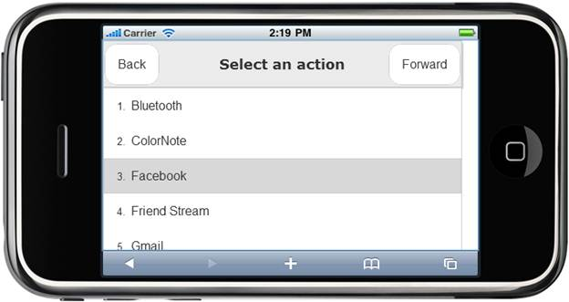

::: {style="DISPLAY: none"}
{#d2h_url_template} {#d2h_package_url style="WIDTH: 0px; DISPLAY: none; HEIGHT: 0px"}
:::

::: {.d2h_secondary_topic style="PADDING-BOTTOM: 10pt; MARGIN: 0pt; PADDING-LEFT: 0pt; PADDING-RIGHT: 0pt; PADDING-TOP: 0pt"}
##### Using Properties Model {#using-properties-model style="tab-stops: 0pt"}

 

The following steps will explain the addition of a Header to an application using the Properties model:

1.   Create an instance for the **MobHeaderModel** in the Controller, define the properties and pass the created instance through the **ViewData** to **View** as given below:**

*[[ []{style="TEXT-DECORATION: none"} ]{style="FONT-FAMILY: 'Calibri','sans-serif'"}]{.underline}*  

+-------------------------------------------------------------------------------------------------------------------------------------------------------------------------+
| **[\[Controller\]]{style="FONT-FAMILY: 'Courier New'"}**                                                                                                                |
|                                                                                                                                                                         |
| **[]{style="FONT-FAMILY: 'Courier New'"}**                                                                                                                              |
|                                                                                                                                                                         |
| [        [public]{style="COLOR: blue"}[ActionResult]{style="COLOR: #2b91af"} CoreFeatures()]{style="FONT-FAMILY: 'Courier New'"}                                        |
|                                                                                                                                                                         |
| [        {]{style="FONT-FAMILY: 'Courier New'"}                                                                                                                         |
|                                                                                                                                                                         |
| [            [MobHeaderModel]{style="COLOR: #2b91af"} model = [new]{style="COLOR: blue"}[MobHeaderModel]{style="COLOR: #2b91af"}()]{style="FONT-FAMILY: 'Courier New'"} |
|                                                                                                                                                                         |
| [            {]{style="FONT-FAMILY: 'Courier New'"}                                                                                                                     |
|                                                                                                                                                                         |
| [                TargetId = [\"targetHeader\"]{style="COLOR: #a31515"},]{style="FONT-FAMILY: 'Courier New'"}                                                            |
|                                                                                                                                                                         |
| [                Title = [\"Select an action\"]{style="COLOR: #a31515"},]{style="FONT-FAMILY: 'Courier New'"}                                                           |
|                                                                                                                                                                         |
| [                AutoFormat = [MobSkins]{style="COLOR: #2b91af"}.MetroBlue,]{style="FONT-FAMILY: 'Courier New'"}                                                        |
|                                                                                                                                                                         |
| [                LeftButton = [new]{style="COLOR: blue"}[LeftButton]{style="COLOR: #2b91af"}()]{style="FONT-FAMILY: 'Courier New'"}                                     |
|                                                                                                                                                                         |
| [                {]{style="FONT-FAMILY: 'Courier New'"}                                                                                                                 |
|                                                                                                                                                                         |
| [                    Caption=[\"Back\"]{style="COLOR: #a31515"},]{style="FONT-FAMILY: 'Courier New'"}                                                                   |
|                                                                                                                                                                         |
| [                    ShowButton=[true]{style="COLOR: blue"}]{style="FONT-FAMILY: 'Courier New'"}                                                                        |
|                                                                                                                                                                         |
| [                },]{style="FONT-FAMILY: 'Courier New'"}                                                                                                                |
|                                                                                                                                                                         |
| [                RightButton = [new]{style="COLOR: blue"}[RightButton]{style="COLOR: #2b91af"}()]{style="FONT-FAMILY: 'Courier New'"}                                   |
|                                                                                                                                                                         |
| [                {]{style="FONT-FAMILY: 'Courier New'"}                                                                                                                 |
|                                                                                                                                                                         |
| [                    Caption = [\"Forward\"]{style="COLOR: #a31515"},]{style="FONT-FAMILY: 'Courier New'"}                                                              |
|                                                                                                                                                                         |
| [                    ShowButton = [true]{style="COLOR: blue"}]{style="FONT-FAMILY: 'Courier New'"}                                                                      |
|                                                                                                                                                                         |
| [                }]{style="FONT-FAMILY: 'Courier New'"}                                                                                                                 |
|                                                                                                                                                                         |
| [            };]{style="FONT-FAMILY: 'Courier New'"}                                                                                                                    |
|                                                                                                                                                                         |
| [            ViewData\[[\"Header\"]{style="COLOR: #a31515"}\] = model;]{style="FONT-FAMILY: 'Courier New'"}                                                             |
|                                                                                                                                                                         |
| [            [return]{style="COLOR: blue"} View();]{style="FONT-FAMILY: 'Courier New'"}                                                                                 |
|                                                                                                                                                                         |
| [        }]{style="FONT-FAMILY: 'Courier New'"}                                                                                                                         |
|                                                                                                                                                                         |
| []{style="FONT-FAMILY: 'Courier New'"}                                                                                                                                  |
+-------------------------------------------------------------------------------------------------------------------------------------------------------------------------+

[]{style="FONT-FAMILY: Consolas; FONT-SIZE: 9.5pt"} 

2.   In **View**, invoke the Header helper with the **ViewData** key as first argument.

[]{style="FONT-FAMILY: 'Calibri','sans-serif'"} 

+-------------------------------------------------------------------------------------------------------------------------------------------------------------------------------------------------------------------+
| **[\[ASPX\]]{style="FONT-FAMILY: 'Courier New'"}**                                                                                                                                                                |
|                                                                                                                                                                                                                   |
| **[]{style="FONT-FAMILY: 'Courier New'"}**                                                                                                                                                                        |
|                                                                                                                                                                                                                   |
| [                [\<%]{style="BACKGROUND: yellow"}[=]{style="COLOR: blue"}Html.MobSyncfusion().Header([\"Header\"]{style="COLOR: #a31515"})[%\>]{style="BACKGROUND: yellow"}]{style="FONT-FAMILY: 'Courier New'"} |
|                                                                                                                                                                                                                   |
| []{style="FONT-FAMILY: 'Courier New'; BACKGROUND: yellow"}                                                                                                                                                        |
+-------------------------------------------------------------------------------------------------------------------------------------------------------------------------------------------------------------------+

[]{style="BACKGROUND: yellow"} 

+---------------------------------------------------------------------------------------------------------------------------------------------------------------------------+
| **[\[Razor\]]{style="FONT-FAMILY: 'Courier New'"}**                                                                                                                       |
|                                                                                                                                                                           |
| **[]{style="FONT-FAMILY: 'Courier New'"}**                                                                                                                                |
|                                                                                                                                                                           |
| [    [@]{style="BACKGROUND: yellow"}Html.MobSyncfusion().Header([\"Header\"]{style="COLOR: #a31515"})]{style="FONT-FAMILY: 'Courier New'"} []{style="BACKGROUND: yellow"} |
+---------------------------------------------------------------------------------------------------------------------------------------------------------------------------+

[]{style="BACKGROUND: yellow"} 

3.   Build and run the application.

 

The output is shown in the following screenshot:

 

{border="0"}

Figure 49: Header using Properties Model

[]{style="FONT-FAMILY: 'Calibri','sans-serif'; COLOR: black"} 

[]{#related-topics}
:::
