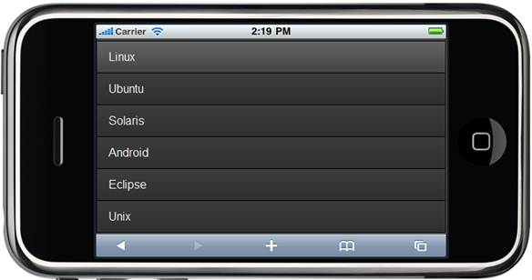
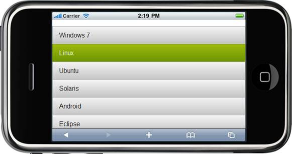
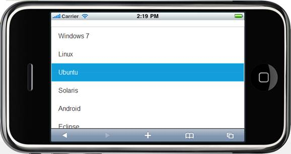
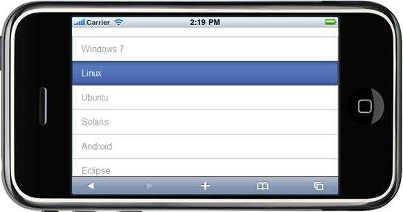

::: {style="DISPLAY: none"}
{#d2h_url_template} {#d2h_package_url style="WIDTH: 0px; DISPLAY: none; HEIGHT: 0px"}
:::

::: {.d2h_secondary_topic style="PADDING-BOTTOM: 10pt; MARGIN: 0pt; PADDING-LEFT: 0pt; PADDING-RIGHT: 0pt; PADDING-TOP: 0pt"}
##### Using Properties Model {#using-properties-model style="tab-stops: 0pt"}

The following steps explain the setting of the Syncfusion themes to the Listbox using the Properties model.

1.   In the **Controller**, create an instance of the **MobListboxModel**, followed by the AutoFormat property with the desired theme as an argument and  pass the instance through **view specific data** to **View** as given below.**

+---------------------------------------------------------------------------------------------------------------------------------------------------------------------------------------------------+
| **[\[Controller\]]{style="FONT-FAMILY: 'Courier New'"}**                                                                                                                                          |
|                                                                                                                                                                                                   |
| **[]{style="FONT-FAMILY: 'Courier New'"}**                                                                                                                                                        |
|                                                                                                                                                                                                   |
| [        ]{style="FONT-FAMILY: 'Courier New'"} [public]{style="FONT-FAMILY: 'Courier New'; COLOR: blue"} [ [ActionResult]{style="COLOR: #2b91af"} ListBox()]{style="FONT-FAMILY: 'Courier New'"}  |
|                                                                                                                                                                                                   |
| [        {]{style="FONT-FAMILY: 'Courier New'"}                                                                                                                                                   |
|                                                                                                                                                                                                   |
| [            [MobListBoxModel]{style="COLOR: #2b91af"} list = [new]{style="COLOR: blue"}[MobListBoxModel]{style="COLOR: #2b91af"}();]{style="FONT-FAMILY: 'Courier New'"}                         |
|                                                                                                                                                                                                   |
| [            **list.AutoFormat = [MobSkins]{style="COLOR: #2b91af"}.DarkNight;**]{style="FONT-FAMILY: 'Courier New'"}                                                                             |
|                                                                                                                                                                                                   |
| [            list.ItemsCollection = [new]{style="COLOR: blue"}[List]{style="COLOR: #2b91af"}\<[ListBoxItem]{style="COLOR: #2b91af"}\>();]{style="FONT-FAMILY: 'Courier New'"}                     |
|                                                                                                                                                                                                   |
| [            list.ItemsCollection.Add([new]{style="COLOR: blue"}[ListBoxItem]{style="COLOR: #2b91af"}() { Text = [\"Windows 7\"]{style="COLOR: #a31515"} });]{style="FONT-FAMILY: 'Courier New'"} |
|                                                                                                                                                                                                   |
| [            list.ItemsCollection.Add([new]{style="COLOR: blue"}[ListBoxItem]{style="COLOR: #2b91af"}() { Text = [\"Linux\"]{style="COLOR: #a31515"} });]{style="FONT-FAMILY: 'Courier New'"}     |
|                                                                                                                                                                                                   |
| [            list.ItemsCollection.Add([new]{style="COLOR: blue"}[ListBoxItem]{style="COLOR: #2b91af"}() { Text = [\"Ubuntu\"]{style="COLOR: #a31515"} });]{style="FONT-FAMILY: 'Courier New'"}    |
|                                                                                                                                                                                                   |
| [            list.ItemsCollection.Add([new]{style="COLOR: blue"}[ListBoxItem]{style="COLOR: #2b91af"}() { Text = [\"Solaris\"]{style="COLOR: #a31515"} });]{style="FONT-FAMILY: 'Courier New'"}   |
|                                                                                                                                                                                                   |
| [            list.ItemsCollection.Add([new]{style="COLOR: blue"}[ListBoxItem]{style="COLOR: #2b91af"}() { Text = [\"Android\"]{style="COLOR: #a31515"} });]{style="FONT-FAMILY: 'Courier New'"}   |
|                                                                                                                                                                                                   |
| [            list.ItemsCollection.Add([new]{style="COLOR: blue"}[ListBoxItem]{style="COLOR: #2b91af"}() { Text = [\"Eclipse\"]{style="COLOR: #a31515"} });]{style="FONT-FAMILY: 'Courier New'"}   |
|                                                                                                                                                                                                   |
| [            list.ItemsCollection.Add([new]{style="COLOR: blue"}[ListBoxItem]{style="COLOR: #2b91af"}() { Text = [\"Unix\"]{style="COLOR: #a31515"} });]{style="FONT-FAMILY: 'Courier New'"}      |
|                                                                                                                                                                                                   |
| [            ViewData\[[\"lbCore\"]{style="COLOR: #a31515"}\] = list;]{style="FONT-FAMILY: 'Courier New'"}                                                                                        |
|                                                                                                                                                                                                   |
| [            [return]{style="COLOR: blue"} View();]{style="FONT-FAMILY: 'Courier New'"}                                                                                                           |
|                                                                                                                                                                                                   |
| [        }]{style="FONT-FAMILY: 'Courier New'"}                                                                                                                                                   |
|                                                                                                                                                                                                   |
| []{style="FONT-FAMILY: 'Courier New'"}                                                                                                                                                            |
+---------------------------------------------------------------------------------------------------------------------------------------------------------------------------------------------------+

[]{style="FONT-FAMILY: Consolas; FONT-SIZE: 9.5pt"} 

2.   In View, invoke the listbox helper with the view data key as the control ID[]{style="FONT-FAMILY: 'Calibri','sans-serif'"}

[]{style="FONT-FAMILY: 'Calibri','sans-serif'"} 

+-----------------------------------------------------------------------------------------------------------------------------------------------------------------------------------------------------------------------------------------------------------------------------------------------------------+
| **[\[ASPX\]]{style="FONT-FAMILY: 'Courier New'"}**                                                                                                                                                                                                                                                        |
|                                                                                                                                                                                                                                                                                                           |
| **[]{style="FONT-FAMILY: 'Courier New'"}**                                                                                                                                                                                                                                                                |
|                                                                                                                                                                                                                                                                                                           |
| [    ]{style="FONT-FAMILY: 'Courier New'"} [\<%]{style="FONT-FAMILY: 'Courier New'; BACKGROUND: yellow"} [=]{style="FONT-FAMILY: 'Courier New'; COLOR: blue"} [ Html.MobSyncfusion().ListBox([\"lbCore\"]{style="COLOR: #a31515"}) [%\>]{style="BACKGROUND: yellow"}]{style="FONT-FAMILY: 'Courier New'"} |
|                                                                                                                                                                                                                                                                                                           |
| []{style="FONT-FAMILY: 'Courier New'"}                                                                                                                                                                                                                                                                    |
+-----------------------------------------------------------------------------------------------------------------------------------------------------------------------------------------------------------------------------------------------------------------------------------------------------------+

 

+----------------------------------------------------------------------------------------------------------------------------------------------------------------------------------------------------------------------------------------------------------------------+
| **[\[Razor\]]{style="FONT-FAMILY: 'Courier New'"}**                                                                                                                                                                                                                  |
|                                                                                                                                                                                                                                                                      |
| **[]{style="FONT-FAMILY: 'Courier New'"}**                                                                                                                                                                                                                           |
|                                                                                                                                                                                                                                                                      |
| [    [\@{]{style="BACKGROUND: yellow"}]{style="FONT-FAMILY: 'Courier New'"} [Html.MobSyncfusion().ListBox([\"lbCore\"]{style="COLOR: #a31515"})]{style="FONT-FAMILY: 'Courier New'"} [.Render();[}]{style="BACKGROUND: yellow"}]{style="FONT-FAMILY: 'Courier New'"} |
|                                                                                                                                                                                                                                                                      |
| []{style="FONT-FAMILY: 'Courier New'"}                                                                                                                                                                                                                               |
+----------------------------------------------------------------------------------------------------------------------------------------------------------------------------------------------------------------------------------------------------------------------+

 

3.   Build and run the application.

 

[]{style="LINE-HEIGHT: 115%; FONT-FAMILY: 'Calibri','sans-serif'; FONT-SIZE: 11pt"} 

[ {border="0"} ]{style="LINE-HEIGHT: 115%; FONT-FAMILY: 'Calibri','sans-serif'; FONT-SIZE: 11pt"}

Figure 69: ListBox with DarkNight Theme

 

[ {border="0"} ]{style="LINE-HEIGHT: 115%; FONT-FAMILY: 'Calibri','sans-serif'; FONT-SIZE: 11pt"}

Figure 70 : ListBox with Spinach Theme[]{style="FONT-FAMILY: 'Calibri','sans-serif'; FONT-SIZE: 11pt"}

[]{style="LINE-HEIGHT: 115%; FONT-FAMILY: 'Calibri','sans-serif'; FONT-SIZE: 11pt"} 

[ {border="0"} ]{style="LINE-HEIGHT: 115%; FONT-FAMILY: 'Calibri','sans-serif'; FONT-SIZE: 11pt"}

Figure 71: ListBox with MetroBlue Theme[]{style="FONT-FAMILY: 'Calibri','sans-serif'; FONT-SIZE: 11pt"}

[]{style="LINE-HEIGHT: 115%; FONT-FAMILY: 'Calibri','sans-serif'; FONT-SIZE: 11pt"} 

[ {border="0"} ]{style="LINE-HEIGHT: 115%; FONT-FAMILY: 'Calibri','sans-serif'; FONT-SIZE: 11pt"}

Figure 72: ListBox with BlueLight Theme[]{style="FONT-FAMILY: 'Calibri','sans-serif'; FONT-SIZE: 11pt"}

[]{style="LINE-HEIGHT: 115%; FONT-FAMILY: 'Calibri','sans-serif'; FONT-SIZE: 11pt"} 

[]{style="LINE-HEIGHT: 115%; FONT-FAMILY: 'Calibri','sans-serif'; FONT-SIZE: 11pt"} 

 

[]{#related-topics}
:::
