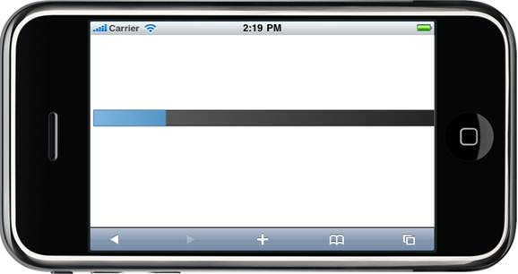

::: {style="DISPLAY: none"}
[](ms-xhelp:///?Id=d2h_url_template){#d2h_url_template} {#d2h_package_url style="WIDTH: 0px; DISPLAY: none; HEIGHT: 0px"}
:::

::: {.d2h_secondary_topic style="PADDING-BOTTOM: 10pt; MARGIN: 0pt; PADDING-LEFT: 0pt; PADDING-RIGHT: 0pt; PADDING-TOP: 0pt"}
##### Using PropertiesModel {#using-propertiesmodel style="tab-stops: 0pt"}

1.   In the controller, create an instance of the **MobProgressBarPropertiesModel**

2.   Define the **Maximum, Minimum, StepValue and Value** property and pass the instance through the view-specific data to the view.

+-----------------------------------------------------------------------------------------------------------------------------------------------------------------------------------------------------------------------------------------------------------------------------------------+
| ``` {style="BACKGROUND: #f2f2f2; MARGIN-LEFT: 7.2pt"}                                                                                                                                                                                                                                   |
|                 [CONTROLLER]                                                                                                                                                                                                                                                            |
|                                                                                                                                                                                                                                                                                         |
| ```                                                                                                                                                                                                                                                                                     |
|                                                                                                                                                                                                                                                                                         |
| ``` {style="BACKGROUND: #f2f2f2; MARGIN-LEFT: 7.2pt"}                                                                                                                                                                                                                                   |
|                                                                                                                                                                                                                                                                                         |
|                 public                                                                                                                                                                                                                                                                  |
|                                                                                                                                                                                                                                                                                         |
|                 ActionResult                                                                                                                                                                                                                                                            |
|                  Index()                                                                                                                                                                                                                                                                |
|                                                                                                                                                                                                                                                                                         |
| ```                                                                                                                                                                                                                                                                                     |
|                                                                                                                                                                                                                                                                                         |
| ``` {style="BACKGROUND: #f2f2f2; MARGIN-LEFT: 7.2pt"}                                                                                                                                                                                                                                   |
|                  {                                                                                                                                                                                                                                                                      |
|                                                                                                                                                                                                                                                                                         |
| ```                                                                                                                                                                                                                                                                                     |
|                                                                                                                                                                                                                                                                                         |
| [            ]{style="FONT-FAMILY: 'Courier New'; COLOR: black"} [MobProgressBarPropertiesModel]{style="FONT-FAMILY: 'Courier New'; COLOR: #2b91af"} [ pBar = [new]{style="COLOR: blue"}[MobProgressBarPropertiesModel]{style="COLOR: #2b91af"}();]{style="FONT-FAMILY: 'Courier New'"} |
|                                                                                                                                                                                                                                                                                         |
| [            pBar.Value = 30;]{style="FONT-FAMILY: 'Courier New'"}                                                                                                                                                                                                                      |
|                                                                                                                                                                                                                                                                                         |
| **[            pBar.Width = 500;]{style="FONT-FAMILY: 'Courier New'"}**                                                                                                                                                                                                                 |
|                                                                                                                                                                                                                                                                                         |
| **[                         pBar.Height = 22;]{style="FONT-FAMILY: 'Courier New'"}**                                                                                                                                                                                                    |
|                                                                                                                                                                                                                                                                                         |
| **[            ]{style="FONT-FAMILY: 'Courier New'"}** [pBar.Maximum = 100;]{style="FONT-FAMILY: 'Courier New'"}                                                                                                                                                                        |
|                                                                                                                                                                                                                                                                                         |
| [            pBar.Minimum = 10;]{style="FONT-FAMILY: 'Courier New'"}                                                                                                                                                                                                                    |
|                                                                                                                                                                                                                                                                                         |
| [            pBar.Value = 20;]{style="FONT-FAMILY: 'Courier New'"}                                                                                                                                                                                                                      |
|                                                                                                                                                                                                                                                                                         |
| [            pBar.StepValue = 10;]{style="FONT-FAMILY: 'Courier New'"}                                                                                                                                                                                                                  |
|                                                                                                                                                                                                                                                                                         |
| ``` {style="BACKGROUND: #f2f2f2; MARGIN-LEFT: 7.2pt"}                                                                                                                                                                                                                                   |
|                        ViewData[                                                                                                                                                                                                                                                        |
|                 "progressBar "                                                                                                                                                                                                                                                          |
|                 ] = pBar;                                                                                                                                                                                                                                                               |
| ```                                                                                                                                                                                                                                                                                     |
|                                                                                                                                                                                                                                                                                         |
| ``` {style="BACKGROUND: #f2f2f2; MARGIN-LEFT: 7.2pt"}                                                                                                                                                                                                                                   |
|                                                                                                                                                                                                                                                                                         |
|                 return                                                                                                                                                                                                                                                                  |
|                  View();                                                                                                                                                                                                                                                                |
|                                                                                                                                                                                                                                                                                         |
| ```                                                                                                                                                                                                                                                                                     |
|                                                                                                                                                                                                                                                                                         |
| ``` {style="BACKGROUND: #f2f2f2; MARGIN-LEFT: 7.2pt"}                                                                                                                                                                                                                                   |
|                 }                                                                                                                                                                                                                                                                       |
|                                                                                                                                                                                                                                                                                         |
| ```                                                                                                                                                                                                                                                                                     |
|                                                                                                                                                                                                                                                                                         |
| ``` {style="BACKGROUND: #f2f2f2; MARGIN-LEFT: 7.2pt"}                                                                                                                                                                                                                                   |
|                                                                                                                                                                                                                                                                                         |
| ```                                                                                                                                                                                                                                                                                     |
+-----------------------------------------------------------------------------------------------------------------------------------------------------------------------------------------------------------------------------------------------------------------------------------------+

[]{style="FONT-SIZE: 12pt"} 

3.   In View, invoke the ProgressBar helper with the control id and view data key as arguments.

 

+------------------------------------------------------------------------------------------------------------------------------------------------------------------------------------------------------------------------------------------------------------------------------------------------------------+
| [\[ASPX\]  ]{style="FONT-FAMILY: 'Courier New'; COLOR: black"}                                                                                                                                                                                                                                             |
|                                                                                                                                                                                                                                                                                                            |
| [\<%]{style="FONT-FAMILY: 'Courier New'; BACKGROUND: yellow"} [=]{style="FONT-FAMILY: 'Courier New'; COLOR: blue"} [ Html.MobSyncfusion().ProgressBar([\"pBar\"]{style="COLOR: #a31515"}, [\"progressBar\"]{style="COLOR: #a31515"})[%\>]{style="BACKGROUND: yellow"}]{style="FONT-FAMILY: 'Courier New'"} |
+------------------------------------------------------------------------------------------------------------------------------------------------------------------------------------------------------------------------------------------------------------------------------------------------------------+

 

+--------------------------------------------------------------------------------------------------------------------------------------------------------------------------------------------------------------------------------------------------------------+
| **[\[Razor\]]{style="FONT-FAMILY: 'Courier New'"}**                                                                                                                                                                                                          |
|                                                                                                                                                                                                                                                              |
| ``` {style="BACKGROUND: #f2f2f2"}                                                                                                                                                                                                                            |
|                                                                                                                                                                                                                                                              |
|                                                                                                                                                                                                                                                              |
| ```                                                                                                                                                                                                                                                          |
|                                                                                                                                                                                                                                                              |
| ``` {style="BACKGROUND: #f2f2f2"}                                                                                                                                                                                                                            |
|                                                                                                                                                                                                                                                              |
|                                                                                                                                                                                                                                                              |
| ```                                                                                                                                                                                                                                                          |
|                                                                                                                                                                                                                                                              |
| [\@{]{style="FONT-FAMILY: 'Courier New'; BACKGROUND: yellow; COLOR: black"} []{style="FONT-FAMILY: 'Courier New'; COLOR: black"}                                                                                                                             |
|                                                                                                                                                                                                                                                              |
| [               ]{style="FONT-FAMILY: 'Courier New'; COLOR: black"} [Html.MobSyncfusion().ProgressBar([\"pBar\"]{style="COLOR: #a31515"}, [\"progressBar\"]{style="COLOR: #a31515"})[.Render(); ]{style="COLOR: black"}]{style="FONT-FAMILY: 'Courier New'"} |
|                                                                                                                                                                                                                                                              |
| [}]{style="FONT-FAMILY: 'Courier New'; BACKGROUND: yellow; COLOR: black"} []{style="FONT-FAMILY: 'Courier New'; COLOR: black"}                                                                                                                               |
|                                                                                                                                                                                                                                                              |
| []{style="FONT-FAMILY: 'Courier New'"}                                                                                                                                                                                                                       |
+--------------------------------------------------------------------------------------------------------------------------------------------------------------------------------------------------------------------------------------------------------------+

[]{style="FONT-SIZE: 12pt"} 

4.   Build and run the application, the output will be as follows.

 

{border="0"}

Figure 88: ProgressBar with range set

**[]{style="FONT-STYLE: normal"}**  

[]{#related-topics}
:::
