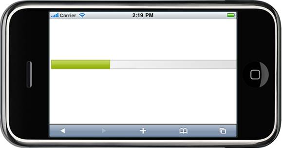
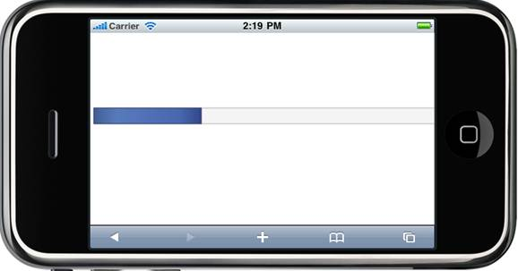
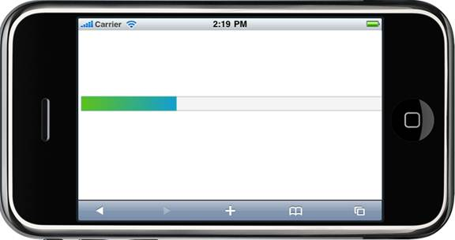

::: {style="DISPLAY: none"}
[](ms-xhelp:///?Id=d2h_url_template){#d2h_url_template} {#d2h_package_url style="WIDTH: 0px; DISPLAY: none; HEIGHT: 0px"}
:::

::: {.d2h_secondary_topic style="PADDING-BOTTOM: 10pt; MARGIN: 0pt; PADDING-LEFT: 0pt; PADDING-RIGHT: 0pt; PADDING-TOP: 0pt"}
##### Using PropertiesModel {#using-propertiesmodel style="tab-stops: 0pt"}

1.   In the controller, create an instance of the **MobProgressBarPropertiesModel**.

2.   Define the **AutoFormat** property and pass the instance through the view-specific data to the view.

 

+----------------------------------------------------------------------------------------------------------------------------------------+
| [\[controller\]]{style="FONT-FAMILY: 'Courier New'"}                                                                                   |
|                                                                                                                                        |
| []{style="FONT-FAMILY: 'Courier New'"}                                                                                                 |
|                                                                                                                                        |
| [public ActionResult Index()]{style="FONT-FAMILY: 'Courier New'"}                                                                      |
|                                                                                                                                        |
| [{  ]{style="FONT-FAMILY: 'Courier New'"}                                                                                              |
|                                                                                                                                        |
| [MobProgressBarPropertiesModel pBar = [new]{style="COLOR: blue"} MobProgressBarPropertiesModel();]{style="FONT-FAMILY: 'Courier New'"} |
|                                                                                                                                        |
| [pBar.Value = 30;]{style="FONT-FAMILY: 'Courier New'"}                                                                                 |
|                                                                                                                                        |
| [pBar.AutoFormat = [MobSkins]{style="COLOR: #2b91af"}.Spinach;]{style="FONT-FAMILY: 'Courier New'"}                                    |
|                                                                                                                                        |
| [ViewData\[[\"progressBar\"]{style="COLOR: #a31515"}\] = pBar;]{style="FONT-FAMILY: 'Courier New'"}                                    |
|                                                                                                                                        |
| []{style="FONT-FAMILY: 'Courier New'"}                                                                                                 |
|                                                                                                                                        |
| [         [return]{style="COLOR: blue"} View();]{style="FONT-FAMILY: 'Courier New'"}                                                   |
|                                                                                                                                        |
| [ }]{style="FONT-FAMILY: 'Courier New'"}                                                                                               |
|                                                                                                                                        |
| []{style="FONT-FAMILY: 'Courier New'"}                                                                                                 |
+----------------------------------------------------------------------------------------------------------------------------------------+

[]{style="FONT-SIZE: 12pt"} 

3.   In View, invoke the ProgressBar helper with the control id and view data key as arguments.

 

+---------------------------------------------------------------------------------------------------------------------------------------------------------------------------------------------------------------------------------------------------------------------------------------------------------------------------------------------------------------------+
| [\[ASPX\]]{style="FONT-FAMILY: 'Courier New'; COLOR: black"}                                                                                                                                                                                                                                                                                                        |
|                                                                                                                                                                                                                                                                                                                                                                     |
| [    ]{style="FONT-FAMILY: 'Courier New'; COLOR: black"} [\<%]{style="FONT-FAMILY: 'Courier New'; BACKGROUND: yellow"} [=]{style="FONT-FAMILY: 'Courier New'; COLOR: blue"} [ Html.MobSyncfusion().ProgressBar([\"pBar\"]{style="COLOR: #a31515"}, [\"progressBar\"]{style="COLOR: #a31515"})[%\>]{style="BACKGROUND: yellow"}]{style="FONT-FAMILY: 'Courier New'"} |
|                                                                                                                                                                                                                                                                                                                                                                     |
|                                                                                                                                                                                                                                                                                                                                                                     |
+---------------------------------------------------------------------------------------------------------------------------------------------------------------------------------------------------------------------------------------------------------------------------------------------------------------------------------------------------------------------+

 

+--------------------------------------------------------------------------------------------------------------------------------------------------------------------------------------------------------------------------------------------------------------+
| **[\[Razor\]]{style="FONT-FAMILY: 'Courier New'"}**                                                                                                                                                                                                          |
|                                                                                                                                                                                                                                                              |
| ``` {style="BACKGROUND: #f2f2f2"}                                                                                                                                                                                                                            |
|                                                                                                                                                                                                                                                              |
|                                                                                                                                                                                                                                                              |
| ```                                                                                                                                                                                                                                                          |
|                                                                                                                                                                                                                                                              |
| [\@{]{style="FONT-FAMILY: 'Courier New'; BACKGROUND: yellow; COLOR: black"} []{style="FONT-FAMILY: 'Courier New'; COLOR: black"}                                                                                                                             |
|                                                                                                                                                                                                                                                              |
| [               ]{style="FONT-FAMILY: 'Courier New'; COLOR: black"} [Html.MobSyncfusion().ProgressBar([\"pBar\"]{style="COLOR: #a31515"}, [\"progressBar\"]{style="COLOR: #a31515"})[.Render(); ]{style="COLOR: black"}]{style="FONT-FAMILY: 'Courier New'"} |
|                                                                                                                                                                                                                                                              |
| [}]{style="FONT-FAMILY: 'Courier New'; BACKGROUND: yellow; COLOR: black"} []{style="FONT-FAMILY: 'Courier New'; COLOR: black"}                                                                                                                               |
|                                                                                                                                                                                                                                                              |
| []{style="FONT-FAMILY: 'Courier New'"}                                                                                                                                                                                                                       |
+--------------------------------------------------------------------------------------------------------------------------------------------------------------------------------------------------------------------------------------------------------------+

[]{style="FONT-SIZE: 12pt"} 

4.   Build and run the application, the output will be as follows:

 

 

{border="0"}

Figure 91: Progressbar with Spinach Theme

 

{border="0"}

Figure 92: Progressbar with BlueLight Theme

 

{border="0"}

Figure 93: Progressbar with MetroBlue Theme

 

{border="0"}

Figure 94: Progressbar with DarkNight Theme

[]{#related-topics}
:::
