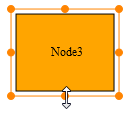

::: {style="DISPLAY: none"}
{#d2h_url_template}{#d2h_package_url style="WIDTH: 0px; DISPLAY: none; HEIGHT: 0px"}
:::

::::: {.d2h_secondary_topic style="PADDING-BOTTOM: 10pt; MARGIN: 0pt; PADDING-LEFT: 0pt; PADDING-RIGHT: 0pt; PADDING-TOP: 0pt"}
#### Using Properties Model {#using-properties-model style="PAGE-BREAK-AFTER: auto; tab-stops: 0pt"}

1.   In the **controller**, create an object for the **Node** class and set the **AllowResize** property.

2.   Create an object for the **DiagramPropertiesModel** class and set the Nodes property and pass this model class to the **view data**.

 

+--------------------------------------------------------------------------------------------------------------------------------------------------------------------------------------------------------------------------------------------------------------------------------------------------------------------------+
| **[Controller ]{style="FONT-FAMILY: 'Courier New'; FONT-SIZE: 11pt"}**                                                                                                                                                                                                                                                   |
|                                                                                                                                                                                                                                                                                                                          |
| [DiagramPropertiesModel]{style="FONT-FAMILY: 'Courier New'; COLOR: #2b91af; FONT-SIZE: 11pt"}[ model = [new]{style="COLOR: blue"} [DiagramPropertiesModel]{style="COLOR: #2b91af"}();]{style="FONT-FAMILY: 'Courier New'; FONT-SIZE: 11pt"}                                                                              |
|                                                                                                                                                                                                                                                                                                                          |
| [        [public]{style="COLOR: blue"} [ActionResult]{style="COLOR: #2b91af"} FlatDiagram()]{style="FONT-FAMILY: 'Courier New'; FONT-SIZE: 11pt"}                                                                                                                                                                        |
|                                                                                                                                                                                                                                                                                                                          |
| [        {]{style="FONT-FAMILY: 'Courier New'; FONT-SIZE: 11pt"}                                                                                                                                                                                                                                                         |
|                                                                                                                                                                                                                                                                                                                          |
| [Node]{style="FONT-FAMILY: 'Courier New'; COLOR: #2b91af; FONT-SIZE: 11pt"}[ node = [new]{style="COLOR: blue"} [Node]{style="COLOR: #2b91af"}()]{style="FONT-FAMILY: 'Courier New'; FONT-SIZE: 11pt"}                                                                                                                    |
|                                                                                                                                                                                                                                                                                                                          |
| [            {]{style="FONT-FAMILY: 'Courier New'; FONT-SIZE: 11pt"}                                                                                                                                                                                                                                                     |
|                                                                                                                                                                                                                                                                                                                          |
| [                Name = \"Node1\",                ]{style="FONT-FAMILY: 'Courier New'; FONT-SIZE: 11pt"}                                                                                                                                                                                                                 |
|                                                                                                                                                                                                                                                                                                                          |
| [                 AllowResize=[true]{style="COLOR: blue"}]{style="FONT-FAMILY: 'Courier New'; FONT-SIZE: 11pt"}                                                                                                                                                                                                          |
|                                                                                                                                                                                                                                                                                                                          |
| [            };]{style="FONT-FAMILY: 'Courier New'; FONT-SIZE: 11pt"}                                                                                                                                                                                                                                                    |
|                                                                                                                                                                                                                                                                                                                          |
| []{style="FONT-FAMILY: 'Courier New'; FONT-SIZE: 11pt"}                                                                                                                                                                                                                                                                  |
|                                                                                                                                                                                                                                                                                                                          |
| [            model.Nodes = [new NodesCollection()]{style="COLOR: blue"}]{style="FONT-FAMILY: 'Courier New'; FONT-SIZE: 11pt"}                                                                                                                                                                                            |
|                                                                                                                                                                                                                                                                                                                          |
| [            {]{style="FONT-FAMILY: 'Courier New'; FONT-SIZE: 11pt"}                                                                                                                                                                                                                                                     |
|                                                                                                                                                                                                                                                                                                                          |
| [                node1 ]{style="FONT-FAMILY: 'Courier New'; FONT-SIZE: 11pt"}                                                                                                                                                                                                                                            |
|                                                                                                                                                                                                                                                                                                                          |
| [            };]{style="FONT-FAMILY: 'Courier New'; FONT-SIZE: 11pt"}                                                                                                                                                                                                                                                    |
|                                                                                                                                                                                                                                                                                                                          |
| [            model.Width = [Unit]{style="COLOR: #2b91af"}.Pixel(1100);]{style="FONT-FAMILY: 'Courier New'; FONT-SIZE: 11pt"}                                                                                                                                                                                             |
|                                                                                                                                                                                                                                                                                                                          |
| [            model.Height = [Unit]{style="COLOR: #2b91af"}.Pixel(500);]{style="FONT-FAMILY: 'Courier New'; FONT-SIZE: 11pt"}                                                                                                                                                                                             |
|                                                                                                                                                                                                                                                                                                                          |
| [            model.DiagramMode = ]{style="FONT-FAMILY: 'Courier New'; COLOR: black; FONT-SIZE: 11pt"}[DiagramMode]{style="FONT-FAMILY: 'Courier New'; COLOR: #2b91af; FONT-SIZE: 11pt"}[.SVG;]{style="FONT-FAMILY: 'Courier New'; COLOR: black; FONT-SIZE: 11pt"}[]{style="FONT-FAMILY: 'Courier New'; FONT-SIZE: 11pt"} |
|                                                                                                                                                                                                                                                                                                                          |
| [            ViewData\[[\"FlatDiagram\"]{style="COLOR: #a31515"}\] = model;]{style="FONT-FAMILY: 'Courier New'; FONT-SIZE: 11pt"}                                                                                                                                                                                        |
|                                                                                                                                                                                                                                                                                                                          |
| [            [return]{style="COLOR: blue"} View();]{style="FONT-FAMILY: 'Courier New'; FONT-SIZE: 11pt"}                                                                                                                                                                                                                 |
|                                                                                                                                                                                                                                                                                                                          |
| [        }]{style="FONT-FAMILY: 'Courier New'; FONT-SIZE: 11pt"}                                                                                                                                                                                                                                                         |
+--------------------------------------------------------------------------------------------------------------------------------------------------------------------------------------------------------------------------------------------------------------------------------------------------------------------------+

**Note:** If you want to create the diagram in the Canvas mode, change the **DiagramMode** to **Canvas**. By default the diagram is rendered in the SVG mode.

 

3.   Create a **view**. In the **view**, invoke the **Diagram** helper with the control ID which is the same as the **view data** name.

::: {align="center"}
+------------------------------------------------------------------------------------------------------------------------------------------------------------------------------------------------------------------------------------------------------------------------------------------------------------------------------------------------+
| **[View]{style="FONT-FAMILY: 'Courier New'; FONT-SIZE: 11pt"}**                                                                                                                                                                                                                                                                                |
|                                                                                                                                                                                                                                                                                                                                                |
| [  [\<%]{style="BACKGROUND: yellow"}{]{style="FONT-FAMILY: 'Courier New'; FONT-SIZE: 11pt"}                                                                                                                                                                                                                                                    |
|                                                                                                                                                                                                                                                                                                                                                |
| [              Html.Syncfusion().Diagram([\"]{style="COLOR: #a31515"}]{style="FONT-FAMILY: 'Courier New'; FONT-SIZE: 11pt"}[FlatDiagram]{style="FONT-FAMILY: 'Courier New'; COLOR: #a31515; FONT-SIZE: 11pt"}[\"]{style="FONT-FAMILY: 'Courier New'; COLOR: #a31515; FONT-SIZE: 11pt"}[)]{style="FONT-FAMILY: 'Courier New'; FONT-SIZE: 11pt"} |
|                                                                                                                                                                                                                                                                                                                                                |
| [                  .Render();]{style="FONT-FAMILY: 'Courier New'; FONT-SIZE: 11pt"}                                                                                                                                                                                                                                                            |
|                                                                                                                                                                                                                                                                                                                                                |
| [    }]{style="FONT-FAMILY: 'Courier New'; FONT-SIZE: 11pt"}                                                                                                                                                                                                                                                                                   |
|                                                                                                                                                                                                                                                                                                                                                |
| [  [%\>]{style="BACKGROUND: yellow"}]{style="FONT-FAMILY: 'Courier New'; FONT-SIZE: 11pt"}[ ]{style="FONT-FAMILY: 'Courier New'; BACKGROUND: yellow; FONT-SIZE: 11pt"}                                                                                                                                                                         |
+------------------------------------------------------------------------------------------------------------------------------------------------------------------------------------------------------------------------------------------------------------------------------------------------------------------------------------------------+
:::

[]{style="FONT-FAMILY: Consolas; BACKGROUND: yellow; FONT-SIZE: 9.5pt"} 

4.   Build and run the application.

 

Resizing a node affects the node\'s **OffsetX**, **OffsetY**, **width**, and **height** properties. To resize a node:  

1.   Select the node that is to be resized.

2.   Move the pointer to the edge that you want to resize.

3.   The cursor will change to one with two arrows.

4.   Now drag the edge to the size you want. The node\'s **OffsetX**, **OffsetY**, **Height**, and **Width** properties will correspondingly change. 

::: {style="BORDER-BOTTOM: windowtext 1pt solid; BORDER-LEFT: medium none; PADDING-BOTTOM: 1pt; MARGIN-TOP: 9pt; PADDING-LEFT: 0pt; PADDING-RIGHT: 0pt; MARGIN-BOTTOM: 9pt; BORDER-TOP: windowtext 1pt solid; BORDER-RIGHT: medium none; PADDING-TOP: 1pt"}
Note: To resize both the width and height by the same factor, click and drag the corners of the resize adorner.
:::

 

{border="0"}

Figure 43: Node Resizing Illustrated

 

 

[]{#related-topics}
:::::
